# 📖 Merchant Portal — Полное описание приложения

> **Для кого эта документация:** для разработчиков, архитекторов, тестировщиков и всех, кто хочет понять, как работает система от «А» до «Я».

---

## 📋 Содержание

1. [Что такое Merchant Portal](#1-что-такое-merchant-portal)
2. [Стек технологий](#2-стек-технологий)
3. [Архитектура проекта](#3-архитектура-проекта)
4. [Модуль Common — общая библиотека](#4-модуль-common--общая-библиотека)
5. [Модуль Auth — авторизация и пользователи](#5-модуль-auth--авторизация-и-пользователи)
6. [Модуль Directory — компании, терминалы, аудит](#6-модуль-directory--компании-терминалы-аудит)
7. [Модуль PBL — Pay-By-Link](#7-модуль-pbl--pay-by-link)
8. [Frontend — веб-интерфейс](#8-frontend--веб-интерфейс)
9. [База данных](#9-база-данных)
10. [Система безопасности](#10-система-безопасности)
11. [Ролевая модель (RBAC)](#11-ролевая-модель-rbac)
12. [Полная карта API](#12-полная-карта-api)
13. [Межсервисные связи](#13-межсервисные-связи)
14. [Интеграция с платёжным шлюзом (TXPG)](#14-интеграция-с-платёжным-шлюзом-txpg)
15. [Фоновые процессы](#15-фоновые-процессы)
16. [Потоки данных](#16-потоки-данных)

---

## 1. Что такое Merchant Portal

**Merchant Portal (MP)** — это веб-платформа для мерчантов (торговых организаций), которая позволяет:

- 🔐 **Авторизоваться** через email и пароль с JWT-токенами
- 🏢 **Управлять компаниями** — создание, просмотр, редактирование
- 🖥️ **Управлять терминалами** — привязка терминалов к компаниям
- 🔗 **Создавать платёжные ссылки** (Pay-By-Link) — мерчант формирует ссылку, клиент оплачивает по ней
- 💳 **Отслеживать транзакции** — статус оплат, возвраты, DMS-подтверждения
- 👥 **Управлять пользователями** — с иерархией ролей и ограничениями по компаниям
- 📋 **Просматривать журнал аудита** — все изменения логируются

---

## 2. Стек технологий

### Бэкенд

| Технология | Версия | Назначение |
|------------|--------|------------|
| Java | 21 (LTS) | Язык программирования |
| Spring Boot | 3.2.5 | Фреймворк приложения |
| Spring Security | 6.x | Безопасность, фильтры авторизации |
| Spring Data JPA | 3.x | ORM, работа с базой данных |
| Hibernate | 6.x | JPA-провайдер |
| Liquibase | — | Миграции базы данных |
| JJWT | 0.11.5 | Генерация и проверка JWT-токенов |
| BCrypt | — | Хеширование паролей |
| Caffeine Cache | 3.1.8 | Кэширование (компании, терминалы) |
| Resilience4j | 2.2.0 | Circuit Breaker, Retry (только PBL) |
| Thymeleaf | — | HTML-шаблоны для redirect-страницы (только PBL) |
| Lombok | 1.18.30 | Генерация boilerplate-кода |
| SpringDoc OpenAPI | 2.5.0 | Swagger UI для API-документации |
| Gradle | 8.5 | Система сборки |

### Фронтенд

| Технология | Версия | Назначение |
|------------|--------|------------|
| React | 18.3.1 | UI-библиотека |
| TypeScript | — | Типизация |
| Vite | 6.3.5 | Сборщик / dev-сервер |
| TailwindCSS | 4.1.12 | CSS-утилиты |
| MUI (Material UI) | 7.3.5 | UI-компоненты |
| React Router | 7.13.0 | Клиентский роутинг |
| Axios | 1.7.9 | HTTP-клиент |
| Recharts | 2.15.2 | Графики и диаграммы |
| React Hook Form | 7.55.0 | Формы |
| Sonner | 2.0.3 | Всплывающие уведомления |
| Radix UI | — | Низкоуровневые UI-примитивы |

### Инфраструктура

| Технология | Назначение |
|------------|------------|
| PostgreSQL 15+ | Реляционная СУБД |
| Nginx | Реверс-прокси, раздача статики |

---

## 3. Архитектура проекта

### 3.1. Общая структура

Проект представляет собой **Gradle multi-module монорепозиторий** с 5 модулями:

```
mp/                           ← Корневой Gradle-проект
├── common/                   ← Общая библиотека (security, exceptions, validation)
├── auth/                     ← Микросервис авторизации (:8081)
├── directory/                ← Микросервис справочников (:8082)
├── pbl/                      ← Микросервис Pay-By-Link (:8080)
└── frontend/                 ← React SPA (отдельный, не Gradle)
```

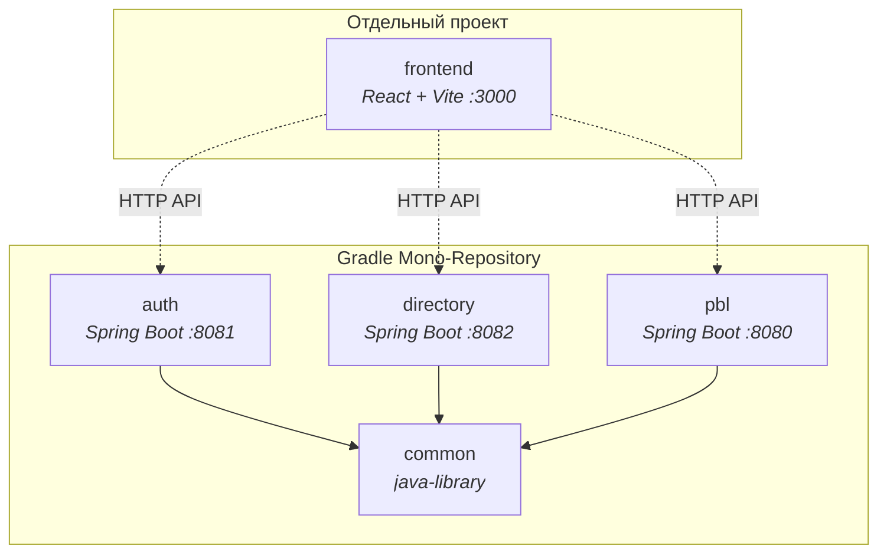

### 3.2. Слоистая архитектура каждого микросервиса

Все бэкенд-модули следуют единой N-tier архитектуре:

```
Controller (REST API)
    ↓ DTO (Request/Response records)
Service (бизнес-логика, RBAC, транзакции)
    ↓ Domain Entity
Repository (JPA, Spring Data)
    ↓ SQL
PostgreSQL (через Hibernate + Liquibase)
```

### 3.3. Зависимости между модулями

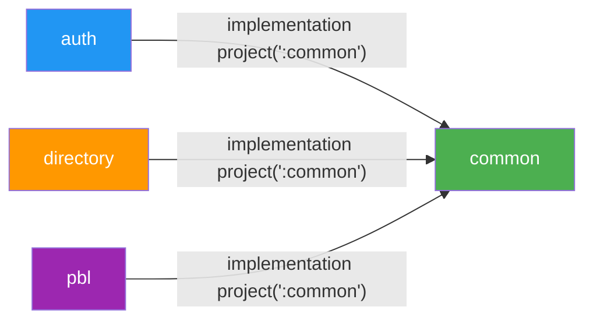

> [!IMPORTANT]
> **common** — это `java-library`, а не `Spring Boot application`. Он **не запускается** самостоятельно, а встраивается в другие модули. Все три микросервиса (auth, directory, pbl) используют `scanBasePackages = "az.millikart"`, что позволяет Spring автоматически находить бины из common.

---

## 4. Модуль Common — общая библиотека

Модуль **common** содержит код, который используется **всеми** микросервисами. Это ключевой архитектурный элемент, обеспечивающий единообразие.

### 4.1. Структура

```
common/src/main/java/az/millikart/common/
├── config/
│   └── CacheConfig.java              ← Caffeine cache (companies, terminals)
├── dto/
│   └── ErrorResponse.java            ← Стандартный формат ошибки API
├── exception/
│   ├── BusinessException.java        ← 400 Bad Request
│   ├── ConflictException.java        ← 409 Conflict
│   ├── InvalidStateException.java    ← 403 Forbidden
│   ├── ResourceNotFoundException.java ← 404 Not Found
│   ├── UnauthorizedException.java    ← 401 Unauthorized
│   └── GlobalExceptionHandler.java   ← @RestControllerAdvice — ловит все ошибки
├── security/
│   ├── JwtProvider.java              ← Генерация и валидация JWT (HS256)
│   ├── JwtAuthFilter.java            ← Фильтр авторизации (OncePerRequestFilter)
│   ├── SecurityConfig.java           ← SecurityFilterChain + BCrypt encoder
│   ├── TraceIdFilter.java            ← Добавляет traceId для отслеживания запросов
│   └── UserPrincipal.java            ← Модель текущего пользователя (userId, role, companyId)
└── validation/
    ├── ValidPassword.java            ← Аннотация @ValidPassword
    └── PasswordConstraintValidator.java ← PCI-DSS: ≥12 символов, A-Z, a-z, 0-9, спецсимвол
```

### 4.2. Ключевые компоненты

#### JwtProvider — Генерация и проверка токенов

- **Алгоритм:** HMAC-SHA256 (`HS256`)
- **Ключ:** Конфигурируется через `pbl.security.jwt.secret`
- **Срок жизни токена:** 24 часа (`86400000 мс`)
- **Claims (данные в токене):**
  - `sub` → username (email)
  - `userId` → UUID пользователя
  - `role` → роль (SYSTEM_ADMIN, COMPANY_HEAD и т.д.)
  - `companyId` → ID привязанной компании (может быть null)

#### JwtAuthFilter — Фильтр авторизации

Этот фильтр выполняется для **каждого** HTTP-запроса:

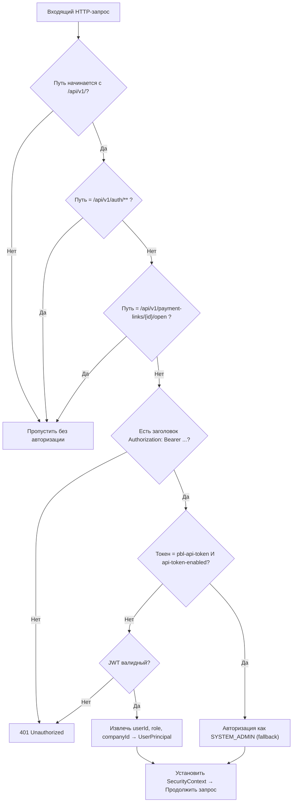

**Публичные эндпоинты** (не требуют авторизации):
- `POST /api/v1/auth/login` — вход
- `GET /api/v1/payment-links/{id}/open` — открытие платёжной ссылки клиентом
- `GET /api/v1/payment-links/redirect/{tx}` — callback после оплаты
- `GET /api/v1/transactions/{providerOrderId}/status` — проверка статуса

#### GlobalExceptionHandler — Единая обработка ошибок

| Exception | HTTP Status | Пример |
|-----------|-------------|--------|
| `BusinessException` | 400 Bad Request | «Username already exists» |
| `UnauthorizedException` | 401 Unauthorized | «Invalid token» |
| `InvalidStateException` | 403 Forbidden | «Access denied» |
| `ResourceNotFoundException` | 404 Not Found | «Company not found» |
| `ConflictException` | 409 Conflict | «Concurrent update» |
| `OptimisticLockingFailureException` | 409 Conflict | «Retry needed» |
| `MethodArgumentNotValidException` | 400 Bad Request | «Password is required» |
| `Exception` (любое другое) | 500 Internal Server Error | «Unexpected error» |

**Формат ответа при ошибке:**
```json
{
  "timestamp": "2026-07-24T21:30:00Z",
  "status": 400,
  "error": "Bad Request",
  "message": "Username already exists",
  "path": "/api/v1/users"
}
```

---

## 5. Модуль Auth — авторизация и пользователи

**Порт:** `8081`  
**Назначение:** Управление учётными записями пользователей и выдача JWT-токенов.

### 5.1. Структура

```
auth/src/main/java/az/millikart/auth/
├── AuthApplication.java           ← Точка входа Spring Boot
├── controller/
│   ├── AuthController.java        ← POST /api/v1/auth/login
│   └── UserController.java        ← CRUD /api/v1/users
├── domain/
│   ├── User.java                  ← JPA Entity (таблица users)
│   └── Company.java               ← JPA Entity (таблица companies, read-only)
├── dto/
│   ├── LoginRequest.java          ← { username, password }
│   ├── LoginResponse.java         ← { token, expiresIn, role }
│   ├── CreateUserRequest.java     ← { username, password, fullName, role, companyId }
│   ├── UpdateUserRequest.java     ← { fullName, role, password, status }
│   └── UserResponse.java          ← { id, username, fullName, role, companyId, status, createdAt }
├── repository/
│   ├── UserRepository.java        ← Spring Data JPA
│   └── CompanyRepository.java     ← Только для проверки existsById
└── service/
    ├── AuthService.java           ← Логика входа + блокировка аккаунтов
    └── UserService.java           ← CRUD + RBAC для пользователей
```

### 5.2. Процесс авторизации (Login)

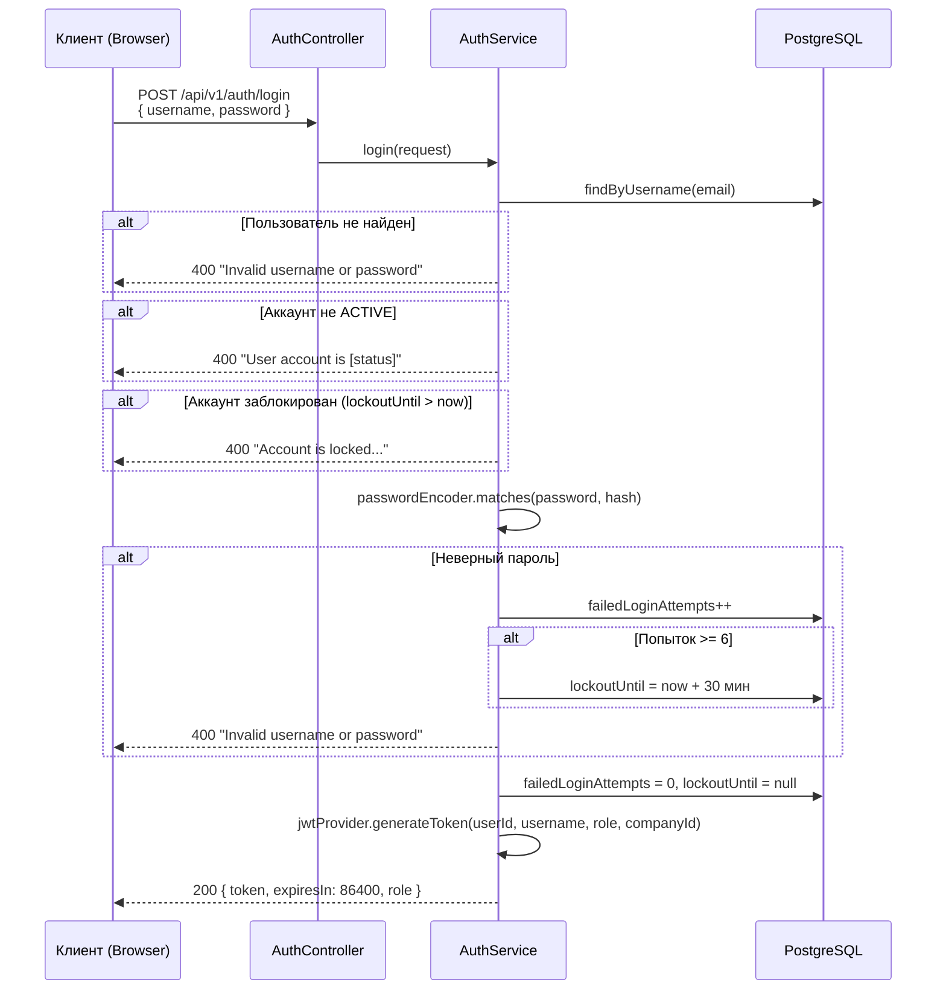

> [!IMPORTANT]
> **PCI-DSS 8.3.4 Compliance:** После 6 неудачных попыток входа аккаунт блокируется на 30 минут. Счётчик сбрасывается после успешного входа или по истечении блокировки.

### 5.3. Управление пользователями (CRUD)

| Метод | Путь | Описание | Кто может |
|-------|------|----------|-----------|
| `POST` | `/api/v1/users` | Создать пользователя | SYSTEM_ADMIN, COMPANY_HEAD (только свою компанию) |
| `GET` | `/api/v1/users` | Список пользователей | SYSTEM_ADMIN (все), COMPANY_HEAD (только своей компании) |
| `GET` | `/api/v1/users/{id}` | Получить пользователя | SYSTEM_ADMIN, COMPANY_HEAD (только своей компании) |
| `PATCH` | `/api/v1/users/{id}` | Обновить пользователя | SYSTEM_ADMIN, COMPANY_HEAD (только своей компании) |
| `DELETE` | `/api/v1/users/{id}` | Удалить пользователя (soft delete → status=DELETED) | SYSTEM_ADMIN, COMPANY_HEAD (только своей компании) |

#### Требования к паролю (PCI-DSS v4.0)

- Минимум **12 символов**
- Хотя бы 1 **заглавная** буква (A-Z)
- Хотя бы 1 **строчная** буква (a-z)
- Хотя бы 1 **цифра** (0-9)
- Хотя бы 1 **спецсимвол** (!@#$%^&*...)

---

## 6. Модуль Directory — компании, терминалы, аудит

**Порт:** `8082`  
**Назначение:** Управление справочниками компаний и терминалов, ведение журнала аудита.

### 6.1. Структура

```
directory/src/main/java/az/millikart/directory/
├── DirectoryApplication.java
├── controller/
│   ├── CompanyController.java     ← CRUD /api/v1/companies
│   ├── TerminalController.java    ← CRUD /api/v1/terminals
│   └── AuditLogController.java   ← GET /api/v1/audit-logs
├── domain/
│   ├── Company.java               ← { id, name, status, createdBy, updatedBy, timestamps }
│   ├── Terminal.java              ← { id, name, login, password, companyId, createdBy, updatedBy }
│   └── AuditLog.java             ← { entityType, entityId, action, performedBy, companyId, details }
├── dto/
│   ├── CreateCompanyRequest.java  ← { id, name }
│   ├── UpdateCompanyRequest.java  ← { name, status }
│   ├── CompanyResponse.java       ← { id, name, status, createdBy, createdAt, updatedBy, updatedAt }
│   ├── CreateTerminalRequest.java ← { id, name, login, password, companyId }
│   ├── UpdateTerminalRequest.java ← { name, login, password, companyId }
│   ├── TerminalResponse.java      ← { id, name, login, password("********"), ... }
│   └── AuditLogResponse.java     ← { id, entityType, entityId, action, performedBy, details, ... }
├── repository/
│   ├── CompanyRepository.java
│   ├── TerminalRepository.java
│   └── AuditLogRepository.java
└── service/
    ├── CompanyService.java        ← CRUD + аудит + кэширование
    ├── TerminalService.java       ← CRUD + аудит + кэширование + RBAC
    └── AuditLogService.java       ← Запись и чтение аудит-логов
```

### 6.2. Управление компаниями

| Метод | Путь | Описание | Кто может |
|-------|------|----------|-----------|
| `POST` | `/api/v1/companies` | Создать компанию | Только SYSTEM_ADMIN |
| `GET` | `/api/v1/companies` | Список компаний | SYSTEM_ADMIN, AUDITOR |
| `GET` | `/api/v1/companies/{id}` | Получить компанию | SYSTEM_ADMIN, AUDITOR, сотрудники этой компании |
| `PATCH` | `/api/v1/companies/{id}` | Обновить компанию | Только SYSTEM_ADMIN |
| `DELETE` | `/api/v1/companies/{id}` | Удалить (soft delete → DELETED) | Только SYSTEM_ADMIN |

> [!NOTE]
> **Кэширование:** Метод `getCompany()` кэшируется через Caffeine Cache (ключ `companies`). При обновлении и удалении кэш инвалидируется через `@CacheEvict`.

### 6.3. Управление терминалами

Терминал — это точка приёма платежей. Каждый терминал привязан к компании и имеет **login/password** для аутентификации в платёжном шлюзе (TXPG).

| Метод | Путь | Описание | Кто может |
|-------|------|----------|-----------|
| `POST` | `/api/v1/terminals` | Создать терминал | SYSTEM_ADMIN, COMPANY_HEAD/MANAGER (своя компания) |
| `GET` | `/api/v1/terminals` | Список терминалов | Все (фильтруется по companyId) |
| `GET` | `/api/v1/terminals/{id}` | Получить терминал | SYSTEM_ADMIN, AUDITOR, сотрудники компании терминала |
| `PATCH` | `/api/v1/terminals/{id}` | Обновить терминал | SYSTEM_ADMIN, COMPANY_HEAD/MANAGER (своя компания) |
| `DELETE` | `/api/v1/terminals/{id}` | Удалить (hard delete!) | SYSTEM_ADMIN, COMPANY_HEAD/MANAGER (своя компания) |

> [!WARNING]
> Пароль терминала в ответе **всегда маскируется** как `"********"` для безопасности. Реальный пароль хранится в БД и используется только для запросов к TXPG.

### 6.4. Журнал аудита

**Каждое** действие с компаниями и терминалами (CREATE, UPDATE, DELETE) автоматически записывается в таблицу `audit_logs`.

| Метод | Путь | Описание | Кто может |
|-------|------|----------|-----------|
| `GET` | `/api/v1/audit-logs` | Список аудит-логов | SYSTEM_ADMIN, AUDITOR (все); COMPANY_HEAD, COMPANY_MANAGER (своя компания) |
| | | Параметры: `?entityType=COMPANY&entityId=COMP-001` | |

**Формат записи аудита:**
```json
{
  "id": "uuid",
  "entityType": "TERMINAL",
  "entityId": "12345",
  "action": "UPDATE",
  "performedBy": "admin@millikart.az",
  "companyId": "COMP-001",
  "details": "Name changed from 'Old' to 'New'. Login updated.",
  "createdAt": "2026-07-24T21:30:00Z"
}
```

---

## 7. Модуль PBL — Pay-By-Link

**Порт:** `8080`  
**Назначение:** Создание платёжных ссылок, обработка платежей через внешний шлюз, управление транзакциями, возвраты, DMS-подтверждения.

Это самый сложный модуль. Он взаимодействует с **внешним платёжным шлюзом** (TXPG — TransaXis Payment Gateway).

### 7.1. Структура

```
pbl/src/main/java/az/millikart/pbl/
├── PblApplication.java               ← @EnableScheduling для фоновых задач
├── controller/
│   ├── PaymentLinkController.java     ← CRUD /api/v1/payment-links
│   ├── OpenLinkController.java        ← Публичные: /open, /redirect
│   └── TransactionController.java     ← /api/v1/transactions (complete, refund, status)
├── domain/
│   ├── PaymentLink.java               ← Основная сущность
│   ├── PaymentLinkStatus.java         ← ACTIVE, EXPIRED, COMPLETED, CANCELED
│   ├── PaymentType.java               ← SMS (одноэтапная), DMS (двухэтапная)
│   ├── UsageType.java                 ← SINGLE (одноразовая), MULTIPLE (многоразовая)
│   ├── Transaction.java               ← Платёжная транзакция
│   ├── TransactionStatus.java         ← PENDING, AUTHORIZED, SUCCESS, FAILED, REFUNDED, PARTIALLY_REFUNDED
│   └── Terminal.java                  ← Read-only сущность терминала
├── dto/
│   ├── CreatePaymentLinkRequest.java  ← { terminal, amount, currency, paymentType, usageType, ... }
│   ├── UpdatePaymentLinkRequest.java  ← { description, status, maxPayments, ... }
│   ├── PaymentLinkResponse.java       ← Полная информация + payUrl
│   ├── PaymentLinkSummaryResponse.java ← Список (без транзакций)
│   ├── TransactionResponse.java       ← { id, amount, status, providerOrderId, ... }
│   ├── CompleteDmsRequest.java        ← { amount } — подтверждение DMS
│   ├── RefundRequest.java             ← { amount } — возврат
│   ├── RefundResponse.java            ← { refundedAmount, message }
│   ├── CustomerDto.java               ← { fullName, email, phone }
│   ├── PagedResponse.java             ← { content, page, size, totalElements, totalPages }
│   └── PaymentCallbackRequest.java    ← Callback от шлюза
├── provider/
│   ├── AcquiringClient.java           ← Интерфейс интеграции
│   ├── TxpgAcquiringClient.java       ← Реализация для TXPG (RestTemplate)
│   ├── StubAcquiringClient.java       ← Заглушка для разработки
│   ├── RestTemplateConfig.java        ← Настройка HTTP-клиента
│   └── dto/                           ← DTO ответов от TXPG
├── repository/
│   ├── PaymentLinkRepository.java
│   └── TransactionRepository.java
├── scheduler/
│   └── PaymentLinkScheduler.java      ← Каждые 5 мин: ACTIVE → EXPIRED
└── service/
    ├── PaymentLinkService.java        ← Вся бизнес-логика (511 строк!)
    ├── PaymentLinkMapper.java         ← Entity → DTO маппинг
    └── OpenLinkService.java           ← Открытие ссылки → перенаправление в TXPG
```

### 7.2. Жизненный цикл платёжной ссылки

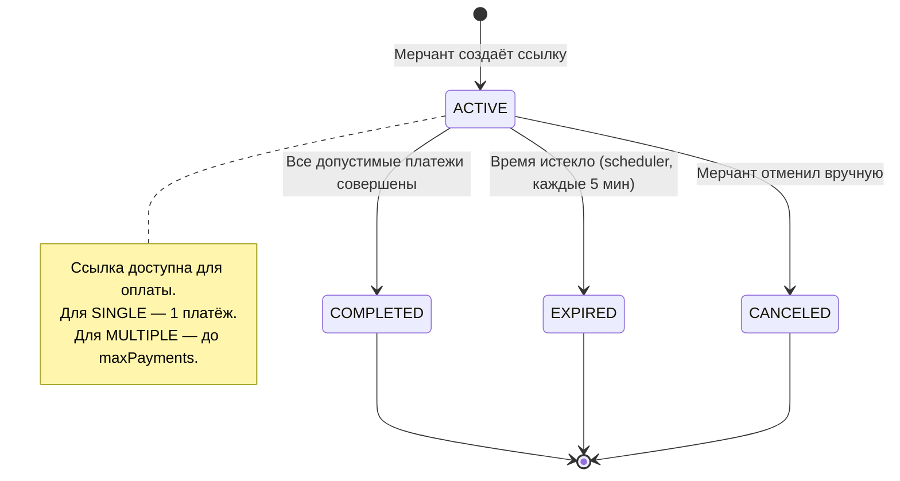

### 7.3. Жизненный цикл транзакции

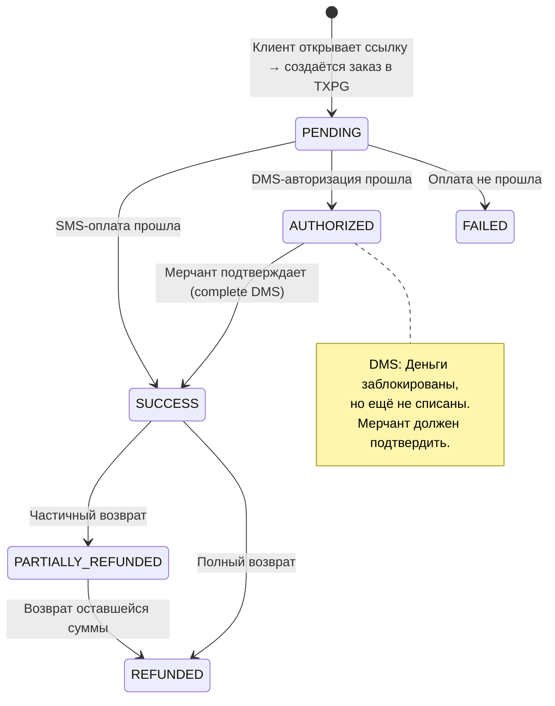

### 7.4. API платёжных ссылок

| Метод | Путь | Описание | Авторизация |
|-------|------|----------|-------------|
| `POST` | `/api/v1/payment-links` | Создать ссылку | JWT (все роли с доступом к терминалу) |
| `GET` | `/api/v1/payment-links` | Список ссылок (paginated) | JWT |
| `GET` | `/api/v1/payment-links/{id}` | Получить ссылку | JWT |
| `PATCH` | `/api/v1/payment-links/{id}` | Обновить ссылку | JWT |
| `GET` | `/api/v1/payment-links/{id}/transactions` | Транзакции ссылки | JWT |
| `GET` | `/api/v1/payment-links/{id}/open` | **Открыть ссылку** (публичный!) | Нет |
| `GET` | `/api/v1/payment-links/redirect/{tx}` | **Redirect callback** (публичный!) | Нет |

### 7.5. API транзакций

| Метод | Путь | Описание | Авторизация |
|-------|------|----------|-------------|
| `GET` | `/api/v1/transactions` | Список транзакций (paginated) | JWT |
| `POST` | `/api/v1/transactions/{id}/complete` | Подтвердить DMS | JWT |
| `POST` | `/api/v1/transactions/{id}/refund` | Возврат средств | JWT |
| `GET` | `/api/v1/transactions/{providerOrderId}/status` | Проверить статус | Нет (публичный) |

### 7.6. Типы платежей

| Тип | Название | Как работает |
|-----|----------|-------------|
| **SMS** | Single Message System | Одноэтапная оплата: авторизация + списание за одну операцию |
| **DMS** | Dual Message System | Двухэтапная: сначала блокировка (AUTHORIZED), потом подтверждение (SUCCESS) |

### 7.7. Типы использования

| Тип | Описание | maxPayments |
|-----|----------|-------------|
| **SINGLE** | Одноразовая ссылка — 1 успешный платёж → COMPLETED | 1 |
| **MULTIPLE** | Многоразовая ссылка — до N успешных платежей | указывается мерчантом |

---

## 8. Frontend — веб-интерфейс

### 8.1. Общая информация

- **Фреймворк:** React 18 + TypeScript
- **Сборщик:** Vite 6.3.5 (dev-сервер на порту `3000`)
- **UI-библиотека:** Material UI 7.x + Radix UI + TailwindCSS 4
- **Роутинг:** React Router 7 (SPA, client-side routing)

### 8.2. Структура страниц

```
frontend/src/app/
├── App.tsx                         ← Корневой компонент
├── routes.tsx                      ← Определение маршрутов
├── api/
│   └── client.ts                   ← Axios с JWT interceptors
├── context/
│   └── AuthContext.tsx              ← React Context для авторизации
├── layouts/
│   └── MainLayout.tsx               ← Sidebar + Header + Content
├── pages/
│   ├── LoginPage.tsx                ← /login
│   ├── HomePage.tsx                 ← / (Dashboard)
│   ├── CompaniesPage.tsx            ← /companies
│   ├── TerminalsPage.tsx            ← /terminals
│   ├── UsersPage.tsx                ← /users
│   ├── PayByLinkPage.tsx            ← /pay-by-link
│   ├── PayByLinkDetailPage.tsx      ← /pay-by-link/:id
│   ├── TransactionListPage.tsx      ← /transactions
│   ├── EcommerceTransactionListPage.tsx ← /transactions/ecommerce
│   ├── TransactionDetailPage.tsx    ← /transactions/:id
│   ├── AuditLogsPage.tsx            ← /audit-logs
│   ├── ReportsPage.tsx              ← Аналитика и отчёты
│   ├── NotificationsPage.tsx        ← Уведомления
│   ├── SettingsPage.tsx             ← Настройки профиля
│   └── POSTransactionListPage.tsx   ← POS-транзакции
├── types/
│   ├── dto.ts                       ← Типы: CompanyDto, TerminalDto, UserDto, AuditLogDto
│   └── transaction.ts               ← Типы: Transaction, TransactionFilters
└── utils/
    └── mockData.ts                  ← Мок-данные для разработки
```

### 8.3. Маршруты

| Маршрут | Страница | Доступ |
|---------|----------|--------|
| `/login` | Страница входа | Только для неавторизованных |
| `/` | Dashboard | Только для авторизованных |
| `/pay-by-link` | Список платёжных ссылок | Только для авторизованных |
| `/pay-by-link/:id` | Детали платёжной ссылки | Только для авторизованных |
| `/transactions` | Список транзакций | Только для авторизованных |
| `/transactions/ecommerce` | E-commerce транзакции | Только для авторизованных |
| `/transactions/:id` | Детали транзакции | Только для авторизованных |
| `/companies` | Управление компаниями | Только для авторизованных |
| `/terminals` | Управление терминалами | Только для авторизованных |
| `/users` | Управление пользователями | Только для авторизованных |
| `/audit-logs` | Журнал аудита | Только для авторизованных |
| `/settings` | Настройки | Только для авторизованных |

### 8.4. Как фронтенд общается с бэкендом

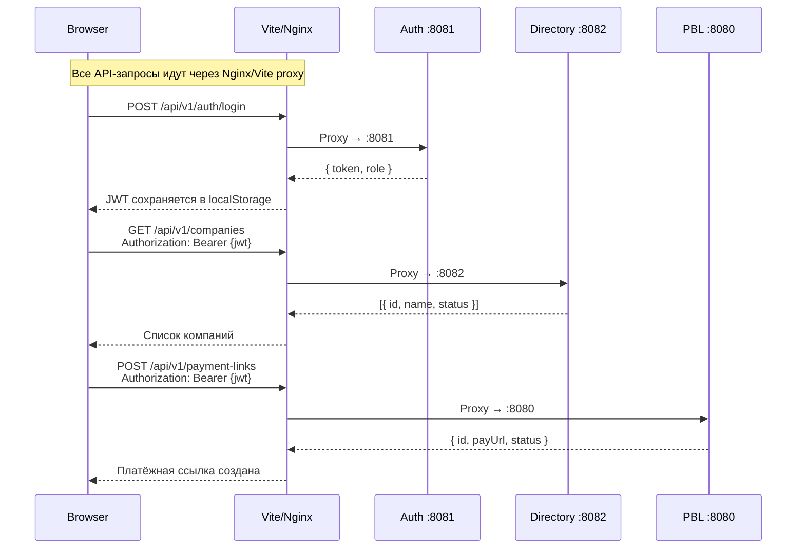

**Axios Interceptors:**
- **Request Interceptor:** Автоматически добавляет `Authorization: Bearer {token}` из `localStorage`
- **Response Interceptor:** При получении `401` — удаляет токен и перенаправляет на `/login`

### 8.5. Proxy-маршрутизация (Vite dev / Nginx prod)

Фронтенд **не знает**, на каких портах работают бэкенд-сервисы. Все запросы идут на **один и тот же домен**, а прокси разруливает:

| Путь запроса | Бэкенд-сервис |
|---|---|
| `/api/v1/auth/**` | Auth → `localhost:8081` |
| `/api/v1/users/**` | Auth → `localhost:8081` |
| `/api/v1/companies/**` | Directory → `localhost:8082` |
| `/api/v1/terminals/**` | Directory → `localhost:8082` |
| `/api/v1/audit-logs/**` | Directory → `localhost:8082` |
| `/api/v1/payment-links/**` | PBL → `localhost:8080` |
| `/api/v1/transactions/**` | PBL → `localhost:8080` |

---

## 9. База данных

### 9.1. ER-диаграмма

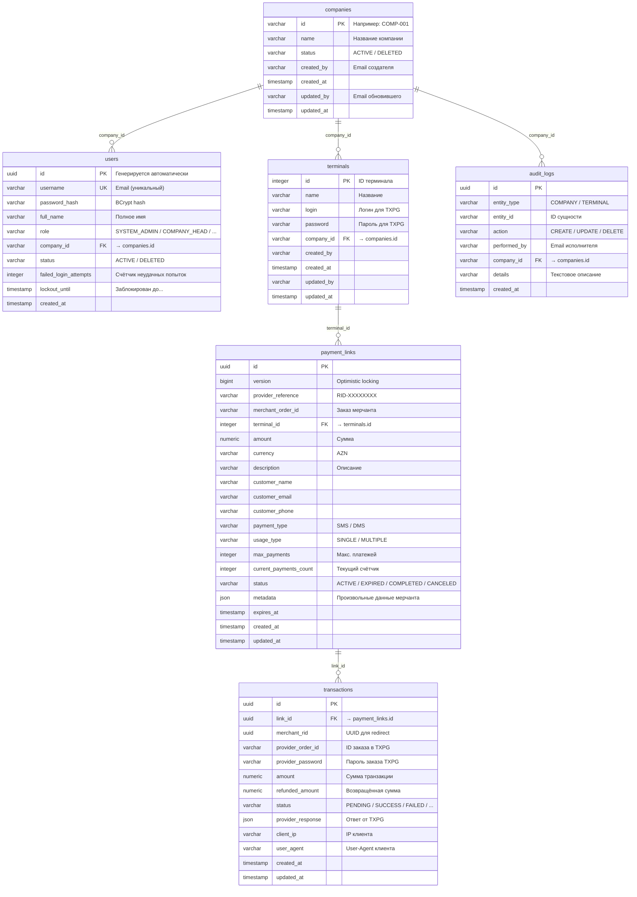

### 9.2. Shared Database

Все три микросервиса используют **одну и ту же** базу данных PostgreSQL. Таблицы общие — `companies` и `terminals` используются и модулем Auth, и Directory, и PBL.

> [!IMPORTANT]
> **Порядок запуска критичен для Liquibase-миграций:**
> 1. **Сначала Auth** или **PBL** — они создают основные таблицы (`companies`, `users`, `terminals`, `payment_links`, `transactions`)
> 2. **Потом Directory** — использует `preConditions onFail="MARK_RAN"`, поэтому не будет пытаться создать таблицы, если они уже существуют, но добавит аудит-колонки

### 9.3. Миграции (Liquibase)

| Модуль | Changelog | Что делает |
|--------|-----------|------------|
| Auth | `002-user-directory-schema.xml` | Создаёт `companies`, `users`, FK `users→companies`, seed admin, FK `terminals→companies`, поля lockout |
| PBL | `001-initial-schema.xml` | Создаёт `terminals` (если нет), `payment_links`, `transactions`, FK-связи |
| PBL | `002-add-indexes.xml` | Добавляет индексы |
| PBL | `003-add-client-ip-and-user-agent.xml` | Добавляет колонки `client_ip`, `user_agent` в `transactions` |
| Directory | `003-directory-schema.xml` | Создаёт `companies` (если нет), `terminals` (если нет), `audit_logs`, добавляет аудит-колонки |

### 9.4. Seed-данные (начальные данные)

При первом запуске автоматически создаётся системный администратор:

| Поле | Значение |
|------|----------|
| ID | `00000000-0000-0000-0000-000000000000` |
| Username | `admin@millikart.az` |
| Password | `admin123` (BCrypt хеш) |
| Role | `SYSTEM_ADMIN` |
| Status | `ACTIVE` |

> [!CAUTION]
> **Обязательно** смените пароль администратора после первого входа в продакшн-среде! Пароль `admin123` предназначен только для разработки.

---

## 10. Система безопасности

### 10.1. Аутентификация

```
┌───────────────────────────────────────────────┐
│                  JWT (HS256)                    │
│                                                │
│  Header: { "alg": "HS256", "typ": "JWT" }     │
│                                                │
│  Payload: {                                     │
│    "sub": "user@company.az",                    │
│    "userId": "uuid-...",                        │
│    "role": "COMPANY_HEAD",                      │
│    "companyId": "COMP-001",                     │
│    "iat": 1721858400,                           │
│    "exp": 1721944800                            │
│  }                                              │
│                                                │
│  Signature: HMACSHA256(                         │
│    header + "." + payload,                      │
│    secret_key                                   │
│  )                                              │
└───────────────────────────────────────────────┘
```

### 10.2. Двойной механизм аутентификации

1. **JWT-токен** (основной) — выдаётся через `POST /api/v1/auth/login`
2. **Статический API-токен** (fallback) — для B2B-интеграций, настраивается через `pbl.security.api-token`

### 10.3. Хеширование паролей

- **Алгоритм:** BCrypt (через `spring-security-crypto`)
- **Фактор сложности:** по умолчанию 10 раундов
- **Пароли пользователей** хешируются в БД
- **Пароли терминалов** хранятся в открытом виде (нужны для API-вызовов к TXPG)

### 10.4. Блокировка аккаунтов (PCI-DSS 8.3.4)

| Параметр | Значение |
|----------|----------|
| Порог блокировки | 6 неудачных попыток |
| Длительность блокировки | 30 минут |
| Сброс счётчика | После успешного входа или истечения блокировки |

---

## 11. Ролевая модель (RBAC)

### 11.1. Роли

| Роль | Описание | companyId |
|------|----------|-----------|
| `SYSTEM_ADMIN` | Полный доступ ко всему | null (нет компании) |
| `COMPANY_HEAD` | Руководитель компании | Обязателен |
| `COMPANY_MANAGER` | Менеджер компании | Обязателен |
| `COMPANY_EMPLOYEE` | Сотрудник компании | Обязателен |
| `AUDITOR` | Аудитор (только просмотр) | null |

### 11.2. Матрица доступа

| Действие | SYSTEM_ADMIN | COMPANY_HEAD | COMPANY_MANAGER | COMPANY_EMPLOYEE | AUDITOR |
|----------|:------------:|:------------:|:---------------:|:----------------:|:-------:|
| **Компании** | | | | | |
| Создать компанию | ✅ | ❌ | ❌ | ❌ | ❌ |
| Список компаний | ✅ | ❌ | ❌ | ❌ | ✅ |
| Просмотр компании | ✅ | Своя | Своя | Своя | ✅ |
| Обновить компанию | ✅ | ❌ | ❌ | ❌ | ❌ |
| Удалить компанию | ✅ | ❌ | ❌ | ❌ | ❌ |
| **Терминалы** | | | | | |
| Создать терминал | ✅ | Своя | Своя | ❌ | ❌ |
| Список терминалов | Все | Свои | Свои | Свои | Все |
| Обновить терминал | ✅ | Своя | Своя | ❌ | ❌ |
| Удалить терминал | ✅ | Своя | Своя | ❌ | ❌ |
| **Пользователи** | | | | | |
| Создать пользователя | ✅ | Своя (не SYSTEM_ADMIN) | ❌ | ❌ | ❌ |
| Список пользователей | Все | Своя | ❌ | ❌ | ❌ |
| Обновить пользователя | ✅ | Своя | ❌ | ❌ | ❌ |
| Удалить пользователя | ✅ | Своя | ❌ | ❌ | ❌ |
| **Платёжные ссылки** | | | | | |
| Создать ссылку | ✅ | ✅ | ✅ | ✅ | ❌ |
| Список/просмотр | ✅ | Свои | Свои | Свои | ❌ |
| **Транзакции** | | | | | |
| Подтвердить DMS | ✅ | ✅ | ✅ | ❌ | ❌ |
| Возврат | ✅ | ✅ | ✅ | ❌ | ❌ |
| **Аудит** | | | | | |
| Просмотр логов | Все | Своя | Своя | ❌ | Все |

> **«Своя»** означает: доступ ограничен записями, принадлежащими компании пользователя (`companyId` в JWT совпадает с `companyId` ресурса).

---

## 12. Полная карта API

### Auth-сервис (`:8081`)

```
POST   /api/v1/auth/login                    ← Вход (публичный)
POST   /api/v1/users                         ← Создать пользователя
GET    /api/v1/users                          ← Список пользователей
GET    /api/v1/users/{id}                     ← Получить пользователя
PATCH  /api/v1/users/{id}                     ← Обновить пользователя
DELETE /api/v1/users/{id}                     ← Удалить пользователя (soft)
```

### Directory-сервис (`:8082`)

```
POST   /api/v1/companies                     ← Создать компанию
GET    /api/v1/companies                     ← Список компаний
GET    /api/v1/companies/{id}                ← Получить компанию
PATCH  /api/v1/companies/{id}                ← Обновить компанию
DELETE /api/v1/companies/{id}                ← Удалить компанию (soft)

POST   /api/v1/terminals                     ← Создать терминал
GET    /api/v1/terminals                     ← Список терминалов
GET    /api/v1/terminals/{id}                ← Получить терминал
PATCH  /api/v1/terminals/{id}                ← Обновить терминал
DELETE /api/v1/terminals/{id}                ← Удалить терминал (hard)

GET    /api/v1/audit-logs                    ← Список аудит-логов
         ?entityType=COMPANY&entityId=X
```

### PBL-сервис (`:8080`)

```
POST   /api/v1/payment-links                ← Создать платёжную ссылку
GET    /api/v1/payment-links                 ← Список ссылок (?page=0&size=20&terminal=X&status=ACTIVE)
GET    /api/v1/payment-links/{id}            ← Получить ссылку
PATCH  /api/v1/payment-links/{id}            ← Обновить ссылку
GET    /api/v1/payment-links/{id}/transactions ← Транзакции по ссылке
GET    /api/v1/payment-links/{id}/open       ← 🌐 Открыть ссылку (публичный) → 302 Redirect
GET    /api/v1/payment-links/redirect/{tx}   ← 🌐 Callback от шлюза (публичный)

GET    /api/v1/transactions                  ← Список транзакций (?page=0&size=20)
POST   /api/v1/transactions/{id}/complete    ← Подтвердить DMS
POST   /api/v1/transactions/{id}/refund      ← Возврат средств
GET    /api/v1/transactions/{orderId}/status  ← 🌐 Проверить статус (публичный)
```

---

## 13. Межсервисные связи

### 13.1. Как связаны модули

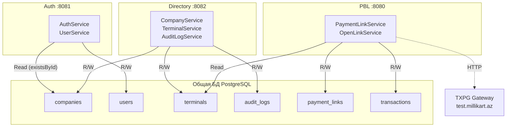

### 13.2. Ключевые точки пересечения

| Таблица | Auth читает | Auth пишет | Directory читает | Directory пишет | PBL читает | PBL пишет |
|---------|:-----------:|:----------:|:----------------:|:---------------:|:----------:|:---------:|
| `companies` | ✅ (existsById) | ❌ | ✅ | ✅ | ❌ | ❌ |
| `users` | ✅ | ✅ | ❌ | ❌ | ❌ | ❌ |
| `terminals` | ❌ | ❌ | ✅ | ✅ | ✅ | ❌ |
| `audit_logs` | ❌ | ❌ | ✅ | ✅ | ❌ | ❌ |
| `payment_links` | ❌ | ❌ | ❌ | ❌ | ✅ | ✅ |
| `transactions` | ❌ | ❌ | ❌ | ❌ | ✅ | ✅ |

> [!WARNING]
> **Таблица `terminals`** используется двумя модулями:
> - **Directory** управляет терминалами (CRUD + аудит)
> - **PBL** только читает терминалы (для получения login/password при создании заказа в TXPG)
> 
> Это «shared table» паттерн. Конфликтов нет, т.к. PBL только читает.

### 13.3. JWT как связующее звено

Сервисы **не вызывают друг друга** по HTTP. Вместо этого они связаны через **JWT-токен**:

```
Auth создаёт JWT → Клиент хранит JWT → Клиент отправляет JWT → Directory/PBL проверяют JWT
```

Все три сервиса разделяют одинаковый `pbl.security.jwt.secret`, что позволяет любому из них валидировать токен, выданный Auth.

---

## 14. Интеграция с платёжным шлюзом (TXPG)

### 14.1. Обзор

PBL-модуль интегрирован с **TransaXis Payment Gateway (TXPG)** — внешним платёжным шлюзом Millikart.

### 14.2. Интерфейс AcquiringClient

```java
public interface AcquiringClient {
    // Создать заказ в TXPG → получить URL платёжной страницы
    EcomCreateOrderResponse createEcomOrder(PaymentLink link, String login, String password, UUID merchantRid, String hppRedirectUrl);
    
    // Подтвердить DMS-транзакцию (списать заблокированные деньги)
    Map<String, Object> completeDms(String providerOrderId, String password, String login, String terminalPassword, BigDecimal amount);
    
    // Вернуть деньги (полный или частичный возврат)
    Map<String, Object> refund(String providerOrderId, String password, String login, String terminalPassword, BigDecimal amount);
    
    // Получить статус заказа
    Map<String, Object> getOrderStatus(String providerOrderId, String password, String login, String terminalPassword);
}
```

### 14.3. Реализации

| Класс | Назначение | Когда используется |
|-------|------------|-------------------|
| `TxpgAcquiringClient` | Реальная интеграция с TXPG через HTTP | Продакшн / тест |
| `StubAcquiringClient` | Заглушка, имитирует ответы | Локальная разработка |

### 14.4. Resilience4j — защита от сбоев

PBL использует паттерны отказоустойчивости для работы с TXPG:

| Паттерн | Настройка | Описание |
|---------|-----------|----------|
| **Circuit Breaker** | Окно: 10 вызовов, порог: 50% ошибок | Если 50%+ запросов к TXPG падают — временно прекращаем отправку |
| **Retry** | 3 попытки, задержка 500мс | Автоматический повтор при временных сбоях |

### 14.5. Потоки оплаты

#### SMS (одноэтапная оплата)

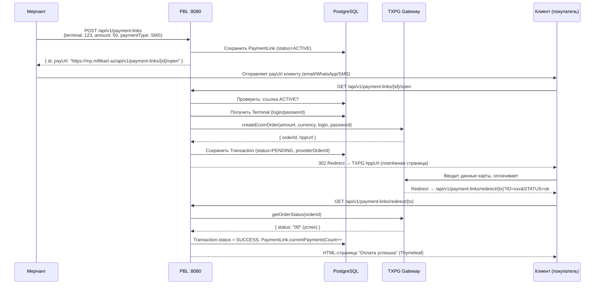

#### DMS (двухэтапная оплата)

Первый этап аналогичен SMS, но Transaction получает статус `AUTHORIZED` вместо `SUCCESS`. Деньги заблокированы на карте, но не списаны.

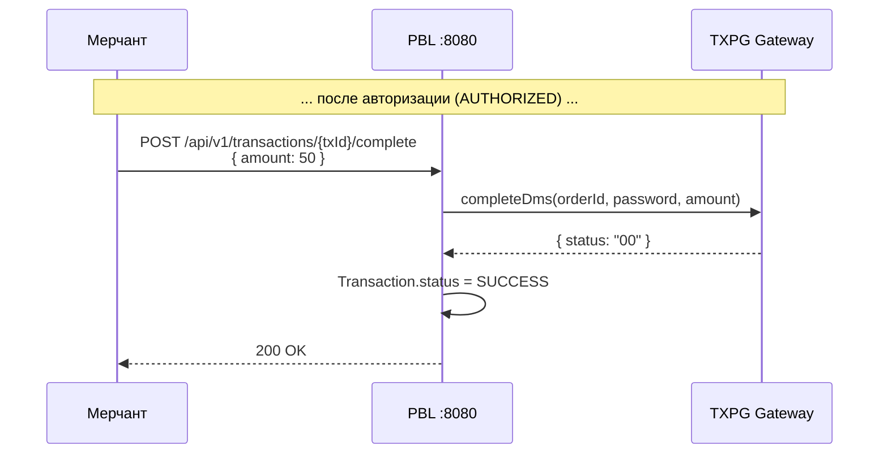

---

## 15. Фоновые процессы

### PaymentLinkScheduler

```
Периодичность: каждые 5 минут (cron: "0 */5 * * * *")
Действие: Находит все ACTIVE-ссылки с expires_at < now → переводит в EXPIRED
```

Это гарантирует, что просроченные ссылки автоматически деактивируются, даже если никто по ним не переходил.

---

## 16. Потоки данных

### 16.1. Поток «Мерчант создаёт пользователя»

```
Frontend → POST /api/v1/users → Nginx → Auth:8081
    → UserController.create()
        → UserService.createUser()
            → validateCreatePermission() ← RBAC-проверка
            → userRepository.findByUsername() ← Проверка уникальности
            → companyRepository.existsById() ← Проверка существования компании
            → passwordEncoder.encode() ← BCrypt-хеширование
            → userRepository.save() ← Сохранение в БД
        ← UserResponse (201 Created)
```

### 16.2. Поток «Мерчант создаёт платёжную ссылку»

```
Frontend → POST /api/v1/payment-links → Nginx → PBL:8080
    → PaymentLinkController.create()
        → PaymentLinkService.create()
            → validateAccess(terminalId) ← Проверка: терминал принадлежит компании пользователя
            → terminalRepository.findById() ← Получение терминала
            → Создание PaymentLink entity
            → paymentLinkRepository.save()
            → mapper.toResponse() ← Генерация payUrl
        ← PaymentLinkResponse (201 Created, includes payUrl)
```

### 16.3. Поток «Клиент оплачивает по ссылке»

```
Клиент → GET /payment-links/{id}/open → Nginx → PBL:8080
    → OpenLinkController.open()
        → OpenLinkService.openAndBuildRedirect()
            → paymentLinkRepository.findById()
            → Проверка: status == ACTIVE, не истекла
            → terminalRepository.findById() ← login/password для TXPG
            → acquiringClient.createEcomOrder() ← HTTP к TXPG
            → Создание Transaction (PENDING)
            → transactionRepository.save()
        ← 302 Redirect → TXPG HPP URL

Клиент → TXPG HPP (вводит карту, платит)

TXPG → Redirect → GET /payment-links/redirect/{tx}?ID=xxx&STATUS=ok → PBL:8080
    → OpenLinkController.redirectPage()
        → paymentLinkService.checkAndStatusUpdate(orderId)
            → acquiringClient.getOrderStatus() ← HTTP к TXPG
            → Обновление Transaction.status
            → Обновление PaymentLink.currentPaymentsCount
        ← HTML-страница (Thymeleaf redirect template)
```

---

> [!TIP]
> **Swagger UI** доступен для каждого сервиса в режиме разработки:
> - Auth: `http://localhost:8081/swagger-ui.html`
> - Directory: `http://localhost:8082/swagger-ui.html`
> - PBL: `http://localhost:8080/swagger-ui.html`
