# 📖 Merchant Portal — Полное описание приложения

> **Для кого эта документация:** для разработчиков, архитекторов, тестировщиков и всех, кто хочет понять, как работает система от «А» до «Я».

---

## 📋 Содержание

1.  [Что такое Merchant Portal](#1-%D1%87%D1%82%D0%BE-%D1%82%D0%B0%D0%BA%D0%BE%D0%B5-merchant-portal)
2.  [Стек технологий](#2-%D1%81%D1%82%D0%B5%D0%BA-%D1%82%D0%B5%D1%85%D0%BD%D0%BE%D0%BB%D0%BE%D0%B3%D0%B8%D0%B9)
3.  [Архитектура проекта](#3-%D0%B0%D1%80%D1%85%D0%B8%D1%82%D0%B5%D0%BA%D1%82%D1%83%D1%80%D0%B0-%D0%BF%D1%80%D0%BE%D0%B5%D0%BA%D1%82%D0%B0)
4.  [Модуль Common — общая библиотека](#4-%D0%BC%D0%BE%D0%B4%D1%83%D0%BB%D1%8C-common--%D0%BE%D0%B1%D1%89%D0%B0%D1%8F-%D0%B1%D0%B8%D0%B1%D0%BB%D0%B8%D0%BE%D1%82%D0%B5%D0%BA%D0%B0)
5.  [Модуль Auth — авторизация и пользователи](#5-%D0%BC%D0%BE%D0%B4%D1%83%D0%BB%D1%8C-auth--%D0%B0%D0%B2%D1%82%D0%BE%D1%80%D0%B8%D0%B7%D0%B0%D1%86%D0%B8%D1%8F-%D0%B8-%D0%BF%D0%BE%D0%BB%D1%8C%D0%B7%D0%BE%D0%B2%D0%B0%D1%82%D0%B5%D0%BB%D0%B8)
6.  [Модуль Directory — компании, терминалы, аудит](#6-%D0%BC%D0%BE%D0%B4%D1%83%D0%BB%D1%8C-directory--%D0%BA%D0%BE%D0%BC%D0%BF%D0%B0%D0%BD%D0%B8%D0%B8-%D1%82%D0%B5%D1%80%D0%BC%D0%B8%D0%BD%D0%B0%D0%BB%D1%8B-%D0%B0%D1%83%D0%B4%D0%B8%D1%82)
7.  [Модуль PBL — Pay-By-Link](#7-%D0%BC%D0%BE%D0%B4%D1%83%D0%BB%D1%8C-pbl--pay-by-link)
8.  [Frontend — веб-интерфейс](#8-frontend--%D0%B2%D0%B5%D0%B1-%D0%B8%D0%BD%D1%82%D0%B5%D1%80%D1%84%D0%B5%D0%B9%D1%81)
9.  [База данных](#9-%D0%B1%D0%B0%D0%B7%D0%B0-%D0%B4%D0%B0%D0%BD%D0%BD%D1%8B%D1%85)
10.  [Система безопасности](#10-%D1%81%D0%B8%D1%81%D1%82%D0%B5%D0%BC%D0%B0-%D0%B1%D0%B5%D0%B7%D0%BE%D0%BF%D0%B0%D1%81%D0%BD%D0%BE%D1%81%D1%82%D0%B8)
11.  [Ролевая модель (RBAC)](#11-%D1%80%D0%BE%D0%BB%D0%B5%D0%B2%D0%B0%D1%8F-%D0%BC%D0%BE%D0%B4%D0%B5%D0%BB%D1%8C-rbac)
12.  [Полная карта API](#12-%D0%BF%D0%BE%D0%BB%D0%BD%D0%B0%D1%8F-%D0%BA%D0%B0%D1%80%D1%82%D0%B0-api)
13.  [Межсервисные связи](#13-%D0%BC%D0%B5%D0%B6%D1%81%D0%B5%D1%80%D0%B2%D0%B8%D1%81%D0%BD%D1%8B%D0%B5-%D1%81%D0%B2%D1%8F%D0%B7%D0%B8)
14.  [Интеграция с платёжным шлюзом (TXPG)](#14-%D0%B8%D0%BD%D1%82%D0%B5%D0%B3%D1%80%D0%B0%D1%86%D0%B8%D1%8F-%D1%81-%D0%BF%D0%BB%D0%B0%D1%82%D1%91%D0%B6%D0%BD%D1%8B%D0%BC-%D1%88%D0%BB%D1%8E%D0%B7%D0%BE%D0%BC-txpg)
15.  [Фоновые процессы](#15-%D1%84%D0%BE%D0%BD%D0%BE%D0%B2%D1%8B%D0%B5-%D0%BF%D1%80%D0%BE%D1%86%D0%B5%D1%81%D1%81%D1%8B)
16.  [Потоки данных](#16-%D0%BF%D0%BE%D1%82%D0%BE%D0%BA%D0%B8-%D0%B4%D0%B0%D0%BD%D0%BD%D1%8B%D1%85)

---

## 1. Что такое Merchant Portal

**Merchant Portal (MP)** — это веб-платформа для мерчантов (торговых организаций), которая позволяет:

-   🔐 **Авторизоваться** через email и пароль с JWT-токенами
-   🏢 **Управлять компаниями** — создание, просмотр, редактирование
-   🖥️ **Управлять терминалами** — привязка терминалов к компаниям
-   🔗 **Создавать платёжные ссылки** (Pay-By-Link) — мерчант формирует ссылку, клиент оплачивает по ней
-   💳 **Отслеживать транзакции** — статус оплат, возвраты, DMS-подтверждения
-   👥 **Управлять пользователями** — с иерархией ролей и ограничениями по компаниям
-   📋 **Просматривать журнал аудита** — все изменения логируются

---

## 2. Стек технологий

### Бэкенд

Технология

Версия

Назначение

Java

21 (LTS)

Язык программирования

Spring Boot

3.2.5

Фреймворк приложения

Spring Security

6.x

Безопасность, фильтры авторизации

Spring Data JPA

3.x

ORM, работа с базой данных

Hibernate

6.x

JPA-провайдер

Liquibase

—

Миграции базы данных

JJWT

0.11.5

Генерация и проверка JWT-токенов

BCrypt

—

Хеширование паролей

Caffeine Cache

3.1.8

⚠ Подключён, но **не используется** — все `@Cacheable` сняты 17.08.2026 (P0-3)

Resilience4j

2.2.0

Circuit Breaker, Retry (только PBL)

Thymeleaf

—

HTML-шаблоны для redirect-страницы (только PBL)

Lombok

1.18.30

Генерация boilerplate-кода

SpringDoc OpenAPI

2.5.0

Swagger UI для API-документации

Gradle

8.5

Система сборки

### Фронтенд

Технология

Версия

Назначение

React

18.3.1

UI-библиотека

TypeScript

7.0.2

Типизация; `tsc -b` — гейт перед `vite build` (с 18.08.2026)

Vite

6.3.5

Сборщик / dev-сервер

TailwindCSS

4.1.12

CSS-утилиты

MUI (Material UI)

7.3.5

UI-компоненты

React Router

7.13.0

Клиентский роутинг

Axios

1.7.9

HTTP-клиент

Recharts

2.15.2

Графики и диаграммы

React Hook Form

7.55.0

Формы

Sonner

2.0.3

Всплывающие уведомления

Radix UI

—

Низкоуровневые UI-примитивы

### Инфраструктура

Технология

Назначение

PostgreSQL 15+

Реляционная СУБД

Nginx

Реверс-прокси, раздача статики

---

## 3. Архитектура проекта

### 3.1. Общая структура

Проект представляет собой **Gradle multi-module монорепозиторий** с 5 модулями:

```
mp/                           ← Корневой Gradle-проект
├── common/                   ← Общая библиотека (security, exceptions, validation)
├── auth/                     ← Микросервис авторизации (:8081)
├── directory/                ← Микросервис справочников (:8082)
├── pbl/                      ← Микросервис Pay-By-Link (:8080)
└── frontend/                 ← React SPA (отдельный, не Gradle)
```

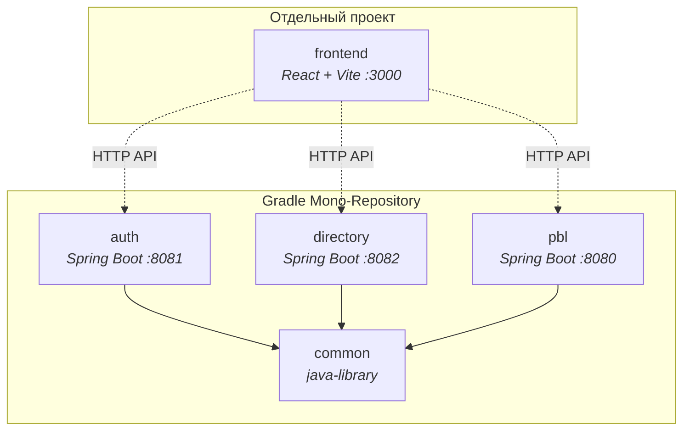

### 3.2. Слоистая архитектура каждого микросервиса

Все бэкенд-модули следуют единой N-tier архитектуре:

```
Controller (REST API)
    ↓ DTO (Request/Response records)
Service (бизнес-логика, RBAC, транзакции)
    ↓ Domain Entity
Repository (JPA, Spring Data)
    ↓ SQL
PostgreSQL (через Hibernate + Liquibase)
```

### 3.3. Зависимости между модулями

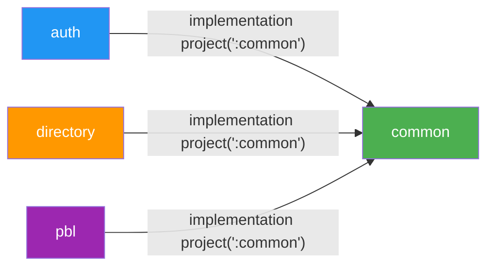

> [!IMPORTANT] **common** — это `java-library`, а не `Spring Boot application`. Он **не запускается** самостоятельно, а встраивается в другие модули. Все три микросервиса (auth, directory, pbl) используют `scanBasePackages = "az.millikart"`, что позволяет Spring автоматически находить бины из common.

---

## 4. Модуль Common — общая библиотека

Модуль **common** содержит код, который используется **всеми** микросервисами. Это ключевой архитектурный элемент, обеспечивающий единообразие.

### 4.1. Структура

```
common/src/main/java/az/millikart/common/
├── config/
│   └── CacheConfig.java              ← Caffeine cache (companies, terminals) — ⚠ без потребителей, см. §6.2
├── dto/
│   └── ErrorResponse.java            ← Стандартный формат ошибки API
├── exception/
│   ├── BusinessException.java        ← 400 Bad Request
│   ├── ConflictException.java        ← 409 Conflict
│   ├── InvalidStateException.java    ← 403 Forbidden
│   ├── ResourceNotFoundException.java ← 404 Not Found
│   ├── UnauthorizedException.java    ← 401 Unauthorized
│   └── GlobalExceptionHandler.java   ← @RestControllerAdvice — ловит все ошибки
├── security/
│   ├── JwtProvider.java              ← Генерация и валидация JWT (HS256)
│   ├── JwtAuthFilter.java            ← Фильтр авторизации (OncePerRequestFilter)
│   ├── SecurityConfig.java           ← SecurityFilterChain + BCrypt encoder
│   ├── TraceIdFilter.java            ← Добавляет traceId для отслеживания запросов
│   └── UserPrincipal.java            ← Модель текущего пользователя (userId, role, companyId)
└── validation/
    ├── ValidPassword.java            ← Аннотация @ValidPassword
    └── PasswordConstraintValidator.java ← PCI-DSS: ≥12 символов, A-Z, a-z, 0-9, спецсимвол
```

### 4.2. Ключевые компоненты

#### JwtProvider — Генерация и проверка токенов

-   **Алгоритм:** HMAC-SHA256 (`HS256`)
-   **Ключ:** Конфигурируется через `pbl.security.jwt.secret`
-   **Срок жизни токена:** 15 минут (`900000 мс`, `JWT_EXPIRATION_MS`; с P1-13 фронтенд обновляет его через `/refresh`)
-   **Claims (данные в токене):**
    -   `sub` → username (email)
    -   `userId` → UUID пользователя
    -   `role` → роль (SYSTEM_ADMIN, COMPANY_HEAD и т.д.)
    -   `companyId` → ID привязанной компании (может быть null)

#### JwtAuthFilter — Фильтр авторизации

Этот фильтр выполняется для **каждого** HTTP-запроса:

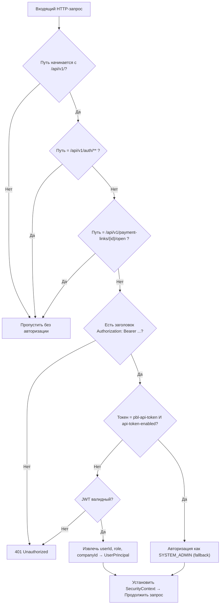

**Публичные эндпоинты** (не требуют авторизации):

-   `POST /api/v1/auth/login` — вход
-   `POST /api/v1/auth/refresh`, `POST /api/v1/auth/logout` — обновление пары токенов и выход (P1-12); оба попадают под тот же шаблон `/api/v1/auth/**` в `PublicEndpoints`, отдельной записи не потребовалось
-   `GET /api/v1/payment-links/{id}/open` — открытие платёжной ссылки клиентом
-   `GET /api/v1/payment-links/redirect/{tx}` — страница возврата плательщика (серверный рендер)

Больше публичных путей под `/api/v1/` нет. `GET /api/v1/transactions/{identifier}/status` был публичным до 15.08.2026 (P0-2) и теперь требует JWT.

#### GlobalExceptionHandler — Единая обработка ошибок

Exception

HTTP Status

Пример

`BusinessException`

400 Bad Request

«Username already exists»

`UnauthorizedException`

401 Unauthorized

«Invalid token»

`InvalidStateException`

403 Forbidden

«Access denied»

`ResourceNotFoundException`

404 Not Found

«Company not found»

`ConflictException`

409 Conflict

«Concurrent update»

`OptimisticLockingFailureException`

409 Conflict

«Retry needed»

`PaymentOutcomeUnknownException`

**502 Bad Gateway**

«No confirmation received from the acquirer. Check the transaction status before retrying.»

`MethodArgumentNotValidException`

400 Bad Request

«Password is required»

`Exception` (любое другое)

500 Internal Server Error

«Unexpected error»

**Формат ответа при ошибке:**

```json
{
  "timestamp": "2026-07-24T21:30:00Z",
  "status": 400,
  "error": "Bad Request",
  "message": "Username already exists",
  "path": "/api/v1/users"
}
```

---

## 5. Модуль Auth — авторизация и пользователи

**Порт:** `8081`  
**Назначение:** Управление учётными записями пользователей и выдача JWT-токенов.

### 5.1. Структура

```
auth/src/main/java/az/millikart/auth/
├── AuthApplication.java           ← Точка входа Spring Boot
├── controller/
│   ├── AuthController.java        ← POST /api/v1/auth/login, /refresh, /logout
│   └── UserController.java        ← CRUD /api/v1/users
├── domain/
│   ├── User.java                  ← JPA Entity (таблица users)
│   ├── RefreshToken.java          ← JPA Entity (таблица refresh_tokens; хранит SHA-256, не токен)
│   └── Company.java               ← JPA Entity (таблица companies, read-only)
├── dto/
│   ├── LoginRequest.java          ← { username, password }
│   ├── LoginResponse.java         ← { token, expiresIn, role, refreshToken, refreshExpiresIn }
│   ├── RefreshRequest.java        ← { refreshToken }
│   ├── LogoutRequest.java         ← { refreshToken } (без валидации — logout всегда 204)
│   ├── CreateUserRequest.java     ← { username, password, fullName, role, companyId }
│   ├── UpdateUserRequest.java     ← { fullName, role, password, status }
│   └── UserResponse.java          ← { id, username, fullName, role, companyId, status, createdAt }
├── repository/
│   ├── UserRepository.java        ← Spring Data JPA
│   ├── RefreshTokenRepository.java ← findByTokenHash + bulk revokeFamily / revokeAllForUser / deleteAllExpiredBefore
│   └── CompanyRepository.java     ← Только для проверки existsById
├── scheduler/
│   └── RefreshTokenCleanupScheduler.java ← cron-уборка просроченных refresh-токенов (тонкий, логика в сервисе)
└── service/
    ├── AuthService.java           ← login (выдача пары), refresh (ротация), logout (отзыв цепочки)
    ├── RefreshTokenService.java   ← хранилище refresh-токенов: выпуск, поиск по хешу, отзыв, уборка
    └── UserService.java           ← CRUD + RBAC для пользователей; отзыв refresh-токенов при блокировке/удалении
```

### 5.2. Процесс авторизации (Login)

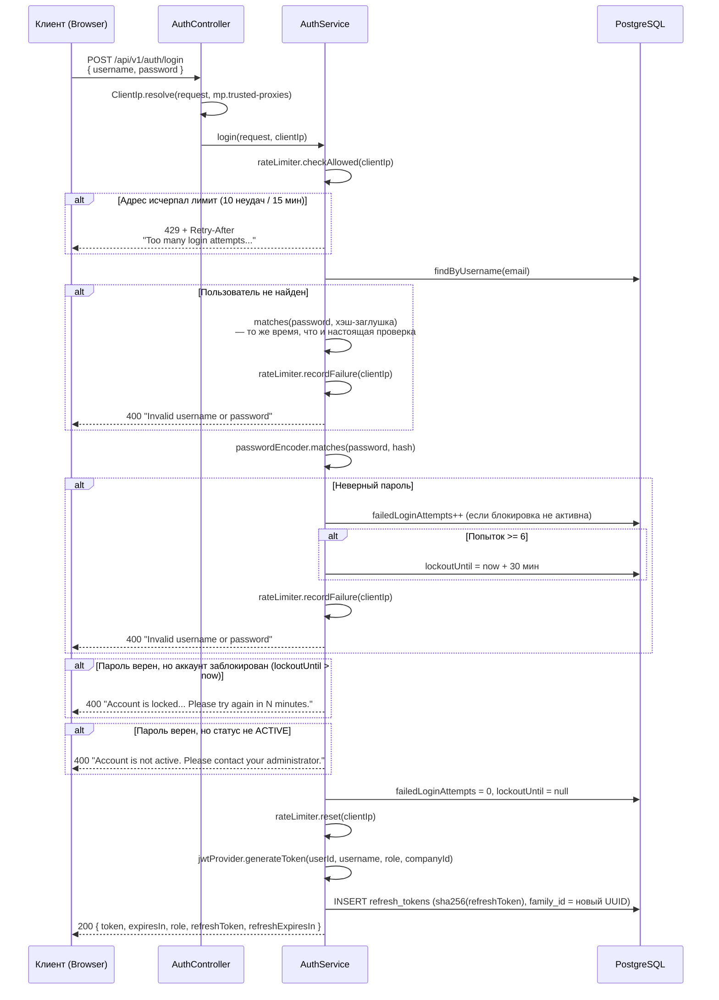

`expiresIn` — секунды из `pbl.security.jwt.expiration-ms` (по умолчанию 900), не константа (P1-12); `refreshExpiresIn` — секунды из `auth.refresh.ttl` (по умолчанию 2592000 = 30 дней).

> [!IMPORTANT] **PCI-DSS 8.3.4 Compliance:** После 6 неудачных попыток входа аккаунт блокируется на 30 минут. Счётчик сбрасывается после успешного входа или по истечении блокировки.

> [!IMPORTANT] **Порядок проверок — это и есть защита от перечисления аккаунтов (P3-Auth, 19.08.2026).** Пароль проверяется раньше статуса и блокировки, поэтому «нет такого пользователя» и «неверный пароль» отвечают одинаково — одним кодом, одним текстом и за одно и то же время (для несуществующего пользователя пароль сравнивается с фиксированным bcrypt-хэшем-заглушкой). Причину отказа узнаёт только тот, кто **верно** ввёл пароль. Блокировка аккаунта (6/30 минут) без лимита по адресу была бы способом выключить чужой аккаунт, поэтому неудачные попытки считаются ещё и по адресу клиента: 10 за 15 минут, дальше 429 с `Retry-After`, до обращения к базе и до bcrypt. Счётчики адресов живут в памяти сервиса (Р-27). Адрес берётся `ClientIp.resolve` и только у доверенного прокси (`mp.trusted-proxies`) — иначе лимит обходился бы заголовком `X-Forwarded-For`. Принятые остаточные риски — `problems.md` §7 и §8.

### 5.2.1. Refresh-токены: ротация, выход, отзыв (P1-12, 18.08.2026)

Refresh-токен — **непрозрачная случайная строка** (32 байта `SecureRandom`, base64url), не JWT. В базе (`refresh_tokens`, миграция `auth/003-refresh-tokens.xml`) хранится только её **SHA-256**: дамп таблицы не даёт ни одной живой сессии. SHA-256, а не BCrypt, потому что 256 бит энтропии перебирать нечего, а поиск по хешу должен быть индексируемым (обоснование — javadoc `RefreshTokenService`). Токены одного логина образуют **цепочку** (`family_id`).

```mermaid
sequenceDiagram
    participant C as Клиент
    participant S as AuthService.refresh
    participant DB as refresh_tokens

    C->>S: POST /api/v1/auth/refresh { refreshToken }
    S->>DB: findByTokenHash(sha256(refreshToken))
    alt не найден / expires_at в прошлом / revoked_at заполнен
        S-->>C: 401 "Invalid refresh token"
    end
    alt rotated_at заполнен и прошло > rotation-grace (10 с)
        S->>DB: UPDATE … SET revoked_at = now WHERE family_id = ?  (вся цепочка)
        Note over S: ERROR с маркером REFRESH_TOKEN_REUSE
        S-->>C: 401 "Invalid refresh token"
    end
    alt rotated_at заполнен, но в пределах окна
        Note over S: гонка двух вкладок — обслуживаем, окно не сдвигаем
    end
    S->>DB: SELECT users WHERE id = user_id
    alt status ≠ ACTIVE
        S->>DB: погасить цепочку
        S-->>C: 401 "Invalid refresh token"
    end
    S->>DB: старый: rotated_at = now (если ещё пуст); новый: INSERT в ту же family_id
    S-->>C: 200 { token, expiresIn, role, refreshToken (новый), refreshExpiresIn }
```

Отказ всегда один и тот же — `401 "Invalid refresh token"`: клиенту не сообщается причина. Отзыв внутри `refresh` (кража, неактивный пользователь) **переживает** этот 401: метод объявлен `@Transactional(noRollbackFor = UnauthorizedException.class)`.

-   **`POST /api/v1/auth/logout` `{ refreshToken }`** → гасит **всю цепочку** и отвечает **204 всегда** (и на неизвестный токен, и на пустое тело) — эндпоинт не должен быть оракулом существования токенов.
-   **Блокировка и удаление** (`PATCH /users/{id}` со `status` ≠ `ACTIVE`, `DELETE /users/{id}`) → `UserService` гасит **все** refresh-токены пользователя во всех сессиях.
-   **Уборка** — `RefreshTokenCleanupScheduler` (`auth.refresh.cleanup-cron`, по умолчанию `0 30 3 * * *`) удаляет строки с `expires_at` в прошлом; в тестовом профиле выключен (`cleanup-enabled: false`). `AuthApplication` получил `@EnableScheduling`.

> [!WARNING] **Access-токен при выходе не отзывается.** `directory` и `pbl` проверяют JWT без базы (подпись + срок), чёрного списка нет намеренно — иначе stateless-модель теряет смысл. После logout, блокировки или удаления уже выданный access-токен работает до `exp` — с P1-13 это **15 минут** (`JWT_EXPIRATION_MS=900000`). Фронтенд держит access-токен только в памяти, refresh-токен — в `localStorage` (`mp_refresh_token`), при 401 молча вызывает `/refresh` (одно обновление на все параллельные запросы) и повторяет запрос; при загрузке вкладки восстанавливает сессию через `/refresh`. Заблокированный пользователь теряет доступ не позже чем через 15 минут.

Настройки: `auth.refresh.ttl` (`AUTH_REFRESH_TTL`, `P30D`), `auth.refresh.rotation-grace` (`AUTH_REFRESH_ROTATION_GRACE`, `PT10S`), `auth.refresh.cleanup-enabled` / `cleanup-cron` (`AUTH_REFRESH_CLEANUP_ENABLED` / `AUTH_REFRESH_CLEANUP_CRON`).

### 5.3. Управление пользователями (CRUD)

Метод

Путь

Описание

Кто может

`POST`

`/api/v1/users`

Создать пользователя

SYSTEM_ADMIN, COMPANY_HEAD (только свою компанию)

`GET`

`/api/v1/users`

Список пользователей — **постранично** (`page`=0, `size`=20, потолок 200; P2-1). Порядок: `username`, затем `id`

SYSTEM_ADMIN (все), COMPANY_HEAD (только своей компании)

`GET`

`/api/v1/users/{id}`

Получить пользователя

SYSTEM_ADMIN, COMPANY_HEAD (только своей компании)

`PATCH`

`/api/v1/users/{id}`

Обновить пользователя

SYSTEM_ADMIN, COMPANY_HEAD (только своей компании)

`DELETE`

`/api/v1/users/{id}`

Удалить пользователя (soft delete → status=DELETED)

SYSTEM_ADMIN, COMPANY_HEAD (только своей компании)

#### Требования к паролю (PCI-DSS v4.0)

-   Минимум **12 символов**
-   Хотя бы 1 **заглавная** буква (A-Z)
-   Хотя бы 1 **строчная** буква (a-z)
-   Хотя бы 1 **цифра** (0-9)
-   Хотя бы 1 **спецсимвол** (!@#$%^&*...)

---

## 6. Модуль Directory — компании, терминалы, аудит

**Порт:** `8082`  
**Назначение:** Управление справочниками компаний и терминалов, ведение журнала аудита.

### 6.1. Структура

```
directory/src/main/java/az/millikart/directory/
├── DirectoryApplication.java
├── controller/
│   ├── CompanyController.java     ← CRUD /api/v1/companies
│   ├── TerminalController.java    ← CRUD /api/v1/terminals
│   └── AuditLogController.java   ← GET /api/v1/audit-logs
├── domain/
│   ├── Company.java               ← { id, name, status, createdBy, updatedBy, timestamps }
│   ├── Terminal.java              ← { id, name, login, password, companyId, createdBy, updatedBy }
│   └── AuditLog.java             ← { entityType, entityId, action, performedBy, companyId, details }
├── dto/
│   ├── CreateCompanyRequest.java  ← { id, name }
│   ├── UpdateCompanyRequest.java  ← { name, status }
│   ├── CompanyResponse.java       ← { id, name, status, createdBy, createdAt, updatedBy, updatedAt }
│   ├── CreateTerminalRequest.java ← { id, name, login, password, companyId }
│   ├── UpdateTerminalRequest.java ← { name, login, password, companyId }
│   ├── TerminalResponse.java      ← { id, name, login, password("********"), ... }
│   └── AuditLogResponse.java     ← { id, entityType, entityId, action, performedBy, details, ... }
├── repository/
│   ├── CompanyRepository.java
│   ├── TerminalRepository.java
│   └── AuditLogRepository.java
└── service/
    ├── CompanyService.java        ← CRUD + аудит + RBAC
    ├── TerminalService.java       ← CRUD + аудит + RBAC
    └── AuditLogService.java       ← Запись и чтение аудит-логов
```

### 6.2. Управление компаниями

Метод

Путь

Описание

Кто может

`POST`

`/api/v1/companies`

Создать компанию

Только SYSTEM_ADMIN

`GET`

`/api/v1/companies`

Список компаний — **постранично** (`page`=0, `size`=20, потолок 200; P2-1). Порядок: `name`, затем `id`

SYSTEM_ADMIN, AUDITOR

`GET`

`/api/v1/companies/{id}`

Получить компанию

SYSTEM_ADMIN, AUDITOR, сотрудники этой компании

`PATCH`

`/api/v1/companies/{id}`

Обновить компанию

Только SYSTEM_ADMIN

`DELETE`

`/api/v1/companies/{id}`

Удалить (soft delete → DELETED)

Только SYSTEM_ADMIN

> [!WARNING] **Кэширования нет.** `getCompany()` и `getTerminal()` были помечены `@Cacheable(key = "#id")`, а проверка прав выполнялась внутри тела метода — при попадании в кэш она не отрабатывала, и сотрудник чужой компании получал данные на все 15 минут TTL. 17.08.2026 все `@Cacheable`/`@CacheEvict` в `directory` сняты (P0-3, решение Р-9). `CacheConfig` в `common` оставлен под будущий кэш в `pbl`. **Не вешай `@Cacheable` на метод, внутри которого выполняется проверка доступа.**

### 6.3. Управление терминалами

Терминал — это точка приёма платежей. Каждый терминал привязан к компании и имеет **login/password** для аутентификации в платёжном шлюзе (TXPG).

Метод

Путь

Описание

Кто может

`POST`

`/api/v1/terminals`

Создать терминал

SYSTEM_ADMIN, COMPANY_HEAD/MANAGER (своя компания)

`GET`

`/api/v1/terminals`

Список терминалов — **постранично** (`page`=0, `size`=20, потолок 200; P2-1). Порядок: `name`, затем `id`

SYSTEM_ADMIN и AUDITOR — все; COMPANY_HEAD/MANAGER/EMPLOYEE — своей компании

`GET`

`/api/v1/terminals/options`

**Лёгкий список терминалов** (Р-45, 22.08.2026): `id`, `name`, `login`, `status`, без пагинации. Отдаёт **и заблокированные** — фильтрует потребитель. `login` — основной параметр терминала, им он подписан на всех экранах платежей; ворота те же, что у `GET /api/v1/terminals`, который логин отдаёт и так. Пароля в фиде нет

Тот же, что у `GET /api/v1/terminals`

`GET`

`/api/v1/terminals/{id}`

Получить терминал

SYSTEM_ADMIN, AUDITOR, сотрудники компании терминала (в т.ч. COMPANY_EMPLOYEE)

`GET`

`/api/v1/terminals/{id}/password`

**Пароль терминала как есть** (11.09.2026) — единственное место, где ключ эквайринга уходит наружу. В `TerminalResponse` он по-прежнему `********`. Каждое чтение пишется в журнал аудита как `READ` по терминалу; сам пароль в журнал не попадает

**Только SYSTEM_ADMIN**

`PATCH`

`/api/v1/terminals/{id}`

Обновить терминал. Поле `password` принимается **только от SYSTEM_ADMIN** (11.09.2026): остальным — `403`, а не тихое игнорирование. Прочие поля — как раньше

SYSTEM_ADMIN, COMPANY_HEAD/MANAGER (своя компания); пароль — только SYSTEM_ADMIN

`DELETE`

`/api/v1/terminals/{id}`

**Удалён (P2-8).** Метод отвечает `405`: терминалы блокируются, а не удаляются — `PATCH` с полем `status`

—

> [!NOTE] Запись терминалов ограничена набором `TerminalService.TERMINAL_WRITE_ROLES` (`SYSTEM_ADMIN`, `COMPANY_HEAD`, `COMPANY_MANAGER`). Роль проверяется **до** `companyId`: до 17.08.2026 совпадения `companyId` было достаточно, и `COMPANY_EMPLOYEE` мог создавать, менять и удалять терминалы своей компании, включая `login`/`password` (P1-15).

> [!WARNING] Пароль терминала в ответе **всегда маскируется** как `"********"` для безопасности. Реальный пароль хранится в БД и используется только для запросов к TXPG.

> [!NOTE] **Терминалы не удаляются, а блокируются** (P2-8, 21.08.2026, решения Р-37…Р-40).
> У терминала есть `status`: `ACTIVE` / `BLOCKED`, меняется тем же `PATCH /api/v1/terminals/{id}`.
> Блокировка запрещает только **новые** платежи (создание ссылки — `400`, открытие ссылки
> плательщиком — отказ) и переводит `ACTIVE`-ссылки терминала в `SUSPENDED`; разблокировка
> возвращает их в `ACTIVE`, а просроченные за время блокировки — в `EXPIRED`. Возвраты, списание
> холдов DMS и проверка статуса по уже прошедшим платежам продолжают работать. Блокировка
> локальна для портала: в MilliKart терминал продолжает работать (`problems.md`).

### 6.4. Журнал аудита

**Каждое** действие с компаниями и терминалами (CREATE, UPDATE, DELETE) записывается в таблицу
`audit_logs` — с 21.08.2026 строго **после коммита** операции (откатившееся действие в журнал
не попадает), а **отказы в доступе** пишутся сразу, в своей транзакции (`outcome = DENIED`,
решение Р-35). Журнал только пополняется.

С 22.08.2026 (P2-14) журнал ведут **все три сервиса**: машинерия записи вынесена в
`az.millikart.common.audit`, `auth` пишет действия с учётными записями и входы (успешные и
неудачные), `pbl` — жизнь платёжной ссылки, списания холдов и возвраты, включая операции с
неподтверждённым исходом. Таблицу `audit_logs` умеет создать любой из трёх сервисов (по
changeset'у в `auth/004-audit-logs.xml` и `pbl/006-audit-logs.xml`), потому что порядок старта
не определён.

Метод

Путь

Описание

Кто может

`GET`

`/api/v1/audit-logs`

Список аудит-логов

SYSTEM_ADMIN, AUDITOR (все); COMPANY_HEAD, COMPANY_MANAGER (своя компания)

Параметры — все необязательные и **независимые** (с 24.08.2026, P3-1; раньше
`entityType`/`entityId` работали только парой): `entityType`, `entityId` (оба без учёта
регистра), `search` (подстрока по `performedBy`/`action`/`entityId`/`details`, `%` и `_`
буквально), `outcome` (`SUCCESS`/`DENIED`/`UNRESOLVED`), `from`/`to` (ISO-instant или дата —
весь день по UTC; неразбираемое значение — как отсутствие фильтра) и `page`/`size` (умолчания
`0`/`20`). Ответ с 21.08.2026 пагинированный (`PagedResponse`: `content`, `totalElements`,
`totalPages`, `size`, `number`), порядок — от новых к старым (`createdAt DESC`, при равенстве
`id DESC`).

**Формат записи аудита (элемент `content`):**

```json
{
  "id": "uuid",
  "entityType": "TERMINAL",
  "entityId": "12345",
  "action": "UPDATE",
  "performedBy": "admin@millikart.az",
  "companyId": "COMP-001",
  "details": "Name changed from 'Old' to 'New'. Login updated.",
  "clientIp": "203.0.113.9",
  "outcome": "SUCCESS",
  "createdAt": "2026-07-24T21:30:00Z"
}
```

`clientIp` — адрес клиента по правилам `ClientIp` (заголовкам верим только от доверенного
прокси); `null`, если действие выполнено вне HTTP-запроса. `outcome` — `SUCCESS`, `DENIED` или
`UNRESOLVED` (с 24.08.2026, P3-2: денежная операция, исход которой эквайер не подтвердил).
Значения `entityType` и `action` — из общего словаря `AuditEntity` / `AuditAction`
(`common/audit`); полная таблица событий — `technical_handover.md` §4.4.

---

## 7. Модуль PBL — Pay-By-Link

**Порт:** `8080`  
**Назначение:** Создание платёжных ссылок, обработка платежей через внешний шлюз, управление транзакциями, возвраты, DMS-подтверждения.

Это самый сложный модуль. Он взаимодействует с **внешним платёжным шлюзом** (TXPG — TransaXis Payment Gateway).

### 7.1. Структура

```
pbl/src/main/java/az/millikart/pbl/
├── PblApplication.java               ← @EnableScheduling для фоновых задач
├── controller/
│   ├── PaymentLinkController.java     ← CRUD /api/v1/payment-links
│   ├── OpenLinkController.java        ← Публичные: /open, /redirect
│   └── TransactionController.java     ← /api/v1/transactions (complete, refund, status)
├── domain/
│   ├── PaymentLink.java               ← Основная сущность
│   ├── PaymentLinkStatus.java         ← ACTIVE, EXPIRED, COMPLETED, CANCELED, SUSPENDED
│   ├── PaymentType.java               ← SMS (одноэтапная), DMS (двухэтапная)
│   ├── UsageType.java                 ← SINGLE (одноразовая), MULTIPLE (многоразовая)
│   ├── Transaction.java               ← Платёжная транзакция
│   ├── TransactionStatus.java         ← PENDING, AUTHORIZED, SUCCESS, FAILED, REFUNDED, PARTIALLY_REFUNDED
│   └── Terminal.java                  ← Read-only сущность терминала
├── dto/
│   ├── CreatePaymentLinkRequest.java  ← { terminal, amount, currency, paymentType, usageType, expiresAt?, ... }
│   ├── UpdatePaymentLinkRequest.java  ← { description, status, maxPayments, expiresAt, ... }
│   ├── PaymentLinkResponse.java       ← Полная информация + payUrl + expiresAt + lastPaidAt + currentPaymentsCount/refundedPaymentsCount (P2-16)
│   ├── PaymentLinkSummaryResponse.java ← Список (без транзакций) + lastPaidAt + terminal; счётчиков нет намеренно (N+1)
│   ├── TransactionResponse.java       ← { id, amount, capturedAmount, refundedAmount, status, providerOrderId, ... }
│   ├── CompleteDmsRequest.java        ← { amount } — подтверждение DMS, допускается частичная сумма
│   ├── RefundRequest.java             ← { amount } — возврат
│   ├── RefundResponse.java            ← { refundedAmount, message }
│   ├── CustomerDto.java               ← { fullName, email, phone }
│   └── PagedResponse.java             ← { content, page, size, totalElements, totalPages }
├── provider/
│   ├── AcquiringClient.java           ← Интерфейс интеграции
│   ├── TxpgAcquiringClient.java       ← Единственная реализация (TXPG)
│   ├── RestTemplateConfig.java        ← Настройка HTTP-клиента
│   └── dto/                           ← DTO ответов от TXPG
├── repository/
│   ├── PaymentLinkRepository.java
│   └── TransactionRepository.java
├── scheduler/
│   ├── PaymentLinkScheduler.java      ← Каждые 5 мин: ACTIVE → EXPIRED
│   └── TransactionReconciliationScheduler.java  ← Каждые 2 мин: сверка зависших PENDING
└── service/
    ├── PaymentLinkService.java        ← Вся бизнес-логика
    ├── PaymentLinkMapper.java         ← Entity → DTO маппинг
    ├── TransactionReconciliationService.java    ← Батч сверки зависших PENDING
    └── OpenLinkService.java           ← Открытие ссылки → перенаправление в TXPG
```

### 7.2. Жизненный цикл платёжной ссылки

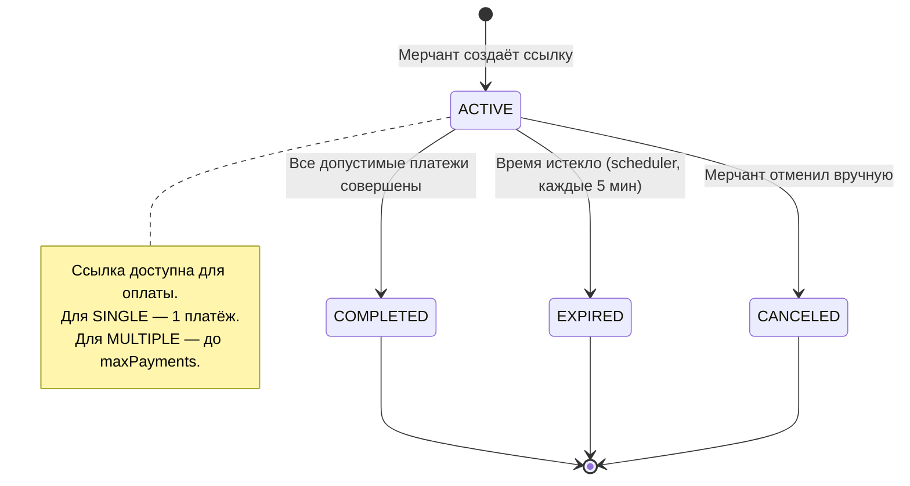

**Срок жизни ссылки (`expiresAt`)** — с 18.08.2026, P1-9:

Случай

Какой срок получает ссылка

`expiresAt` не передан при создании

`now + pbl.link.default-ttl` — по умолчанию **24 часа**

`expiresAt` передан и корректен

ровно переданное значение

`expiresAt` в прошлом или «прямо сейчас»

**400** `expiresAt must be in the future`, ссылка не создаётся

`expiresAt` дальше потолка

**400** с указанием предельной даты; потолок — `pbl.link.max-ttl`, по умолчанию **90 дней**

Потолок считается **от момента создания ссылки**: при создании это «сейчас», при `PATCH` — `payment_links.created_at`, а не момент запроса. Иначе последовательными PATCH'ами срок продлевался бы бесконечно и потолок перестал бы что-либо ограничивать. Те же две проверки применяются к `expiresAt` в `PATCH` (до 18.08.2026 он принимался вообще без проверок).

Просроченную `ACTIVE`-ссылку переводит в `EXPIRED` `PaymentLinkScheduler` (§15); при попытке открыть просроченную ссылку `/open` отвечает 403 «Payment link has expired» независимо от того, успел ли отработать планировщик. `NULL` в `expires_at` означает «без срока» — так помечены ссылки, созданные до 18.08.2026; бэкфилла для них не делалось.

**Дата оплаты ссылки (`lastPaidAt`)** — с 22.08.2026, P2-15:

Поле есть в обоих ответах — полном (`PaymentLinkResponse`) и списочном (`PaymentLinkSummaryResponse`), — и означает время **последнего** успешного платежа по ссылке (решение Р-46: у многоразовой ссылки платежей много, отсюда и имя — не `paidAt`). В базе оно не хранится: считается по транзакциям ссылки как `MAX(created_at)`.

«Успешный платёж» — это `SUCCESS`, `REFUNDED` **и** `PARTIALLY_REFUNDED` (`TransactionStatus.PAID_STATUSES`; с 24.08.2026 набор живёт в самом enum — P2-16). Возврат не создаёт отдельной строки, а переписывает статус самой транзакции, поэтому поиск только по `SUCCESS` терял бы дату оплаты у каждой возвращённой ссылки — как будто платежа не было. Он был: деньги заплатили, а потом вернули. `AUTHORIZED` (холд DMS) — не платёж: деньги зарезервированы, но не взяты; дата появляется при списании холда.

Одиночные ответы делают один дополнительный запрос. **Список — один запрос на всю страницу**, а не на строку: `SELECT link_id, MAX(created_at) … GROUP BY link_id` по идентификаторам страницы, склейка в памяти. Запрос попадает в индекс `idx_transactions_link_status` (P2-3). Пустая страница запрос не выполняет вовсе — `IN ()` не является корректным SQL. Сторож — `PaymentLinkLastPaidAtTest.listOfTwentyLinks_resolvesDatesWithASingleQuery`.

**Счётчики использования ссылки** — с 24.08.2026, P2-16 (Р-49, Р-50):

Тем же набором `PAID_STATUSES` считается `currentPaymentsCount` — теперь это «сколько раз ссылкой воспользовались», а не «сколько платежей числится в `SUCCESS`». Возврат — полный или частичный — использование не отменяет: счётчик не уменьшается, слот открытия не освобождается (`OpenLinkService.SLOT_OCCUPYING_STATUSES` = `PAID_STATUSES` + `AUTHORIZED`, холд — отдельное основание P1-6), `COMPLETED` не пересчитывается, понижение `maxPayments` меряется об это же число. Колонка `payment_links.current_payments_count` при каждом расчёте получает то же значение, что уходит в ответ; `refund()` её не трогает — возврат не выводит статус из набора, база и API сходятся сами.

Сколько из платежей возвращено, показывает новое поле `refundedPaymentsCount` (`REFUNDED` + `PARTIALLY_REFUNDED`) — **только** в одиночном `PaymentLinkResponse`; в списочный ответ счётчики не добавлены намеренно, иначе вернулся бы запрос на строку. Сторожа — `PaymentLinkRefundUsageTest` (10 методов, `pbl`).

Настройки:

Ключ

По умолчанию

ENV

Смысл

`pbl.link.default-ttl`

`PT24H`

`PBL_LINK_DEFAULT_TTL`

Срок жизни, если мерчант не задал свой

`pbl.link.max-ttl`

`P90D`

`PBL_LINK_MAX_TTL`

Потолок срока от `created_at` ссылки

### 7.3. Жизненный цикл транзакции

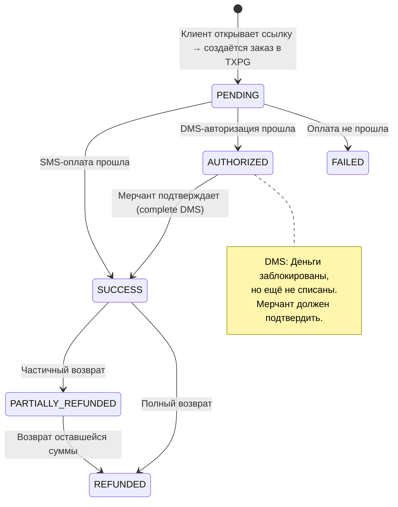

### 7.4. API платёжных ссылок

Метод

Путь

Описание

Авторизация

`POST`

`/api/v1/payment-links`

Создать ссылку

JWT (все роли с доступом к терминалу)

`GET`

`/api/v1/payment-links`

Список ссылок (paginated)

JWT

`GET`

`/api/v1/payment-links/{id}`

Получить ссылку

JWT

`PATCH`

`/api/v1/payment-links/{id}`

Обновить ссылку

JWT

`GET`

`/api/v1/payment-links/{id}/transactions`

Транзакции ссылки

JWT

`GET`

`/api/v1/payment-links/{id}/open`

**Открыть ссылку** (публичный!)

Нет

`GET`

`/api/v1/payment-links/redirect/{tx}`

**Redirect callback** (публичный!)

Нет

### 7.5. API транзакций

Метод

Путь

Описание

Авторизация

`GET`

`/api/v1/transactions`

Список транзакций (paginated)

JWT; SYSTEM_ADMIN, AUDITOR — все компании; COMPANY_HEAD/MANAGER/EMPLOYEE — терминалы своей компании; прочие роли — 403

`POST`

`/api/v1/transactions/{id}/complete`

Подтвердить DMS

JWT

`POST`

`/api/v1/transactions/{id}/refund`

Возврат средств

JWT

`GET`

`/api/v1/transactions/{identifier}/status`

Проверить статус (`identifier` — UUID транзакции или `providerOrderId`)

JWT; роль из READ_ROLES + компания терминала (SYSTEM_ADMIN и AUDITOR — глобально)

`GET`

`/api/v1/transactions/{id}`

P3-7: карточка операции по UUID. Обычное чтение, **эквайер не опрашивается** — за свежим исходом ходит `/{id}/status`. В ответе есть `statusHistory` (11.09.2026): заведение, списание холда и каждый возврат — со своим записанным временем, суммой и ссылкой эквайера. Переходов, времени которых никто не записывал, в списке нет

JWT; роль из READ_ROLES + компания терминала (SYSTEM_ADMIN и AUDITOR — глобально)

`GET`

`/api/v1/dashboard/summary`

P3-7: сводка главной страницы. Параметры `from` и `to` (ISO-8601, оба необязательны; по умолчанию семь календарных суток по сегодняшний день). `from > to` или окно больше 92 дней → **400**. Всё считает база: итоги и разбивка по статусам, посуточная выручка, распределение по часам, топ-5 терминалов на валюту, разбиения ссылок. Деньги — **по валютам**, сводного числа поверх валют нет. Сутки и часы режутся в поясе `pbl.dashboard.zone` (умолчание `Asia/Baku`), пояс возвращается в ответе

JWT; те же правила, что у списка транзакций: SYSTEM_ADMIN и AUDITOR — все компании, остальные — терминалы своей компании; **без компании — нули и 200**, не 403

### 7.6. Типы платежей

Тип

Название

Как работает

**SMS**

Single Message System

Одноэтапная оплата: авторизация + списание за одну операцию

**DMS**

Dual Message System

Двухэтапная: сначала блокировка (AUTHORIZED), потом подтверждение (SUCCESS)

### 7.7. Типы использования

Тип

Описание

maxPayments

**SINGLE**

Одноразовая ссылка — 1 успешный платёж → COMPLETED

1

**MULTIPLE**

Многоразовая ссылка — до N успешных платежей

указывается мерчантом

---

## 8. Frontend — веб-интерфейс

### 8.1. Общая информация

-   **Фреймворк:** React 18 + TypeScript
-   **Сборщик:** Vite 6.3.5 (dev-сервер на порту `3000`)
-   **UI-библиотека:** Material UI 7.x + Radix UI + TailwindCSS 4
-   **Роутинг:** React Router 7 (SPA, client-side routing)

### 8.2. Структура страниц

```
frontend/src/app/
├── App.tsx                         ← Корневой компонент
├── routes.tsx                      ← Определение маршрутов
├── api/
│   └── client.ts                   ← Axios с JWT interceptors
├── context/
│   └── AuthContext.tsx              ← React Context для авторизации
├── layouts/
│   └── MainLayout.tsx               ← Sidebar + Header + Content
├── pages/
│   ├── LoginPage.tsx                ← /login
│   ├── HomePage.tsx                 ← / (Dashboard)
│   ├── CompaniesPage.tsx            ← /companies
│   ├── TerminalsPage.tsx            ← /terminals
│   ├── UsersPage.tsx                ← /users
│   ├── PayByLinkPage.tsx            ← /pay-by-link
│   ├── PayByLinkDetailPage.tsx      ← /pay-by-link/:id
│   ├── TransactionListPage.tsx      ← /transactions
│   ├── EcommerceTransactionListPage.tsx ← /transactions/ecommerce
│   ├── TransactionDetailPage.tsx    ← /transactions/:id
│   ├── AuditLogsPage.tsx            ← /audit-logs
│   ├── ReportsPage.tsx              ← Аналитика и отчёты
│   ├── NotificationsPage.tsx        ← Уведомления
│   ├── SettingsPage.tsx             ← Настройки профиля
│   └── POSTransactionListPage.tsx   ← POS-транзакции
├── types/
│   ├── dto.ts                       ← Типы: CompanyDto, TerminalDto, UserDto, AuditLogDto
│   └── transaction.ts               ← Типы: Transaction, TransactionFilters
└── utils/
    └── mockData.ts                  ← Мок-данные для разработки
```

### 8.3. Маршруты

Маршрут

Страница

Доступ

`/login`

Страница входа

Только для неавторизованных

`/`

Dashboard

Только для авторизованных

`/pay-by-link`

Список платёжных ссылок

Только для авторизованных

`/pay-by-link/:id`

Детали платёжной ссылки

Только для авторизованных

`/transactions`

Список транзакций

Только для авторизованных

`/transactions/ecommerce`

E-commerce транзакции

Только для авторизованных

`/transactions/:id`

Детали транзакции

Только для авторизованных

`/companies`

Управление компаниями

Только для авторизованных

`/terminals`

Управление терминалами

Только для авторизованных

`/users`

Управление пользователями

Только для авторизованных

`/audit-logs`

Журнал аудита

Только для авторизованных

`/settings`

Настройки

Только для авторизованных

### 8.4. Как фронтенд общается с бэкендом

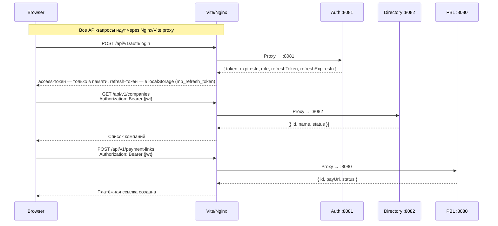

**Axios Interceptors** (`src/app/api/client.ts`, с P1-13):

-   **Request Interceptor:** добавляет `Authorization: Bearer {token}` из памяти (`src/app/auth/session.ts`); к `/api/v1/auth/*` токен не прикладывается
-   **Response Interceptor:** при `401` (кроме самих `/login`, `/refresh`, `/logout`) — одно общее (single-flight) обновление через `POST /api/v1/auth/refresh` и повтор исходного запроса; повторный `401` после обновления или отказ `/refresh` — сброс сессии, `ProtectedRoute` уводит на `/login`
-   **Ролевые guard'ы** (`RoleRoute`, раскладка в `src/app/auth/routeAccess.ts`): `/users` — `SYSTEM_ADMIN`, `COMPANY_HEAD`; `/companies` — `SYSTEM_ADMIN`, `AUDITOR`; `/audit-logs` — `SYSTEM_ADMIN`, `AUDITOR`, `COMPANY_HEAD`, `COMPANY_MANAGER`. Это UX, а не безопасность — права проверяет бэкенд

### 8.5. Proxy-маршрутизация (Vite dev / Nginx prod)

Фронтенд **не знает**, на каких портах работают бэкенд-сервисы. Все запросы идут на **один и тот же домен**, а прокси разруливает:

Путь запроса

Бэкенд-сервис

`/api/v1/auth/**`

Auth → `localhost:8081`

`/api/v1/users/**`

Auth → `localhost:8081`

`/api/v1/companies/**`

Directory → `localhost:8082`

`/api/v1/terminals/**`

Directory → `localhost:8082`

`/api/v1/audit-logs/**`

Directory → `localhost:8082`

`/api/v1/payment-links/**`

PBL → `localhost:8080`

`/api/v1/transactions/**`

PBL → `localhost:8080`

`/api/v1/dashboard/**`

PBL → `localhost:8080` (P3-7; отдельный префикс, а не `/api/v1/transactions/summary`: рядом живёт `GET /api/v1/transactions/{id}`, и «summary» уехало бы в разбор UUID)

---

## 9. База данных

### 9.1. ER-диаграмма

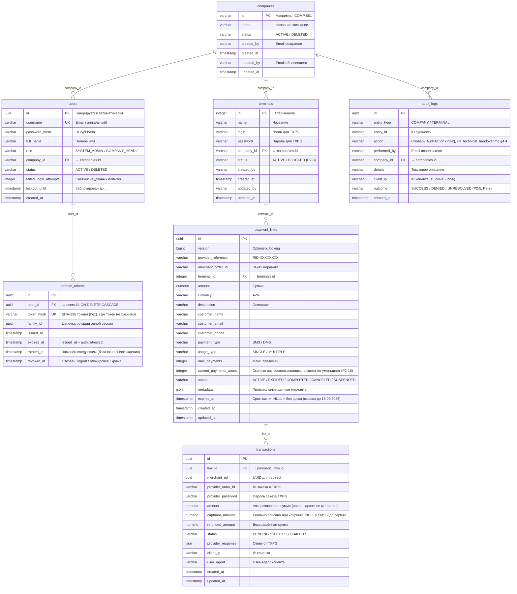

### 9.2. Shared Database

Все три микросервиса используют **одну и ту же** базу данных PostgreSQL. Таблицы общие — `companies` и `terminals` используются и модулем Auth, и Directory, и PBL.

> [!NOTE] **Порядок запуска для Liquibase-миграций не важен** (с 17.08.2026, P1-2). Каждый changeset, создающий общий объект, обложен собственным `<preConditions onFail="MARK_RAN">` с проверкой `<not><tableExists/></not>` — по одному объекту на changeset. Общие таблицы создаёт тот сервис, который стартовал первым; остальные их пропускают, а `Directory` дополняет `companies` и `terminals` аудит-колонками.
> 
> Единственная межсервисная зависимость — FK `terminals.company_id → companies.id` (changeset `2-auth-terminal-fk`): его создаёт `Auth`, а саму таблицу `terminals` — `Directory` или `PBL`. Он стоит под `onFail="CONTINUE"`, поэтому при отсутствии `terminals` **не** записывается в `DATABASECHANGELOG` и повторяет попытку при следующем запуске `Auth`.

### 9.3. Миграции (Liquibase)

Модуль

Changelog

Что делает

Auth

`002-user-directory-schema.xml`

Создаёт `companies`, `users`, FK `users→companies`, FK `terminals→companies`, поля lockout. Пять changeset'ов, по одному объекту на каждый, у всех свои `preConditions`; оба FK — под `onFail="CONTINUE"`

Auth

`003-refresh-tokens.xml`

P1-12: таблица `refresh_tokens`, индексы `idx_refresh_tokens_user` / `idx_refresh_tokens_family`, FK `refresh_tokens→users` (`ON DELETE CASCADE`). Четыре changeset'а, по одному объекту, у всех свои `preConditions`; FK — под `onFail="CONTINUE"`

PBL

`001-initial-schema.xml`

Создаёт `terminals` (если нет), `payment_links`, `transactions`, FK-связи

PBL

`002-add-indexes.xml`

Добавляет индексы; три changeset'а, по одному на индекс, каждый под `<not><indexExists/></not>`

PBL

`008-dashboard-indexes.xml`

P3-7: `idx_transactions_created` на `transactions(created_at)` — сводка отбирает диапазон по времени без фильтра по статусу, а `idx_transactions_status_created` из 007 ведёт со `status` и такой отбор не обслуживает. Один changeset под `<not><indexExists/></not>`

PBL

`003-add-client-ip-and-user-agent.xml`

Добавляет колонки `client_ip`, `user_agent` в `transactions`; два changeset'а, каждый под `<not><columnExists/></not>`

PBL

`004-add-captured-amount.xml`

Добавляет колонку `captured_amount` в `transactions` (nullable — у SMS-платежей capture не бывает), под `<not><columnExists/></not>`

Directory

`003-directory-schema.xml`

Создаёт `companies` (если нет), `terminals` (если нет), `audit_logs`, добавляет аудит-колонки

Directory

`004-audit-log-ip-and-indexes.xml`

Добавляет в `audit_logs` колонки `client_ip` (varchar 45) и `outcome` (not null, default `SUCCESS`) и три индекса: `(company_id, created_at desc)`, `(entity_type, entity_id)`, `(created_at desc)`; каждый changeset под своим прекондишеном

Directory

`005-terminal-status.xml`

Добавляет `terminals.status` (varchar 16, not null, default `ACTIVE`) — P2-8. **Парный** к `pbl/005-terminal-status.xml`: таблицу `terminals` создаёт тот сервис, который стартовал первым, поэтому колонку добавляют оба, каждый под `<not><columnExists/></not>`

PBL

`005-terminal-status.xml`

Тот же `terminals.status` со стороны `pbl` — см. выше. Покрыто `TerminalStatusMigrationTest` (оба порядка старта)

Auth

`004-audit-logs.xml`

P2-14: создаёт `audit_logs` сразу в финальном виде (колонки и три индекса) под `<not><tableExists/></not>` — журнал пишут все три сервиса, и любой из них может стартовать первым

PBL

`006-audit-logs.xml`

P2-14: то же со стороны `pbl` — см. выше. Пять changeset'ов `directory/004` после этого находят каждый свой объект на месте и помечаются выполненными

PBL

`007-transaction-indexes.xml`

P2-3 (22.08.2026): три индекса на `transactions` — `idx_transactions_link_status` `(link_id, status)`, `idx_transactions_link_created` `(link_id, created_at desc)`, `idx_transactions_status_created` `(status, created_at)`. По одному changeset'у на индекс, каждый под `<not><indexExists/></not>`. `link_id` — внешний ключ, а PostgreSQL внешние ключи автоматически не индексирует. Покрыто `TransactionIndexSchemaTest`

### 9.4. Seed-данные (начальные данные)

Seed-данных нет. Миграция не заводит ни одного пользователя: пароль, записанный в changeset, одинаков на всех установках и виден каждому, у кого есть репозиторий (это была находка P0-6, закрыта 17.08.2026).

Первый `SYSTEM_ADMIN` создаётся раннером `AdminBootstrapRunner` (`auth/.../bootstrap/AdminBootstrapRunner.java`) — разово, при первом развёртывании:

Условие

Значение

Флаг

`auth.bootstrap.enabled` (`AUTH_BOOTSTRAP_ENABLED`), по умолчанию `false`

Логин

`BOOTSTRAP_ADMIN_USERNAME`, обязан быть email

Пароль

`BOOTSTRAP_ADMIN_PASSWORD`, та же политика, что у обычных пользователей (`PasswordConstraintValidator`)

Role

`SYSTEM_ADMIN`, `companyId = null`

Когда срабатывает

только если таблица `users` **пуста**; иначе пишет в лог и выходит

Если переменных нет или пароль слабый

`IllegalStateException`, сервис не стартует

> [!NOTE] Флаг включают на один запуск и сразу выключают. Процедура — `deployment_guide.md`, раздел «Первый запуск и ротация ключа».

---

## 10. Система безопасности

### 10.1. Аутентификация

```
┌───────────────────────────────────────────────┐
│                  JWT (HS256)                    │
│                                                │
│  Header: { "alg": "HS256", "typ": "JWT" }     │
│                                                │
│  Payload: {                                     │
│    "sub": "user@company.az",                    │
│    "userId": "uuid-...",                        │
│    "role": "COMPANY_HEAD",                      │
│    "companyId": "COMP-001",                     │
│    "iat": 1721858400,                           │
│    "exp": 1721944800                            │
│  }                                              │
│                                                │
│  Signature: HMACSHA256(                         │
│    header + "." + payload,                      │
│    secret_key                                   │
│  )                                              │
└───────────────────────────────────────────────┘
```

### 10.2. Двойной механизм аутентификации

1.  **JWT-токен** (основной) — выдаётся через `POST /api/v1/auth/login`
2.  **Статический API-токен** (fallback) — для B2B-интеграций, настраивается через `pbl.security.api-token`

### 10.3. Хеширование паролей

-   **Алгоритм:** BCrypt (через `spring-security-crypto`)
-   **Фактор сложности:** по умолчанию 10 раундов
-   **Пароли пользователей** хешируются в БД
-   **Пароли терминалов** хранятся в открытом виде (нужны для API-вызовов к TXPG)

### 10.4. Блокировка аккаунтов (PCI-DSS 8.3.4)

Параметр

Значение

Порог блокировки

6 неудачных попыток

Длительность блокировки

30 минут

Сброс счётчика

После успешного входа или истечения блокировки

---

## 11. Ролевая модель (RBAC)

### 11.1. Роли

Роль

Описание

companyId

`SYSTEM_ADMIN`

Полный доступ ко всему

null (нет компании)

`COMPANY_HEAD`

Руководитель компании

Обязателен

`COMPANY_MANAGER`

Менеджер компании

Обязателен

`COMPANY_EMPLOYEE`

Сотрудник компании

Обязателен

`AUDITOR`

Аудитор (только просмотр)

null

### 11.2. Матрица доступа

Действие

SYSTEM_ADMIN

COMPANY_HEAD

COMPANY_MANAGER

COMPANY_EMPLOYEE

AUDITOR

**Компании**

Создать компанию

✅

❌

❌

❌

❌

Список компаний

✅

❌

❌

❌

✅

Просмотр компании

✅

Своя

Своя

Своя

✅

Обновить компанию

✅

❌

❌

❌

❌

Удалить компанию

✅

❌

❌

❌

❌

**Терминалы**

Создать терминал

✅

Своя

Своя

❌

❌

Список терминалов

Все

Свои

Свои

Свои

Все

Обновить терминал

✅

Своя

Своя

❌

❌

Заблокировать / разблокировать терминал (P2-8)

✅

Своя

Своя

❌

❌

**Пользователи**

Создать пользователя

✅

Своя (не SYSTEM_ADMIN)

❌

❌

❌

Список пользователей

Все

Своя

❌

❌

❌

Обновить пользователя

✅

Своя

❌

❌

❌

Удалить пользователя

✅

Своя

❌

❌

❌

**Платёжные ссылки**

Создать ссылку

✅

✅

✅

✅

❌

Список/просмотр

Все

Свои

Свои

Свои

Все

**Транзакции**

Список транзакций

Все

Свои

Свои

Свои

Все

Подтвердить DMS

✅

✅

✅

✅

❌

Возврат

✅

✅

✅

❌

❌

**Аудит**

Просмотр логов

Все

Своя

Своя

❌

Все

> **«Своя» / «Свои»** означает: доступ ограничен записями, принадлежащими компании пользователя (`companyId` в JWT совпадает с `companyId` ресурса). В `pbl` связь с компанией идёт через терминал ссылки: `payment_links.terminal_id → terminals.company_id`.
> 
> **«Все» у `AUDITOR`** — с 15.08.2026 аудитор является глобальным читателем во всех трёх сервисах (`PaymentLinkService.isGlobalReader` в `pbl`). На запись это не распространяется: `AUDITOR` не входит в списки разрешённых ролей ни у одной изменяющей операции.
> 
> **Роли типизированы** (с 16.08.2026): `common/.../security/Role.java`. В JWT и в колонке `users.role` роль остаётся строкой, разбор — `Role.fromValue(...)` на границе сервиса: значение вне пяти известных даёт «роли нет», и любая проверка отказывает. Списки разрешённых ролей — `EnumSet` (`PaymentLinkService.READ_ROLES`, `LINK_WRITE_ROLES`, `REFUND_ROLES`).
> 
> `GET /api/v1/payment-links/{id}/transactions` до 16.08.2026 проверялся против несуществующих ролей `MERCHANT_ADMIN`/`MERCHANT_USER` и отдавал 403 всем, кроме `SYSTEM_ADMIN` (блокер P0-4). Теперь права совпадают с чтением самой ссылки — строка «Список/просмотр» в таблице выше.

---

## 12. Полная карта API

### Auth-сервис (`:8081`)

```
POST   /api/v1/auth/login                    ← Вход (публичный) → пара access + refresh
POST   /api/v1/auth/refresh                  ← Обновление пары по refresh-токену (публичный, P1-12)
POST   /api/v1/auth/logout                   ← Выход: отзыв цепочки refresh-токенов, всегда 204 (публичный, P1-12)
POST   /api/v1/users                         ← Создать пользователя
GET    /api/v1/users                          ← Список пользователей
GET    /api/v1/users/{id}                     ← Получить пользователя
PATCH  /api/v1/users/{id}                     ← Обновить пользователя
DELETE /api/v1/users/{id}                     ← Удалить пользователя (soft)
```

### Directory-сервис (`:8082`)

```
POST   /api/v1/companies                     ← Создать компанию
GET    /api/v1/companies                     ← Список компаний
GET    /api/v1/companies/{id}                ← Получить компанию
PATCH  /api/v1/companies/{id}                ← Обновить компанию
DELETE /api/v1/companies/{id}                ← Удалить компанию (soft)

POST   /api/v1/terminals                     ← Создать терминал
GET    /api/v1/terminals                     ← Список терминалов
GET    /api/v1/terminals/{id}                ← Получить терминал
PATCH  /api/v1/terminals/{id}                ← Обновить терминал
# DELETE /api/v1/terminals/{id}              ← удалён в P2-8: терминалы блокируются (PATCH status)

GET    /api/v1/audit-logs                    ← Список аудит-логов
         ?entityType=COMPANY&entityId=X
```

### PBL-сервис (`:8080`)

```
POST   /api/v1/payment-links                ← Создать платёжную ссылку
GET    /api/v1/payment-links                 ← Список ссылок (?page=0&size=20&terminal=X&status=ACTIVE)
GET    /api/v1/payment-links/{id}            ← Получить ссылку
PATCH  /api/v1/payment-links/{id}            ← Обновить ссылку
GET    /api/v1/payment-links/{id}/transactions ← Транзакции по ссылке
GET    /api/v1/payment-links/{id}/open       ← 🌐 Открыть ссылку (публичный) → 302 Redirect
GET    /api/v1/payment-links/redirect/{tx}   ← 🌐 Страница возврата плательщика (публичная, серверный рендер)

GET    /api/v1/transactions                  ← Список транзакций (?page=0&size=20), фильтр по компании через терминалы
POST   /api/v1/transactions/{id}/complete    ← Подтвердить DMS
POST   /api/v1/transactions/{id}/refund      ← Возврат средств
GET    /api/v1/transactions/{identifier}/status ← Проверить статус (JWT, проверка компании)
```

---

## 13. Межсервисные связи

### 13.1. Как связаны модули

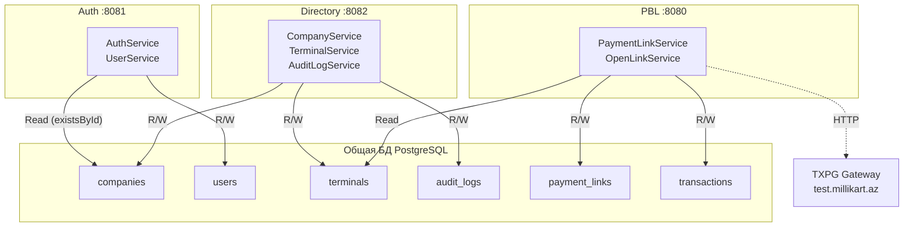

### 13.2. Ключевые точки пересечения

Таблица

Auth читает

Auth пишет

Directory читает

Directory пишет

PBL читает

PBL пишет

`companies`

✅ (existsById)

❌

✅

✅

❌

❌

`users`

✅

✅

❌

❌

❌

❌

`refresh_tokens`

✅

✅

❌

❌

❌

❌

`terminals`

❌

❌

✅

✅

✅

❌

`audit_logs`

❌

❌

✅

✅

❌

❌

`payment_links`

❌

❌

❌

❌

✅

✅

`transactions`

❌

❌

❌

❌

✅

✅

> [!WARNING] **Таблица `terminals`** используется двумя модулями:
> 
> -   **Directory** управляет терминалами (CRUD + аудит)
> -   **PBL** только читает терминалы (для получения login/password при создании заказа в TXPG)
> 
> Это «shared table» паттерн. Конфликтов нет, т.к. PBL только читает.

### 13.3. JWT как связующее звено

Сервисы **не вызывают друг друга** по HTTP. Вместо этого они связаны через **JWT-токен**:

```
Auth создаёт JWT → Клиент хранит JWT → Клиент отправляет JWT → Directory/PBL проверяют JWT
```

Все три сервиса разделяют одинаковый `pbl.security.jwt.secret`, что позволяет любому из них валидировать токен, выданный Auth.

---

## 14. Интеграция с платёжным шлюзом (TXPG)

### 14.1. Обзор

PBL-модуль интегрирован с **TransaXis Payment Gateway (TXPG)** — внешним платёжным шлюзом Millikart.

### 14.2. Интерфейс AcquiringClient

```java
public interface AcquiringClient {
    // Создать заказ в TXPG → получить URL платёжной страницы
    EcomCreateOrderResponse createEcomOrder(PaymentLink link, String login, String password, UUID merchantRid, String hppRedirectUrl);
    
    // Подтвердить DMS-транзакцию (списать заблокированные деньги)
    Map<String, Object> completeDms(String providerOrderId, String password, String login, String terminalPassword, BigDecimal amount);
    
    // Вернуть деньги (полный или частичный возврат)
    Map<String, Object> refund(String providerOrderId, String password, String login, String terminalPassword, BigDecimal amount);
    
    // Получить статус заказа
    Map<String, Object> getOrderStatus(String providerOrderId, String password, String login, String terminalPassword);
}
```

### 14.3. Реализации

Класс

Назначение

Когда используется

`TxpgAcquiringClient`

Реальная интеграция с TXPG через HTTP

Продакшн, тестовый стенд и локальная разработка — везде она одна

`StubAcquiringClient`

Двойник, имитирует ответы

Только тестовые исходники (`src/test`), с 20.08.2026 — из работающего сервиса недостижим

### 14.4. Resilience4j — защита от сбоев

PBL использует паттерны отказоустойчивости для работы с TXPG:

Паттерн

Настройка

Описание

**Circuit Breaker**

Окно: 10 вызовов, порог: 50% ошибок

Все четыре вызова TXPG. Если 50%+ запросов падают — временно прекращаем отправку

**Retry**

3 попытки, задержка 500мс

⚠ **Только `createEcomOrder` и `getOrderStatus`** (P0-7, 17.08.2026)

`@Retry` намеренно снят с `completeDms` и `refund`: это неидемпотентные операции, и при таймауте чтения запрос мог уже исполниться на стороне TXPG — повтор провёл бы возврат или списание дважды. Повтор `createEcomOrder` безвреден (неоплаченный заказ-дубль, плюс мы передаём собственный `ridByMerchant`), `getOrderStatus` — чистое чтение.

Сбой денежного вызова классифицируется в `TxpgAcquiringClient.classifyMoneyOperationFailure`:

Что случилось

Вывод

Исключение → HTTP

`errorCode` в ответе 200, либо 4xx

шлюз отказал, деньги не двигались

`BusinessException` → 400

5xx, `ResourceAccessException`, любое другое

**исход неизвестен**

`PaymentOutcomeUnknownException` → 502

502 означает «операция могла выполниться»: локальное состояние транзакции не меняется, повторять вслепую нельзя, нужно сверить статус с эквайером.

### 14.5. Потоки оплаты

#### SMS (одноэтапная оплата)

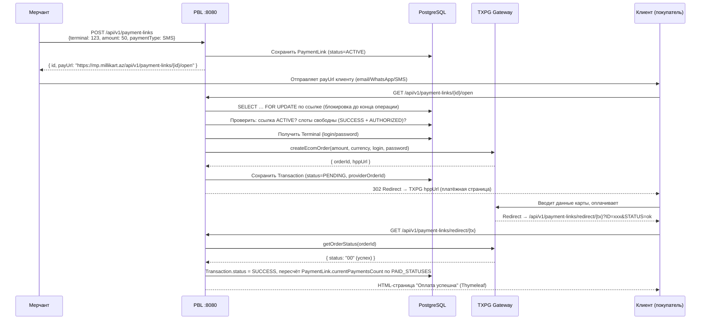

#### DMS (двухэтапная оплата)

Первый этап аналогичен SMS, но Transaction получает статус `AUTHORIZED` вместо `SUCCESS`. Деньги заблокированы на карте, но не списаны.

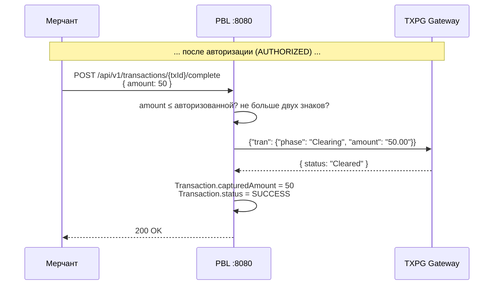

Частичный capture поддерживается: можно захватить меньше, чем авторизовано. `amount` транзакции при этом остаётся авторизованной суммой, захваченная пишется в `captured_amount`, и именно от неё считается потолок возврата — иначе мерчант мог бы вернуть деньги, которые с карты не списывались. Отдельного статуса под частичный capture нет: транзакция расчиталась, значит `SUCCESS`. Неиспользованный остаток холда провайдеру не отменяется (Void не реализован).

---

## 15. Фоновые процессы

### PaymentLinkScheduler

```
Периодичность: каждые 5 минут (cron: "0 */5 * * * *")
Действие: Находит все ACTIVE-ссылки с expires_at < now → переводит в EXPIRED
```

Это гарантирует, что просроченные ссылки автоматически деактивируются, даже если никто по ним не переходил.

> [!NOTE] До 18.08.2026 (P1-9) планировщику было нечего просрочивать: `create` не выставлял `expires_at`, и условие `expires_at IS NOT NULL AND expires_at < now` не выполнялось никогда. Сам планировщик при этом был корректен и не менялся. `NULL` в `expires_at` по-прежнему означает «без срока» — так остались помечены ссылки, созданные раньше.

### TransactionReconciliationScheduler (P1-3, 16.08.2026)

```
Периодичность: каждые 2 минуты (cron: "${pbl.reconciliation.cron}", по умолчанию "0 */2 * * * *")
Выключатель:   pbl.reconciliation.enabled (@ConditionalOnProperty)
Действие:      TransactionReconciliationService.reconcilePendingTransactions()
```

Настройки (`pbl.reconciliation.*`, все переопределяются переменными окружения):

Ключ

По умолчанию

ENV

Смысл

`enabled`

`true`

`PBL_RECONCILIATION_ENABLED`

Регистрировать ли шедулер

`cron`

`0 */2 * * * *`

`PBL_RECONCILIATION_CRON`

Периодичность прогона

`min-age`

`PT2M`

`PBL_RECONCILIATION_MIN_AGE`

Свежие не трогаем: страница возврата их уже опросила

`max-age`

`PT24H`

`PBL_RECONCILIATION_MAX_AGE`

После этого возраста платёж считается брошенным — но только при известном нефинальном статусе (`Preparing`)

`give-up-age`

`P7D`

`PBL_RECONCILIATION_GIVE_UP_AGE`

Верхняя граница выборки (P1-8a): старше — запись живая, но автоматика её не трогает, нужен человек; количество таких пишется в лог

`batch-size`

`50`

`PBL_RECONCILIATION_BATCH_SIZE`

Сколько записей за один прогон

Алгоритм:

```
1. Выбрать PENDING с now − give-up-age ≤ created_at < now − min-age, ORDER BY created_at ASC, LIMIT batch-size
2. По каждой → PaymentLinkService.reconcileOne(id, maxAge) в отдельной транзакции (REQUIRES_NEW)
   2.1 статус уже не PENDING → выход
   2.2 refreshStatus(tx): один опрос провайдера + существующий маппинг статусов
       статус классифицирует ProviderOrderStatus.classify → ProviderOrderOutcome (P1-8a)
       • исключение  → WARN, статус НЕ меняем, ждём следующего прогона
       • PAID / AUTHORIZED / FAILED_FINAL → статус выставлен, готово
       • NON_FINAL (Preparing) + возраст > max-age → FAILED + маркеры в provider_response:
           reconciliationOutcome = "ABANDONED_TIMEOUT", reconciledAt = <ISO-8601>
       • UNKNOWN / SETTLED_OTHER → WARN, остаётся PENDING в любом возрасте (Р-20),
           в provider_response: mpStatusOutcome, mpProviderStatus = сырое слово эквайера
3. Ссылку не трогаем: single-use остаётся ACTIVE, покупатель может попробовать снова
```

`AUTHORIZED` сверка не рассматривает: захолдированные средства ждут capture мерчантом — это легитимное состояние покоя, а не зависание. Снятие протухшего холда упирается в отсутствие операции Void у `AcquiringClient` — отдельная задача; до неё брошенный холд занимает слот ссылки (P1-6, `AGENTS.md` §10).

**Инвариант:** «не смогли достучаться до шлюза» ≠ «шлюз сказал, что платежа не было». Первое никогда не приводит к `FAILED` — иначе суточная недоступность эквайера массово пометит `FAILED` реально оплаченные транзакции.

---

## 16. Потоки данных

### 16.1. Поток «Мерчант создаёт пользователя»

```
Frontend → POST /api/v1/users → Nginx → Auth:8081
    → UserController.create()
        → UserService.createUser()
            → validateCreatePermission() ← RBAC-проверка
            → userRepository.findByUsername() ← Проверка уникальности
            → companyRepository.existsById() ← Проверка существования компании
            → passwordEncoder.encode() ← BCrypt-хеширование
            → userRepository.save() ← Сохранение в БД
        ← UserResponse (201 Created)
```

### 16.2. Поток «Мерчант создаёт платёжную ссылку»

```
Frontend → POST /api/v1/payment-links → Nginx → PBL:8080
    → PaymentLinkController.create()
        → PaymentLinkService.create()
            → validateAccess(terminalId) ← Проверка: терминал принадлежит компании пользователя
            → terminalRepository.findById() ← Получение терминала
            → Срок жизни (P1-9): expiresAt не передан → now + default-ttl (24 ч);
              передан → validateExpiresAt (в будущем и не дальше max-ttl от создания), иначе 400
            → Создание PaymentLink entity
            → paymentLinkRepository.save()
            → mapper.toResponse() ← Генерация payUrl
        ← PaymentLinkResponse (201 Created, includes payUrl)
```

### 16.3. Поток «Клиент оплачивает по ссылке»

```
Клиент → GET /payment-links/{id}/open → Nginx → PBL:8080
    → OpenLinkController.open()
        → OpenLinkService.openAndBuildRedirect()   ← ОДНА транзакция целиком (P1-5)
            → paymentLinkRepository.findWithLockById() ← SELECT … FOR UPDATE на строке ссылки
            → Проверка: status == ACTIVE, не истекла
            → Проверка лимита: слот занимают SUCCESS и AUTHORIZED (P1-6)
            → Самая свежая PENDING → FAILED; если она создана уже после начала запроса —
              это второй одновременный клик → 409 (нового заказа не создаём)
            → terminalRepository.findById() ← login/password для TXPG
            → acquiringClient.createEcomOrder() ← HTTP к TXPG, блокировка удерживается
            → Создание Transaction (PENDING)
            → transactionRepository.save()
        ← 302 Redirect → TXPG HPP URL

Клиент → TXPG HPP (вводит карту, платит)

TXPG → Redirect → GET /payment-links/redirect/{tx}?ID=xxx&STATUS=ok → PBL:8080
    → OpenLinkController.redirectPage()
        → paymentLinkService.checkAndStatusUpdate(orderId)
            → acquiringClient.getOrderStatus() ← HTTP к TXPG
            → Обновление Transaction.status
            → Пересчёт PaymentLink.currentPaymentsCount (по PAID_STATUSES, P2-16)
        ← HTML-страница (Thymeleaf redirect template)
```

---

> [!TIP] **Swagger UI** доступен для каждого сервиса, **только когда включён флаг** `SWAGGER_ENABLED=true` (с 17.08.2026, P1-1 — по умолчанию выключен):
> 
> -   Auth: `http://localhost:8081/swagger-ui.html`
> -   Directory: `http://localhost:8082/swagger-ui.html`
> -   PBL: `http://localhost:8080/swagger-ui.html`
> 
> При выключенном флаге springdoc не регистрирует эти эндпоинты: с токеном они отдают 404, без токена — 401. Как включить на время приёмки — `deployment_guide.md`, раздел 14.3.