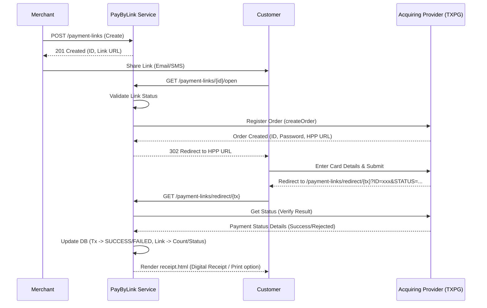

# Architecture and name: PayByLink Service

## 1. General Description and Context

-   **Reason:** Microservice for generating and managing payment links. Designed specifically for merchants without their own website or infrastructure.
-   **Technology stack:** Java Spring Boot
-   **Acquiring integration:** MilliKart - TXPG
-   **Redirection & Receipt:** Since the merchants do not have their own website, the service hosts a built-in checkout status and receipt page (`redirect.html`). Upon completion, the customer receives a digital receipt with options to print or close the browser window.

---

## 2. Endpoint List

1.  **Create Payment Link:** Generates a new payment link with specified parameters.
2.  **Update Payment Link:** Modifies parameters of an existing payment link.
3.  **Get Payment Link by ID:** Retrieves detailed information for a specific link.
4.  **List Payment Links:** Retrieves a paginated list of links for a company's terminals.
5.  **Open Payment Page:** Customer-facing endpoint. Validates the link status, initiates a transaction at the provider, and redirects the customer to the acquiring payment interface.
6.  **Redirect Landing Page:** Receives the customer back from the acquiring provider, triggers status verification, and serves the Thymeleaf-based online receipt page.
7.  **Get Transaction Status:** Serves transaction details and real-time status (accessed publicly by the receipt page).
8.  **Complete DMS Payment:** Finalizes a Dual Message System (DMS) payment.
9.  **Refund Transaction:** Processes a refund for a successful payment.

---

## 3. DB Models (PostgreSQL + Hibernate)

*A normalized structure to support both single and multiple payment usage, transaction tracking, and terminal configurations.*

### 3.1. Table `payment_links`

Stores the configuration and metadata for the generated payment link.

-   `id` (UUID) – Primary Key
-   `version` (Long) – Optimistic-locking version
-   `provider_reference` (String) – Reference ID from the provider (corresponds to `rid`)
-   `merchant_order_id` (String) – Reference ID from the merchant side
-   `terminal_id` (Integer) – Associated merchant terminal ID (Foreign Key to `terminals.id`)
-   `amount` (Decimal) – Payment amount
-   `currency` (String) – ISO 4217 code (e.g., AZN)
-   `description` (String) – Optional description for the customer
-   `customer_name` (String) – Customer's full name
-   `customer_email` (String) – Customer's email address
-   `customer_phone` (String) – Customer's phone number
-   `payment_type` (Enum) - `SMS` (Single Message), `DMS` (Dual Message)
-   `usage_type` (Enum) - `SINGLE` (one-time use), `MULTIPLE` (reusable)
-   `max_payments` (Integer) – Allowed number of payments (for `MULTIPLE`)
-   `current_payments_count` (Integer) – Number of successful payments processed (synced on payment success)
-   `status` (Enum) - `ACTIVE`, `EXPIRED`, `COMPLETED`, `CANCELED`
-   `metadata` (JSONB) – Custom key-value metadata for the merchant
-   `expires_at` (Timestamp) - Link expiration time
-   `created_at` (Timestamp) – Record creation timestamp
-   `updated_at` (Timestamp) – Last update timestamp

### 3.2. Table `transactions`

Records each individual payment attempt/transaction associated with a link.

-   `id` (UUID) - Primary Key
-   `link_id` (UUID) - Foreign Key referencing `payment_links.id`
-   `merchant_rid` (UUID) - Unique tracking UUID sent to the provider
-   `provider_order_id` (String) - Order ID returned by the acquiring provider (TXPG)
-   `provider_password` (String) - Password returned by the acquiring provider
-   `amount` (Decimal) - Amount processed in this specific transaction
-   `refunded_amount` (Decimal) - Total amount refunded so far
-   `status` (Enum) - `PENDING`, `AUTHORIZED`, `SUCCESS`, `FAILED`, `REFUNDED`, `PARTIALLY_REFUNDED`
-   `provider_response` (JSONB) - Raw response from the provider for auditing
-   `created_at` (Timestamp) - Transaction creation timestamp
-   `updated_at` (Timestamp) - Last update timestamp

### 3.3. Table `terminals`

Stores acquiring credentials and company mapping.

-   `id` (Integer) - Primary Key (Terminal ID)
-   `name` (String) - Terminal name
-   `login` (String) - Acquiring login credentials
-   `password` (String) - Acquiring password credentials
-   `company_id` (String) - ID of the parent company owning this terminal

---

## 4. Security & Role-Based Access Control (RBAC)

The service enforces stateless authorization using JWT Bearer tokens passed in the `Authorization` header. The token payload must contain:
-   `userId` (String)
-   `role` (String)
-   `companyId` (String)

### 4.1. Roles and Permissions Matrix

-   **SYSTEM_ADMIN**: Bypasses company matching logic. Has full access across all terminals.
-   **COMPANY_HEAD / COMPANY_MANAGER**: Access to terminals belonging to their own company (`companyId` matching). Can create/update links, complete DMS, and issue refunds.
-   **COMPANY_EMPLOYEE**: Allowed to create/update links and complete DMS payments for their company, but **refunds are forbidden** (returns `403 Forbidden`).
-   **AUDITOR**: Read-only access (GET/LIST) to their company's payment links and transactions. All write actions are forbidden.

---

## 5. API Contracts (Endpoints)

### 5.1. Create Payment Link

Creates a new payment link resource.

-   **Method:** `POST /api/v1/payment-links`
-   **Headers:**
    -   `Authorization: Bearer <token>`

**Request Body:**

```json
{
  "merchantOrderId": "ORDER-12345",
  "terminal": 123456789,
  "amount": 1500.50,
  "currency": "AZN",
  "description": "Payment for order #123456",
  "customer": {
    "fullName": "John Doe",
    "email": "test@test.com",
    "phone": "994509771884"
  },
  "paymentType": "DMS",
  "usageType": "MULTIPLE",
  "maxPayments": 25,
  "metadata": {
    "campaign": "summer_sale"
  }
}
```

**Validation Rules:**

-   `terminal`: Required, Integer
-   `amount`: Required, Decimal (Positive, > 0)
-   `currency`: Required, String (ISO 4217, 3 letters, e.g., "AZN")
-   `paymentType`: Required, Enum (`SMS`, `DMS`)
-   `usageType`: Required, Enum (`SINGLE`, `MULTIPLE`)
-   `maxPayments`: Required if `usageType` is `MULTIPLE`, Integer (> 0)
-   `customer.email`: Optional, valid email format
-   `customer.phone`: Optional, valid phone format

**Response:**

-   **Status Code:** `201 Created`
-   **Body:**

```json
{
  "id": "550e8400-e29b-41d4-a716-446655440000",
  "rid": "RID-987654321",
  "merchantOrderId": "ORDER-12345",
  "terminal": 123456789,
  "amount": 1500.50,
  "currency": "AZN",
  "description": "Payment for order #123456",
  "customer": {
    "fullName": "John Doe",
    "email": "test@test.com",
    "phone": "994509771884"
  },
  "paymentType": "DMS",
  "usageType": "MULTIPLE",
  "maxPayments": 25,
  "currentPaymentsCount": 0,
  "status": "ACTIVE",
  "link": "http://localhost:8080/api/v1/payment-links/550e8400-e29b-41d4-a716-446655440000/open",
  "metadata": {
    "campaign": "summer_sale"
  },
  "createdAt": "2026-07-07T13:14:00Z"
}
```

### 5.2. Update Payment Link

Partially updates an existing payment link. Only fields provided in the request will be modified.

-   **Method:** `PATCH /api/v1/payment-links/{id}`
-   **Headers:**
    -   `Authorization: Bearer <token>`

**Request Body:**

```json
{
  "amount": 1600.00,
  "description": "Updated description",
  "customer": {
    "fullName": "John Doe",
    "email": "new-email@test.com"
  },
  "expiresAt": "2026-07-10T15:00:00Z",
  "status": "CANCELED"
}
```

**Response:**

-   **Status Code:** `200 OK`
-   **Body:** (Same structure as Create Link response)

### 5.3. Get Payment Link by ID

-   **Method:** `GET /api/v1/payment-links/{id}`
-   **Headers:**
    -   `Authorization: Bearer <token>`

**Response:**

-   **Status Code:** `200 OK`
-   **Body:** (Same structure as Create Link response)

### 5.4. List Payment Links

Retrieves a paginated list of links. Automatic company boundaries are enforced for non-admin requests based on the user's `companyId`.

-   **Method:** `GET /api/v1/payment-links`
-   **Headers:**
    -   `Authorization: Bearer <token>`
-   **Query Parameters:**
    -   `page`: Integer (default 0)
    -   `size`: Integer (default 20)
    -   `terminal`: Integer (optional filter)
    -   `status`: String (optional filter)

**Response:**

-   **Status Code:** `200 OK`
-   **Body:**

```json
{
  "content": [
    {
      "id": "550e8400-e29b-41d4-a716-446655440000",
      "status": "COMPLETED",
      "amount": 1500.50,
      "currency": "AZN",
      "createdAt": "2026-07-07T13:14:00Z"
    }
  ],
  "totalElements": 1,
  "totalPages": 1,
  "size": 20,
  "number": 0
}
```

### 5.5. Open Payment Page

-   **Method:** `GET /api/v1/payment-links/{id}/open`
-   **Description:** Customer-facing public endpoint. Validates the link status, initiates an order with the acquiring provider, and redirects the customer to the HPP page.
-   **Response:** `302 Found` (Redirects to provider HPP) or `403 Forbidden` (if link is EXPIRED/CANCELED/COMPLETED).

### 5.6. Redirect Landing Page

-   **Method:** `GET /api/v1/payment-links/redirect/{tx}`
-   **Path Parameters:**
    -   `tx`: Unique tracking transaction UUID
-   **Query Parameters:**
    -   `ID`: Provider Order ID
    -   `PASSWORD`: Provider Order Password
    -   `STATUS`: Provider Order Status
-   **Description:** Customer-facing public landing endpoint. Immediately triggers background status verification and serves the Thymeleaf-based payment result/receipt page.

### 5.7. Get Transaction Status

-   **Method:** `GET /api/v1/transactions/{providerOrderId}/status`
-   **Description:** Public endpoint used by the receipt page to retrieve transaction details and status. It queries the provider's API to ensure the status is fresh and verified.

**Response:**

-   **Status Code:** `200 OK`
-   **Body:**

```json
{
  "id": "550e8400-e29b-41d4-a716-446655440001",
  "status": "SUCCESS",
  "amount": 1500.50,
  "currency": "AZN",
  "description": "Payment for order #123456",
  "merchantOrderId": "ORDER-12345",
  "createdAt": "2026-07-07T13:15:00Z",
  "customerName": "John Doe",
  "customerEmail": "test@test.com",
  "customerPhone": "994509771884"
}
```

### 5.8. Complete DMS Payment

-   **Method:** `POST /api/v1/transactions/{transactionId}/complete`
-   **Headers:**
    -   `Authorization: Bearer <token>`

**Request Body:**

```json
{
  "amount": 1500.50
}
```

**Response:**

-   **Status Code:** `200 OK`
-   **Body:** (Same structure as Create Link response)

### 5.9. Refund Transaction

-   **Method:** `POST /api/v1/transactions/{transactionId}/refund`
-   **Headers:**
    -   `Authorization: Bearer <token>`

**Request Body:**

```json
{
  "amount": 500.00,
  "reason": "Customer request"
}
```

**Response:**

-   **Status Code:** `200 OK`
-   **Body:**

```json
{
  "transactionId": "550e8400-e29b-41d4-a716-446655440001",
  "status": "PARTIALLY_REFUNDED",
  "amount": 500.00,
  "refundId": "REF-12345"
}
```

---

## 6. Error Handling

Standard HTTP status codes are used:

-   `400 Bad Request`: Validation error or business logic violation.
-   `401 Unauthorized`: Missing or invalid authentication token.
-   `403 Forbidden`: Access denied or resource in invalid state for action.
-   `404 Not Found`: The requested resource does not exist.
-   `409 Conflict`: Request conflict (e.g., duplicate Idempotency-Key with different parameters).
-   `500 Internal Server Error`: Unexpected server-side error.

---

## 7. Payment Flow Diagram

The following diagram illustrates the typical lifecycle of a payment link using the built-in receipt landing page.

