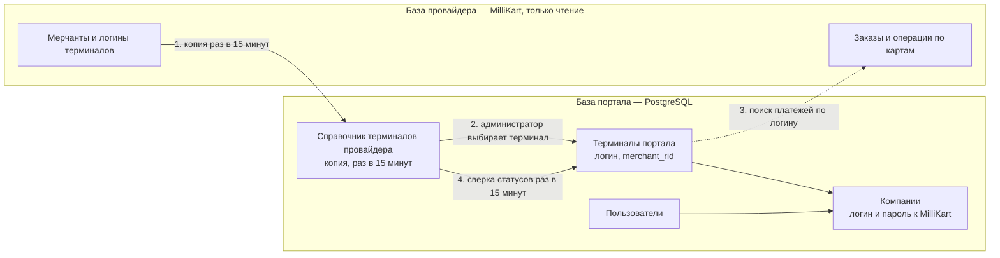

# Руководство системного администратора: компании, терминалы, пользователи

> Для того, кто заводит в портал новых мерчантов. Сверено с кодом 24.09.2026.
> Точные запросы и ответы API — `directory.md`, `auth.md`, `ecom.md`; установка сервисов и первый
> администратор — `deployment_guide.md`.

## Содержание

1. [Что вы настраиваете](#1-что-вы-настраиваете)
2. [Как связаны две базы](#2-как-связаны-две-базы)
3. [Перед началом](#3-перед-началом)
4. [Компания](#4-компания)
5. [Терминал](#5-терминал)
6. [Пользователи компании](#6-пользователи-компании)
7. [Проверить результат](#7-проверить-результат)
8. [Вывести компанию из работы](#8-вывести-компанию-из-работы)
9. [Журнал аудита](#9-журнал-аудита)
10. [Частые вопросы](#10-частые-вопросы)

---

## 1. Что вы настраиваете

Мерчант появляется в портале в три шага, и порядок важен:

1. **Компания** — запись о юрлице и её **логин и пароль к MilliKart** (у провайдера компания —
   мультимерчант). С ними портал отправляет провайдеру все запросы по платежам компании.
2. **Терминал** — терминал мерчанта у MilliKart, выбранный из справочника провайдера. Пароля у
   терминала нет. Через терминал портал принимает оплаты по ссылкам и по его логину находит платежи
   мерчанта в базе провайдера.
3. **Пользователи** — сотрудники мерчанта. Видят только данные своей компании, то есть платежи её
   терминалов.

Компания без терминалов пустая: выписка и главная страница у её сотрудников будут нулевыми.

Всё, что описано ниже, доступно роли **«Системный администратор»**. Первого такого пользователя
создают при установке (`deployment_guide.md` §20), следующих — на странице «Пользователи».

---

## 2. Как связаны две базы

### 2.1. Простыми словами

У портала две базы данных:

- **База портала** (PostgreSQL) — наша. В ней компании, пользователи, терминалы с паролями,
  платёжные ссылки и журнал аудита. Портал в неё пишет.
- **База провайдера** (Oracle платёжного шлюза MilliKart, TXPG) — чужая. В ней мерчанты MilliKart,
  логины их терминалов и все операции по картам. Портал её **только читает** и ничего в неё не пишет.

Общих таблиц между базами нет. Связывают их две вещи: **код мерчанта у провайдера** (`merchant_rid`)
и **логин терминала**.

Представьте, что база провайдера — большой архив в соседнем здании. За каждой мелочью портал туда не
ходит: раз в 15 минут он снимает **копию списка терминалов** и хранит её у себя — это «справочник
терминалов провайдера». А за платежами ходит в архив напрямую, когда пользователь открывает выписку
или главную страницу.

### 2.2. Четыре связи

1. **Справочник.** Раз в 15 минут портал читает из базы провайдера активные e-commerce терминалы —
   код мерчанта, название и логин — и обновляет свою копию. Пароля в копии нет: у провайдера его не
   берут. Обновить копию сразу можно кнопкой «Обновить справочник» в форме терминала.
2. **Привязка терминала.** Заводя терминал, вы выбираете строку из справочника. Портал записывает в
   свой терминал код мерчанта, название и логин провайдера; пароля у терминала нет. Один терминал
   провайдера привязывается только к одному терминалу портала — значит, к одной компании.
3. **Платежи.** Выписка «Электронная коммерция» и главная страница читают базу провайдера в момент
   открытия по цепочке: компания пользователя → её терминалы → их логины → мерчанты с этими логинами у
   провайдера → их заказы. Поэтому **от логина терминала и от выбранной компании зависит, кто чьи
   платежи видит.**
4. **Статусы.** Раз в 15 минут портал сравнивает свои терминалы со справочником:
   - терминал пропал у провайдера (три обновления справочника подряд) → портал сам блокирует свой
     терминал, активные ссылки приостанавливаются;
   - терминал снова появился → портал сам его разблокирует и возвращает ссылки;
   - у провайдера сменились название или логин → портал переносит их к себе.

   Терминал, заблокированный вручную, и терминал без кода мерчанта сверка не трогает.

Оплата по платёжной ссылке идёт другим путём — не через базу, а через API шлюза MilliKart: портал
создаёт заказ, подписываясь логином и паролем **компании** терминала. Поэтому неверный пароль компании
выписке не мешает, а оплату по ссылкам ломает.

### 2.3. Чего эта связь не делает

- **Не выключает терминал у MilliKart.** Блокировка в портале запрещает только новые оплаты через
  портал; у провайдера терминал продолжает работать.
- **Не заводит терминал у провайдера.** Сначала терминал заводит MilliKart, потом он появляется в
  справочнике, и только после этого его можно добавить в портал.
- **Не ломается от недоступности провайдера.** Если база провайдера не ответила или вернула пустой
  список, справочник остаётся прежним, и терминалы из-за этого не блокируются.

### 2.4. Что где хранится

| Что | Где | Кто меняет |
|:---|:---|:---|
| Компании, пользователи | база портала | вы, на страницах портала |
| Логин и пароль компании к MilliKart | база портала, пароль зашифрован | вы; посмотреть пароль нельзя, только заменить |
| Терминал: компания, статус | база портала | вы |
| Терминал: название и логин | база портала | провайдер; портал переносит изменения сам |
| Справочник терминалов провайдера | база портала, копия | портал, раз в 15 минут или по кнопке |
| Платёжные ссылки и оплаты по ним | база портала | сотрудники мерчанта |
| Операции по картам (выписка) | база провайдера | MilliKart; портал только читает |

---

## 3. Перед началом

- Вы вошли с ролью «Системный администратор».
- Терминал мерчанта уже заведён и включён у MilliKart.
- От MilliKart получены **логин и пароль компании** (мультимерчанта) — логин целиком, с префиксом,
  например `TerminalSys/…`.
- Выбран код компании (§4.1) — поменять его потом нельзя.

---

## 4. Компания

### 4.1. Завести

1. Меню **«Компании»** → **«Добавить компанию»**.
2. **«Код / ID компании»** — короткий уникальный код, например `COMP-001`. Лучше латиница, цифры и
   дефис. Код виден в списках и журнале. **Изменить его потом нельзя**, а код удалённой компании
   остаётся занятым навсегда.
3. **«Юридическое название»** — как в договоре.
4. **«Логин к провайдеру»** — логин компании от MilliKart **целиком, с префиксом**, например
   `TerminalSys/merchant`: портал ничего не дописывает.
5. **«Пароль к провайдеру»** — пароль от MilliKart. Хранится зашифрованным; посмотреть его потом
   нельзя никому, только заменить.
6. **«Создать»**.

Ошибка `Company with ID '…' already exists` — код занят, в том числе удалённой компанией. Возьмите
другой. Ошибка `Provider login is already used by another company` — этот логин уже у другой
компании: у каждой компании свой.

### 4.2. Что можно менять потом

- **Название** — на экране нельзя, только через API: `PATCH /api/v1/companies/{id}` (`directory.md` §3.1).
- **Логин и пароль к провайдеру** — ключ в строке, окно **«Доступ к провайдеру»**. Пароль в окне пуст:
  оставьте пустым, чтобы не менять, или введите новый. Перед сохранением портал покажет, что изменится.
  С новыми данными сразу пойдут все запросы компании к провайдеру — после смены нажмите «Тест» у
  любого её терминала.
- **Пометка «Активна / Неактивна»** — переключатель в строке. **Это только пометка**: вход сотрудников,
  создание ссылок и приём платежей она не останавливает.
- **Удаление** — корзина в строке. Компания пропадает из списков портала, но её терминалы,
  пользователи, ссылки и операции остаются и продолжают работать. Восстановить удалённую компанию из
  портала нельзя.

Как на самом деле остановить компанию — §8.

---

## 5. Терминал

### 5.1. Завести

1. Меню **«Терминалы»** → **«Добавить терминал»**.
2. **«Назначенная компания»** — компания мерчанта.
3. **«Терминал провайдера»** — начните вводить логин или название и выберите строку. Под полем
   появятся название и логин от провайдера: сверьте их с данными от MilliKart.
   Нужного терминала нет или список пуст — нажмите **«Обновить справочник»**. Если терминал не
   появился и после этого, у провайдера он не заведён или выключен: вопрос к MilliKart.
4. **«Зарегистрировать терминал»**. Пароля у терминала нет — портал ходит к провайдеру с логином и
   паролем компании.
5. **«Тест»** в строке нового терминала (§5.2): ошибка иначе всплывёт только на первой оплате клиента.

Номер терминала портал выдаёт сам. В списке логин показан с приставкой `TerminalSys/` — так шлюз
называет логины терминалов, это нормально.

### 5.2. Кнопка «Тест»

Портал создаёт у провайдера пробный заказ на 1 AZN с логином и паролем компании терминала — так
проверяется, что платёж создать можно. Его никто не оплачивает, денег он не списывает,
через 10 минут истекает у провайдера и в выписку не попадает. Каждая проверка записывается в журнал
аудита.

| Результат | Что значит | Что делать |
|:---|:---|:---|
| «Данные компании приняты, платёж создать можно» | всё в порядке | — |
| «Неверный логин или пароль компании» | пароль не подходит к логину компании | уточнить у MilliKart и сменить в «Доступ к провайдеру» (§4.2) |
| «Данные приняты, но эквайер не разрешил оплату» | логин и пароль верные, но провайдер отказал в заказе; причина — рядом | к MilliKart: терминал не настроен на приём оплат |
| «Эквайер не ответил — о терминале ничего не известно» | провайдер недоступен | повторить позже |

«Тест» есть только у заведённого терминала. Пригодится и потом — когда мерчант жалуется, что оплаты
не проходят. Если у компании нет логина и пароля к провайдеру, портал ответит ошибкой
`Company … has no acquirer credentials` и к провайдеру не обратится — задайте их (§4.2).

### 5.3. Ошибки при заведении

| Что видите | Причина | Что делать |
|:---|:---|:---|
| `Provider terminal … is already linked to terminal …` | этот терминал провайдера уже заведён в портале, возможно в другой компании | найдите его поиском на странице «Терминалы»; если компания не та — поменяйте её в найденном терминале (§5.4), второй не заводите |
| `Provider terminal … is not in the synchronised list` | терминала нет в справочнике | «Обновить справочник» и выбрать заново |
| «Справочник провайдера пуст…» | копия ещё ни разу не снималась | «Обновить справочник» |
| «Справочник не обновлён: …» | не удалось прочитать базу провайдера | повторить позже; если не проходит — к администратору сервера: сервис `ecom` и доступ к базе шлюза |
| «Заполните все обязательные поля» | не выбрана компания или терминал | заполнить |

### 5.4. Изменить

Карандаш в строке — **«Редактировать терминал»**. Перед сохранением портал покажет список изменений —
сверьте его.

- **Компания** — перенос терминала в другую компанию. Вместе с терминалом к новой компании переходят
  его ссылки и платежи в выписке.
- **Название** можно поправить, но при сверке портал вернёт значение провайдера. Логин терминала не
  правится: его меняет только сверка со справочником.
- Пароля у терминала нет: логин и пароль к провайдеру меняются у компании (§4.2).

### 5.5. Заблокировать и разблокировать

Терминалы **не удаляются**, их блокируют.

- **Блокировка**: новые оплаты через портал не принимаются, активные ссылки приостанавливаются.
  Возвраты, списание холдов DMS и проверка статуса по прошлым платежам продолжают работать.
- **Разблокировка**: приостановленные ссылки возвращаются в работу, кроме тех, у которых за время
  блокировки истёк срок.
- Блокировка действует **только в портале**: у MilliKart терминал продолжает работать.

**Автоматическая блокировка.** Если терминал выключили у провайдера, портал заблокирует его сам — в
пределах часа (три обновления справочника подряд без терминала, затем сверка). Вручную такой терминал
не разблокировать: портал ответит, что терминал выключен у провайдера и включится сам. Когда провайдер
вернёт терминал, портал разблокирует его в пределах получаса.

### 5.6. Терминалы, заведённые самой компанией

С 24.09.2026 заводит терминалы только системный администратор, выбором из справочника; руководитель и
менеджер компании терминалы только правят и блокируют. Терминалы, которые компании завели раньше
руками, остались: кода мерчанта у них нет, сверка статусов их не трогает, а выписка ищет их платежи по
введённому логину — опечатка или чужой логин открывает компании платежи чужого мерчанта. Проверьте их.

---

## 6. Пользователи компании

### 6.1. Роли

| Роль | Кому | Что может |
|:---|:---|:---|
| Руководитель компании | владельцу, директору | всё по своей компании: заводит менеджеров и сотрудников, правит и блокирует терминалы (заводит их администратор), ссылки, возвраты, журнал аудита |
| Менеджер компании | менеджеру | правит и блокирует терминалы, ссылки, возвраты, журнал аудита своей компании; пользователей не заводит |
| Сотрудник компании | кассиру, оператору | создаёт ссылки, списывает холды DMS, смотрит платежи; возвратов и терминалов нет |
| Аудитор | проверяющему, не сотруднику мерчанта | только чтение, по всем компаниям |
| Системный администратор | вам | всё, по всем компаниям |

Обычно администратор заводит одного **руководителя компании**, а остальных сотрудников заводит уже он.

### 6.2. Завести

1. Меню **«Пользователи»** → **«Добавить пользователя»**.
2. **«Имя пользователя (Логин)»** — email сотрудника, им он входит.
3. **«Пароль»** — не короче 12 символов: заглавные и строчные буквы, цифра и спецсимвол. Передайте
   пароль сотруднику безопасным способом.
4. **«ФИО»**.
5. **«Системная роль»**.
6. **«Назначенная компания»** — для ролей компании обязательна: без компании пользователь не увидит
   ни терминалов, ни платежей.
7. **«Создать»**.

### 6.3. Изменить и заблокировать

- Карандаш в строке — ФИО, роль, компания, статус, новый пароль. Новая роль или компания начинает
  действовать в течение 15 минут; блокировка завершает сессии пользователя сразу.
- Для временного отключения ставьте статус «Заблокирован». Удаление необратимо: удалённого
  пользователя не восстановить и не отредактировать.
- Свою роль и свой статус поменять нельзя.
- После 6 неудачных попыток входа учётная запись сама блокируется на 30 минут.

---

## 7. Проверить результат

1. **«Терминалы»** — терминал в нужной компании, статус «Активен», «Тест» проходит.
2. **«Транзакции» → «Электронная коммерция»** — выберите период, в котором у мерчанта были оплаты, и
   терминал в фильтре: платежи видны. Администратор видит платежи всех заведённых терминалов.
3. Попросите руководителя компании войти: на главной — статистика только его терминалов, на странице
   «Терминалы» — только его терминалы.
4. **«Журнал аудита»** — записи о создании компании, терминала и пользователя.

---

## 8. Вывести компанию из работы

Пометка «Неактивна» и удаление компании ничего не останавливают. Порядок такой:

1. **Заблокируйте все терминалы компании** — на странице «Терминалы» поиск находит терминалы и по
   названию компании. Новые оплаты через портал прекратятся.
2. **Заблокируйте пользователей компании** — они перестанут входить.
3. При необходимости пометьте компанию неактивной или удалите её.

Если мерчант уходит от MilliKart совсем, терминал выключает MilliKart, и портал подхватит это сам (§5.5).

---

## 9. Журнал аудита

Меню **«Журнал аудита»**: кто, когда и с какого адреса что сделал — создание и изменение компаний,
терминалов и пользователей, смена логина и пароля компании к провайдеру (без самого пароля), проверки
«Тест», блокировки. Автоматические
действия сверки записаны от исполнителя `system`. Есть фильтры по ресурсу, результату и датам. Записи
журнала нельзя изменить или удалить.

---

## 10. Частые вопросы

**Мерчант не видит платежи в выписке.** Проверьте по порядку: у пользователя назначена компания; у
компании есть терминалы; терминал в той компании; в выбранном периоде были оплаты. Незавершённые
заказы в выписку не попадают.

**Оплата по ссылке не проходит, а выписка работает.** Скорее всего, неверный логин или пароль
компании: нажмите «Тест» в строке терминала и при необходимости смените их (§4.2).

**Терминал заблокировался сам.** Его выключили у провайдера. В журнале аудита будет блокировка от
`system`. Вопрос к MilliKart; когда терминал включат, портал разблокирует его сам.

**Терминал не разблокируется вручную.** Он выключен у провайдера — см. предыдущий вопрос.

**У мерчанта сменился логин терминала у MilliKart.** Терминал из справочника обновится сам в течение
получаса. **Сменились логин или пароль компании** — введите новые в «Доступ к провайдеру» (§4.2) и
нажмите «Тест».

**Терминал нужно перенести в другую компанию.** Не заводите второй — поменяйте компанию в
существующем (§5.4).
