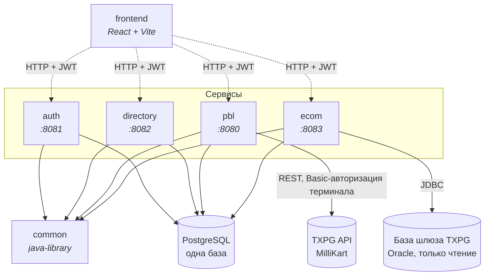
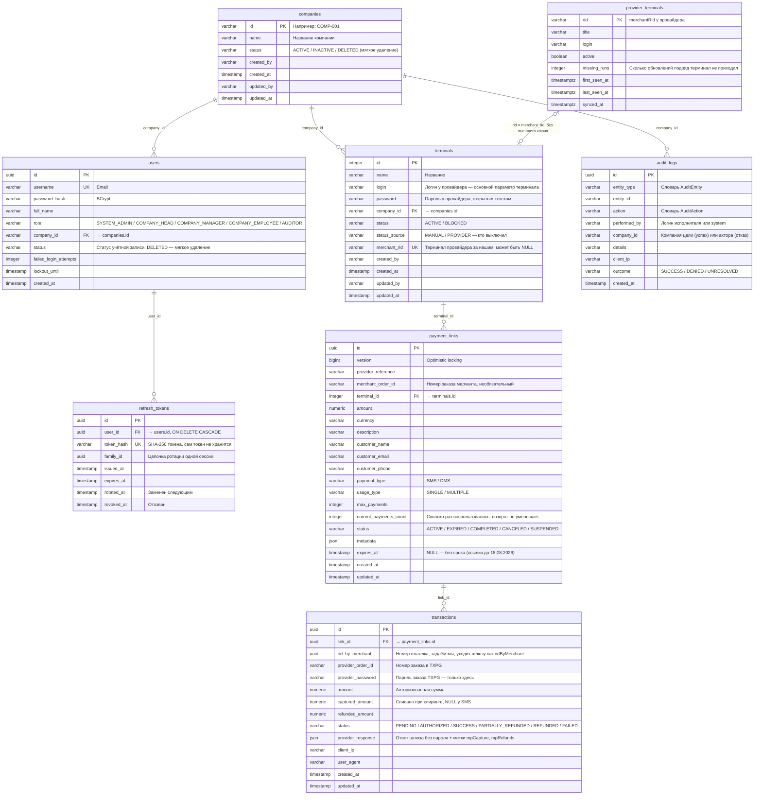
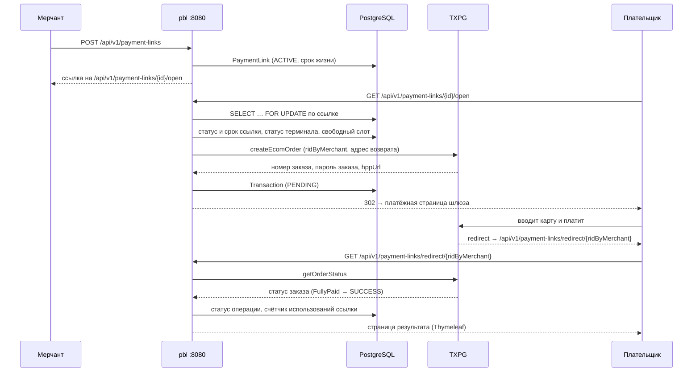
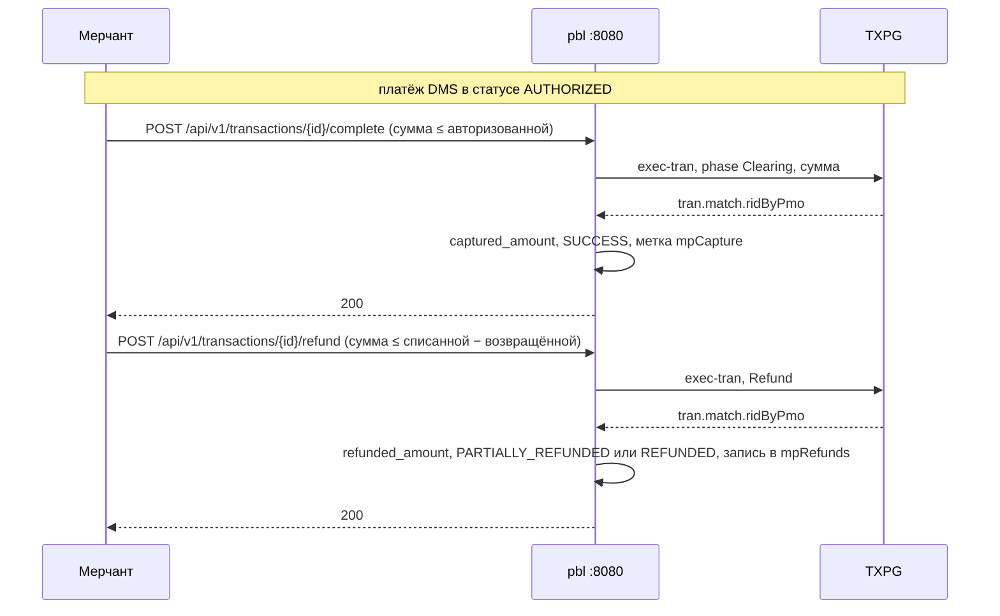

# 📖 Merchant Portal — обзор архитектуры

> Для разработчиков, архитекторов и тестировщиков: из чего состоит система и как её части связаны.
> Сверено с кодом 13.09.2026.
>
> Чего здесь нет и где это искать: контракты API (запросы, ответы, отказы) — `auth.md`,
> `directory.md`, `pay-by-link.md`, `ecom.md`; стек с версиями, роли и матрица доступа, правила и
> известные ограничения — корневой `AGENTS.md`; установка и эксплуатация — `deployment_guide.md`.

## 📋 Содержание

1. Что такое Merchant Portal
2. Архитектура
3. Модули
4. База данных
5. Безопасность
6. Связи между сервисами
7. Интеграция с платёжным шлюзом TXPG
8. Сервис `ecom` и база провайдера
9. Фоновые процессы
10. Фронтенд
11. Потоки данных

---

## 1. Что такое Merchant Portal

Веб-портал мерчантов MilliKart:

- 🔐 вход по email и паролю, пять ролей; пользователь компании видит только данные своей компании;
- 🏢 компании и эквайринговые терминалы: логин и пароль терминала у провайдера, проверка учётных
  данных пробным заказом, сверка статусов терминалов с провайдером;
- 🔗 платёжные ссылки Pay-By-Link: одноразовые и многоразовые, со сроком жизни и страницей возврата
  плательщика;
- 💳 операции: одностадийные (SMS) и двухстадийные (DMS) платежи, списание холда, возвраты,
  проверка статуса у шлюза;
- 📊 сводка на главной странице и 📋 журнал аудита действий;
- 🧾 выписка E-commerce из базы провайдера — для мерчантов с собственным онлайн-эквайрингом
  (в работе, §8).

---

## 2. Архитектура

### 2.1. Общая структура

Gradle-монорепозиторий: четыре Spring Boot-сервиса, библиотека `common` и React SPA (не Gradle).

```
mp/
├── common/      ← java-library: security, журнал аудита, исключения, общие DTO, поиск
├── auth/        ← :8081 — вход, токены, пользователи
├── directory/   ← :8082 — компании, терминалы, чтение журнала аудита, сверка статусов терминалов
├── pbl/         ← :8080 — платёжные ссылки, операции, сводка, интеграция с TXPG, проверка терминала
├── ecom/        ← :8083 — выписка провайдера, справочник терминалов провайдера
└── frontend/    ← React SPA (Vite)
```



### 2.2. Слои сервиса

```
Controller (REST)  ← принимает UserPrincipal и передаёт в сервис; прав не проверяет
    ↓ DTO (Java record)
Service            ← бизнес-правила, проверки прав, транзакции, журнал аудита
    ↓ сущность JPA
Repository         ← Spring Data JPA; нативные запросы — там, где читается чужая таблица
    ↓ SQL
PostgreSQL         ← схема из Liquibase, ddl-auto: validate
```

`common` сам не запускается: сервисы подключают его зависимостью и сканируют пакет `az.millikart`
целиком. Сущности и репозитории журнала аудита каждый сервис дополнительно перечисляет в
`@EntityScan` / `@EnableJpaRepositories`.

---

## 3. Модули

### 3.1. `common`

| Пакет | Что внутри |
|:---|:---|
| `security` | `JwtProvider` (HS256), `JwtAuthFilter`, `SecurityConfig` («по умолчанию запрещено»), `PublicEndpoints` — единственный список публичных путей, `Role`, `UserPrincipal`, `SecurityErrorResponder`, `TraceIdFilter`, `MissingSecretFailureAnalyzer` |
| `audit` | журнал аудита: `AuditEvent`, `AuditLogService` (отказы и неизвестный исход пишутся сразу), `AuditLogWriter` (успех — после коммита), словарь `AuditEntity` / `AuditAction`, `AuditOutcome`, `AuditLogRepository` (только `save`) |
| `exception` | исключения проекта и `GlobalExceptionHandler` с единым `ErrorResponse` |
| `web` | адрес клиента: `ClientIp`, `ClientIpFilter`, `ClientIpHolder`, `TrustedProxies` |
| `dto`, `search`, `validation`, `config` | `ErrorResponse`, `PagedResponse`; `SearchTerms` — поиск с экранированием; политика паролей PCI-DSS; `CacheConfig` (потребителей кэша нет) |

`testFixtures` — `PostgresTestContainer`, общий контейнер PostgreSQL для интеграционных тестов.

### 3.2. `auth` (:8081)

| Пакет | Что внутри |
|:---|:---|
| `controller` | `AuthController` (вход, обновление пары токенов, выход), `UserController` |
| `service` | `AuthService` (вход, ротация и отзыв refresh-токенов), `RefreshTokenService`, `UserService` (пользователи; отзыв сессий при блокировке и удалении) |
| `security` | `LoginRateLimiter` — лимит неудачных входов с одного адреса, счётчики в памяти |
| `bootstrap` | `AdminBootstrapRunner` — разовое создание первого `SYSTEM_ADMIN` |
| `scheduler` | `RefreshTokenCleanupScheduler` |
| `domain`, `repository` | `User`, `RefreshToken`, `Company` (только для проверок и поиска) |

Контракты — `auth.md`.

### 3.3. `directory` (:8082)

| Пакет | Что внутри |
|:---|:---|
| `controller` | `CompanyController`, `TerminalController` (в том числе лёгкий список `options` и пароль терминала), `AuditLogController` |
| `service` | `CompanyService`, `TerminalService` (права, блокировка с приостановкой ссылок, пароль терминала), `AuditLogQueryService`, `TerminalStatusReconciliationService` (сверка статусов со слепком провайдера) |
| `repository` | `CompanyRepository`, `TerminalRepository`, `AuditLogQueryRepository`; нативные запросы к чужим таблицам — `PaymentLinkStatusRepository` (статусы ссылок `pbl`) и `ProviderTerminalStatusRepository` (слепок `ecom`) |
| `scheduler` | `TerminalStatusReconciliationScheduler` |
| `domain` | `Company`, `Terminal`, `TerminalStatus`, `TerminalStatusSource` |

Контракты — `directory.md`.

### 3.4. `pbl` (:8080)

| Пакет | Что внутри |
|:---|:---|
| `controller` | `PaymentLinkController`, `OpenLinkController` (публичные открытие ссылки и страница возврата), `TransactionController`, `DashboardController`, `TerminalCheckController` |
| `service` | `PaymentLinkService` (ссылки, операции, статусы, история операции), `OpenLinkService` (открытие ссылки под блокировкой строки), `TransactionReconciliationService`, `DashboardService`, `TerminalCheckService`, `PaymentLinkMapper` |
| `provider` | `AcquiringClient` и его единственная реализация `TxpgAcquiringClient`; разборщики ответов шлюза `ProviderOrderStatus`, `ProviderOrderDetails`, `ProviderDeclineReason`, `ProviderPayloads`; DTO шлюза |
| `repository` | `PaymentLinkRepository`, `TransactionRepository`, `TerminalRepository`, `DashboardRepository` |
| `scheduler` | `PaymentLinkScheduler`, `TransactionReconciliationScheduler` |
| `config` | `UrlConfigurationCheck` — проверка адресов на старте |
| `resources/templates` | `redirect.html` — страница возврата плательщика (Thymeleaf) |

Контракты — `pay-by-link.md`; контракт шлюза — `TXPG-client-side-integration.md`.

### 3.5. `ecom` (:8083)

| Пакет | Что внутри |
|:---|:---|
| `config` | `TxpgDataSourceConfig` — второй источник данных (база шлюза) рядом с основной PostgreSQL, `TxpgProperties` |
| `controller` | `EcomTransactionController` (выписка, итоги периода, терминалы для фильтра, карточка заказа), `ProviderTerminalController` (справочник терминалов провайдера и его ручное обновление) |
| `service` | `EcomTransactionService`, `EcomScopeService` (чьи платежи видит пользователь), `EcomOrderAssembler` (строки шлюза → заказы и их деньги), `EcomOperationKind`, `EcomStatusResolver`, `EcomStatsAccumulator` (итоги периода), `ProviderTerminalSyncService`, `ProviderTerminalSource` |
| `repository` | SQL к базе шлюза — `TxpgTransactionRepository`, `TxpgProviderTerminalSource`; в PostgreSQL — `ProviderTerminalRepository`, `TerminalRepository` (только чтение) |
| `scheduler` | `ProviderTerminalSyncScheduler` |

Контракты — `ecom.md`.

---

## 4. База данных

### 4.1. ER-диаграмма



### 4.2. Общая база

Все сервисы работают с **одной** базой PostgreSQL; кто владеет какой таблицей и кто ещё её читает,
— `AGENTS.md` §5 и §6 ниже. Порядок старта сервисов не важен: каждый changeset, создающий общий
объект, обложен собственным `<preConditions onFail="MARK_RAN">`, и общие таблицы создаёт тот
сервис, что стартовал первым. Единственная межсервисная зависимость — внешний ключ
`terminals.company_id → companies.id`: его создаёт `auth` под `onFail="CONTINUE"`, поэтому при
отсутствии `terminals` changeset не записывается и повторяет попытку на следующем старте `auth`.

`DATABASECHANGELOG` одна на все сервисы, поэтому id changeset'ов несут имя модуля. Применённые
changeset'ы не редактируются.

### 4.3. Миграции (Liquibase)

| Модуль | Файл | Что делает |
|:---|:---|:---|
| `auth` | `002-user-directory-schema.xml` | `companies`, `users`, поля блокировки входа, внешние ключи `users → companies` и `terminals → companies`; администратора не заводит |
| `auth` | `003-refresh-tokens.xml` | `refresh_tokens` и индексы |
| `auth` | `004-audit-logs.xml` | `audit_logs` в финальном виде, если таблицы ещё нет |
| `directory` | `003-directory-schema.xml` | `companies` и `terminals`, аудит-колонки |
| `directory` | `004-audit-log-ip-and-indexes.xml` | `client_ip`, `outcome` и три индекса журнала |
| `directory` | `005-terminal-status.xml` | `terminals.status` |
| `directory` | `006-terminal-status-source.xml` | `terminals.status_source` (по умолчанию `MANUAL`), `terminals.merchant_rid`, уникальный индекс `uk_terminals_merchant_rid` |
| `directory` | `007-terminal-id-sequence.xml` | последовательность `terminals_id_seq` — номера терминалов выдаёт база, продолжая после наибольшего существующего |
| `pbl` | `001-initial-schema.xml` | `payment_links`, `transactions`; `terminals`, если ещё нет |
| `pbl` | `002-add-indexes.xml` | индексы ссылок и транзакций |
| `pbl` | `003-add-client-ip-and-user-agent.xml` | `transactions.client_ip`, `user_agent` |
| `pbl` | `004-add-captured-amount.xml` | `transactions.captured_amount` |
| `pbl` | `005-terminal-status.xml` | `terminals.status` со стороны `pbl` |
| `pbl` | `006-audit-logs.xml` | `audit_logs` со стороны `pbl` |
| `pbl` | `007-transaction-indexes.xml` | три индекса `transactions`: `(link_id, status)`, `(link_id, created_at desc)`, `(status, created_at)` |
| `pbl` | `008-dashboard-indexes.xml` | индекс `transactions(created_at)` для сводки |
| `pbl` | `009-rid-by-merchant.xml` | переименование `transactions.merchant_rid` → `rid_by_merchant` |
| `ecom` | `001-provider-terminals.xml` | `provider_terminals` |
| `ecom` | `002-terminal-status-source.xml` | те же `status_source`, `merchant_rid` и уникальный индекс, что в `directory/006`, если их ещё нет |

### 4.4. Начальные данные

Начальных данных нет: миграции не заводят ни одного пользователя. Первый `SYSTEM_ADMIN` создаёт
`AdminBootstrapRunner` на одном запуске `auth` с `AUTH_BOOTSTRAP_ENABLED=true` из
`BOOTSTRAP_ADMIN_USERNAME` / `BOOTSTRAP_ADMIN_PASSWORD`, и только на пустой таблице `users`.
Процедура — `deployment_guide.md` §20.

---

## 5. Безопасность

- **Токены.** Access-токен — JWT HS256 на 15 минут, claims `sub` (email), `userId`, `role`,
  `companyId`; проверяется во всех сервисах без обращения к базе. Refresh-токен — случайная строка,
  в базе только её SHA-256; ротация с окном снисхождения, цепочка гасится при выходе, краже,
  блокировке и удалении пользователя. Секрет подписи один на все сервисы.
- **Фильтры.** `TraceIdFilter` кладёт `traceId` в MDC, `ClientIpFilter` определяет адрес клиента
  через доверенный прокси, `JwtAuthFilter` превращает токен в `UserPrincipal`. Spring Security
  пропускает без токена только пути из `PublicEndpoints`, остальное — `authenticated()`.
- **Права** проверяются в сервисах через `UserPrincipal` и `enum Role`; матрица доступа —
  `AGENTS.md` §6.
- **Пароли пользователей** — BCrypt и политика PCI-DSS v4.0; после 6 неудачных попыток учётная
  запись блокируется на 30 минут; с одного адреса — не больше 10 неудачных входов за 15 минут.
- **Пароли терминалов** хранятся открытым текстом — они нужны для Basic-авторизации у шлюза.
  Наружу пароль отдаётся только `SYSTEM_ADMIN`, с записью в журнале.
- **Инфраструктурные пути.** Actuator слушает отдельные порты на `127.0.0.1`, Swagger включается
  флагом `SWAGGER_ENABLED` на время приёмки.
- **Журнал аудита** только дописывается: у репозитория один метод `save`, у сущности нет сеттеров.

---

## 6. Связи между сервисами

Сервисы не вызывают друг друга по HTTP. Их связывают JWT с общим секретом и общая база:

| Данные | Пишет | Кто ещё читает или пишет, и как |
|:---|:---|:---|
| `users`, `refresh_tokens` | `auth` | — |
| `companies` | `directory` | `auth` — название компании нативным запросом для поиска пользователей |
| `terminals` | `directory` | `pbl` — логин, пароль и статус для заказов у шлюза; `ecom` — логин для скоупа выписки, `merchant_rid` для её фильтра |
| `payment_links`, `transactions` | `pbl` | `directory` — статусы ссылок нативным запросом при блокировке и разблокировке терминала, в той же транзакции |
| `audit_logs` | все сервисы через `common` | `directory` — чтение журнала |
| `provider_terminals` | `ecom` | `directory` — нативным запросом для сверки статусов терминалов |

Цепочка статуса терминала: `ecom` обновляет слепок `provider_terminals` → `directory` сверяет с
ним `terminals` и приостанавливает или возвращает ссылки → `pbl` не выпускает новые платежи по
заблокированному терминалу.

---

## 7. Интеграция с платёжным шлюзом TXPG

### 7.1. `AcquiringClient`

```java
public interface AcquiringClient {
    EcomCreateOrderResponse createEcomOrder(PaymentLink link, String login, String password, UUID ridByMerchant, String hppRedirectUrl);
    MoneyOperationResult completeDms(String providerOrderId, String password, String login, String terminalPassword, BigDecimal amount);
    MoneyOperationResult refund(String providerOrderId, String password, String login, String terminalPassword, BigDecimal amount);
    Map<String, Object> getOrderStatus(String providerOrderId, String password, String login, String terminalPassword);
    TerminalCheckResult checkTerminalCredentials(String login, String password);
}
```

Реализация одна — `TxpgAcquiringClient` поверх `RestClient`; тестовый двойник живёт только в
тестах. Авторизация у шлюза — Basic с логином и паролем терминала.

### 7.2. Устойчивость

- `@CircuitBreaker(name="acquiring")` — на создании заказа, списании, возврате и запросе статуса.
- `@Retry` — только на создании заказа и запросе статуса: повтор списания или возврата превращается
  в деньги.
- `checkTerminalCredentials` — без обоих: повтор множит пробные заказы, а общий предохранитель
  закрыл бы платежи из-за проверок администратора.
- Сбои денежных вызовов делятся на «шлюз отказал» (400) и «исход неизвестен» (502); успех
  подтверждается только `tran.match.ridByPmo`. Таблица классификации и словарь статусов заказа —
  `AGENTS.md` §7.

### 7.3. Оплата по ссылке (SMS)



Параметры, которые шлюз добавляет к адресу возврата, не читаются: операция определяется по
`ridByMerchant` из пути, статус — запросом к шлюзу. Не финальный статус показывается как «в
обработке»; дожимают его ручная проверка статуса и фоновая сверка (§9).

### 7.4. Списание холда (DMS) и возврат



Нет `ridByPmo`, таймаут или 5xx — операция не записывается, ответ 502 и запись `UNRESOLVED` в
журнале. Частичное списание не отменяет остаток холда: Void не реализован.

### 7.5. Проверка терминала

`TerminalCheckService` заводит у шлюза пробный заказ на 1 AZN с логином и паролем терминала — из
базы для заведённого терминала или из формы для нового. Ответ без `errorCode` — данные приняты;
`InvalidLogin` — неверный логин или пароль; другой код — провайдер отказал; 5xx или нет ответа —
провайдер недоступен. Неоплаченный заказ через 10 минут истекает у провайдера.

---

## 8. Сервис `ecom` и база провайдера

- **Два источника данных в одном процессе.** Основная PostgreSQL помечена `@Primary` — ей
  достаются JPA и Liquibase. База шлюза подключается отдельным маленьким пулом только на чтение,
  без транзакционного менеджера (`TxpgDataSourceConfig`).
- **Выписка** читается из базы шлюза синхронно на каждый запрос, двумя запросами: страница номеров
  заказов (окно по `tran.id`, период по дате создания заказа), затем все операции этих заказов. В
  заказы с историей их склеивает `EcomOrderAssembler` (Р-74, Р-75); итоги периода — тот же разбор
  по потоку строк. Запросы собраны по SQL провайдера от 14.09.2026, скоуп — по логинам терминалов,
  как в запросе выписки от 15.09.2026 (Р-83); кто что видит, какие поля и как считается статус —
  `ecom.md` §2.
- **Справочник терминалов провайдера** обновляется в `provider_terminals` по расписанию и по кнопке
  (`ecom.md` §3); по нему `directory` сверяет статусы наших терминалов (§6).
- **Экран.** Вкладка `/transactions/ecommerce` — выписка на API `ecom`: фильтры и итоги считает сервер,
  страница курсорная («показать ещё»), карточка заказа — `/transactions/ecommerce/:orderId`. Форма
  заведения терминала у системного администратора выбирает терминал из справочника провайдера.

Правила, которые здесь легко сломать, — `AGENTS.md` §10, раздел про `ecom`.

---

## 9. Фоновые процессы

| Сервис | Планировщик | Расписание (cron) | Что делает | Выключатель |
|:---|:---|:---|:---|:---|
| `pbl` | `PaymentLinkScheduler` | `0 */5 * * * *` | активные ссылки с истёкшим сроком → `EXPIRED` | — |
| `pbl` | `TransactionReconciliationScheduler` | `0 */2 * * * *` | сверка зависших `PENDING` со шлюзом | `pbl.reconciliation.enabled` |
| `auth` | `RefreshTokenCleanupScheduler` | `0 30 3 * * *` | удаление истёкших refresh-токенов | `auth.refresh.cleanup-enabled` |
| `ecom` | `ProviderTerminalSyncScheduler` | `0 */15 * * * *` | обновление справочника терминалов провайдера | `ecom.terminal-sync.enabled` |
| `directory` | `TerminalStatusReconciliationScheduler` | `0 */15 * * * *` | статусы наших терминалов по справочнику провайдера | `directory.terminal-reconciliation.enabled` |

Правила сверки зависших `PENDING` — `AGENTS.md` §7; переходы статусов терминалов при сверке со
справочником провайдера — `directory.md` §3.2.

---

## 10. Фронтенд

```
frontend/src/app/
├── App.tsx, routes.tsx      ← корень приложения и маршруты
├── api/client.ts            ← единственный axios-клиент
├── auth/                    ← session.ts (токены), guards.tsx, routeAccess.ts (маршрут → роли)
├── context/                 ← AuthContext, LanguageContext
├── layouts/, components/    ← MainLayout, Header, Sidebar, ConfirmDialog, таблицы и фильтры
├── pages/                   ← экраны: главная, операции, ссылки, компании, терминалы, пользователи, журнал, настройки
├── i18n/translations.ts     ← словарь en / az / ru
├── types/                   ← DTO, роли, транзакции, выписка провайдера (ecom)
└── utils/                   ← разбор ответов (mapTransaction, terminals, ecom), исходы денежных операций, экспорт в Excel
```

- **Связь с бэкендом.** Один клиент `api/client.ts`, адрес — `VITE_API_BASE_URL` (пусто — тот же
  origin). Access-токен живёт в памяти, refresh-токен — в `localStorage`; ответ 401 запускает одно
  обновление токена на все параллельные запросы и повтор запроса.
- **Маршрутизация по сервисам.** В разработке запросы разводит прокси Vite, в эксплуатации — nginx
  по префиксам `/api/v1/*`; таблица префиксов — `deployment_guide.md` §19, правила фронтенда —
  `AGENTS.md` §9.
- **Роли на экране.** `RoleRoute` и боковое меню читают одну раскладку `routeAccess.ts`; это
  удобство, а не защита — права проверяет бэкенд.

---

## 11. Потоки данных

### 11.1. Мерчант создаёт платёжную ссылку

```
Frontend → POST /api/v1/payment-links → nginx → pbl:8080
    → PaymentLinkController → PaymentLinkService.create()
        → проверка роли и доступа к терминалу (терминал компании пользователя)
        → терминал должен быть ACTIVE
        → срок жизни: не передан → now + 24 ч; передан → в будущем и не дальше 90 дней от создания
        → PaymentLink (ACTIVE) → журнал аудита PAYMENT_LINK / CREATE
    ← PaymentLinkResponse
```

### 11.2. Терминал выключен у провайдера

```
ecom: ProviderTerminalSyncScheduler (каждые 15 мин)
    → чтение терминалов из базы шлюза → provider_terminals (active = false после трёх пропусков)
directory: TerminalStatusReconciliationScheduler (каждые 15 мин)
    → наш терминал ACTIVE, у провайдера неактивен
        → terminals.status = BLOCKED, status_source = PROVIDER
        → payment_links ACTIVE → SUSPENDED
        → журнал аудита TERMINAL / BLOCK, исполнитель system
pbl: открытие ссылки и создание новой по этому терминалу — отказ
```

### 11.3. Администратор проверяет терминал

```
Frontend → POST /api/v1/acquiring/terminal-checks/{terminalId} → nginx → pbl:8080
    → TerminalCheckController → TerminalCheckService.checkExisting()
        → только SYSTEM_ADMIN (иначе 403 и запись отказа в журнале)
        → логин и пароль терминала из базы
        → TxpgAcquiringClient.checkTerminalCredentials() → пробный CreateOrder на 1 AZN
        → журнал аудита TERMINAL / READ с исходом, без пароля
    ← { outcome: OK | INVALID_CREDENTIALS | REJECTED | UNREACHABLE, … }
```
