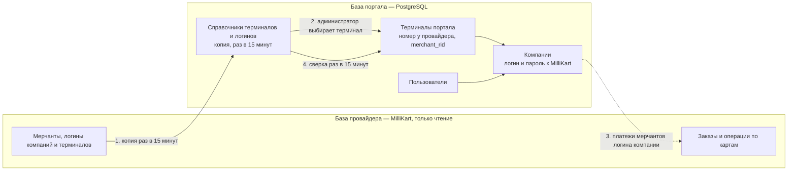

# Руководство системного администратора: компании, терминалы, пользователи

> Для того, кто заводит в портал новых мерчантов. Сверено с кодом 29.09.2026.
> Точные запросы и ответы API — [directory.md](../modules/directory.md), [auth.md](../modules/auth.md),
> [ecom.md](../modules/ecom.md); установка сервисов и первый администратор —
> [deployment_guide.md](deployment_guide.md); словарь журнала аудита —
> [technical_handover.md](technical_handover.md) §4.4.

## Содержание

1. [Что вы настраиваете](#1-что-вы-настраиваете)
2. [Как связаны две базы](#2-как-связаны-две-базы)
3. [Перед началом](#3-перед-началом)
4. [Компания](#4-компания)
5. [Терминал](#5-терминал)
6. [Пользователи компании](#6-пользователи-компании)
7. [Проверить результат](#7-проверить-результат)
8. [Вывести компанию из работы](#8-вывести-компанию-из-работы)
9. [Журнал аудита](#9-журнал-аудита)
10. [Частые вопросы](#10-частые-вопросы)

---

## 1. Что вы настраиваете

Мерчант появляется в портале в три шага, и порядок важен:

1. **Компания** — запись о юрлице и её **логин и пароль к MilliKart** (у провайдера компания —
   мультимерчант). С ними портал отправляет провайдеру все запросы по платежам компании, а по логину
   находит её платежи: выписка показывает всех мерчантов, связанных с логином у провайдера.
2. **Терминал** — терминал мерчанта у MilliKart, выбранный из справочника провайдера. Пароля у
   терминала нет. Через терминал портал принимает оплаты по ссылкам.
3. **Пользователи** — сотрудники мерчанта. Видят только данные своей компании: ссылки её терминалов и
   платежи мерчантов её логина.

Компания без терминалов не принимает оплаты по ссылкам, но выписку по мерчантам своего логина видит.
Компания без логина к MilliKart (такие остались с тех пор, когда логин не требовался, Р-93) видит пустую
выписку и нулевую главную.

Всё, что описано ниже, доступно роли **«Системный администратор»**. Первого такого пользователя
создают при установке ([deployment_guide.md](deployment_guide.md) §20), следующих — на странице
«Пользователи».

---

## 2. Как связаны две базы

### 2.1. Простыми словами

У портала две базы данных:

- **База портала** (PostgreSQL) — наша. В ней компании, пользователи, терминалы, платёжные ссылки и
  журнал аудита. Портал в неё пишет.
- **База провайдера** (Oracle платёжного шлюза MilliKart, TXPG) — чужая. В ней мерчанты MilliKart,
  логины компаний и терминалов и все операции по картам. Портал её **только читает** и ничего в неё не
  пишет.

Общих таблиц между базами нет. Связывают их две вещи: **логин компании** (у провайдера — логин
мультимерчанта) и **код мерчанта у провайдера** (`merchant_rid`).

Представьте, что база провайдера — большой архив в соседнем здании. За каждой мелочью портал туда не
ходит: раз в 15 минут он снимает **копии двух списков** и хранит их у себя — терминалов («справочник
терминалов провайдера») и логинов мультимерчантов с их мерчантами («справочник логинов»). А за
платежами ходит в архив напрямую, когда пользователь открывает выписку или главную страницу.

### 2.2. Четыре связи

1. **Справочник.** Раз в 15 минут портал читает из базы провайдера активные e-commerce терминалы —
   код мерчанта, номер терминала, название и логин — и обновляет свою копию. Пароля в копии нет: у
   провайдера его не берут. Обновить копию сразу можно кнопкой «Обновить справочник» в формах терминала
   и компании.
2. **Привязка терминала.** Заводя терминал, вы выбираете строку из справочника. Портал записывает в
   свой терминал код мерчанта, номер терминала, название и логин провайдера; пароля у терминала нет.
   Один терминал провайдера привязывается только к одному терминалу портала — значит, к одной компании.
3. **Платежи.** Выписка «Электронная коммерция» и главная страница читают базу провайдера в момент
   открытия по цепочке: компания пользователя → её логин к MilliKart → мерчанты, активно связанные с
   этим логином по справочнику логинов → их заказы. Поэтому **кто чьи платежи видит, зависит от логина
   компании и его связей у провайдера**; терминалы портала на выписку не влияют. Связь, изменённую у
   провайдера, портал увидит со следующим обновлением справочника.
4. **Сверка.** Раз в 15 минут портал сравнивает свои терминалы со справочником:
   - терминал пропал у провайдера (три обновления справочника подряд) → портал сам блокирует свой
     терминал, активные ссылки приостанавливаются;
   - терминал снова появился → портал сам разблокирует терминал, который заблокировала сверка, и
     возвращает ссылки;
   - у провайдера сменились название, логин или номер терминала → портал переносит их к себе.

   Терминал, заблокированный вручную, сверка не разблокирует; терминал без кода мерчанта сверка не
   трогает вовсе.

Оплата по платёжной ссылке идёт другим путём — не через базу, а через API шлюза MilliKart: портал
создаёт заказ на номере терминала у провайдера, подписываясь логином и паролем **компании** терминала.
Поэтому неверный пароль компании выписке не мешает, а оплату по ссылкам ломает.

### 2.3. Чего эта связь не делает

- **Не выключает терминал у MilliKart.** Блокировка в портале запрещает только новые оплаты через
  портал; у провайдера терминал продолжает работать.
- **Не заводит терминал у провайдера.** Сначала терминал заводит MilliKart, потом он появляется в
  справочнике, и только после этого его можно добавить в портал.
- **Не ломается от недоступности провайдера.** Если база провайдера не ответила или вернула пустой
  список, справочник остаётся прежним, и терминалы из-за этого не блокируются.

### 2.4. Что где хранится

| Что | Где | Кто меняет |
|:---|:---|:---|
| Компании, пользователи | база портала | вы, на страницах портала |
| Логин и пароль компании к MilliKart | база портала, пароль зашифрован | вы; посмотреть пароль нельзя, только заменить |
| Терминал: компания, статус | база портала | вы; статус меняет и сверка (§5.5) |
| Терминал: номер у провайдера, название и логин | база портала | провайдер; портал переносит изменения сам |
| Справочник терминалов провайдера | база портала, копия | портал, раз в 15 минут или по кнопке |
| Справочник логинов мультимерчантов и их мерчантов | база портала, копия | портал, раз в 15 минут или по кнопке |
| Платёжные ссылки и оплаты по ним | база портала | сотрудники мерчанта |
| Операции по картам (выписка) | база провайдера | MilliKart; портал только читает |

---

## 3. Перед началом

- Вы вошли с ролью «Системный администратор».
- Терминал мерчанта уже заведён и включён у MilliKart, а его мерчант привязан к логину компании.
- От MilliKart получены **логин компании** (мультимерчанта, `MultiMerchantSys/…`) и **пароль** к нему.
- Выбран код компании (§4.1) — поменять его потом нельзя.

---

## 4. Компания

### 4.1. Завести

1. Меню **«Компании»** → **«Добавить компанию»**.
2. **«Код / ID компании»** — короткий уникальный код, например `COMP-001`. Лучше латиница, цифры и
   дефис. Код виден в списках и журнале. **Изменить его потом нельзя**, а код удалённой компании
   остаётся занятым навсегда.
3. **«Юридическое название»** — как в договоре.
4. **«Логин к провайдеру»** — логин не вводится, а выбирается из списка: начните вводить логин, под
   каждым видны названия его мерчантов. В списке только логины, активные у провайдера, с хотя бы одним
   активным мерчантом и не занятые другой компанией, в том числе удалённой. Нужного нет — нажмите
   **«Обновить справочник»** под полем: только что заведённый у MilliKart логин иначе появится в течение
   15 минут. Если он не появился и после этого — логин не заведён у провайдера, выключен, без активных
   мерчантов или уже у другой компании.
5. **«Пароль к провайдеру»** — пароль от MilliKart. Хранится зашифрованным; посмотреть его потом
   нельзя никому, только заменить.
6. **«Создать»**.

При сохранении портал проверяет код и логин ещё раз: между загрузкой списка и сохранением справочник
могли обновить, а логин — занять.

| Что видите | Что значит | Что делать |
|:---|:---|:---|
| `Company with ID '…' already exists` | код занят, в том числе удалённой компанией | взять другой код |
| `Provider login is already used by another company` | логин за это время заняла другая компания | выбрать другой логин; у каждой компании свой |
| «Свободных логинов мультимерчантов в справочнике нет…» | справочник логинов пуст или все логины в нём заняты, выключены или без активных мерчантов | «Обновить справочник»; не помогло — к MilliKart или к администратору сервера (`ecom`) |
| `The provider login list has not been synchronised yet…` | справочник логинов пуст: `ecom` его ещё не снимал или не установлен | «Обновить справочник»; не помогло — к администратору сервера (`ecom`) |
| `Provider login … is not in the synchronised list…` | логина больше нет в справочнике | «Обновить справочник» и выбрать логин заново |
| `Provider login … is not active at the provider` | логин выключен у провайдера | к MilliKart |
| `Provider login … has no active merchants at the provider` | у логина не осталось активных мерчантов | к MilliKart: привязать мерчантов к логину |

### 4.2. Что можно менять потом

Всё, кроме удаления, меняется в одном окне — карандаш в строке, **«Редактировать компанию»**. Перед
сохранением портал покажет список изменений и предупредит о последствиях тех, что затронуты. Код
компании не меняется.

- **Юридическое название** — обязательно.
- **Логин и пароль к провайдеру.** Пароль в окне пуст: оставьте пустым, чтобы не менять, или введите
  новый. Логин выбирается из того же списка, что при заведении, плюс текущий логин компании; рядом —
  «Обновить справочник». Уже сохранённый логин справочник не трогает, стереть его нельзя. С новыми
  данными сразу пойдут все запросы компании к провайдеру — после смены нажмите «Тест» у любого её
  терминала. Ошибки при смене логина — те же, что в §4.1, и ещё одна: новый логин должен быть связан у
  провайдера с мерчантами **всех** терминалов компании, заблокированных тоже. Иначе портал откажет и
  назовёт номера терминалов: попросите MilliKart привязать их мерчантов к новому логину и обновите
  справочник или сначала перенесите эти терминалы в другую компанию.
- **Статус «Активно / Неактивно».** **Это только пометка**: вход сотрудников, создание ссылок и приём
  платежей она не останавливает.
- **Удаление** — корзина в строке. Компания пропадает из списков портала, но её терминалы,
  пользователи, ссылки и операции остаются и продолжают работать. Восстановить удалённую компанию из
  портала нельзя. **Код и логин к провайдеру удалённой компании заняты навсегда**: этот логин не
  получит ни одна другая компания. Для паузы блокируйте терминалы (§8).

Как на самом деле остановить компанию — §8.

---

## 5. Терминал

### 5.1. Завести

1. Меню **«Терминалы»** → **«Добавить терминал»**.
2. **«Назначенная компания»** — компания мерчанта. От неё зависит список ниже.
3. **«Терминал провайдера»** — в списке только активные терминалы мерчантов, привязанных к логину
   компании у провайдера, с номером терминала и ещё не заведённые в портале. Строка — номер терминала у
   провайдера (например, `BS00003`), под ним название и код мерчанта; сверьте их с данными от MilliKart.
   Нужного терминала нет — нажмите **«Обновить справочник»**.
4. **«Зарегистрировать терминал»**. Пароля у терминала нет — портал ходит к провайдеру с логином и
   паролем компании.
5. **«Тест»** в строке нового терминала (§5.2): ошибка иначе всплывёт только на первой оплате клиента.

Внутренний номер терминала портал выдаёт сам. На экранах терминал подписан **номером у провайдера** —
с ним портал и создаёт заказы. Терминалы без этого номера — §5.6.

### 5.2. Кнопка «Тест»

Кнопка есть только у заведённого терминала и только у системного администратора. Портал создаёт у
провайдера пробный заказ на 1 AZN на номере терминала с логином и паролем компании — так проверяется,
что платёж создать можно. Его никто не оплачивает, денег он не списывает, через 10 минут истекает у
провайдера и в выписку не попадает. Каждая проверка записывается в журнал аудита.

Итог виден цветом кнопки (зелёный — всё в порядке, оранжевый — провайдер не ответил, красный — отказ)
и в подсказке при наведении на неё; там же — код и текст провайдера.

| Результат | Что значит | Что делать |
|:---|:---|:---|
| «Данные компании приняты, платёж создать можно» | провайдер завёл пробный заказ | — |
| «Неверный логин или пароль компании» | провайдер ответил `InvalidLogin` | уточнить у MilliKart и сменить в «Редактировать компанию» (§4.2) |
| «Данные приняты, но эквайер не разрешил оплату» | провайдер ответил, но заказ не завёл; в подсказке его код и текст, а если кода нет — `HTTP NNN` | к MilliKart с текстом из подсказки: обычно терминал не настроен на приём оплат |
| «Эквайер не ответил — о терминале ничего не известно» | нет ответа или ответ 5xx без тела | повторить позже; не проходит — к администратору сервера (доступ `pbl` к шлюзу) |

Пригодится и потом — когда мерчант жалуется, что оплаты не проходят. Две ошибки портал показывает
полосой над таблицей и к провайдеру при этом не обращается:

- `Company … has no acquirer credentials; a system administrator must set them on the company` — у
  компании нет логина и пароля к провайдеру: задайте их (§4.2);
- `Terminal … has no provider terminal number and cannot take payments; link it from the provider
  directory` — терминал без номера у провайдера (§5.6).

### 5.3. Ошибки при заведении

| Что видите | Причина | Что делать |
|:---|:---|:---|
| «Свободных терминалов мерчантов этой компании в справочнике нет…» | справочник ещё не снимался; у компании нет логина к провайдеру; мерчанты логина не привязаны; все их терминалы уже заведены или выключены | «Обновить справочник»; у компании нет логина — задать (§4.2); иначе — к MilliKart |
| «Не удалось загрузить справочник провайдера.» | портал не получил список терминалов или не дозвался до обновления справочника | повторить позже; не проходит — к администратору сервера (`directory`, `ecom`) |
| «Справочник не обновлён: …» | не удалось прочитать базу провайдера или она вернула пустой список | повторить позже; если не проходит — к администратору сервера: сервис `ecom` и доступ к базе шлюза |
| `Provider terminal … is already linked to terminal …` | этот терминал провайдера уже заведён в портале, возможно в другой компании | найдите его поиском на странице «Терминалы»; если компания не та — поменяйте её в найденном терминале (§5.4), второй не заводите |
| `Provider terminal … is not in the synchronised list` | терминала нет в справочнике | «Обновить справочник» и выбрать заново |
| `Provider terminal … is not active at the provider` | терминал выключили у провайдера после загрузки списка | к MilliKart |
| `Provider terminal … has no name, login or terminal number in the synchronised list` | у провайдера у терминала не заполнены название, логин или номер | к MilliKart |
| `Provider terminal … does not belong to the multimerchant login of company …` | мерчант терминала не привязан к логину компании у провайдера | проверить компанию; если компания верная — к MilliKart |
| «Заполните все обязательные поля» | не выбрана компания или терминал | заполнить |

### 5.4. Изменить

Карандаш в строке — **«Редактировать терминал»**. Перед сохранением портал покажет список изменений —
сверьте его.

- **Компания** — перенос терминала в другую компанию. Портал разрешит его, только если мерчант
  терминала связан у провайдера с логином новой компании, — как при заведении; иначе окно покажет
  `Terminal … cannot be moved to company …: its provider merchant is not linked to the multimerchant
  login of that company`. Вместе с терминалом к новой компании переходят его ссылки. Платежи в выписке
  идут за логином компании, а не за терминалом. Терминал без номера у провайдера не переносится (§5.6).
- **Название** можно поправить, но при сверке портал вернёт значение провайдера. Логин и номер
  терминала не правятся: их меняет только сверка со справочником.
- Пароля у терминала нет: логин и пароль к провайдеру меняются у компании (§4.2).

Руководитель и менеджер компании правят название и блокируют терминалы своей компании; компанию
терминала меняет только системный администратор.

### 5.5. Заблокировать и разблокировать

Терминалы **не удаляются**, их блокируют. Перед блокировкой и разблокировкой портал покажет, скольких
ссылок это коснётся.

- **Блокировка**: новые оплаты через портал не принимаются, активные ссылки приостанавливаются.
  Возвраты, списание холдов DMS и проверка статуса по прошлым платежам продолжают работать.
- **Разблокировка**: приостановленные ссылки возвращаются в работу, кроме тех, у которых за время
  блокировки истёк срок.
- Блокировка действует **только в портале**: у MilliKart терминал продолжает работать.

**Автоматическая блокировка.** Если терминал выключили у провайдера, портал заблокирует его сам — в
пределах часа (три обновления справочника подряд без терминала, затем сверка). Вручную такой терминал
не разблокировать: портал ответит `Terminal … is out of service at the provider and will be unblocked
automatically once the provider brings it back`. Когда провайдер вернёт терминал, портал разблокирует
его в пределах получаса.

### 5.6. Терминалы без номера у провайдера

В портале могут оставаться терминалы, заведённые руками до справочника (Р-80, Р-96): у них нет кода
мерчанта и номера терминала у провайдера, на экранах они подписаны логином. Такой терминал:

- платежей не принимает: создание ссылки, её открытие и «Тест» отвечают `Terminal … has no provider
  terminal number and cannot take payments; link it from the provider directory`;
- сверкой не затрагивается и в другую компанию не переносится;
- на выписку не влияет: она идёт по мерчантам логина компании.

Чтобы вернуть терминал в работу, заведите его заново из справочника (§5.1), а старый заблокируйте
(§5.5).

---

## 6. Пользователи компании

### 6.1. Роли

| Роль | Кому | Что может |
|:---|:---|:---|
| Руководитель компании | владельцу, директору | всё по своей компании: заводит и правит менеджеров и сотрудников, правит и блокирует терминалы (заводит их администратор), ссылки, возвраты, журнал аудита |
| Менеджер компании | менеджеру | правит и блокирует терминалы, ссылки, возвраты, журнал аудита своей компании; пользователей не заводит |
| Сотрудник компании | кассиру, оператору | создаёт ссылки, списывает холды DMS, смотрит платежи и терминалы; возвратов нет, терминалы не правит |
| Аудитор | проверяющему, не сотруднику мерчанта | только чтение, по всем компаниям |
| Системный администратор | вам | всё, по всем компаниям |

Обычно администратор заводит одного **руководителя компании**, а остальных сотрудников заводит уже он.

### 6.2. Завести

1. Меню **«Пользователи»** → **«Добавить пользователя»**.
2. **«Имя пользователя (Логин)»** — email сотрудника, им он входит.
3. **«Пароль»** — не короче 12 символов: заглавные и строчные буквы, цифра и спецсимвол. Передайте
   пароль сотруднику безопасным способом. При первом входе портал попросит его заменить своим: до этого
   сотрудник не войдёт, а в списке у него метка «Ждёт смены пароля».
4. **«ФИО»**.
5. **«Системная роль»**.
6. **«Назначенная компания»** — для ролей компании обязательна: без неё портал пользователя не создаст
   («Для роли компании выберите компанию.»). Системному администратору и аудитору компания не нужна:
   при выборе этих ролей поле переключается на «Без компании» — так и оставьте.
7. **«Создать»**.

Руководитель компании заводит людей только в свою компанию и только с ролями менеджера и сотрудника —
поля компании у него в форме нет.

### 6.3. Изменить и заблокировать

- Карандаш в строке — ФИО, роль, компания, статус, новый пароль. Перед сохранением портал покажет
  список изменений.
- Новая роль или компания начинает действовать при следующем обновлении сессии пользователя, в течение
  15 минут.
- **Блокировка** сразу отзывает продление сессий пользователя: открытая сессия работает ещё не дольше
  15 минут, затем портал попросит войти, а вход будет отклонён.
- Новый пароль, заданный вами, — это сброс: продление сессий пользователя так же отзывается сразу, а при
  следующем входе он заменит пароль своим. Свой собственный пароль вы задаёте без такой замены.
- Свой новый пароль нельзя сделать одним из четырёх последних — ни при смене на входе, ни в правке своей
  учётной записи (PCI DSS 8.3.7). Пароль, который вы задаёте другому, с его прошлыми паролями не
  сверяется, но заменить его пользователь сможет только на новый.
- Для временного отключения ставьте статус «Заблокирован». Удаление необратимо: удалённого
  пользователя не восстановить и не отредактировать, а его email остаётся занятым (`Username already
  exists`). Сессии удалённого завершаются так же, как при блокировке.
- Свою роль и свой статус поменять нельзя.
- После 6 неудачных попыток входа учётная запись сама блокируется на 30 минут.
- **Выход по простою** (PCI DSS 8.2.8, Р-99): 15 минут без действий пользователя — без движения мыши,
  нажатий и прокрутки — портал завершает сессию и пишет на форме входа «Сессия завершена: 15 минут без
  действий. Войдите снова.». Так же и при открытии портала после перерыва. Действие в одной вкладке
  продлевает сессию во всех. Касается всех ролей, в том числе вашей.
- Учётная запись, в которую не входили и не работали 90 дней, блокируется автоматически — и ваша тоже
  (PCI DSS 8.2.6). В журнале это блокировка от `system`. Вернуть сотрудника — статус «Активен»: отсчёт
  начнётся заново. Держите двух администраторов: единственного заблокированного вернёт только
  администратор сервера ([deployment_guide.md](deployment_guide.md) §20.3).

---

## 7. Проверить результат

1. **«Терминалы»** — терминал в нужной компании, статус «Активен», «Тест» проходит.
2. **«Транзакции» → «Электронная коммерция»** — выберите период, в котором у мерчанта были оплаты, и
   терминал в фильтре, затем «Применить»: платежи видны. Администратор видит платежи мерчантов всех
   компаний.
3. Попросите руководителя компании войти: на главной — статистика только мерчантов логина его компании,
   на странице «Терминалы» — только его терминалы.
4. **«Журнал аудита»** — записи о создании компании, терминала и пользователя.

---

## 8. Вывести компанию из работы

Пометка «Неактивно» и удаление компании ничего не останавливают. Порядок такой:

1. **Заблокируйте все терминалы компании** — на странице «Терминалы» поиск находит терминалы и по
   названию компании. Новые оплаты через портал прекратятся.
2. **Заблокируйте пользователей компании** — они перестанут входить.
3. При необходимости пометьте компанию неактивной или удалите её. Код и логин к провайдеру удалённой
   компании остаются занятыми навсегда: если компания может вернуться, не удаляйте её.

Если мерчант уходит от MilliKart совсем, терминал выключает MilliKart, и портал подхватит это сам (§5.5).

---

## 9. Журнал аудита

Меню **«Журнал аудита»**: кто, когда и с какого адреса что сделал — создание и изменение компаний,
терминалов и пользователей, смена логина и пароля компании к провайдеру (без самого пароля), проверки
«Тест», блокировки, входы и выходы, ссылки, списания и возвраты. Автоматические действия — сверка
терминалов, блокировка за 90 дней без входа — записаны от исполнителя `system`. Есть поиск и фильтры по
ресурсу, результату и датам; клик по строке открывает запись целиком. Записи журнала нельзя изменить
или удалить. Что означает каждая запись — [technical_handover.md](technical_handover.md) §4.4.

---

## 10. Частые вопросы

**Мерчант не видит платежи в выписке.** Проверьте по порядку: у пользователя назначена компания; у
компании задан логин к MilliKart (§4.2); мерчант связан с этим логином у провайдера и связь активна —
если её только что поменяли, нажмите «Обновить справочник»; в выбранном периоде были оплаты.
Незавершённые заказы в выписку не попадают.

**Оплата по ссылке не проходит, а выписка работает.** Проверьте по порядку: терминал не заблокирован
(§5.5); у терминала есть номер у провайдера (§5.6); логин и пароль компании верны — нажмите «Тест» в
строке терминала и при необходимости смените их (§4.2).

**Терминал заблокировался сам.** Его выключили у провайдера. В журнале аудита будет блокировка от
`system`. Вопрос к MilliKart; когда терминал включат, портал разблокирует его сам.

**Терминал не разблокируется вручную.** Он выключен у провайдера — см. предыдущий вопрос.

**У MilliKart сменились название или номер терминала.** Терминал обновится сам в течение получаса; в
журнале будет запись от `system`. **Сменились логин или пароль компании** — введите новые в
«Редактировать компанию» (§4.2) и нажмите «Тест».

**Сотрудника выбросило на форму входа.** Скорее всего, 15 минут без действий (§6.3): надпись об этом —
на форме входа. Иначе проверьте статус его учётной записи.

**Терминал нужно перенести в другую компанию.** Не заводите второй — поменяйте компанию в
существующем (§5.4).
