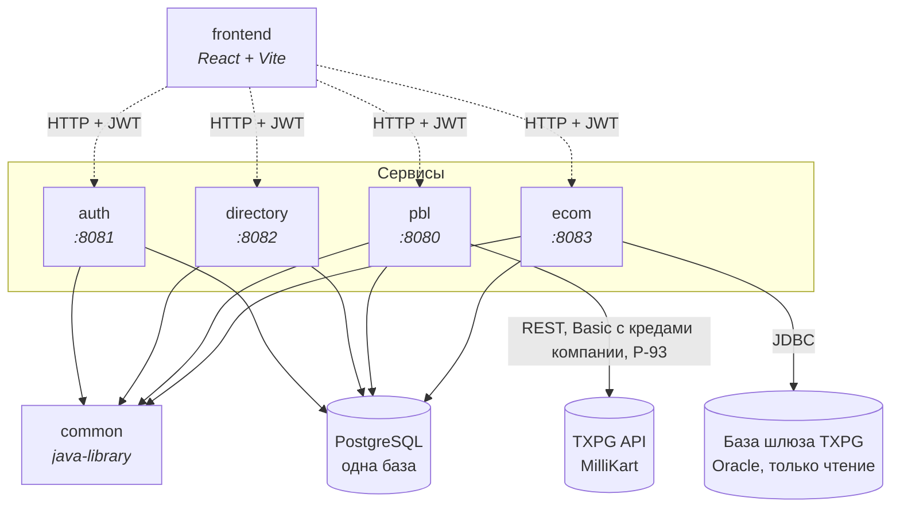
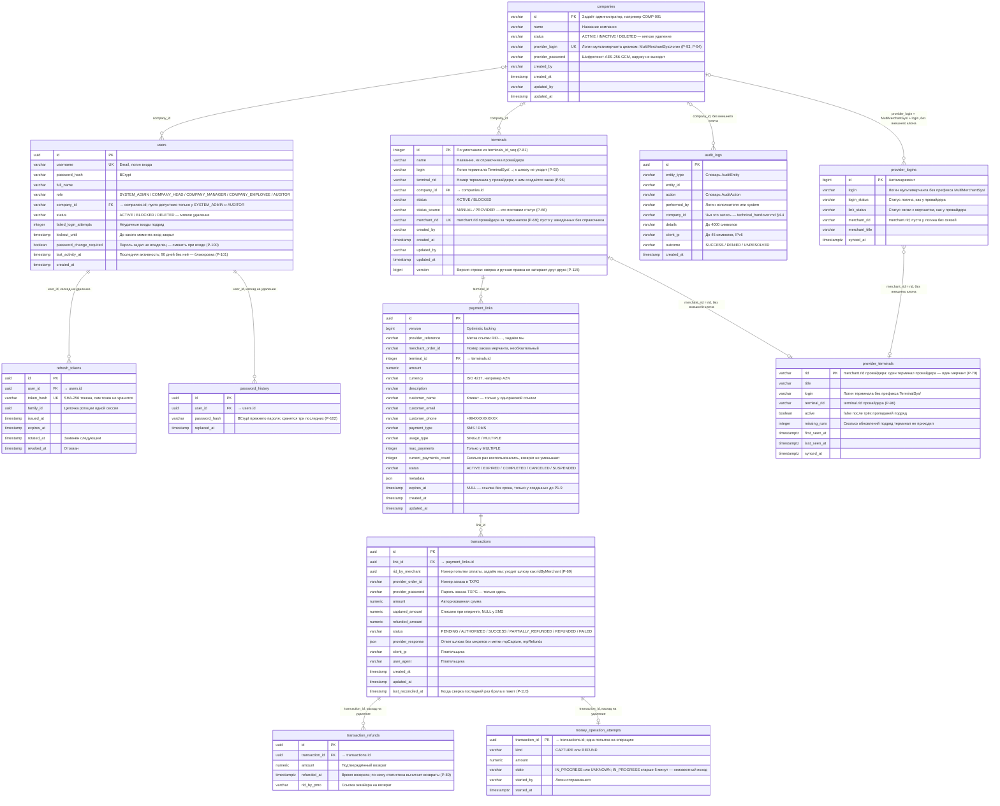
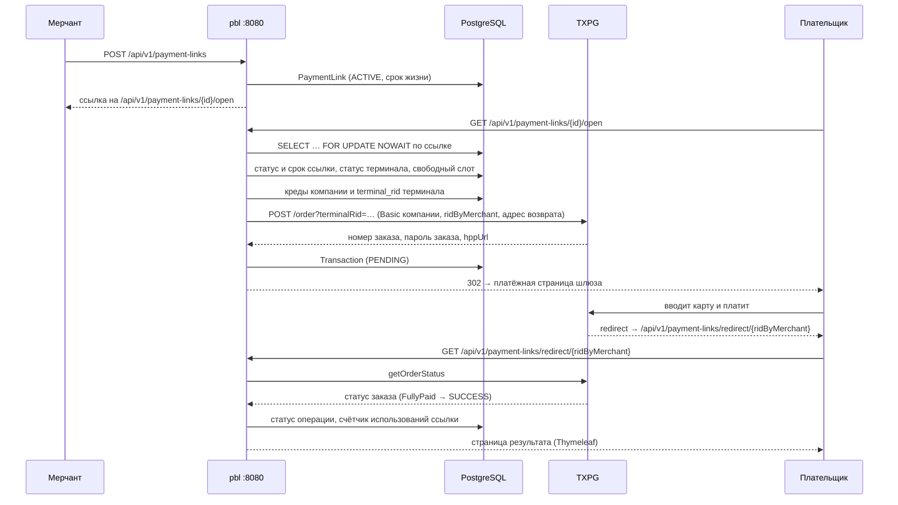
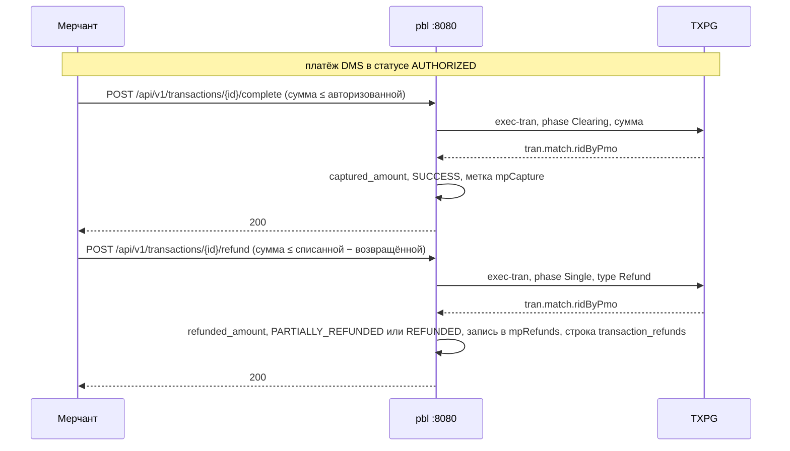

# 📖 Merchant Portal — обзор архитектуры

> Для разработчиков, архитекторов и тестировщиков: из чего состоит система и как её части связаны.
> Сверено с кодом 29.09.2026.
>
> Чего здесь нет и где это искать: контракты API (запросы, ответы, отказы) —
> [`auth.md`](../modules/auth.md), [`directory.md`](../modules/directory.md),
> [`pay-by-link.md`](../modules/pay-by-link.md), [`ecom.md`](../modules/ecom.md); стек с версиями, владение
> таблицами, роли и матрица доступа, правила и известные ограничения — корневой
> [`AGENTS.md`](../../AGENTS.md); установка и эксплуатация — [`deployment_guide.md`](deployment_guide.md);
> словарь событий журнала аудита — [`technical_handover.md`](technical_handover.md) §4.4.
>
> Схема базы (§4) описана только здесь: модульные документы ссылаются на этот раздел.

## 📋 Содержание

1. Что такое Merchant Portal
2. Архитектура
3. Модули
4. База данных
5. Безопасность
6. Связи между сервисами
7. Интеграция с платёжным шлюзом TXPG
8. Сервис `ecom` и база провайдера
9. Фоновые процессы
10. Фронтенд
11. Потоки данных

---

## 1. Что такое Merchant Portal

Веб-портал мерчантов MilliKart:

- 🔐 вход по email и паролю, пять ролей; пользователь компании видит только данные своей компании;
  правила PCI DSS к паролям и сессиям: смена пароля, заданного не владельцем, при первом входе, выход
  после 15 минут простоя, блокировка после 90 дней без активности, запрет четырёх последних паролей;
- 🏢 компании и эквайринговые терминалы: логин мультимерчанта и пароль компании к провайдеру (логин
  выбирается из справочника провайдера, пароль хранится зашифрованным), терминалы из справочника
  провайдера, кнопка «Тест» — пробный заказ у провайдера, сверка статусов, названий и номеров
  терминалов с провайдером;
- 🔗 платёжные ссылки Pay-By-Link: одноразовые и многоразовые, со сроком жизни и страницей возврата
  плательщика;
- 💳 операции по ссылкам: одностадийные (SMS) и двухстадийные (DMS) платежи, списание холда, возвраты,
  проверка статуса у шлюза; статистика оплат по ссылкам — вкладка страницы Pay by Link;
- 🧾 главная страница и вкладка E-commerce — оплаты картой по выписке из базы провайдера, по мерчантам
  логина мультимерчанта компании (§8);
- 📋 журнал аудита действий.

---

## 2. Архитектура

### 2.1. Общая структура

Gradle-монорепозиторий: четыре Spring Boot-сервиса, библиотека `common` и React SPA (не Gradle).

```
mp/
├── common/      ← java-library: security, журнал аудита, исключения, общие DTO, поиск, логирование
├── txpg-client/ ← java-library: клиент API провайдера (TXPG), подключает pbl (Р-122)
├── auth/        ← :8081 — вход, токены, пользователи
├── directory/   ← :8082 — компании, терминалы, чтение журнала аудита, сверка терминалов с провайдером
├── pbl/         ← :8080 — платёжные ссылки, операции, статистика оплат по ссылкам, TXPG, кнопка «Тест»
├── ecom/        ← :8083 — выписка провайдера, сводка главной, слепки терминалов и логинов провайдера
└── frontend/    ← React SPA (Vite)
```



### 2.2. Слои сервиса

```
Controller (REST)  ← принимает UserPrincipal и передаёт в сервис; прав не проверяет
    ↓ DTO (Java record)
Service            ← бизнес-правила, проверки прав, транзакции, журнал аудита
    ↓ сущность JPA
Repository         ← Spring Data JPA; нативные запросы — там, где читается чужая таблица
    ↓ SQL
PostgreSQL         ← схема из Liquibase, ddl-auto: validate
```

`common` сам не запускается: сервисы подключают его зависимостью и сканируют пакет `az.millikart`
целиком. Сущности и репозитории журнала аудита каждый сервис дополнительно перечисляет в
`@EntityScan` / `@EnableJpaRepositories`, поэтому сущность `AuditLog` проверяется на старте каждого
сервиса, и таблица `audit_logs` должна к этому моменту существовать (§4.2).

### 2.3. Запрос и журнал аудита

- **Фильтры запроса** (`common`): `ClientIpFilter` определяет адрес клиента через доверенные прокси,
  `TraceIdFilter` кладёт `traceId` в MDC и в заголовок ответа `X-Trace-Id`, `JwtAuthFilter` превращает
  токен в `UserPrincipal`, `AuditOutboxFilter` дописывает отложенные записи журнала после запроса.
  Прогон планировщика получает свой `traceId` от `SchedulerRun` (Р-98).
- **Журнал аудита** — одна машинерия на все сервисы (`common.audit`, Р-41). Успех: сервис публикует
  `AuditEvent`, `AuditLogWriter` пишет его после коммита бизнес-транзакции (Р-35). Отказ и неизвестный
  исход денежной операции: `AuditLogService.logDenied` / `logUnresolved` пишут в своей транзакции,
  которая не откатывается вместе с бизнес-транзакцией.
- **Когда запись ложится в базу** (Р-85). Внутри HTTP-запроса запись, сделанная при открытой транзакции,
  откладывается до конца запроса (`AuditOutbox`, `AuditOutboxFilter`): так она не просит второе
  соединение из пула, пока транзакция запроса держит первое. Вне запроса (планировщик) запись ложится
  сразу. Ошибка записи не пробрасывается, а уходит в лог с маркером `AUDIT_WRITE_FAILED`.

Правила записи — [`AGENTS.md`](../../AGENTS.md) §10 «Журнал аудита»; словарь событий —
[`technical_handover.md`](technical_handover.md) §4.4.

---

## 3. Модули

### 3.1. `common`

| Пакет | Что внутри |
|:---|:---|
| `security` | `JwtProvider` (HS256; на пустом, коротком или скомпрометированном ключе сервис не стартует), `JwtAuthFilter`, `SecurityConfig` («по умолчанию запрещено»), `PublicEndpoints` — единственный список публичных путей, `Role`, `UserPrincipal`, `SecurityErrorResponder` (единый ответ 401 и 403), `TraceIdFilter`, `MissingSecretFailureAnalyzer` (объясняет отсутствующую переменную окружения), `CredentialCipher` — AES-256-GCM паролей компаний к провайдеру (не бин: объявляют только `directory` и `pbl`) |
| `audit` | `AuditLog` (сущность без сеттеров), `AuditLogRepository` (только `save`), `AuditEvent`, `AuditLogWriter` (успех — после коммита), `AuditLogService` (отказ и неизвестный исход — в своей транзакции), `AuditOutbox` и `AuditOutboxFilter` (отложенная запись до конца запроса, Р-85), словарь `AuditEntity` / `AuditAction`, `AuditOutcome` |
| `exception` | исключения проекта (`BusinessException`, `UnauthorizedException`, `InvalidStateException`, `ResourceNotFoundException`, `ConflictException`, `TooManyRequestsException`, `PaymentOutcomeUnknownException`) и `GlobalExceptionHandler` с единым `ErrorResponse`; коды ответов — `AGENTS.md` §5 п. 5 |
| `web` | адрес клиента: `ClientIp`, `ClientIpFilter`, `ClientIpHolder`, `TrustedProxies` |
| `logging` | `SchedulerRun` — свой `traceId` каждому прогону планировщика (Р-98) |
| `dto` | `ErrorResponse`, `PagedResponse` |
| `search` | `SearchTerms` — нормализация строки поиска и `LIKE` с экранированием |
| `validation` | `ValidPassword` / `PasswordConstraintValidator` — политика паролей PCI DSS |
| `config` | `CacheConfig` (потребителей кэша нет) |

`testFixtures` — `PostgresTestContainer`, общий контейнер PostgreSQL для интеграционных тестов.

### 3.2. `auth` (:8081)

| Пакет | Что внутри |
|:---|:---|
| `controller` | `AuthController` (вход, смена пароля при входе, обновление пары токенов, выход), `UserController` |
| `service` | `AuthService` (вход, смена пароля при входе — Р-100, ротация и отзыв refresh-токенов), `RefreshTokenService` (хранилище refresh-токенов: выпуск, поиск, отзыв, уборка), `UserService` (пользователи; отзыв сессий при блокировке, сбросе пароля и удалении), `InactiveAccountService` (блокировка учёток без активности 90 дней, Р-101), `PasswordHistoryService` (запрет четырёх последних паролей, Р-102) |
| `security` | `LoginRateLimiter` — лимит неудачных входов с одного адреса, счётчики в памяти |
| `bootstrap` | `AdminBootstrapRunner` — разовое создание первого `SYSTEM_ADMIN` |
| `scheduler` | `RefreshTokenCleanupScheduler`, `InactiveAccountScheduler` (Р-101) |
| `domain` | `User`, `RefreshToken`, `PasswordHistory`, `Company` (только проверка существования компании) |
| `repository` | `UserRepository` (поиск пользователей с названием компании — нативным запросом), `RefreshTokenRepository`, `PasswordHistoryRepository`, `CompanyRepository` |

Контракты — [`auth.md`](../modules/auth.md).

### 3.3. `directory` (:8082)

| Пакет | Что внутри |
|:---|:---|
| `controller` | `CompanyController` (в том числе свободные логины справочника `provider-logins`), `TerminalController` (в том числе лёгкий список `options` и терминалы провайдера для формы заведения `provider-terminals`), `AuditLogController` |
| `service` | `CompanyService` (компании; креды к провайдеру — шифрование через `CredentialCipher`, проверка логина по слепку `provider_logins` — Р-94, список свободных логинов — Р-95), `TerminalService` (права, заведение из справочника провайдера с проверкой мерчанта по логину компании — Р-96, блокировка с приостановкой ссылок), `AuditLogQueryService` (чтение журнала), `TerminalStatusReconciliationService` (статусы, название, логин и номер наших терминалов по слепку провайдера) |
| `repository` | `CompanyRepository`, `TerminalRepository` (номер нового терминала — `nextId` из `terminals_id_seq`, Р-81), `AuditLogQueryRepository`; нативные запросы к чужим таблицам — `PaymentLinkStatusRepository` (статусы ссылок `pbl`), `ProviderTerminalStatusRepository` (`provider_terminals`) и `ProviderLoginSnapshotRepository` (`provider_logins`) |
| `scheduler` | `TerminalStatusReconciliationScheduler` |
| `config` | `CredentialCipherConfig` — бин шифра паролей компаний |
| `domain` | `Company`, `Terminal`, `TerminalStatus`, `TerminalStatusSource` |

Контракты — [`directory.md`](../modules/directory.md).

### 3.4. `pbl` (:8080)

| Пакет | Что внутри |
|:---|:---|
| `controller` | `PaymentLinkController`, `OpenLinkController` (публичные открытие ссылки и страница возврата), `TransactionController` (список, карточка и статус операции, списание холда, возврат), `DashboardController` (статистика оплат по ссылкам), `TerminalCheckController` (кнопка «Тест») |
| `service` | `PaymentLinkService` (ссылки, операции, статусы, история операции), `OpenLinkService` (открытие ссылки под блокировкой строки), `ProviderCredentialsService` (креды компании терминала и номер терминала у провайдера; нет — 400 до шлюза), `TransactionReconciliationService`, `DashboardService`, `TerminalCheckService`, `PaymentLinkMapper` |
| `domain` | `PaymentLink`, `Transaction`, `TransactionRefund`, `Terminal` (чтение общей таблицы), `CustomerPhone` (азербайджанский телефон клиента, Р-96), перечисления `PaymentLinkStatus`, `TransactionStatus`, `PaymentType`, `UsageType`, `TerminalStatus` |
| `provider` | `AcquiringClientConfig` — бин клиента провайдера из `txpg-client` с адресами `pbl`; `ProviderOrders` — ссылка в заказ провайдера (`NewOrder`); разборщики ответов шлюза `ProviderOrderStatus`, `ProviderOrderDetails`, `ProviderDeclineReason`; `RestTemplateConfig` — бин `RestClient` для шлюза (и неиспользуемый `RestTemplate`). Сам клиент — в модуле `txpg-client` (§7.1) |
| `exception` | `AcquirerUnavailableHandler` — 503 при открытом circuit breaker к эквайеру (Р-103) |
| `repository` | `PaymentLinkRepository`, `TransactionRepository`, `TransactionRefundRepository`, `TerminalRepository`, `DashboardRepository`; `CompanyCredentialsRepository` — креды компании из общей таблицы `companies` (запрос, не сущность) |
| `scheduler` | `PaymentLinkScheduler`, `TransactionReconciliationScheduler` |
| `config` | `UrlConfigurationCheck` — проверка адресов на старте; `CredentialCipherConfig` — бин шифра паролей компаний |
| `resources/templates` | `redirect.html` — страница возврата плательщика (Thymeleaf) |

Контракты — [`pay-by-link.md`](../modules/pay-by-link.md); контракт шлюза —
[`TXPG-client-side-integration.md`](../external/TXPG-client-side-integration.md).

### 3.5. `ecom` (:8083)

| Пакет | Что внутри |
|:---|:---|
| `config` | `TxpgDataSourceConfig` — второй источник данных (база шлюза, только чтение) рядом с основной PostgreSQL; без `ECOM_TXPG_URL`, `ECOM_TXPG_USERNAME` и `ECOM_TXPG_PASSWORD` сервис не стартует (`requireGatewaySettings`); `TxpgProperties` — схема шлюза, таймаут, потолки периода и страницы, пояс дат шлюза |
| `controller` | `EcomTransactionController` (выписка, итоги периода, терминалы для фильтра, карточка заказа), `EcomDashboardController` (сводка главной, Р-91), `ProviderTerminalController` (справочник терминалов провайдера и ручное обновление обоих слепков) |
| `service` | `EcomTransactionService` (выписка, итоги, карточка заказа, сводка главной), `EcomScopeService` и `EcomScope` (чьи платежи видит пользователь: мерчанты логина компании, Р-97), `EcomOrderAssembler` (строки шлюза → заказы и их деньги), `EcomOperationKind` (словарь пар операций), `EcomPaymentType` (SMS или DMS по операциям заказа, Р-87), `EcomStatusResolver` (статус заказа, Р-92), `EcomStatsAccumulator` (итоги периода), `EcomDashboardAccumulator` (сводка главной), `ProviderTerminalSyncService` и `ProviderTerminalSource`, `ProviderLoginSyncService` и `ProviderLoginSource`, `ProviderSyncFailure` (причина неудачного опроса) |
| `repository` | SQL к базе шлюза — `TxpgTransactionRepository` (строки `TxpgStatementRow`), `TxpgProviderTerminalSource`, `TxpgProviderLoginSource`; в PostgreSQL — `ProviderTerminalRepository`, `ProviderLoginRepository`, `CompanyLoginRepository` (логины компаний, нативный запрос, только чтение) |
| `domain` | `ProviderTerminal`, `ProviderLogin` |
| `scheduler` | `ProviderTerminalSyncScheduler` — оба слепка |

Контракты — [`ecom.md`](../modules/ecom.md).

---

## 4. База данных

### 4.1. ER-диаграмма

Все таблицы нашей PostgreSQL. Типы — как в миграциях: `timestamp` — без пояса, `timestamptz` — с
поясом. «Без внешнего ключа» — связь по значению, ограничения в базе нет.



Индексы и уникальные ограничения — в таблице миграций (§4.3). Строка `provider_logins` — одна связь
«логин — мерчант»; у логина без связей — одна строка с пустым мерчантом.

### 4.2. Общая база

Все сервисы работают с **одной** базой PostgreSQL; кто владеет какой таблицей и кто ещё её читает, —
[`AGENTS.md`](../../AGENTS.md) §5 п. 2. `DATABASECHANGELOG` одна на все сервисы, поэтому id changeset'ов
несут имя модуля. Применённые changeset'ы не редактируются.

**Порядок первого старта.**

- `auth`, `directory` и `pbl` стартуют в любом порядке. Каждый changeset, создающий общий объект,
  обложен собственным `<preConditions onFail="MARK_RAN">`, и общие таблицы создаёт тот сервис, что
  стартовал первым: `companies` — `auth`, `directory` или `pbl`; `terminals` — `directory` или `pbl`;
  `audit_logs` — любой из трёх.
- Внешний ключ `terminals.company_id → companies.id` создаёт `auth` под `onFail="CONTINUE"`: пока
  таблицы `terminals` нет, changeset не записывается и повторяется на следующем старте `auth`. Что
  сделать на свежей установке — [`deployment_guide.md`](deployment_guide.md) §9.5.
- **`ecom` на пустой базе стартует только после `directory` или `pbl`.** Его changeset
  `002-ecom-terminal-status-source` добавляет колонки в `terminals` под условием `not columnExists`, а
  Liquibase на PostgreSQL отсутствие таблицы читает как «колонки нет» — условие проходит, и
  `addColumn` падает. Кроме того, `ecom` проверяет сущность `AuditLog`, а `audit_logs` не создаёт.
- При обновлении `ecom` ставится не позже `directory`: `directory` читает
  `provider_terminals.terminal_rid`, которую добавляет `ecom/004` (Р-96, `AGENTS.md` §10). Без таблиц
  `provider_terminals` и `provider_logins` (`ecom` не развёрнут) `directory` стартует: сверка не идёт,
  а проверка логина компании отказывает.

### 4.3. Миграции (Liquibase)

| Модуль | Файл | Что делает |
|:---|:---|:---|
| `auth` | `002-user-directory-schema.xml` | `companies` в исходном виде (`id`, `name`, `status`, `created_at`), `users`, внешний ключ `users → companies`; внешний ключ `terminals → companies` под `onFail="CONTINUE"` (§4.2); поля блокировки входа `failed_login_attempts`, `lockout_until`; администратора не заводит |
| `auth` | `003-refresh-tokens.xml` | `refresh_tokens`, индексы по `user_id` и `family_id`, внешний ключ на `users` с каскадом |
| `auth` | `004-audit-logs.xml` | `audit_logs` в итоговом виде с тремя индексами, если таблицы ещё нет |
| `auth` | `005-password-change-required.xml` | `users.password_change_required`, по умолчанию `false` (Р-100) |
| `auth` | `006-last-activity.xml` | `users.last_activity_at`; существующим строкам — момент миграции (Р-101) |
| `auth` | `007-password-history.xml` | `password_history`, индекс по `user_id`, внешний ключ на `users` с каскадом (Р-102) |
| `directory` | `003-directory-schema.xml` | `companies` и `terminals` (с колонкой `password`, её удаляет `008`), если их ещё нет; недостающие аудит-колонки (`created_by`, `created_at`, `updated_by`, `updated_at`) к таблицам, созданным другим сервисом; `audit_logs` в исходном виде, без `client_ip` и `outcome` |
| `directory` | `004-audit-log-ip-and-indexes.xml` | `audit_logs.client_ip`, `outcome` (по умолчанию `SUCCESS`) и индексы `(company_id, created_at desc)`, `(entity_type, entity_id)`, `(created_at desc)` |
| `directory` | `005-terminal-status.xml` | `terminals.status`, по умолчанию `ACTIVE` |
| `directory` | `006-terminal-status-source.xml` | `terminals.status_source` (по умолчанию `MANUAL`), `terminals.merchant_rid`, уникальный индекс `uk_terminals_merchant_rid` |
| `directory` | `007-terminal-id-sequence.xml` | последовательность `terminals_id_seq` — номера терминалов выдаёт база, продолжая после наибольшего существующего; она же — значение `terminals.id` по умолчанию (Р-81) |
| `directory` | `008-company-provider-credentials.xml` | `companies.provider_login` и `provider_password`, уникальный индекс `ux_companies_provider_login`; удаление `terminals.password` (Р-93) |
| `directory` | `009-terminal-rid.xml` | `terminals.terminal_rid` — номер терминала у провайдера (Р-96) |
| `directory` | `010-terminal-version.xml` | `terminals.version`, если её ещё нет, с умолчанием 0 — для `@Version` (Р-115) |
| `pbl` | `001-initial-schema.xml` | `terminals`, если ещё нет (исходный вид: с `password`, без аудит-колонок); `payment_links`, `transactions` (колонка `merchant_rid`, её переименовывает `009`), внешние ключи `payment_links → terminals` и `transactions → payment_links` |
| `pbl` | `002-add-indexes.xml` | индексы `payment_links (terminal_id, status)`, `payment_links (status, expires_at)`, `transactions (provider_order_id)` |
| `pbl` | `003-add-client-ip-and-user-agent.xml` | `transactions.client_ip`, `user_agent` |
| `pbl` | `004-add-captured-amount.xml` | `transactions.captured_amount` |
| `pbl` | `005-terminal-status.xml` | `terminals.status`, если его ещё нет (двойник `directory/005`) |
| `pbl` | `006-audit-logs.xml` | `audit_logs` в итоговом виде с тремя индексами, если таблицы ещё нет |
| `pbl` | `007-transaction-indexes.xml` | три индекса `transactions`: `(link_id, status)`, `(link_id, created_at desc)`, `(status, created_at)` |
| `pbl` | `008-dashboard-indexes.xml` | индекс `transactions (created_at)` для статистики |
| `pbl` | `009-rid-by-merchant.xml` | переименование `transactions.merchant_rid` → `rid_by_merchant` (Р-69) |
| `pbl` | `010-transaction-refunds.xml` | `transaction_refunds` с индексами по `refunded_at` и `transaction_id`; на PostgreSQL — перенос подтверждённых возвратов из `provider_response.mpRefunds` (Р-89) |
| `pbl` | `011-company-provider-credentials.xml` | `companies`, если ещё нет (в виде `auth/002`), колонки кредов, если их нет; удаление `terminals.password` (Р-93) |
| `pbl` | `012-terminal-rid.xml` | `terminals.terminal_rid`, если его ещё нет (Р-96) |
| `pbl` | `013-transaction-rid-index.xml` | уникальный индекс `transactions (rid_by_merchant)` — по нему ищет публичная страница возврата |
| `pbl` | `014-transaction-last-reconciled.xml` | `transactions.last_reconciled_at`, если её ещё нет: очередь сверки (Р-110) |
| `pbl` | `015-money-operation-attempts.xml` | `money_operation_attempts` — возврат или списание, исход которого ещё не записан (Р-123) |
| `ecom` | `001-provider-terminals.xml` | `provider_terminals` и индекс по `login`; без преконтроля |
| `ecom` | `002-terminal-status-source.xml` | те же `status_source`, `merchant_rid` и уникальный индекс, что в `directory/006`, если их ещё нет; таблица `terminals` уже должна быть (§4.2) |
| `ecom` | `003-provider-logins.xml` | `provider_logins` — слепок логинов мультимерчантов со связями к мерчантам — и индекс по `login` (Р-94) |
| `ecom` | `004-provider-terminal-rid.xml` | `provider_terminals.terminal_rid` (Р-96) |

### 4.4. Начальные данные

Начальных данных нет: миграции не заводят ни одного пользователя. Первый `SYSTEM_ADMIN` создаёт
`AdminBootstrapRunner` на одном запуске `auth` с `AUTH_BOOTSTRAP_ENABLED=true` из
`BOOTSTRAP_ADMIN_USERNAME` / `BOOTSTRAP_ADMIN_PASSWORD`, и только на пустой таблице `users`.
Процедура — [`deployment_guide.md`](deployment_guide.md) §20.

---

## 5. Безопасность

Здесь только указатели: у каждой темы одно место.

| Тема | Где |
|:---|:---|
| модель «по умолчанию запрещено», публичные пути, роли, матрица доступа, actuator, CSRF и CORS | [`AGENTS.md`](../../AGENTS.md) §6 |
| JWT: алгоритм, claims, срок, отзыв через refresh-токены | `AGENTS.md` §5 п. 4; [`auth.md`](../modules/auth.md) |
| пароли, блокировка входа, лимит по адресу, выход по простою, правила PCI DSS | [`auth.md`](../modules/auth.md) |
| креды компаний к провайдеру и их шифрование | `AGENTS.md` §10, «Терминалы» |
| фильтры запроса и запись журнала аудита | §2.3 |
| порты actuator, Swagger на время приёмки | [`deployment_guide.md`](deployment_guide.md) §19, §14.3 |

---

## 6. Связи между сервисами

Сервисы не вызывают друг друга по HTTP. Их связывают JWT с общим секретом (`AGENTS.md` §5 п. 4) и
общая база (§4.2). Кто пишет какую таблицу и кто ещё её читает, — [`AGENTS.md`](../../AGENTS.md) §5 п. 2.
Ключ `CREDENTIALS_ENCRYPTION_KEY` общий у `directory` (шифрует пароли компаний) и `pbl` (расшифровывает
их для шлюза).

Цепочки через общую базу:

- **Статус терминала.** `ecom` обновляет слепок `provider_terminals` → `directory` сверяет с ним
  `terminals`, приостанавливает или возвращает ссылки → `pbl` не выпускает новые платежи по
  заблокированному терминалу.
- **Логин компании.** `ecom` обновляет слепок `provider_logins` → `directory` проверяет по нему логин
  компании при сохранении и мерчанта терминала при заведении → `ecom` строит по логину компании и
  слепку скоуп выписки и главной, `pbl` ходит к шлюзу с логином и паролем компании.

---

## 7. Интеграция с платёжным шлюзом TXPG

### 7.1. `AcquiringClient`

```java
public interface AcquiringClient {
    EcomCreateOrderResponse createEcomOrder(NewOrder order, ProviderCredentials credentials, String terminalRid,
                                            UUID ridByMerchant, String hppRedirectUrl);
    MoneyOperationResult completeDms(String providerOrderId, ProviderCredentials credentials, BigDecimal amount);
    MoneyOperationResult refund(String providerOrderId, ProviderCredentials credentials, BigDecimal amount);
    Map<String, Object> getOrderStatus(String providerOrderId, String password, ProviderCredentials credentials);
    TerminalCheckResult checkOrderCreation(ProviderCredentials credentials, String terminalRid);
}
```

Реализация одна — `TxpgAcquiringClient` поверх `RestClient`, в модуле `txpg-client` (пакет `az.millikart.txpg`):
там же `ProviderCredentials`, `ProviderPayloads` (секреты из payload и адресов для лога), `AcquirerDeclinedException`
(отказ шлюза, который circuit breaker и retry не считают сбоем) и DTO шлюза. Модуль бинов не объявляет: клиент с
адресами `pbl.provider.*` создаёт `AcquiringClientConfig` в `pbl`. Тестовый двойник — в testFixtures модуля.

- **Авторизация** — Basic с логином и паролем **компании** терминала (Р-93): их читает из `companies` и
  расшифровывает `ProviderCredentialsService.forTerminal`. Терминал без компании и компания без кредов —
  400 до шлюза.
- **Заказ** создаётся на терминале провайдера: `POST /order?terminalRid=<terminals.terminal_rid>` на
  адрес шлюза `PBL_PROVIDER_GATEWAY_BASE_URL` (Р-96). Номер отдаёт `ProviderCredentialsService.terminalRidOf`;
  терминал без `terminal_rid` — 400 до шлюза. Клиент одноразовой ссылки уходит в `order.tdsPresetAreq`
  (`AGENTS.md` §7).
- **Списание, возврат и статус** — на адрес API `PBL_PROVIDER_API_BASE_URL`: `POST /order/{id}/exec-tran`
  и `GET /order/{id}`.

### 7.2. Устойчивость

- `@CircuitBreaker(name="acquiring")` — на создании заказа, списании, возврате и запросе статуса.
  Отказ шлюза (`AcquirerDeclinedException`) предохранитель и повтор сбоем не считают. Открытый
  предохранитель — ответ 503 без обращения к шлюзу (`AcquirerUnavailableHandler`, Р-103).
- `@Retry` — только на создании заказа и запросе статуса: повтор списания или возврата превращается
  в деньги.
- `checkOrderCreation` — без обоих: повтор множит пробные заказы, а общий предохранитель
  закрыл бы платежи из-за проверок администратора.
- Сбои денежных вызовов делятся на «шлюз отказал» (400) и «исход неизвестен» (502); успех
  подтверждается только `tran.match.ridByPmo`. Таблица классификации и словарь статусов заказа —
  `AGENTS.md` §7.

### 7.3. Оплата по ссылке (SMS)



Параметры, которые шлюз добавляет к адресу возврата, не читаются: операция определяется по
`ridByMerchant` из пути, статус — запросом к шлюзу. Не финальный статус показывается как «в
обработке»; дожимают его ручная проверка статуса и фоновая сверка (§9).

### 7.4. Списание холда (DMS) и возврат



Нет `ridByPmo`, таймаут или 5xx — операция не записывается, ответ 502 и запись `UNRESOLVED` в
журнале. Каждое списание и возврат — три шага (Р-123): под замком ссылки проверки и строка
`money_operation_attempts`, вызов эквайера без транзакции, под замком запись итога и удаление строки. Без
итога строка остаётся и запрещает повтор, пока `SYSTEM_ADMIN` не отметит, прошла ли операция
(`POST /api/v1/transactions/{id}/resolve-outcome`). Частичное списание не отменяет остаток холда: Void не реализован. Поле `reason` запроса
возврата принимается и никуда не попадает (задача REFUND-REASON).

### 7.5. Проверка терминала

`TerminalCheckService` заводит у шлюза пробный заказ `Order_SMS` на 1 AZN на заведённом терминале:
`POST /order?terminalRid=…` с логином и паролем его компании (Р-70, Р-93). Проверки до заведения нет —
своих кредов у терминала нет. Терминал без номера у провайдера или компания без кредов — 400 до шлюза.
Исход (`TxpgAcquiringClient.checkOrderCreation`, Р-103):

| Ответ шлюза | `outcome` |
|:---|:---|
| 2xx с заведённым заказом (`order.id`) | `OK` |
| `errorCode = InvalidLogin` в теле 2xx, 4xx или 5xx | `INVALID_CREDENTIALS` |
| другой `errorCode` | `REJECTED` с этим кодом |
| ошибка HTTP с телом без `errorCode` (в том числе не JSON), 4xx с пустым телом | `REJECTED` с кодом `HTTP NNN` |
| 2xx без заказа и без `errorCode` | `REJECTED` без кода |
| 5xx с пустым телом, нет ответа (таймаут, обрыв) | `UNREACHABLE` |

Неоплаченный пробный заказ через 10 минут истекает у провайдера и в выписку не попадает (Р-71).
Контракт — [`pay-by-link.md`](../modules/pay-by-link.md).

---

## 8. Сервис `ecom` и база провайдера

- **Два источника данных в одном процессе.** Основная PostgreSQL помечена `@Primary` — ей
  достаются JPA и Liquibase. База шлюза подключается отдельным маленьким пулом только на чтение,
  без транзакционного менеджера (`TxpgDataSourceConfig`); без её адреса и учётной записи сервис не
  стартует.
- **Выписка** читается из базы шлюза синхронно на каждый запрос, двумя запросами: страница номеров
  заказов (окно по `tran.id`, период по дате создания заказа), затем все операции этих заказов. В
  заказы с историей их склеивает `EcomOrderAssembler` (Р-74, Р-75); итоги периода — тот же разбор
  по потоку строк. Запросы собраны по SQL провайдера от 14.09.2026, скоуп — мерчанты логина
  мультимерчанта компании: `companies.provider_login` → активные связи в `provider_logins` (Р-97); кто что
  видит, какие поля и как считается статус — [`ecom.md`](../modules/ecom.md) §2.
- **Справочник терминалов провайдера** обновляется в `provider_terminals` по расписанию и по кнопке
  (`ecom.md` §3); по нему `directory` сверяет статусы, названия, логины и номера наших терминалов (§6).
  Тем же расписанием и той же кнопкой обновляется `provider_logins` — логины мультимерчантов
  (`ecom.md` §3.3): по нему `directory` проверяет логин компании при её сохранении и мерчанта терминала
  при заведении, а выписка строит скоуп.
- **Главная.** Сводка главной — тоже `ecom` (`GET /api/v1/ecom/dashboard/summary`, Р-91, `ecom.md` §2.8):
  оплаты картой по всем мерчантам логина компании за период, теми же правилами, что итоги выписки.
  Статистика оплат по платёжным ссылкам — вкладка Pay by Link, сводка `pbl`.
- **Экран.** Вкладка `/transactions/ecommerce` — выписка на API `ecom`: фильтры и итоги считает сервер,
  страница курсорная («показать ещё»), карточка заказа — панелью поверх выписки (Р-120) и страницей
  `/transactions/ecommerce/:orderId` для главной и прямых ссылок. Форма
  заведения терминала у системного администратора выбирает терминал из справочника провайдера среди
  мерчантов логина выбранной компании.

Правила, которые здесь легко сломать, — `AGENTS.md` §10, раздел про `ecom`.

---

## 9. Фоновые процессы

| Сервис | Планировщик | Расписание (cron) | Что делает | Выключатель |
|:---|:---|:---|:---|:---|
| `pbl` | `PaymentLinkScheduler` | `0 */5 * * * *` | активные ссылки с истёкшим сроком → `EXPIRED` | `pbl.link-expiry.enabled` |
| `pbl` | `TransactionReconciliationScheduler` | `0 */2 * * * *` | сверка зависших `PENDING` со шлюзом | `pbl.reconciliation.enabled` |
| `auth` | `RefreshTokenCleanupScheduler` | `0 30 3 * * *` | удаление истёкших refresh-токенов | `auth.refresh.cleanup-enabled` |
| `auth` | `InactiveAccountScheduler` | `0 45 3 * * *` | блокировка учёток без активности дольше 90 дней (PCI DSS 8.2.6, Р-101) | `auth.inactivity.enabled` |
| `ecom` | `ProviderTerminalSyncScheduler` | `0 */15 * * * *` | обновление справочника терминалов провайдера и слепка логинов мультимерчантов (Р-94) | `ecom.terminal-sync.enabled` |
| `directory` | `TerminalStatusReconciliationScheduler` | `0 */15 * * * *` | статусы, названия, логины и номера наших терминалов по справочнику провайдера | `directory.terminal-reconciliation.enabled` |

Расписание, кроме `PaymentLinkScheduler`, меняется переменной окружения — перечень в
[`deployment_guide.md`](deployment_guide.md) §20.1. Каждый прогон пишет лог под своим `traceId`
(`SchedulerRun`, Р-98). Правила сверки зависших `PENDING` — `AGENTS.md` §7; переходы статусов терминалов
при сверке со справочником провайдера — [`directory.md`](../modules/directory.md) §3.2.

---

## 10. Фронтенд

```
frontend/src/
├── main.tsx                  ← точка входа
└── app/
    ├── App.tsx, routes.tsx   ← корень приложения и маршруты; роутер создаётся один раз
    ├── api/client.ts         ← единственный axios-клиент
    ├── auth/                 ← session.ts (токены), idle.ts (выход по простою, Р-99), guards.tsx,
    │                           routeAccess.ts (маршрут → роли), actionAccess.ts (действие → роли)
    ├── context/              ← AuthContext, LanguageContext
    ├── hooks/                ← useDebounced (задержка строки поиска)
    ├── layouts/              ← MainLayout
    ├── components/           ← Header, Sidebar, ConfirmDialog, StatusPage, DashboardParts (общие куски
    │                           главной и статистики по ссылкам), LinkPaymentsStats (вкладка «Статистика»),
    │                           EcomOrderDetails (карточка заказа выписки: панель и страница)
    ├── pages/                ← HomePage, LoginPage (вход и смена пароля), TransactionDetailPage,
    │                           EcommerceTransactionListPage, EcommerceOrderDetailPage, PayByLinkPage,
    │                           PayByLinkDetailPage, CompaniesPage, TerminalsPage, UsersPage, AuditLogsPage,
    │                           SettingsPage, ForbiddenPage, NotFoundPage, RouteErrorPage
    ├── i18n/translations.ts  ← словарь en / az / ru
    ├── types/                ← dto, role, transaction, ecom
    └── utils/                ← mapTransaction, terminals, ecom (разбор ответов), payByLinkData (словари
                                ссылок), format (суммы и даты), statusColors, moneyOperationError (отказ или
                                неизвестный исход), terminalCheck (кнопка «Тест»), password (зеркало
                                политики паролей), exportExcel (выгрузка выписки)
```

Как устроены связь с бэкендом, сессия, маршруты, роли на экране и правила экранов —
[`AGENTS.md`](../../AGENTS.md) §9; таблица префиксов `/api/v1/*` для nginx —
[`deployment_guide.md`](deployment_guide.md) §19.

---

## 11. Потоки данных

### 11.1. Мерчант создаёт платёжную ссылку

```
Frontend → POST /api/v1/payment-links → nginx → pbl:8080
    → PaymentLinkController → PaymentLinkService.create()
        → роль из LINK_WRITE_ROLES и доступ к терминалу (терминал своей компании)
        → терминал не BLOCKED (иначе 400)
        → у компании терминала есть креды, у терминала — terminal_rid (иначе 400)
        → клиент — только у одноразовой ссылки, телефон — только азербайджанский (иначе 400)
        → срок жизни: не передан → now + 24 ч; передан → в будущем и не дальше 90 дней от создания
        → PaymentLink (ACTIVE) → журнал PAYMENT_LINK / CREATE с компанией терминала (Р-104)
    ← PaymentLinkResponse
```

### 11.2. Терминал выключен у провайдера

```
ecom: ProviderTerminalSyncScheduler (каждые 15 мин)
    → терминалы из базы шлюза → provider_terminals (active = false после трёх пропаданий подряд)
directory: TerminalStatusReconciliationScheduler (каждые 15 мин)
    → наш терминал ACTIVE, у провайдера неактивен (status_source = MANUAL не трогается никогда)
        → terminals.status = BLOCKED, status_source = PROVIDER
        → payment_links ACTIVE → SUSPENDED
        → журнал TERMINAL / BLOCK, исполнитель system
pbl: открытие ссылки и создание новой по этому терминалу — отказ
```

### 11.3. Администратор проверяет терминал

```
Frontend → POST /api/v1/acquiring/terminal-checks/{terminalId} → nginx → pbl:8080
    → TerminalCheckController → TerminalCheckService.checkExisting()
        → только SYSTEM_ADMIN (иначе 403 и запись отказа в журнале)
        → терминала нет — 404
        → креды компании терминала (пароль расшифровывается) и terminal_rid (нет — 400)
        → TxpgAcquiringClient.checkOrderCreation() → пробный заказ на 1 AZN (§7.5)
        → журнал TERMINAL / READ с исходом и кодом провайдера, без пароля
    ← { outcome: OK | INVALID_CREDENTIALS | REJECTED | UNREACHABLE, … }
```
