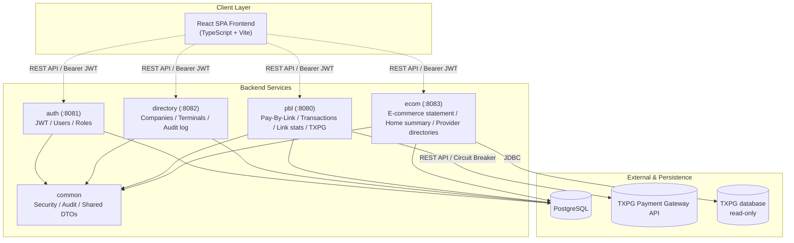

# 📑 ТЕХНИЧЕСКИЙ ПАСПОРТ СИСТЕМЫ
## Приложение к Акту приёма-передачи ПО «Merchant Portal (MP)»

> Сверено с кодом 29.09.2026.

| Параметр | Значение |
| :--- | :--- |
| **Наименование проекта** | Merchant Portal (MP) |
| **Назначение** | Личный кабинет мерчанта: платёжные ссылки (Pay-By-Link), компании и терминалы, учётные записи и роли, журнал аудита, выписка по онлайн-эквайрингу |
| **Архитектурный тип** | Четыре сервиса на Spring Boot и общая библиотека в одном Gradle-репозитории, общая база данных, React SPA |
| **Версия сборки** | 0.0.1-SNAPSHOT |
| **Язык разработки / Фреймворки** | Java 21 (LTS), Spring Boot 3.2.5, React 18, TypeScript 7, Vite 6 |

---

## 1. Назначение и краткое резюме проекта

**Merchant Portal (MP)** — веб-портал для мерчантов MilliKart:

1. **Вход и ролевой доступ.** Пять ролей; пользователь компании видит только данные своей компании.
2. **Компании и терминалы.** Справочник компаний с логином и паролем компании к провайдеру;
   эквайринговые терминалы заводятся выбором из справочника терминалов провайдера, проверяются пробным
   заказом (кнопка «Тест») и сверяют с провайдером статус и данные.
3. **Pay-By-Link.** Одноразовые и многоразовые платёжные ссылки со сроком жизни и страницей возврата
   плательщика.
4. **Операции.** Одностадийные (SMS) и двухстадийные (DMS) платежи: списание холда, в том числе
   частичное, полные и частичные возвраты, проверка статуса у платёжного шлюза.
5. **Аналитика и аудит.** Главная страница — сводка по оплатам картой всех мерчантов компании по
   выписке провайдера (сервис `ecom`); статистика оплат по платёжным ссылкам — вкладка «Статистика»
   страницы Pay by Link (сервис `pbl`); журнал аудита действий пользователей и системы во всех
   сервисах.
6. **E-commerce.** Выписка по платежам мерчантов компании из базы провайдера (§4.6).

---

## 2. Архитектура и структура модулей

### 2.1. Схема взаимодействия

### 2.2. Назначение модулей

1. **`common`** — общая библиотека: проверка JWT и Spring Security, журнал аудита, единая обработка
   ошибок, общие DTO, поиск по спискам.
2. **`auth`** (порт 8081) — вход, обновление и отзыв токенов (access и refresh), учётные записи и роли,
   хеширование паролей (BCrypt), блокировка после неудачных попыток и лимит попыток входа по адресу,
   автоблокировка учётных записей без активности.
3. **`directory`** (порт 8082) — компании (с логином и паролем к провайдеру) и терминалы (заведение из
   справочника провайдера), чтение журнала аудита, сверка статусов и данных терминалов с провайдером.
   Кэширования справочников нет.
4. **`pbl`** (порт 8080) — платёжные ссылки и операции, статистика оплат по ссылкам, интеграция со
   шлюзом TXPG — от имени компании терминала. Circuit breaker (Resilience4j) стоит на вызовах шлюза;
   автоматические повторы — только на создании заказа и запросе статуса: списание и возврат
   автоматически не повторяются. Здесь же кнопка «Тест» — пробный заказ с логином и паролем компании,
   без повторов и без общего с платежами circuit breaker.
5. **`ecom`** (порт 8083) — выписка по онлайн-эквайрингу и сводка главной страницы из базы шлюза, только
   чтение; справочники терминалов провайдера и логинов мультимерчантов — копия раз в 15 минут и по
   кнопке администратора.
6. **`frontend`** (порт 3000 при разработке, nginx в эксплуатации) — React 18, TypeScript, Material UI 7.

---

## 3. Технологический стек (Tech Stack)

### Бэкенд-инфраструктура
| Технология | Версия | Назначение |
| :--- | :--- | :--- |
| **Java** | 21 (LTS) | Язык программирования |
| **Spring Boot** | 3.2.5 | Каркас приложения |
| **Spring Security** | 6.x | Авторизация и фильтры безопасности |
| **Spring Data JPA** | 3.x | ORM и работа с базой данных |
| **Liquibase** | из Spring Boot | Версионирование и миграция схемы БД |
| **JJWT** | 0.11.5 | Выпуск и проверка JWT |
| **Resilience4j** | 2.2.0 | Circuit breaker и повторы вызовов шлюза (клиент провайдера `txpg-client`, сервис `pbl`) |
| **Caffeine** | 3.1.8 | Счётчики лимита попыток входа в памяти |
| **SpringDoc OpenAPI** | 2.5.0 | Swagger UI документация API |
| **Oracle JDBC** | 23.4 | Чтение базы шлюза (сервис `ecom`) |
| **Testcontainers** | 1.20.6 | Интеграционные тесты на PostgreSQL |
| **Gradle** | 8.5 | Система сборки |

### Фронтенд-инфраструктура
| Технология | Версия | Назначение |
| :--- | :--- | :--- |
| **React** | 18.3.1 | UI-библиотека |
| **TypeScript** | 7.0.2 | Типизация кода |
| **Vite** | 6.3.5 | Сборка и dev-сервер |
| **MUI (Material UI)** | 7.3.5 | UI-компоненты |
| **React Router** | 7.13.0 | Маршрутизация на стороне клиента |
| **Axios** | 1.x | HTTP-клиент с обновлением токена |
| **Recharts** | 2.15.2 | Графики |
| **xlsx** | 0.18.5 | Выгрузка в Excel |

### СУБД и среда выполнения
- **PostgreSQL 16** — одна база данных на все сервисы.
- **Oracle** — база платёжного шлюза TXPG, сервис `ecom` читает её без права записи.
- **Nginx** — раздача фронтенда и reverse proxy к сервисам.

---

## 4. Сводка реализованной функциональности

### 4.1. Авторизация и защита данных
- Вход по логину и паролю; access-токен JWT живёт 15 минут, refresh-токен обновляется с ротацией.
  Выход, блокировка, удаление учётной записи и сброс её пароля сразу отзывают refresh-токены;
  открытая сессия после этого работает не дольше срока access-токена — 15 минут.
- Второго фактора аутентификации нет: вход — по логину и паролю.
- Пароль, заданный не владельцем, — при создании пользователя, сбросе администратором или
  руководителем компании, первом запуске — пользователь меняет при первом входе, до смены сессии нет
  (PCI DSS 8.3.5, Р-100).
- Новый пароль, который пользователь задаёт себе сам, не может совпадать ни с одним из четырёх
  последних (PCI DSS 8.3.7, Р-102).
- Учётная запись без входа и работы 90 дней блокируется автоматически, администраторы тоже
  (PCI DSS 8.2.6, Р-101); вернуть её — обычная разблокировка.
- Выход по простою (PCI DSS 8.2.8, Р-99): 15 минут без действий пользователя — портал завершает
  сессию и просит войти снова, в том числе когда его открывают после перерыва. На сервере сессия
  гаснет через 20 минут без обновления.
- Ролевая модель доступа:
  - `SYSTEM_ADMIN` — системный администратор: все компании, терминалы и пользователи; единственный,
    кто задаёт и меняет логин и пароль компании к провайдеру, заводит терминалы, проверяет терминал у
    провайдера и обновляет справочники провайдера.
  - `COMPANY_HEAD` — руководитель компании: менеджеры и сотрудники своей компании, правка и блокировка
    терминалов, платёжные ссылки, операции (включая возвраты) и журнал аудита своей компании.
  - `COMPANY_MANAGER` — менеджер: правка и блокировка терминалов, платёжные ссылки, операции (включая
    возвраты) и журнал аудита своей компании.
  - `COMPANY_EMPLOYEE` — сотрудник: платёжные ссылки и операции своей компании, списание холда;
    без возвратов и без изменения терминалов.
  - `AUDITOR` — аудитор: чтение данных всех компаний и журнала аудита, без изменений.
- Изоляция данных компаний: пользователь компании видит только её терминалы, ссылки, операции и выписку.
- Учётная запись блокируется на 30 минут после 6 неудачных попыток входа (PCI-DSS 8.3.4); с одного
  адреса — не более 10 неудачных попыток за 15 минут.
- Пароли пользователей хранятся как хеш BCrypt, политика сложности — по PCI-DSS v4.0. Пароли компаний
  к провайдеру — шифротекстом AES-256-GCM, ключ задаётся переменной окружения (Р-93).

### 4.2. Управление компаниями и терминалами
- Компании: создание, изменение, смена статуса и мягкое удаление — только системный администратор.
- **Логин и пароль к провайдеру — у компании, а не у терминала** (Р-93). Все запросы к провайдеру —
  создание заказа, списание, возврат, проверка статуса, «Тест» — идут от имени компании терминала.
  Логин и пароль задаёт системный администратор при заведении компании (обязательно) и меняет в окне
  «Редактировать компанию» с подтверждением. Пароль хранится зашифрованным и не показывается никому —
  его можно только заменить; логин видит только системный администратор. Компании без логина и пароля
  портал отказывает в платежах, не обращаясь к провайдеру. Логин — только мультимерчанта: администратор
  не вводит его, а выбирает из справочника логинов провайдера (обновляется каждые 15 минут и по
  кнопке); в списке только активные логины с активными мерчантами, не занятые другой компанией, и при
  сохранении портал проверяет это ещё раз (Р-94, Р-95).
- Эквайринговые терминалы компании. **Основной параметр терминала — его номер у провайдера** (Р-96):
  им терминал подписан на всех экранах платежей, название идёт пояснением, и на нём портал создаёт
  заказ у провайдера. Пароля у терминала нет. Заводит терминал только системный администратор, выбором
  из терминалов мерчантов, привязанных к логину компании у провайдера; один терминал провайдера — одна
  компания. Править название и блокировать может и руководитель или менеджер компании; перенос в другую
  компанию — только системный администратор и только к компании, с логином которой мерчант терминала
  связан у провайдера.
- **Клиент в платёжной ссылке** — только у одноразовой: имя, почта и азербайджанский телефон уходят
  провайдеру для 3-D Secure. У многоразовой ссылки клиента нет — ей платят разные люди.
- **Проверка терминала у провайдера** — кнопка «Тест», доступна системному администратору для
  заведённого терминала. Пробный заказ на 1 AZN с логином и паролем компании на номере терминала
  проверяет, что платёж создать можно. Исходов четыре: заказ создан; неверный логин или пароль
  компании; провайдер ответил, но заказ не завёл (с его пояснением); провайдер не ответил. Пробный
  заказ не оплачивается и через 10 минут истекает у провайдера; в выписку он не попадает.
- **Терминалы сверяются с провайдером.** Каждые 15 минут система обновляет справочник терминалов
  провайдера и выключает у себя терминал, снятый провайдером с обслуживания (после трёх проверок
  подряд), вместе с приостановкой его ссылок; когда провайдер возвращает терминал, он включается
  обратно. Название, логин и номер терминала, изменённые у провайдера, переносятся в портал той же
  сверкой. Терминал, выключенный вручную, сверка не включает, а выключенный сверкой нельзя включить
  вручную. Сбой или пустой ответ провайдера ничего не меняет.
- **Вывод терминала из работы — блокировка, а не удаление**: у терминала есть статус `ACTIVE` /
  `BLOCKED`. Блокировка запрещает только новые платежи (создание ссылок и их открытие плательщиком) и
  приостанавливает активные ссылки терминала; возвраты, списание холдов DMS и проверка статуса по уже
  прошедшим платежам продолжают работать. Разблокировка возвращает ссылки в работу, кроме тех, у
  которых за это время истёк срок. Удаление терминала недоступно: на терминал ссылаются проведённые
  платежи. Ручная блокировка действует в портале — в MilliKart терминал остаётся включённым.
- **Статусная модель:** терминал — `ACTIVE` / `BLOCKED` (`TerminalStatus`), компания — `ACTIVE` /
  `INACTIVE` плюс `DELETED` как признак мягкого удаления.
- **Статус компании ничего не останавливает.** `INACTIVE` у компании — пометка в справочнике и запись
  в журнале аудита: вход сотрудников, создание платёжных ссылок и приём платежей продолжают работать.
  Чтобы остановить платежи компании, блокируют её терминалы.
- **Удаление компании необратимо из портала.** Это мягкое удаление: строка остаётся в базе со
  статусом `DELETED`, но становится невидимой на всех путях чтения, и правка такой компании
  отвечает «Company not found». Код компании и её логин к провайдеру остаются занятыми. Восстановление
  возможно только правкой в базе.
- **Опасные действия требуют подтверждения**: удаление и правка компании (название, логин и пароль к
  провайдеру, статус), блокировка и разблокировка терминала, правка терминала, правка и удаление
  пользователя, отмена платёжной ссылки, списание холда и возврат. Перед выполнением открывается окно,
  где названы конкретная запись и последствия именно этого действия. Перед правкой компании,
  терминала и пользователя окно показывает построчный список изменений; перед блокировкой и
  разблокировкой терминала — сколько платёжных ссылок это затронет.
- Настраиваемых лимитов и правил обработки платежей в портале нет (P3-6); тайм-аут сессии
  фиксированный (§4.1). На экране настроек — название компании, email учётной записи и язык
  интерфейса.

### 4.3. Процессинг Pay-By-Link и интеграция с TXPG
- Платёжные ссылки: одноразовые и многоразовые (с лимитом числа оплат), срок жизни — 24 часа по
  умолчанию и не более 90 дней от создания; страница возврата плательщика с чеком по закону о платёжных
  услугах (ст. 17.1) и правилам ЦБ АР № 12/3 (п. 14.1): провайдер и продавец с VÖEN, терминал, номер
  чека, RRN, код авторизации, платёжная система и последние 4 цифры карты, данные ссылки и клиента, на
  азербайджанском с английским (Р-130); отмена ссылки и снятие
  отмены. Сумму ссылки нельзя изменить после первой попытки оплаты. Ссылку отправляют копией адреса,
  письмом, в WhatsApp или QR-кодом: QR показывают карточка ссылки и окно «Поделиться» списка, его
  можно скачать PNG-файлом для печати (Р-127).
- Одностадийная оплата (SMS) и двухстадийная (DMS): холд при оплате и его списание — полное или
  частичное.
- Возвраты — полные и частичные, в пределах списанной суммы. Возврат не освобождает использование
  многоразовой ссылки. Необязательная причина возврата записывается в журнал аудита (Р-126).
- **Отмена холда (Void) не поддерживается:** несписанный холд снимает банк по своим срокам.
- Статус оплаты подтверждается у шлюза: при возврате плательщика на страницу, ручной проверкой из
  карточки операции и фоновой сверкой каждые 2 минуты. Асинхронных уведомлений шлюз не присылает.
- Списание и возврат засчитываются только при подтверждении шлюза. Если шлюз не ответил или ответ
  не подтверждает операцию, она помечается «исход неизвестен» (запись `UNRESOLVED` в журнале), и
  повтор в открытой карточке закрыт до проверки статуса — чтобы не провести деньги дважды.
  Перезагрузка страницы этот запрет снимает; такие операции разбирают по записи `UNRESOLVED`.
- Если circuit breaker к шлюзу открыт, портал отвечает `503` и к шлюзу не обращается: деньги такой
  отказ не двигает, повторить можно через минуту (Р-103).
- Карточка операции: номер заказа провайдера и номер платежа мерчанта (`ridByMerchant`) — первыми,
  маска карты, RRN, код одобрения, причина отказа, история статусов по записанным событиям.

### 4.4. Журнал аудита и Мониторинг

Здесь — общие правила журнала для всех сервисов и словарь его событий. Чтение журнала (эндпоинт,
фильтры, порядок) — [directory.md](../modules/directory.md) §3.3.

- **Журнал аудита ведётся во всех сервисах.** Записываются:
  - `directory` — компании и терминалы, включая смену логина и пароля компании к провайдеру (без
    самого пароля), блокировку терминала с числом приостановленных ссылок, а также блокировку,
    разблокировку и смену данных терминала сверкой с провайдером — исполнителем в таких записях стоит
    `system`;
  - `auth` — заведение и изменение учётных записей с указанием, что именно изменилось (смена роли
    видна как `role COMPANY_EMPLOYEE -> SYSTEM_ADMIN`), блокировка и разблокировка, в том числе
    автоматическая за 90 дней без активности, смена пароля, **успешные и неудачные входы, выходы**
    (PCI-DSS 10.2), срабатывание блокировки после шести неудач, признаки кражи refresh-токена;
  - `pbl` — создание, изменение и отмена платёжных ссылок, **списание холдов и возвраты** с суммой
    и идентификаторами операции у эквайера, операции, исход которых эквайер не подтвердил
    (`outcome = UNRESOLVED` — по такой записи разбирают, ушли деньги или нет), и каждая проверка
    терминала у провайдера с её исходом;
  - `ecom` — отказ в выписке и сводке главной пользователю, у которого нет компании.
- **Когда запись ложится.** Успешное действие — строго после коммита операции (Р-35): откатившееся
  действие в журнал не попадает. Отказ в доступе (`outcome = DENIED`) и неизвестный исход денежной
  операции (`UNRESOLVED`) пишутся в своей транзакции и переживают откат операции. Запись, возникшая
  внутри транзакции HTTP-запроса, откладывается до конца запроса и ложится там в своей транзакции
  (Р-85): запись посреди запроса взяла бы второе соединение из пула. Вне запроса (планировщики, первый
  запуск) и вне транзакции запись ложится сразу.
- **Что есть у каждой записи:** исполнитель, `companyId`, `timestamp`, детали и IP-адрес клиента.
  Адрес разрешается через доверенный прокси и подделке заголовком не поддаётся; у действий вне
  HTTP-запроса он пуст.
- **Секретов в журнале нет:** ни паролей, ни токенов, ни их частей. В записи о неудачном входе —
  только категория отказа. Строки длиннее колонки обрезаются, а не роняют запись.
- **Сбой записи не ломает операцию:** бизнес-действие выполняется, а в лог приложения уходит ERROR с
  маркером `AUDIT_WRITE_FAILED`.
- **Каждая запись журнала открывается карточкой**: клик по строке показывает запись целиком, включая
  полный текст деталей; из записи об операции или платёжной ссылке можно перейти в их карточку.

#### Словарь событий журнала (P3-2)

Значения `entityType` и `action` заданы константами в `az.millikart.common.audit.AuditEntity` и
`AuditAction` — сервисы не придумывают собственных названий. Значение вне словаря журнал всё
равно записывает (запись важнее правописания), но в лог приложения уходит warning с маркером
`AUDIT_OUTSIDE_DICTIONARY`. Новое значение сначала появляется в словаре и в этой таблице, потом в
коде. Ниже — по одной строке на каждое реальное сочетание `entityType`/`action` в коде
(30 сочетаний; у `USER`/`BLOCK` две строки).

| Событие | entityType | action | outcome | entityId | performedBy | companyId | Кто пишет | details |
|---|---|---|---|---|---|---|---|---|
| Вход в систему | `AUTH` | `LOGIN` | SUCCESS / DENIED | введённый логин (без пробелов, в нижнем регистре) | логин | компания аккаунта; пусто, если аккаунт не найден | `auth`, `AuthService.login`, `AuthService.changePassword` | успех: `Login successful, role …`; отказ: `Login refused: <категория>` — `no such account`, `wrong password`, `account locked until …`, `account status …`; верный пароль, заданный не владельцем, — `Login held: the password must be changed first` (Р-100). Пароля нет ни в каком виде |
| Выход из системы | `AUTH` | `LOGOUT` | SUCCESS | логин | логин | компания пользователя | `auth`, `AuthService.logout` | `Logout: revoked N token(s) of family …`; пишется **только** если токен нашёлся и был отозван — 204 на незнакомый токен записи не оставляет |
| Блокировка аккаунта после 6 неудач | `AUTH` | `LOCKOUT` | DENIED | логин | логин | компания аккаунта | `auth`, `AuthService.registerFailedAttempt` | `Account locked until … after N failed attempts` (PCI-DSS 8.3.4) |
| IP исчерпал лимит попыток входа | `AUTH` | `RATE_LIMIT` | DENIED | логин последней попытки | логин последней попытки | пусто | `auth`, `AuthService.recordAddressFailure` | `Address reached the failed-login limit; further attempts refused for the window`; одна запись на окно, не на попытку; сам адрес — в `client_ip` |
| Повторное использование refresh-токена | `AUTH` | `TOKEN_REUSE` | DENIED | логин владельца токена | логин владельца | пусто | `auth`, `AuthService.refresh` | `Rotated refresh token reused … revoked N token(s) of family …`; самого токена в записи нет |
| Создание пользователя | `USER` | `CREATE` | SUCCESS / DENIED | успех: UUID пользователя; отказ: логин создаваемого | логин актора; `system` у первого администратора | успех: компания созданного (у первого администратора пусто); отказ: компания актора | `auth`, `UserService.createUser`; `AdminBootstrapRunner.run` | `Created user … with role …[ in company …]`; первый администратор — `Admin bootstrap created the first SYSTEM_ADMIN …`; отказы: `Denied: role … attempted to create a user with role …` (руководитель выдаёт роль выше менеджера и сотрудника), `Denied: role … attempted to create a user in company …` (руководитель заводит в чужую компанию), `Denied: role … attempted to create a user` (роль без права заводить), `Denied: actor account is …` (учётная запись актора уже не `ACTIVE`) |
| Изменение пользователя | `USER` | `UPDATE` | SUCCESS / DENIED | UUID пользователя | логин актора | успех: компания цели; отказ: компания актора | `auth`, `UserService.updateUser` | `Changed fullName, password…, role X -> Y, companyId A -> B, status S -> T` — только изменённое, или `No fields changed`; отказы: `… attempted to grant role …` (не администратор выдаёт роль выше менеджера и сотрудника), `… attempted to move user … to company …` (перевод в другую компанию не администратором), `… attempted UPDATE of user … with role …` (руководитель правит пользователя роли выше), `Denied: role … of company … attempted UPDATE of user … outside its company` (пользователь чужой компании; компания цели не называется), `Denied: actor account is …` |
| Смена пароля пользователя | `USER` | `PASSWORD_CHANGE` | SUCCESS | UUID пользователя | логин актора | компания цели | `auth`, `UserService.updateUser`, `AuthService.changePassword` | `Password changed for …` — сброс администратором или руководителем и смена своего пароля в правке учётной записи; `Password changed by its owner at sign-in` — смена на входе (Р-100); без пароля |
| Блокировка аккаунта администратором | `USER` | `BLOCK` | SUCCESS | UUID пользователя | логин актора | компания цели | `auth`, `UserService.updateUser` | `Account set to BLOCKED for … (was ACTIVE)` |
| Блокировка аккаунта без активности 90 дней (Р-101) | `USER` | `BLOCK` | SUCCESS | UUID пользователя | `system` | компания цели | `auth`, `InactiveAccountService.blockInactive` | `Account … blocked: no activity for more than 90 days (PCI DSS 8.2.6), last activity …` |
| Разблокировка аккаунта | `USER` | `UNBLOCK` | SUCCESS | UUID пользователя | логин актора | компания цели | `auth`, `UserService.updateUser` | `Account reactivated for … (was …)` |
| Удаление пользователя (soft) | `USER` | `DELETE` | SUCCESS / DENIED | UUID пользователя | логин актора | успех: компания цели; отказ: компания актора | `auth`, `UserService.deleteUser` | `Soft deleted user … (role …)`; отказы: `… attempted DELETE of user … with role …` (руководитель удаляет пользователя роли выше), `… attempted DELETE of user … outside its company` (пользователь чужой компании), `Denied: actor account is …` |
| Список пользователей — отказ | `USER` | `LIST` | DENIED | `ALL` | логин актора | компания актора | `auth`, `UserService.listUsers` | `Denied: role … attempted to list users` (роль без права на пользователей) |
| Чтение пользователя — отказ | `USER` | `READ` | DENIED | UUID пользователя | логин актора | компания актора | `auth`, `UserService.getUser` | `Denied: role … of company … attempted READ of user … outside its company`; компания цели не называется — руководитель читает журнал своей компании и узнал бы, чей это UUID |
| Создание компании | `COMPANY` | `CREATE` | SUCCESS / DENIED | id компании | логин актора | успех: id созданной; отказ: компания актора | `directory`, `CompanyService.createCompany` | `Created company: …, provider login …[, tax ID …]` (без пароля) / `Denied: role … attempted to create company '…'` |
| Список компаний и логинов провайдера — отказ | `COMPANY` | `LIST` | DENIED | `ALL` | логин актора | компания актора | `directory`, `CompanyService.listCompanies`, `CompanyService.listFreeProviderLogins` | `Denied: role … attempted to list all companies`; `Denied: role … attempted to list provider logins` |
| Чтение чужой компании — отказ | `COMPANY` | `READ` | DENIED | id запрошенной компании | логин актора | компания актора | `directory`, `CompanyService.validateAccess` (из `getCompany`) | `Denied: role … of company … attempted to read company …` |
| Изменение компании | `COMPANY` | `UPDATE` | SUCCESS / DENIED | id компании | логин актора | успех: id компании; отказ: компания актора | `directory`, `CompanyService.updateCompany` | изменённые поля — только те, что действительно изменились; PATCH без изменений записи не оставляет (Р-108): `Name changed from '…' to '…'`, `Status changed from '…' to '…'`, `Provider login changed from '…' to '…'`, `Tax ID changed from '…' to '…'`, `Provider password changed` — без значения пароля (Р-93); отказ — `Denied: role … attempted to update company …` |
| Блокировка компании | `COMPANY` | `BLOCK` | SUCCESS | id компании | логин актора | id компании | `directory`, `CompanyService.updateCompany` | `Company set to INACTIVE (was ACTIVE)` |
| Разблокировка компании | `COMPANY` | `UNBLOCK` | SUCCESS | id компании | логин актора | id компании | `directory`, `CompanyService.updateCompany` | `Company reactivated (was …)`; возврат в `ACTIVE` |
| Удаление компании (soft) | `COMPANY` | `DELETE` | SUCCESS / DENIED | id компании | логин актора | успех: id компании; отказ: компания актора | `directory`, `CompanyService.deleteCompany` | `Soft deleted company` / `Denied: role … attempted to delete company …` |
| Создание терминала | `TERMINAL` | `CREATE` | SUCCESS / DENIED | успех: id терминала; отказ: `NEW` — номер выдаётся только при сохранении | логин актора | успех: компания терминала; отказ: компания актора | `directory`, `TerminalService.createTerminal` | `Created terminal: … for company …`; отказ — `Denied: role … attempted to create a terminal for company …` (заводит только системный администратор, Р-93) |
| Список терминалов — отказ | `TERMINAL` | `LIST` | DENIED | `ALL` | логин актора | компания актора; пусто, если её нет | `directory`, `TerminalService.isGlobalReader`, `requireOwnCompany`, `listProviderTerminals`; `ecom`, `EcomScopeService.scopeFor`, `ProviderTerminalController.list` | `directory`: `Denied: role … attempted to list terminals`, `Denied: … without a company attempted to list terminals`, `Denied: role … attempted to list provider terminals`; `ecom` (выписка и сводка главной): `Denied: … without a company asked for acquiring transactions`, `Denied: unrecognised role … asked for acquiring transactions`; `ecom` (справочник терминалов провайдера): `Denied: role … attempted to list provider terminals` |
| Чтение терминала: проверка у провайдера; отказ в доступе к терминалу | `TERMINAL` | `READ` | SUCCESS / DENIED | id терминала | логин актора | успех: компания терминала; отказ: компания актора, а у статуса заказа чужой компании — пусто (Р-114) | `directory`, `TerminalService.validateReadAccessToCompany`; `pbl`, `TerminalCheckService`, `PaymentLinkService.validateAccess`, `PaymentLinkService.requireStatusReadable` | успех: `Checked payment creation on terminal … with the company credentials: OK / INVALID_CREDENTIALS / REJECTED / UNREACHABLE (код провайдера)`; отказы: `Denied: role … attempted to check terminal …` (проверка не системным администратором), `Denied: role … of company … attempted to read terminal … of company …` (`directory`), `Denied: role … is not allowed to act on terminal …` и `… attempted to act on terminal … of another company` (`pbl`: роль без права на действие, чужой терминал); `Denied: role … of company … asked for the status of transaction … on terminal … of another company` (`pbl`, `/status` по чужому заказу: запись без компании видят только `SYSTEM_ADMIN` и `AUDITOR`, клиенту — 404 как на несуществующий) |
| Синхронизация справочников провайдера — отказ | `TERMINAL` | `UPDATE` | DENIED | `ALL` | логин актора | компания актора; пусто, если её нет | `ecom`, `ProviderTerminalController.sync` | `Denied: role … attempted to sync provider snapshots` (синхронизацию по кнопке запускает только системный администратор) |
| Изменение терминала | `TERMINAL` | `UPDATE` | SUCCESS / DENIED | id терминала | логин актора; `system` у сверки с провайдером | успех: компания терминала; отказ: компания актора | `directory`, `TerminalService.updateTerminal`; `TerminalStatusReconciliationService` | изменённые поля — только те, что действительно изменились; PATCH без изменений записи не оставляет (Р-108): `Name changed from '…' to '…'. CompanyId changed from '…' to '…'.` и смена статуса; у сверки — `Provider terminal … changed for terminal …: login … -> … name … -> … terminal … -> …` (только изменённое); отказ — `Denied: role … of company … attempted to update terminal …` или `… move terminal … to company …`. Логин и номер терминала вручную не правятся (Р-93, Р-96) |
| Блокировка терминала | `TERMINAL` | `BLOCK` | SUCCESS | id терминала | логин актора; `system` у сверки с провайдером | компания терминала | `directory`, `TerminalService.updateTerminal`; `TerminalStatusReconciliationService` | `Blocked terminal …, suspended N links`; у сверки — `Blocked terminal … because provider terminal … is out of service; suspended N links` |
| Разблокировка терминала | `TERMINAL` | `UNBLOCK` | SUCCESS / DENIED | id терминала | логин актора; `system` у сверки с провайдером | компания терминала (и у отказа) | `directory`, `TerminalService.updateTerminal`; `TerminalStatusReconciliationService` | `Unblocked terminal …, resumed N links, expired M links`; у сверки — `… because provider terminal … is back in service …`; отказ — `Denied: terminal … was blocked by the provider sync and cannot be unblocked by hand` |
| Чтение журнала аудита — отказ | `AUDIT_LOG` | `LIST` | DENIED | `ALL` | логин актора | компания актора; пусто, если её нет | `directory`, `AuditLogQueryService.listAuditLogs` | `Denied: role … attempted to list audit logs` (роль без права на журнал); `Denied: … without a company attempted to list audit logs` (роль компании без компании) |
| Создание платёжной ссылки | `PAYMENT_LINK` | `CREATE` | SUCCESS | UUID ссылки | логин актора | компания терминала ссылки (Р-104) | `pbl`, `PaymentLinkService.create` | `Created <тип использования> <тип платежа> link for <сумма> <валюта> on terminal …, expires …` |
| Изменение платёжной ссылки | `PAYMENT_LINK` | `UPDATE` | SUCCESS | UUID ссылки | логин актора | компания терминала ссылки (Р-104) | `pbl`, `PaymentLinkService.update` | `Changed amount X -> Y, description, …` — изменённые поля, или `No fields changed` |
| Отмена платёжной ссылки | `PAYMENT_LINK` | `CANCEL` | SUCCESS | UUID ссылки | логин актора | компания терминала ссылки (Р-104) | `pbl`, `PaymentLinkService.update` (переход ссылки в `CANCELED`; правка уже отменённой — `UPDATE`) | изменённые поля, в т.ч. `status ACTIVE -> CANCELED` |
| Списание холда (capture) | `TRANSACTION` | `CAPTURE` | SUCCESS / UNRESOLVED | UUID транзакции | логин актора | компания терминала ссылки (Р-104) | `pbl`, `PaymentLinkService.completeDms` | успех: `Captured <сумма> of the authorized <сумма> (ridByPmo …, tranActionId …, approvalCode …)`; UNRESOLVED: `Capture of … left unconfirmed by the acquirer (providerOrderId …): … Outcome unknown — a system administrator must reconcile it with the provider and resolve it before another money operation.` |
| Возврат средств | `TRANSACTION` | `REFUND` | SUCCESS / UNRESOLVED | UUID транзакции | логин актора | компания терминала ссылки (Р-104) | `pbl`, `PaymentLinkService.refund` | успех: сумма, база возврата, возвращено всего, статус транзакции и идентификаторы эквайера; UNRESOLVED: как у capture — деньги могли уйти, локального следа нет; причина мерчанта, если дана, — хвостом `; reason: <текст>` (Р-126) |
| Возврат и списание заказа выписки | `PROVIDER_ORDER` | `REFUND`, `CAPTURE` | SUCCESS / UNRESOLVED / DENIED | номер заказа у провайдера | логин актора | компания терминала заказа; у отказа — компания актора | `ecom`, `EcomMoneyOperationService` (Р-125) | успех: `Refunded <сумма> <валюта> (ridByPmo …, tranActionId …, approvalCode …)`; UNRESOLVED: `… left unconfirmed by the acquirer: … Outcome unknown — a system administrator must reconcile it …`; DENIED: роль без права; у возврата причина мерчанта, если дана, — хвостом `; reason: <текст>` (Р-126) |
| Итог неподтверждённой операции заказа выписки | `PROVIDER_ORDER` | `RESOLVE` | SUCCESS / DENIED | номер заказа у провайдера | логин администратора или `system` | компания терминала заказа; у `system` — пусто | `ecom`, `EcomMoneyOperationService.resolve`, `ProviderOrderAttemptService.open` (Р-125) | `Unknown <refund/capture> of <сумма> started by <логин> at <время> resolved as executed` или `… as not executed`; у `system` — `… resolved as executed: the statement shows it approved` |
| Итог неподтверждённой денежной операции | `TRANSACTION` | `RESOLVE` | SUCCESS | UUID транзакции | логин администратора | компания терминала ссылки (Р-104) | `pbl`, `PaymentLinkService.resolveOutcome` (Р-123) | `Unknown <refund/capture> of <сумма> started by <логин> at <время> resolved as executed: recorded without acquirer references` или `… as not executed: nothing recorded` |

Пояснения к таблице — соглашения, которые из самих записей не видны:

- **`entityId = "ALL"`** — действие было над списком, а не над конкретной записью (отказы в `LIST`).
  Колонка `NOT NULL`, и заглушка честнее, чем ослабление ограничения. **`entityId = "NEW"`** — отказ в
  заведении терминала, у которого ещё нет номера.
- **`entityId` у `AUTH` — всегда логин** (не UUID и не IP-адрес): успешный вход, отказ, lockout,
  превышение лимита и кража токена одного аккаунта отвечают на один и тот же фильтр. IP-адрес
  при этом не теряется — он в отдельной колонке `client_ip` у каждой записи. У отказа в создании
  пользователя `entityId` — тоже логин: UUID ещё нет.
- **Асимметрия `companyId`**: у успеха это компания **цели** действия, у отказа — компания
  **актора**, намеренно. Журнал режется по этой колонке для `COMPANY_HEAD`/`COMPANY_MANAGER`,
  и отказ, подшитый под названную в запросе компанию, позволял бы любому пользователю писать
  произвольный текст в чужой обзор аудита. Что именно пытались сделать, видно в `entityId` и
  `details`. Цель записей о ссылках, списаниях и возвратах — компания терминала ссылки (Р-104), поэтому
  руководитель видит в журнале и действия администратора по своей компании. Исключение — отказ
  `TERMINAL`/`UNBLOCK`: он подшит под компанию терминала, но до него доходят только те, кому правка
  этого терминала разрешена, — у роли компании это её же компания.
- **Автоматические действия** записываются от исполнителя `system`: первый администратор при
  установке, блокировка за 90 дней без активности, блокировка, разблокировка и смена данных терминала
  сверкой с провайдером.
- **Успешные `LIST` и `READ` не журналируются** — намеренно, из-за объёма: каждая загрузка
  каждого экрана превращала бы журнал в лог доступа. Пишутся только отказы. Отсутствие записи
  об успешном просмотре — не пробел. Исключение — проверка терминала у провайдера: она заводит заказ
  у провайдера, и след нужен.
- **Журнал только на добавление**: `AuditLogRepository` намеренно не наследует `JpaRepository` —
  в нём один метод `save`, у сущности нет сеттеров, а на уровне БД у роли приложения нет прав
  `UPDATE`/`DELETE`/`TRUNCATE` на `audit_logs` ([deployment_guide.md](deployment_guide.md) §5.1a;
  вступает в силу после перевода сервисов на отдельного пользователя базы — сейчас они работают под
  суперпользователем).
- **Запись переживает откат операции**: успех пишется после коммита
  (`@TransactionalEventListener(AFTER_COMMIT)`), отказ и `UNRESOLVED` — в своей транзакции
  (`TransactionTemplate` с `REQUIRES_NEW`); возникшие внутри транзакции HTTP-запроса ложатся в его
  конце (`AuditOutbox`, Р-85). Если не удалась сама запись, бизнес-операция не ломается, а в лог
  приложения уходит маркер `AUDIT_WRITE_FAILED`.

---

### 4.5. Главная страница и статистика по ссылкам

- **Главная страница — весь эквайринг компании** (Р-91): сводка по оплатам картой всех мерчантов,
  связанных у провайдера с логином компании, из выписки провайдера (сервис `ecom`); у системного
  администратора и аудитора — по мерчантам логинов всех компаний. Цифры совпадают с вкладкой
  E-commerce за тот же период: те же заказы (по дате создания) и те же правила денег. Период по
  умолчанию — 7 дней; ниже сводки — последние заказы периода. Каждое открытие главной — запрос к базе
  шлюза, кэша нет. Контракт — [ecom.md](../modules/ecom.md) §2.8.
- **Статистика оплат по платёжным ссылкам** — вкладка «Статистика» страницы Pay by Link (сервис `pbl`,
  Р-89): только платежи через ссылки портала. Период — сегодня, 7, 30 или 90 дней (не больше 92);
  сутки режутся по поясу `PBL_DASHBOARD_ZONE` (по умолчанию `Asia/Baku`), а не по UTC. Деньги —
  отдельно по каждой валюте, сводного числа поверх валют нет. Выручка — полученное по платежам,
  созданным в периоде (для частичных списаний — фактически списанное), минус возвраты, проведённые в
  периоде: возврат по старому платежу уменьшает сегодняшнюю выручку и не переписывает прошлые дни.
  Разбивка по статусам — попытки оплаты: каждое открытие ссылки — операция. Воронка ссылок,
  созданных за период: создана → открыта → карта отправлена → оплачена (списание или холд); оплаты
  после периода тоже засчитываются, поэтому недавний период ещё растёт. Время до оплаты — только у
  одноразовых ссылок, от создания ссылки до начала оплаченной попытки: медиана и раскладка (до часа,
  до суток, до недели, дольше). Системный администратор и
  аудитор видят все компании, остальные роли — терминалы своей; учётная запись без компании получает
  нули, а не отказ. Контракт — `GET /api/v1/dashboard/summary` в
  [pay-by-link.md](../modules/pay-by-link.md).
- **Чего нет ни там, ни там:** средней скорости обработки платежа, сравнения с прошлым периодом и
  комиссии эквайера — этих величин система не хранит и не измеряет.

### 4.6. E-commerce: выписка провайдера

- Сервис `ecom` читает базу платёжного шлюза TXPG — только чтение — и отдаёт выписку по платежам
  мерчантов компании, в том числе тех, чьи платежи портал не создаёт: строка выписки — заказ со
  всеми его операциями (авторизация, списание, возврат, отмена); заказ относится к периоду по дате
  создания.
- Выписка берёт завершённые заказы, а также заказы, по которым уже списаны деньги, даже если
  провайдер ещё держит их авторизованными (списание частями); неоплаченные и пробные заказы и
  авторизации без списания в неё не попадают.
- Каждый пользователь видит выписку только по мерчантам, связанным у провайдера с логином своей
  компании; системный администратор и аудитор — по мерчантам логинов всех компаний портала.
- Справочник терминалов провайдера и справочник логинов мультимерчантов обновляются каждые 15 минут и
  по кнопке администратора. По первому заводятся терминалы и сверяются их статусы (§4.2), по второму
  проверяется логин компании и строится круг мерчантов её выписки.
- Статус заказа берётся из статуса провайдера: `FullyPaid` — «Успешный» без сверки суммы, у оплаты
  одним сообщением (SMS) — только статус провайдера. У двухстадийной оплаты (DMS) со списаниями статус
  считается по суммам одобренных операций — так видна оплата частями, пока провайдер держит заказ
  авторизованным; без списаний — снова статус провайдера. Суммы «списано» и «возвращено» — всегда по
  операциям ([ecom.md](../modules/ecom.md) §2.3, Р-92).
- Вкладка «E-commerce»: фильтры по периоду, терминалам, сумме, номеру заказа, статусу и типу оплаты —
  применяются кнопкой «Применить»; итоги периода, карточка заказа со всеми операциями и выгрузка
  загруженных строк в Excel.
- **Проверка:** выписка собрана по SQL провайдера и проверена на выгрузке тестового стенда — 114
  заказов во всех статусах провайдера, включая возвраты и реверсалы, — и на локальной Oracle со схемой
  `TXPG`, собранной по SQL провайдера. На боевой базе провайдера запросы портала ещё не исполнялись.

---

## 5. Передаваемая техническая документация

Документация лежит в каталоге `project_docs/` репозитория:

1. `guides/technical_handover.md` — данный документ (технический паспорт системы).
2. `guides/admin_guide.md` — руководство системного администратора: заведение компаний, терминалов и
   пользователей, связь базы портала с базой провайдера.
3. `guides/application_description.md` — обзор архитектуры: модули и связи, схема базы данных, фоновые
   процессы, интеграция с TXPG.
4. `guides/deployment_guide.md` — установка, настройка окружения, запуск и обновление сервисов, nginx.
5. `modules/auth.md`, `modules/directory.md`, `modules/pay-by-link.md`, `modules/ecom.md` — контракты
   API сервисов.
6. `decisions.md` — реестр проектных решений; на его номера (Р-NN) ссылаются остальные документы.
7. **OpenAPI / Swagger** — интерактивные спецификации API сервисов (`/swagger-ui.html`).
   Включается на время приёмо-сдаточных испытаний переменной `SWAGGER_ENABLED=true`; в постоянной
   эксплуатации остаётся выключенной, поскольку `/v3/api-docs` — это полная карта API.
   Процедура включения и выключения — [deployment_guide.md](deployment_guide.md), раздел 14.3.

---

## 6. Состояние на момент передачи

Программный комплекс **Merchant Portal (MP)**:
- реализует функциональность, перечисленную в разделе 4; запросы выписки E-commerce (§4.6) на боевой
  базе провайдера ещё не исполнялись;
- покрыт автоматическими интеграционными и модульными тестами бэкенда — более 750 тестов; тесты,
  зависящие от поведения базы данных, выполняются на PostgreSQL; автоматических тестов фронтенда нет;
- известные ограничения (в том числе отсутствие отмены холда) перечислены в корневом
  [`AGENTS.md`](../../AGENTS.md), раздел 10.
