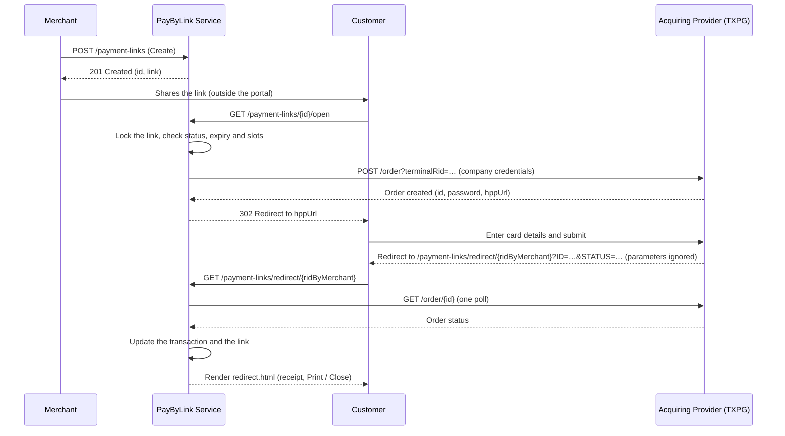

# PayByLink Service (`pbl`)

> API contracts of the `pbl` service: requests, responses, refusals. Checked against the code on 29.09.2026.
> Architecture, schema and the TXPG integration — `../guides/application_description.md` (§4, §7); roles,
> invariants and pitfalls — `../../AGENTS.md` (§6, §7, §10). Postman collection — `pbl/Pay-By-Link.postman_collection.json`.

## 1. General Description and Context

-   **Purpose:** payment links for merchants without their own website. The service creates a link,
    sends the payer to the acquirer's hosted payment page (HPP) and shows the result on its own receipt
    page (`redirect.html`, §5.6).
-   **Stack:** Spring Boot, module `pbl`, port `8080`.
-   **Acquirer:** MilliKart TXPG, contract `../external/TXPG-client-side-integration.md`. Every call —
    order creation, capture, refund, status, the terminal check — authenticates with the login and
    password of the terminal's **company**, not of the terminal (Р-93). They are set on the company by a
    system administrator (`directory.md` §3.1); the password is stored encrypted and decrypted only for
    the Basic header. The order is created on the provider terminal: `POST /order?terminalRid=<terminals.terminal_rid>`
    (Р-96). A terminal without a company, a company without credentials or a terminal without the
    provider number gets `400` before the acquirer is called (§6).
-   **No callback from the acquirer** (Р-7). A payment's outcome is fetched by the return page (§5.6),
    by `GET /transactions/{id}/status` (§5.8) and by the background reconciliation of `PENDING`
    transactions (`../../AGENTS.md` §7).

---

## 2. Endpoint List

| # | Endpoint | Token | Section |
|:---|:---|:---|:---|
| 1 | `POST /api/v1/payment-links` — create a link | JWT | §5.1 |
| 2 | `PATCH /api/v1/payment-links/{id}` — update a link | JWT | §5.2 |
| 3 | `GET /api/v1/payment-links/{id}` — one link | JWT | §5.3 |
| 4 | `GET /api/v1/payment-links` — list of links | JWT | §5.4 |
| 5 | `GET /api/v1/payment-links/{id}/open` — the payer opens a link | public | §5.5 |
| 6 | `GET /api/v1/payment-links/redirect/{tx}` — the payer's return page | public | §5.6 |
| 7 | `GET /api/v1/transactions` — list of transactions | JWT | §5.7 |
| 8 | `GET /api/v1/transactions/{identifier}/status` — poll the acquirer | JWT | §5.8 |
| 9 | `POST /api/v1/transactions/{transactionId}/complete` — capture a DMS hold | JWT | §5.9 |
| 10 | `POST /api/v1/transactions/{transactionId}/refund` — refund | JWT | §5.10 |
| 11 | `GET /api/v1/payment-links/{id}/transactions` — attempts of one link | JWT | §5.11 |
| 12 | `GET /api/v1/transactions/{id}` — one transaction, no acquirer call | JWT | §5.12 |
| 13 | `GET /api/v1/dashboard/summary` — payment link statistics | JWT | §5.13 |
| 14 | `POST /api/v1/acquiring/terminal-checks/{terminalId}` — terminal check | JWT | §5.14 |

---

## 3. Data Model

Tables `payment_links`, `transactions`, `transaction_refunds` and the `terminals` columns this service
reads — `../guides/application_description.md` §4 (ER diagram and migrations). Which service owns which
table — `../../AGENTS.md` §5. What the fields mean in the API — in the responses below.

---

## 4. Security and Access

-   Every endpoint except §5.5 and §5.6 needs `Authorization: Bearer <JWT>` issued by `auth`
    (`POST /api/v1/auth/login`, `auth.md`). No token or an invalid one — `401`.
-   Which role may call which endpoint — the matrix in `../../AGENTS.md` §6. `SYSTEM_ADMIN` and `AUDITOR`
    read every company; the other roles see only links and transactions whose terminal belongs to their
    company (`companyId` claim). `AUDITOR` writes nothing; refunds need `SYSTEM_ADMIN`, `COMPANY_HEAD`
    or `COMPANY_MANAGER`.

### 4.1. Access Gate

Every endpoint that addresses a link, a transaction or a terminal goes through one check
(`PaymentLinkService.validateAccess`): the role first, then the company of the terminal.

| Case | Answer | Audit journal |
|:---|:---|:---|
| role not allowed for the action, or not recognised | `403 Access denied: role <ROLE> is not authorized for this action` | `TERMINAL` / `READ` / `DENIED`, entity — the terminal id |
| terminal row not found | `404 Terminal not found: <id>` | — |
| terminal of another company | `403 Access denied to terminal: <id>` | `TERMINAL` / `READ` / `DENIED` |

The lists (§5.4, §5.7) and the summary (§5.13) check the role only: an unrecognised role gets the same
`403` without a journal record, a known role without a company (or with a company that has no
terminals) gets an empty page or zeros, not `403`. The `terminal` filter of §5.4 goes through the full
gate. The terminal check (§5.14) has its own gate.

Successful changes — link creation and update, capture, refund — are written to the journal with the
company of the link's terminal, not of the actor (Р-104): a company head sees what an administrator did
with the company's links. Event dictionary — `../guides/technical_handover.md` §4.4.

---

## 5. API Contracts (Endpoints)

### 5.1. Create Payment Link

-   **Method:** `POST /api/v1/payment-links`
-   **Access:** every role except `AUDITOR`, on a terminal of the caller's company (§4.1).

**Request Body:**

```json
{
  "merchantOrderId": "ORDER-12345",
  "terminal": 17,
  "amount": 1500.50,
  "currency": "AZN",
  "description": "Payment for order #12345",
  "customer": {
    "fullName": "John Doe",
    "email": "test@test.com",
    "phone": "+994 50 977 18 84"
  },
  "paymentType": "DMS",
  "usageType": "SINGLE",
  "expiresAt": "2026-10-10T15:00:00Z",
  "metadata": {
    "campaign": "summer_sale"
  }
}
```

| Field | Rules |
|:---|:---|
| `terminal` | required, our terminal id. The terminal must be `ACTIVE` (a blocked terminal takes no new payments, Р-38), its company must have acquirer credentials, and it must carry the provider terminal number (`terminal_rid`, Р-96) |
| `amount` | required, > 0 |
| `currency` | required, exactly 3 characters; only the length is checked, not ISO 4217 |
| `paymentType` | required, `SMS` or `DMS` |
| `usageType` | required, `SINGLE` or `MULTIPLE` |
| `maxPayments` | required and > 0 for `MULTIPLE`; ignored and not stored for `SINGLE` |
| `merchantOrderId`, `description` | optional, free text, at most 255 characters |
| `customer` | optional, **single-use links only** (Р-96): a customer with any filled field on a `MULTIPLE` link is refused, not dropped. `fullName` — at most 255 characters. `email` — a valid address, at most 255 characters. `phone` — an Azerbaijani number: `+994`, `994` or `0` followed by 9 digits, spaces, dashes and brackets allowed; stored as `+994XXXXXXXXX` |
| `expiresAt` | optional ISO-8601 instant, §5.1.1 |
| `metadata` | optional JSON object, stored as is |

**Response:** `201 Created`

```json
{
  "id": "550e8400-e29b-41d4-a716-446655440000",
  "rid": "RID-3F2A9C1B",
  "merchantOrderId": "ORDER-12345",
  "terminal": 17,
  "amount": 1500.50,
  "currency": "AZN",
  "description": "Payment for order #12345",
  "customer": {
    "fullName": "John Doe",
    "email": "test@test.com",
    "phone": "+994509771884"
  },
  "paymentType": "DMS",
  "usageType": "SINGLE",
  "currentPaymentsCount": 0,
  "refundedPaymentsCount": 0,
  "status": "ACTIVE",
  "link": "https://pay.example.az/api/v1/payment-links/550e8400-e29b-41d4-a716-446655440000/open",
  "metadata": {
    "campaign": "summer_sale"
  },
  "expiresAt": "2026-10-10T15:00:00Z",
  "createdAt": "2026-09-29T13:14:00Z"
}
```

The same body is returned by §5.2, §5.3 and §5.9.

-   **Empty fields are omitted**, not sent as `null`: `merchantOrderId`, `description`, `customer`,
    `maxPayments` (always absent on `SINGLE`), `metadata`, `expiresAt` (absent only on legacy links, which
    never expire) and `lastPaidAt`. Inside `customer` an empty field comes as `null`.
-   `rid` — this service's reference of the link, `RID-` and 8 hex characters. Generated here; not sent to
    the acquirer.
-   `link` — the URL the payer opens (§5.5): `<PBL_BASE_URL>/api/v1/payment-links/{id}/open`.
-   `status` — `ACTIVE`, `EXPIRED`, `COMPLETED`, `CANCELED` or `SUSPENDED` (§5.2).
-   `currentPaymentsCount` — how many times the link was used: its transactions in `SUCCESS`,
    `REFUNDED` and `PARTIALLY_REFUNDED` (Р-49). A refund does not lower it and does not free a usage slot:
    a link allowed 3 payments takes 3 over its lifetime.
-   `refundedPaymentsCount` — how many of those payments were refunded, fully or partially (Р-50); never
    above `currentPaymentsCount`. Present on the single-link responses only; list rows carry neither
    counter (§5.4).
-   `lastPaidAt` — creation time of the newest attempt in `SUCCESS`, `REFUNDED` or `PARTIALLY_REFUNDED`
    (P2-15). Omitted when the link was never paid. A refund does not remove it; an `AUTHORIZED` hold does
    not set it, its capture does.

**Refusals** (checked in this order):

| HTTP | `message` | When |
|:---|:---|:---|
| 400 | `terminal is required`, `amount is required`, `amount must be positive`, `currency is required`, `currency must be a 3-letter ISO 4217 code`, `paymentType is required`, `usageType is required`, `maxPayments must be greater than 0`, `maxPayments is required and must be greater than 0 when usageType is MULTIPLE`, `customer.email must be a valid email address` | body validation; one message per answer |
| 400 | `Invalid request payload format or parameter value` | malformed JSON, unknown `paymentType` / `usageType` |
| 403, 404 | §4.1 | role, terminal, company |
| 400 | `terminal <id> is blocked and cannot take new payments; unblock it or use another terminal` | terminal `BLOCKED` |
| 400 | credentials and terminal number texts, §6 | company without credentials, terminal without company or provider number |
| 400 | `customer can only be set on a single-use link` | customer on a `MULTIPLE` link |
| 400 | `customer.phone must be an Azerbaijani number: +994 and 9 digits` | phone format |
| 400 | `expiresAt must be in the future`, `expiresAt must not be later than <instant>: …` | §5.1.1 |

**Audit journal:** `PAYMENT_LINK` / `CREATE`.

#### 5.1.1. Link Lifetime

| Case | Resulting `expiresAt` |
|:---|:---|
| Field omitted | creation time + `pbl.link.default-ttl` (24 h by default) |
| Field supplied and valid | exactly the value supplied |
| Field in the past or equal to now | `400 expiresAt must be in the future`, nothing is created |
| Field beyond the ceiling | `400 expiresAt must not be later than <instant>: a payment link may live at most 90 days from the moment it was created`; the ceiling is `pbl.link.max-ttl` (90 days by default) |

The ceiling is measured **from the link's own creation time**, on create and on every later `PATCH` —
otherwise a chain of `PATCH`es would push the expiry forward forever (P1-9).

An `ACTIVE` link whose expiry has passed is moved to `EXPIRED` by `PaymentLinkScheduler` every 5 minutes;
opening it answers `403 Payment link has expired` whether or not the sweep has run yet.

Configuration: `pbl.link.default-ttl` (`PBL_LINK_DEFAULT_TTL`, default `PT24H`) and `pbl.link.max-ttl`
(`PBL_LINK_MAX_TTL`, default `P90D`), ISO-8601 durations; environment variables —
`../guides/deployment_guide.md` §20.1.

### 5.2. Update Payment Link

-   **Method:** `PATCH /api/v1/payment-links/{id}`
-   **Access:** as §5.1, on the link's terminal.

**Request Body:** only non-null fields are applied; a field equal to the current value is not a change.

```json
{
  "amount": 1600.00,
  "description": "Updated description",
  "customer": {
    "email": "new-email@test.com"
  },
  "expiresAt": "2026-10-10T15:00:00Z",
  "status": "CANCELED"
}
```

-   **`amount` is frozen once the link has an attempt** in `PENDING`, `AUTHORIZED`, `SUCCESS`,
    `PARTIALLY_REFUNDED` or `REFUNDED` (P2-9, Р-31); only `FAILED` attempts leave it editable. Sending
    the current amount is always accepted.
-   **`customer`** — single-use links only, same rules as §5.1. Each filled field replaces the stored one.
-   **`expiresAt`** — the same bounds as §5.1.1, the ceiling counted from the link's `created_at`. It is
    applied before `status`, so one request can extend an expired link and reactivate it.
-   **`maxPayments`** — `MULTIPLE` links only; may not go below the number of uses, and a refunded
    payment still counts as a use (Р-49). Equal is allowed and closes the link at what it has collected.
-   **`metadata`** — replaces the stored object.
-   **`status`** — case-insensitive, `CANCELLED` is read as `CANCELED`. Allowed transitions:
    `ACTIVE → CANCELED`, `EXPIRED → CANCELED`, `CANCELED → ACTIVE` (the expiry must be in the future).
    `COMPLETED` never changes. `SUSPENDED` is set and cleared only by blocking and unblocking the link's
    terminal in `directory` (Р-39, Р-40): it can be neither set nor left here. Re-sending the current
    status is a no-op.

**Response:** `200 OK`, the body of §5.1.

**Refusals** — every refusal leaves the link untouched:

| HTTP | `message` |
|:---|:---|
| 404 | `Payment link not found: <id>` |
| 403, 404 | §4.1 |
| 400 | body validation: `amount must be positive`, `maxPayments must be greater than 0`, `customer.email must be a valid email address`; `Invalid request payload format or parameter value` for malformed JSON or an unknown status |
| 400 | `payment link already has payments, its amount cannot be changed; create a new link instead` |
| 400 | `customer can only be set on a single-use link`, `customer.phone must be an Azerbaijani number: +994 and 9 digits` |
| 400 | `expiresAt must be in the future`, `expiresAt must not be later than <instant>: …` |
| 400 | `maxPayments can only be set when usageType is MULTIPLE` |
| 400 | `maxPayments cannot be lowered to <n>: the link was already used <m> times (a refunded payment still counts as a use)` |
| 400 | `payment link is suspended because its terminal <id> is blocked; unblock the terminal to bring its links back` |
| 400 | `payment link status SUSPENDED is set by blocking terminal <id>, not on the link itself` |
| 400 | `payment link status cannot be changed from <A> to <B>` |
| 400 | `payment link expired at <instant> and cannot be reactivated; send a new expiresAt in the same request` |
| 409 | `The resource was updated concurrently, please retry` — the link was changed by another request |

**Audit journal:** `PAYMENT_LINK` / `UPDATE`, or `CANCEL` when the link is `CANCELED` after the
request; the details name the changed fields (customer values are not written). Edits are not versioned
(`../../AGENTS.md` §10).

### 5.3. Get Payment Link by ID

-   **Method:** `GET /api/v1/payment-links/{id}`
-   **Access:** every role, on the link's terminal (§4.1).
-   **Response:** `200 OK`, the body of §5.1.
-   **Refusals:** `404 Payment link not found: <id>`; §4.1.

### 5.4. List Payment Links

-   **Method:** `GET /api/v1/payment-links`
-   **Access:** every role. `SYSTEM_ADMIN` and `AUDITOR` see all links, the other roles — links on their
    company's terminals; no company or no terminals — an empty page.
-   **Query Parameters:**

| Parameter | Default | Meaning |
|:---|:---|:---|
| `page` | `0` | page number |
| `size` | `20` | page size; not clamped — `size=0` answers `500` (`../../AGENTS.md` §10) |
| `terminal` | — | our terminal id; a terminal of another company — `403`, an unknown one — `404` (§4.1) |
| `status` | — | exactly `ACTIVE`, `EXPIRED`, `COMPLETED`, `CANCELED` or `SUSPENDED`; anything else — `400 Parameter 'status' has an invalid value` |

-   **Ordering:** `createdAt DESC, id DESC`. There is no search.

**Response:** `200 OK`

```json
{
  "content": [
    {
      "id": "550e8400-e29b-41d4-a716-446655440000",
      "status": "COMPLETED",
      "terminal": 17,
      "amount": 1500.50,
      "currency": "AZN",
      "description": "Payment for order #12345",
      "customerName": "John Doe",
      "customerEmail": "test@test.com",
      "customerPhone": "+994509771884",
      "paymentType": "DMS",
      "usageType": "SINGLE",
      "maxPayments": null,
      "expiresAt": "2026-10-10T15:00:00Z",
      "lastPaidAt": "2026-09-29T13:20:00Z",
      "createdAt": "2026-09-29T13:14:00Z"
    }
  ],
  "totalElements": 1,
  "totalPages": 1,
  "size": 20,
  "number": 0
}
```

-   Empty fields come as `null` here, they are not omitted.
-   `terminal` — our terminal id from the link row; the label (provider number, login, name) comes from
    `GET /api/v1/terminals/options` (`directory.md` §3.2).
-   `lastPaidAt` — the same value as in §5.1, resolved with one query per page.
-   `currentPaymentsCount` and `refundedPaymentsCount` are deliberately absent (P2-16): a counter per row
    would put a count query behind every line. Read the single link for them.

### 5.5. Open Payment Page

-   **Method:** `GET /api/v1/payment-links/{id}/open`
-   **Access:** public, no token — this is the URL in `link` that the payer opens.

The whole open is one database transaction:

1.  The link row is locked with `SELECT … FOR UPDATE NOWAIT` (Р-85). If an open, a capture or a refund of
    the same link holds the lock, the answer is `409` at once.
2.  The terminal is read under the lock. A blocked terminal or a `SUSPENDED` link — `403`, without naming
    the terminal to the payer.
3.  `CANCELED` and `COMPLETED` links — `403`; a link past its expiry — `403 Payment link has expired`.
4.  Earlier `PENDING` attempts are polled at the acquirer once each (§5.8): an order stays payable for
    about ten minutes, and a payment made on an old page must take its slot. A multi-use link polls its
    newest attempt only — every payer has an order of their own. A single-use link polls the newest one and
    every one created in the last 30 minutes (Р-112). An unpaid attempt stays `PENDING` for the
    reconciliation; a failed poll leaves it as it was. An attempt created after this request started is a
    second click on the same link — `409`.
5.  Usage slots are counted: payments (`SUCCESS`, `REFUNDED`, `PARTIALLY_REFUNDED`) and `AUTHORIZED` holds,
    because there is no Void to release a hold (P1-6, `../../AGENTS.md` §10). A single-use link has one
    slot, a multi-use link `maxPayments`. When the slots are taken, the newest hold is polled once: a hold
    the bank released without a capture (`Closed` after `Authorized`, every record of `order.trans[]`
    carries `clearAmount` and none is positive) becomes `FAILED` and frees its slot. Still taken — `403`.
    A single-use link whose earlier order is still payable (`Preparing`) gets no second order — `409`: both
    orders would be payable, and the provider does not open the page of the first one again (Р-112). The
    same `409` when the acquirer did not answer about an attempt younger than 30 minutes, or answered with an
    unknown status.
6.  The company credentials and the provider terminal number are checked (`400`, §6).
7.  The order is registered: `POST /order?terminalRid=<terminal_rid>` with the company credentials; the
    call is retried and goes through the circuit breaker (§6). Body: `typeRid` `Order_SMS` or `Order_DMS`;
    `ridByMerchant` — a new random UUID of this attempt; `amount`, `currency`; `description` (or
    `Payment via Pay-By-Link`); `language` `az`; `hppRedirectUrl` —
    `<PBL_BASE_URL>/api/v1/payment-links/redirect/<ridByMerchant>`; `subMerchant.url`. A **single-use**
    link sends its customer for 3-D Secure in `order.tdsPresetAreq` — `cardholderName`, `email` and
    `mobilePhone` as `{"subscriber": "509771884", "cc": "994"}` — only the filled fields, and no block when
    none is filled. A multi-use link sends no customer; a stored phone that is not an Azerbaijani number
    is left out.
8.  A `PENDING` transaction is stored with `ridByMerchant`, the provider order id, the order password
    (only in `provider_password`, P0-9), the payer's IP (through the trusted proxies) and `User-Agent`,
    cut to 512 characters: the row is written after the acquirer order, and a refusal here would leave the
    payer without the payment page.

The lock is held during the call to the acquirer (P1-5). A refusal rolls the whole transaction back,
including what the polls of steps 4–5 found; those attempts are settled later by the return page,
`/status` or the reconciliation.

**Responses** (in the order of the checks):

| HTTP | `message` | When |
|:---|:---|:---|
| 302 | — | `Location: <hppUrl>?id=<orderId>&password=<orderPassword>` |
| 400 | `Parameter 'id' has an invalid value` | `id` is not a UUID |
| 404 | `Payment link not found: <id>` | |
| 409 | `The resource is being changed by another request, please retry` | the link lock is busy |
| 400 | `Terminal configuration is not configured` | the link's terminal row is missing |
| 403 | `Payment link is not available for payment` | terminal blocked or link `SUSPENDED` |
| 403 | `Payment link is not available for payment (status: CANCELED)` / `(status: COMPLETED)` | |
| 403 | `Payment link has expired` | |
| 409 | `A payment session for this link is already being opened` | second click while the first open was running |
| 403 | `Single-use payment link has already been used` | a payment took the slot; a refund does not free it |
| 403 | `Payment link has an authorized payment awaiting capture` | a hold takes the slot |
| 409 | `A payment session for this link is already open; complete it or try again in about 10 minutes` | single-use link: an earlier order is still payable (Р-112) |
| 409 | `The previous payment session for this link could not be checked; try again in a minute` | single-use link: the acquirer did not answer about an attempt younger than 30 minutes, or its status is unknown |
| 403 | `Payment link has reached its usage limit` | a multi-use link has `maxPayments` payments |
| 400 | credentials and terminal number texts, §6 | |
| 400 | `Acquirer error: <description>` | the acquirer refused or failed (HTTP 4xx or 5xx) |
| 400 | `Acquirer connection failed: <reason>` | no answer from the acquirer |
| 400 | `Failed to register order with provider` | an answer without an order |
| 503 | §6 | the circuit breaker to the acquirer is open |

Refusals are the JSON of §6, not an HTML page: the payer's browser shows the raw body.

### 5.6. Redirect Landing Page

-   **Method:** `GET /api/v1/payment-links/redirect/{tx}`
-   **Access:** public, no token — the acquirer sends the payer here after the HPP.
-   **`tx`:** the attempt's `ridByMerchant`, the random UUID put into `hppRedirectUrl` (§5.5). The
    parameters the acquirer appends (`ID`, `PASSWORD`, `STATUS`) are not declared and are never read or
    logged.
-   **Behaviour:** the transaction is polled at the acquirer once, synchronously, and the result is stored
    (as §5.8: a final status is not polled). There is no polling in the page and no JavaScript data
    loading. The poll takes the link lock (Р-109); if the lock is busy or the acquirer is unavailable, the
    last known state is shown; a concurrent update of the same link is retried once.

**Response:** always `200 OK`, `text/html` (Thymeleaf `redirect.html`):

| Transaction status | Page |
|:---|:---|
| `SUCCESS`, `REFUNDED`, `PARTIALLY_REFUNDED` | receipt "Paid": amount and currency, `merchantOrderId`, transaction id, date, description, customer name and email; "Print Receipt" and "Close Page" |
| `AUTHORIZED` | the same receipt marked "Authorized (Hold)", "Amount On Hold" |
| `FAILED` | "Payment failed" |
| `PENDING` | "Your payment is being processed" |
| unknown or malformed `tx` | "Payment information is unavailable" — the page does not disclose whether the transaction exists |

The page gets only these fields (`PaymentReceiptView`): no card mask, RRN, approval code, IP or provider
order id.

### 5.7. List Transactions

-   **Method:** `GET /api/v1/transactions`
-   **Access:** every role; an unrecognised role — `403` (§4.1). `SYSTEM_ADMIN` and `AUDITOR` see every
    company, the other roles — transactions of links on their company's terminals; no company or no
    terminals — an empty page.
-   **Query Parameters:** `page` (default `0`), `size` (default `20`, not clamped — `../../AGENTS.md` §10).
-   **Ordering:** `createdAt DESC, id DESC`. No filters. The portal UI does not call this endpoint: it
    shows transactions under their link (§5.11) and opens one by id (§5.12).

**Response:** `200 OK`, `PagedResponse<TransactionResponse>` — the envelope of §5.4 with the payload of §5.8.

### 5.8. Get Transaction Status

-   **Method:** `GET /api/v1/transactions/{identifier}/status`
-   **Access:** every role, on the transaction's terminal (§4.1).
-   **`identifier`:** the transaction UUID or the provider order id (`providerOrderId`).
-   **Behaviour:**
    -   `PENDING` and `AUTHORIZED` — the acquirer is polled once (`GET /order/{id}` with
        `orderDetailLevel`, `tokenDetailLevel` and `tranDetailLevel` = 2; retried, through the circuit
        breaker), the answer is classified and stored. The dictionary of acquirer statuses —
        `../../AGENTS.md` §7. A paid transaction updates `currentPaymentsCount` of the link and completes a
        single-use link or a multi-use link that reached `maxPayments`.
    -   `Closed` after `Authorized` with no capture in `order.trans[]` — the bank released the hold: the
        transaction becomes `FAILED` with `failureReason` `Authorization released by the acquirer without capture`.
    -   Any other `SETTLED_OTHER` or unknown status leaves the transaction as it was, for a person to check.
    -   `SUCCESS`, `FAILED`, `REFUNDED`, `PARTIALLY_REFUNDED` — returned from the database, the acquirer is
        not asked. A refund or reversal made outside the portal is therefore not seen (`../../AGENTS.md` §10).
    -   The poll takes the link lock, like a capture or a refund (Р-109): while one of them is running, the
        answer is `409` at once and the acquirer is not asked.
-   **Refusals:** `404 Transaction not found: <identifier>`; §4.1; `409` — the link lock is busy (§6); for a polled transaction — `400 Terminal configuration not found`,
    the credentials texts (§6), `400 Acquirer error: <description>` (the acquirer refused: `errorCode` or
    HTTP error), `400 Order status check failed: <reason>` (no answer), `503` (§6).
-   No journal record.

**Response:** `200 OK`

```json
{
  "id": "550e8400-e29b-41d4-a716-446655440001",
  "paymentLinkId": "550e8400-e29b-41d4-a716-446655440000",
  "status": "PARTIALLY_REFUNDED",
  "amount": 1500.50,
  "capturedAmount": null,
  "refundedAmount": 500.00,
  "currency": "AZN",
  "description": "Payment for order #12345",
  "merchantOrderId": "ORDER-12345",
  "paymentType": "SMS",
  "terminalId": 17,
  "ridByMerchant": "7d1c1a0e-3f0b-4a55-9a63-2b1f0e7c9d11",
  "cardNumberMasked": "426863******3689",
  "rrn": "629677123123",
  "approvalCode": "629677",
  "createdAt": "2026-09-29T13:15:00Z",
  "customerName": "John Doe",
  "customerEmail": "test@test.com",
  "customerPhone": "+994509771884",
  "clientIp": "203.0.113.7",
  "userAgent": "Mozilla/5.0 …",
  "providerOrderId": "1234567",
  "statusHistory": [
    { "at": "2026-09-29T13:15:00Z", "type": "CREATED", "status": "PENDING", "amount": null, "acquirerReference": null },
    { "at": "2026-09-30T08:02:44Z", "type": "REFUNDED", "status": "PARTIALLY_REFUNDED", "amount": 500.00, "acquirerReference": "845120993" }
  ],
  "failureReason": null
}
```

The same payload is returned by §5.7, §5.11 and §5.12. Empty fields come as `null`.

-   `status` — `PENDING`, `AUTHORIZED`, `SUCCESS`, `FAILED`, `REFUNDED` or `PARTIALLY_REFUNDED`.
-   `amount` — the authorised amount, never changed by a capture; `capturedAmount` — what a DMS capture
    cleared, `null` for SMS and uncaptured holds; `refundedAmount` — refunded so far (P0-8).
-   `currency`, `description`, `merchantOrderId`, `paymentType`, `terminalId` and the customer fields come
    from the link.
-   `ridByMerchant` — this service's reference of the payment attempt, sent to the acquirer as
    `ridByMerchant` (Р-69); `providerOrderId` — the acquirer's order number. The UI shows these two first
    and the internal `id` second (Р-58).
-   `statusHistory` — only what was recorded, oldest first (Р-63): `CREATED` at `createdAt`; `CAPTURED`
    at the capture mark (`mpCapture.at`) with the captured amount; one `REFUNDED` per refund
    (`mpRefunds[i].at`) with its amount and `acquirerReference` (`ridByPmo`); last, `STATUS` at
    `updatedAt`, only when the last event above does not end in the current status (an SMS payment that
    became `SUCCESS`, a hold that became `AUTHORIZED`, a failure). `status` of an event is the state
    **after** it. Events without a recorded time are dropped; nothing is made up — so a refunded SMS
    payment shows `CREATED` and `REFUNDED` only.
-   `failureReason` (P1-8b, Р-24) — the acquirer's decline description for a `FAILED` transaction:
    `custAttrs` `DeclineDescription`, else `PmoDeclineDescription`, else `PmoResultCode`
    (`../external/TXPG-client-side-integration.md` §5.8.7), or the released-hold text above; `null`
    otherwise. Read once, at the poll that ended the payment, and stored under `mpDeclineReason`.
-   `cardNumberMasked`, `rrn`, `approvalCode` (P1-16) — read on the fly from the stored acquirer payload by
    `ProviderOrderDetails`: the mask is `order.srcToken.displayName`, RRN and approval code come from the
    purchase record of `order.trans[]` (`order.lastTran` when the list is absent) — not a reversal and not
    a refund, the earliest by `regTime` (`../external/TXPG-client-side-integration.md` §5.8.3–5.8.6).
    `null` while the order has no card operation, after a decline, or when the acquirer did not send the field.

### 5.9. Complete DMS Payment

-   **Method:** `POST /api/v1/transactions/{transactionId}/complete`
-   **Access:** every role except `AUDITOR`, on the transaction's terminal (§4.1). A blocked terminal does
    not prevent it: the money is already held on the card (Р-38).

**Request Body:**

```json
{
  "amount": 1500.50
}
```

-   The link is locked (`NOWAIT`) before the transaction is read, as in §5.5.
-   `AUTHORIZED` is captured. `PENDING` is polled at the acquirer once first (§5.8), and the capture
    proceeds only if the acquirer reports it authorised.
-   **Partial capture** (P0-8): `amount` may be lower than the authorised amount, and exactly that is
    cleared — `exec-tran` with `{"tran": {"phase": "Clearing", "amount": "500.00"}}`. It is stored in
    `captured_amount`; `amount` keeps the authorised figure; later refunds are capped by the captured
    amount. A partial capture ends in `SUCCESS` too; the rest of the hold is not voided.
-   Success is confirmed only by `tran.match.ridByPmo` in the answer (P1-8b); the acquirer's identifiers
    are kept under `mpCapture`. Then the transaction is `SUCCESS`, the link's `currentPaymentsCount` is
    recounted, a single-use link and a multi-use link that reached `maxPayments` become `COMPLETED`.
-   The call is **never retried**: a repeated capture charges the card twice (P0-7).

**Response:** `200 OK` — the **link** (body of §5.1), not the transaction; read the transaction with §5.12.

**Refusals:**

| HTTP | `message` |
|:---|:---|
| 400 | `amount is required`, `amount must be positive` |
| 404 | `Transaction not found: <id>` |
| 409 | `The resource is being changed by another request, please retry` — the link lock is busy |
| 403, 404 | §4.1 |
| 400 | `Transaction has already been captured` — `SUCCESS`, or a `PENDING` the acquirer reports as settled |
| 400 | `Transaction is in status <STATUS>. Only PENDING or AUTHORIZED transactions can be completed.` |
| 400 | the poll of a `PENDING` transaction failed: `Acquirer error: <description>`, `Order status check failed: <reason>` (§5.8) |
| 400 | `Transaction is in status <STATUS> and has not been authorized by the acquirer yet. Capture is only possible for an authorized payment.` |
| 400 | `Capture amount must not have more than two decimal places` — money is never rounded on its way to the acquirer |
| 400 | `Capture amount exceeds the authorized amount` |
| 400 | `Terminal configuration not found`; credentials texts (§6) |
| 400 | `Acquirer error: <description>` — the acquirer refused (`errorCode` or HTTP 4xx); nothing moved |
| 502 | outcome unknown, §6 |
| 503 | circuit breaker open, §6 |

**Audit journal:** `TRANSACTION` / `CAPTURE`; on `502` — the same pair with outcome `UNRESOLVED`.

### 5.10. Refund Transaction

-   **Method:** `POST /api/v1/transactions/{transactionId}/refund`
-   **Access:** `SYSTEM_ADMIN`, `COMPANY_HEAD`, `COMPANY_MANAGER`, on the transaction's terminal (§4.1).
    A blocked terminal does not prevent it (Р-38).

**Request Body:**

```json
{
  "amount": 500.00,
  "reason": "Customer request"
}
```

-   `amount` — required, > 0, at most two decimal places.
-   `reason` — accepted and **not used**: it is not stored, not written to the journal and not sent to the
    acquirer (open task REFUND-REASON).

-   Only `SUCCESS` and `PARTIALLY_REFUNDED` transactions are refunded. The ceiling is the **captured**
    amount — `captured_amount` after a DMS capture, `amount` when there was none (every SMS payment) —
    minus what was already refunded (P0-8).
-   The link is locked (`NOWAIT`) before the transaction is read. `exec-tran` with
    `{"tran": {"phase": "Single", "type": "Refund", "amount": "500.00"}}`; success is confirmed only by
    `tran.match.ridByPmo` (P1-8b). The call is **never retried**: a repeated refund pays twice (P0-7).
-   A confirmed refund is recorded twice with the same moment: under `mpRefunds` in the transaction's
    acquirer payload (a list, partial refunds accumulate) and as a row of `transaction_refunds`, which the
    summary counts by refund date (Р-89). Refunding the whole remaining amount moves the transaction to
    `REFUNDED`, a part — to `PARTIALLY_REFUNDED`.
-   **A refund does not reopen the link** (Р-49): `currentPaymentsCount` does not drop, the slot stays
    taken, a `COMPLETED` link stays `COMPLETED`; `refundedPaymentsCount` grows (Р-50).

**Response:** `200 OK`

```json
{
  "transactionId": "550e8400-e29b-41d4-a716-446655440001",
  "status": "PARTIALLY_REFUNDED",
  "amount": 500.00,
  "refundId": "220613-09172925-000hbr=",
  "acquirerReference": "220613334596244733",
  "approvalCode": "340775"
}
```

The identifiers are the acquirer's own, from its `exec-tran` answer
(`../external/TXPG-client-side-integration.md` §5.7); none is generated locally:

-   `acquirerReference` — `tran.match.ridByPmo`, the refund's id in the processing-centre core; the
    reference that matters in a dispute. **Never `null` on a `200`**: without it the refund is reported as `502`.
-   `refundId` — `tran.match.tranActionId`, the id in the acquirer's e-commerce module; may be `null`.
-   `approvalCode` — `tran.approvalCode`; may be `null`.

**Refusals:**

| HTTP | `message` |
|:---|:---|
| 400 | `amount is required`, `amount must be positive` |
| 404 | `Transaction not found: <id>` |
| 409 | `The resource is being changed by another request, please retry` — the link lock is busy |
| 403, 404 | §4.1 |
| 400 | `Only successful or partially refunded transactions can be refunded` |
| 400 | `Refund amount must not have more than two decimal places` |
| 400 | `Refund amount exceeds the captured amount of the transaction` |
| 400 | `Terminal configuration not found`; credentials texts (§6) |
| 400 | `Acquirer error: <description>` — the acquirer refused (`errorCode` or HTTP 4xx); nothing moved |
| 502 | outcome unknown, §6 |
| 503 | circuit breaker open, §6 |

**Audit journal:** `TRANSACTION` / `REFUND`; on `502` — the same pair with outcome `UNRESOLVED`.

### 5.11. Get Payment Link Transactions

-   **Method:** `GET /api/v1/payment-links/{id}/transactions`
-   **Access:** every role, on the link's terminal (§4.1).
-   **Response:** `200 OK`, an array of the payload of §5.8 — every attempt of the link in any of the six
    statuses, newest first by `createdAt`, without pagination. The acquirer is not polled.
-   **Refusals:** `404 Payment link not found: <id>`; §4.1.

### 5.12. Get Transaction by ID

-   **Method:** `GET /api/v1/transactions/{id}`
-   **Access:** every role, on the transaction's terminal (§4.1).
-   **Behaviour:** a plain read — **the acquirer is not polled**; for a fresh outcome use §5.8.
-   **Response:** `200 OK`, the payload of §5.8.
-   **Refusals:** `400 Parameter 'id' has an invalid value` (not a UUID); `404 Transaction not found: <id>`; §4.1.

### 5.13. Dashboard Summary

-   **Method:** `GET /api/v1/dashboard/summary`
-   **Access:** every role; an unrecognised role — `403` (§4.1). `SYSTEM_ADMIN` and `AUDITOR` count every
    company, the other roles — their company's terminals; no company or no terminals — `200` with zeros.
    No journal record.
-   **Scope:** payments made through the portal's **payment links** only (Р-89). The home page counts all
    card payments from the provider's statement instead (`ecom.md` §2.8).
-   **Query Parameters:** `from`, `to` — ISO-8601 instants, both optional; the window is `[from, to)`.
    Defaults: `to` — now, `from` — the start of the day six days before `to`, i.e. seven calendar days
    including today, in the report time zone.
-   **Refusals:**
    -   `400 'from' must not be after 'to'`;
    -   `400 Window must not exceed 92 days` — counted in whole days, so 92 days and some hours pass. A
        refusal, not a silent clamp;
    -   `400 Parameter 'from' has an invalid value` (or `'to'`) — not an ISO-8601 instant.
-   **Time zone:** days and hours are cut in `pbl.dashboard.zone` (`PBL_DASHBOARD_ZONE`, default
    `Asia/Baku`), not in UTC; the zone is echoed in `window.zone`. Only whole-hour offsets are supported.

**Response:** `200 OK`

```json
{
  "window": { "from": "2026-09-22T20:00:00Z", "to": "2026-09-29T12:00:00Z", "zone": "Asia/Baku" },
  "totals": [
    { "currency": "AZN", "transactionCount": 412, "paidCount": 300, "failedCount": 90,
      "pendingCount": 22, "refundedCount": 18, "paidAmount": 48210.55,
      "refundedAmount": 1200.00, "netAmount": 47010.55, "averagePaidAmount": 160.70 }
  ],
  "statusBreakdown": [ { "status": "PENDING", "count": 4 } ],
  "dailyTotals": [ { "date": "2026-09-23", "currency": "AZN", "netAmount": 5120.00, "transactionCount": 41 } ],
  "hourlyTotals": [ { "hour": 0, "transactionCount": 3 } ],
  "topTerminals": [ { "currency": "AZN", "terminalId": 17, "terminalRid": "00044558", "terminalLogin": "main_ecom",
                      "terminalName": "Main e-commerce", "netAmount": 31000.00, "transactionCount": 190 } ],
  "paymentLinks": {
    "total": 57,
    "byPaymentType": [ { "paymentType": "SMS", "count": 40 } ],
    "byUsageType": [ { "usageType": "SINGLE", "count": 50 } ],
    "byStatus": [ { "status": "ACTIVE", "count": 12 } ]
  }
}
```

-   **Money is per currency**, there is no total across currencies: the currency lives on the link, and a
    sum over currencies would be a number that does not exist.
    -   `paidAmount` — `COALESCE(captured_amount, amount)` over transactions **created** in the window in
        `SUCCESS`, `REFUNDED` or `PARTIALLY_REFUNDED` (`amount` stays the authorised figure after a partial
        capture).
    -   `refundedAmount` — refunds **made** in the window (`transaction_refunds.refunded_at`, Р-89),
        whatever the date of the payment: a refund today lowers today, not the month of the payment. A
        currency, day or terminal with only refunds has a negative `netAmount`. Refunds confirmed before
        `mpRefunds` existed are not subtracted (`../../AGENTS.md` §10).
    -   `netAmount` = `paidAmount − refundedAmount`; `averagePaidAmount` = `paidAmount / paidCount`.
-   **Counts are attempts, not payments:** every opening of a link creates a transaction (§5.5), and an
    abandoned one ends `FAILED`. `transactionCount` — attempts created in the window; `paidCount` — in the
    three paid statuses; `failedCount` — `FAILED`; `pendingCount` — `PENDING` and `AUTHORIZED` together;
    `refundedCount` — attempts of the window that are now `REFUNDED` or `PARTIALLY_REFUNDED`.
-   **Empty buckets are present:** `statusBreakdown` has all six statuses, `hourlyTotals` all 24 hours
    (by creation hour), `dailyTotals` every calendar day of the window for every currency that has rows,
    zeros included.
-   `topTerminals` — the five terminals with the highest `netAmount` **per currency**. `terminalRid` (the
    provider number, the main label, Р-96), `terminalLogin` and `terminalName` come from `terminals`; all
    three are `null` when the terminal row is gone.
-   `paymentLinks` — links **created** in the window, by their current status, payment type and usage
    type; every value is listed, zeros included.
-   With nothing in scope `totals`, `dailyTotals` and `topTerminals` are empty arrays, the breakdowns are zeros.

### 5.14. Terminal Check

-   **Method:** `POST /api/v1/acquiring/terminal-checks/{terminalId}`, no body. Lives in `pbl` because only
    `pbl` talks to the acquirer; `/api/v1/terminals` belongs to `directory`.
-   **Access:** `SYSTEM_ADMIN` only.
-   **Behaviour** (Р-70, Р-93, Р-96): the only provider request that proves both that the credentials are
    right and that a payment can be created is creating an order. The check places a real order with the
    company credentials on the terminal's provider number: `POST /order?terminalRid=…`, `Order_SMS`,
    1.00 AZN, description `Terminal credentials check`, a random `ridByMerchant`. The order is never paid;
    the provider expires it after ten minutes, and the statement shows only completed orders (Р-71). The
    provider agreed to this load.
-   **No retries and no circuit breaker:** a retry multiplies test orders, and a breaker shared with
    payments would let repeated checks stop payments for everyone.

**Response:** `200 OK` for every outcome — the outcome is the answer, not an error.

```json
{ "outcome": "INVALID_CREDENTIALS", "providerErrorCode": "InvalidLogin", "message": "Invalid login or password" }
```

The outcome is decided by the body, not by the HTTP status (Р-103):

| `outcome` | Acquirer answer | `providerErrorCode` | `message` |
|:---|:---|:---|:---|
| `OK` | 2xx with a created order (`order.id`) and no `errorCode` | `null` | `null` |
| `INVALID_CREDENTIALS` | `errorCode` = `InvalidLogin` in the body of a 2xx, 4xx or 5xx answer | `InvalidLogin` | the provider's `errorDescription`, else the code |
| `REJECTED` | any other `errorCode` in the body of any answer | that code | the provider's `errorDescription`, else the code |
| `REJECTED` | HTTP 4xx/5xx with a non-empty body without `errorCode`, or 4xx with an empty body | `HTTP <status>` | the body's `message`, else `Acquirer answered HTTP <status>` |
| `REJECTED` | 2xx without an order and without `errorCode` | `null` | the body's `message`, else `Acquirer answered without an order` |
| `UNREACHABLE` | 5xx with an empty body | `null` | `Acquirer answered HTTP <status> with an empty body` |
| `UNREACHABLE` | no answer: timeout, connection refused | `null` | `No answer from the acquirer: <reason>` |

`OK` means the company credentials were accepted and a payment can be created on this terminal;
`INVALID_CREDENTIALS` — wrong company login or password; `REJECTED` — the provider answered but created
no order, its text is passed on; `UNREACHABLE` — nothing is known about the terminal.

**Refusals:**

| HTTP | `message` | Audit journal |
|:---|:---|:---|
| 400 | `Parameter 'terminalId' has an invalid value` | — |
| 403 | `Access denied` | `TERMINAL` / `READ` / `DENIED`; no order reaches the provider |
| 404 | `Terminal not found: <id>` | — |
| 400 | credentials and terminal number texts, §6 | — |

**Audit journal:** every check — `TERMINAL` / `READ` with the outcome and the provider code in the
details, under the terminal's company. The password is never logged or recorded.

---

## 6. Error Handling

Every error is the `ErrorResponse` JSON `{ timestamp, status, error, message, path }` (`../../AGENTS.md` §5).

| HTTP | `message` | When |
|:---|:---|:---|
| 400 | `Required parameter '<name>' is missing` | a required query parameter is absent |
| 400 | `Parameter '<name>' has an invalid value` | a path or query parameter of the wrong type: a non-UUID id, `?page=abc`, `?status=FOO`, a malformed instant. The value itself is not echoed (Р-103) |
| 400 | the message of the failed body field (`amount is required`, …) | body validation |
| 400 | `Invalid request payload format or parameter value` | malformed JSON, an unknown enum value in the body |
| 400 | `Terminal <id> is not assigned to a company and cannot reach the acquirer` | before any call to the acquirer: link creation, opening, capture, refund, status poll, terminal check |
| 400 | `Company <id> has no acquirer credentials; a system administrator must set them on the company` | the same (Р-93) |
| 400 | `Terminal <id> has no provider terminal number and cannot take payments; link it from the provider directory` | link creation, opening, terminal check (Р-96) |
| 400 | business rules of each endpoint | §5 |
| 400 | `Acquirer error: <description>` | the acquirer read the request and refused it (`errorCode` in a 200, or HTTP 4xx). For a capture or a refund: nothing moved, a retry is safe |
| 401 | — | no token or an invalid one |
| 403 | access and state refusals | §4.1, §5.5 |
| 404 | `… not found: <id>`; `Endpoint not found` | missing resource; unknown path |
| 405 | `Method <M> is not supported for this endpoint; use <M2>` | wrong method, with `Allow` |
| 409 | `The resource is being changed by another request, please retry` | the link lock is taken (`NOWAIT`) by an open, a capture, a refund or a status poll of the same link. Nothing was sent to the acquirer, a retry is safe |
| 409 | `The resource was updated concurrently, please retry` | a concurrent update of the same link (§5.2) |
| 409 | `The request conflicts with existing data` | the database refused the row (a unique or foreign key constraint). The driver's text, which quotes the values, is not echoed |
| 400 | `A field value is too long or has an invalid format` | the database refused a value that the body validation let through |
| 415 | `Content-Type <type> is not supported by this endpoint; send application/json` | |
| 500 | `Unexpected server error` | anything not listed here |
| 502 | `No confirmation received from the acquirer. Check the transaction status before retrying.` | **the outcome of a capture or a refund is unknown** |
| 503 | `The acquirer is temporarily unavailable; nothing was sent to it. Try again in a minute.` | the circuit breaker `acquiring` is open |

**`502` — outcome unknown** (P1-8b, Р-23). Returned by §5.9 and §5.10 when the acquirer did not confirm
the operation: a read timeout, a dropped connection, an HTTP 5xx, or a `200` without
`tran.match.ridByPmo`. The operation may have executed. The transaction is left exactly as it was, and the
only local trace is the journal record with outcome `UNRESOLVED`. The request **must not be repeated
blindly**: check the transaction first (§5.8). A `400 Acquirer error` means the opposite — nothing moved.

**`503` — circuit breaker open** (Р-103). The call to the acquirer was not made and moved no money.
Affects link opening, capture, refund and the status poll (§5.8, also inside a capture of `PENDING`). The
terminal check has no breaker; the return page shows the last known state. Breaker parameters —
`../guides/application_description.md` §7.2; acquirer refusals (4xx, `errorCode`) do not count as failures.

---

## 7. Payment Flow Diagram


