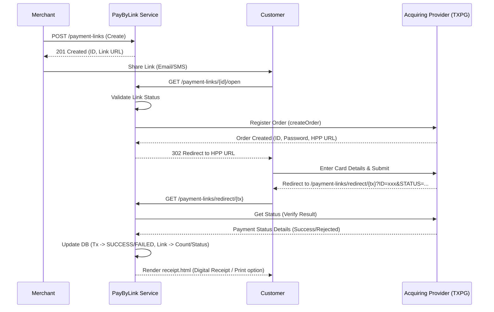

# Architecture and name: PayByLink Service

## 1. General Description and Context

-   **Reason:** Microservice for generating and managing payment links. Designed specifically for merchants without their own website or infrastructure.
-   **Technology stack:** Java Spring Boot
-   **Acquiring integration:** MilliKart - TXPG
-   **Redirection & Receipt:** Since the merchants do not have their own website, the service hosts a built-in checkout status and receipt page (`redirect.html`). Upon completion, the customer receives a digital receipt with options to print or close the browser window.

---

## 2. Endpoint List

1.  **Create Payment Link:** Generates a new payment link with specified parameters.
2.  **Update Payment Link:** Modifies parameters of an existing payment link.
3.  **Get Payment Link by ID:** Retrieves detailed information for a specific link.
4.  **List Payment Links:** Retrieves a paginated list of links for a company's terminals.
5.  **Open Payment Page:** Customer-facing endpoint. Validates the link status, initiates a transaction at the provider, and redirects the customer to the acquiring payment interface.
6.  **Redirect Landing Page:** Receives the customer back from the acquiring provider, triggers status verification, and serves the Thymeleaf-based online receipt page.
7.  **List Transactions:** Retrieves a paginated list of transactions, scoped to the caller's company (all companies for `SYSTEM_ADMIN` / `AUDITOR`).
8.  **Get Transaction Status:** Serves transaction details and real-time status (accessed publicly by the receipt page).
9.  **Complete DMS Payment:** Finalizes a Dual Message System (DMS) payment.
10. **Refund Transaction:** Processes a refund for a successful payment.
11. **Get Transaction by ID:** Reads one transaction without polling the acquirer (P3-7).
12. **Dashboard Summary:** Aggregates the caller's payments over a time window; the database does the counting (P3-7).
13. **Terminal Credentials Check:** Places a test order at the provider with a terminal's login and password and reports whether they work (since 13.09.2026, `SYSTEM_ADMIN` only).

---

## 3. DB Models (PostgreSQL + Hibernate)

*A normalized structure to support both single and multiple payment usage, transaction tracking, and terminal configurations.*

### 3.1. Table `payment_links`

Stores the configuration and metadata for the generated payment link.

-   `id` (UUID) – Primary Key
-   `version` (Long) – Optimistic-locking version
-   `provider_reference` (String) – Reference ID from the provider (corresponds to `rid`)
-   `merchant_order_id` (String) – Reference ID from the merchant side
-   `terminal_id` (Integer) – Associated merchant terminal ID (Foreign Key to `terminals.id`)
-   `amount` (Decimal) – Payment amount
-   `currency` (String) – ISO 4217 code (e.g., AZN)
-   `description` (String) – Optional description for the customer
-   `customer_name` (String) – Customer's full name
-   `customer_email` (String) – Customer's email address
-   `customer_phone` (String) – Customer's phone number
-   `payment_type` (Enum) - `SMS` (Single Message), `DMS` (Dual Message)
-   `usage_type` (Enum) - `SINGLE` (one-time use), `MULTIPLE` (reusable)
-   `max_payments` (Integer) – Allowed number of payments (for `MULTIPLE`)
-   `current_payments_count` (Integer) – How many times the link was used: payments that actually
    happened — `SUCCESS`, `REFUNDED` and `PARTIALLY_REFUNDED` together (since 24.08.2026, P2-16,
    Р-49). Rewritten with that count on every settlement; a refund changes no status out of that
    set, so it needs no write and the number never goes down
-   `status` (Enum) - `ACTIVE`, `EXPIRED`, `COMPLETED`, `CANCELED`, `SUSPENDED`. `SUSPENDED` is set
    and cleared **only** by blocking and unblocking the link's terminal in `directory` (P2-8): it
    describes the terminal, not a decision about the link, so a merchant can neither set it nor
    leave it
-   `metadata` (JSONB) – Custom key-value metadata for the merchant
-   `expires_at` (Timestamp) - When the link stops being payable. Always set for links created from 18.08.2026 on: the merchant's own value, or `created_at + pbl.link.default-ttl` (24 h) when none was given. `NULL` means "never expires" and only occurs on links created before that date
-   `created_at` (Timestamp) – Record creation timestamp
-   `updated_at` (Timestamp) – Last update timestamp

### 3.2. Table `transactions`

Records each individual payment attempt/transaction associated with a link.

-   `id` (UUID) - Primary Key
-   `link_id` (UUID) - Foreign Key referencing `payment_links.id`
-   `rid_by_merchant` (UUID) - Reference id of the payment set on the merchant side: this service generates it per payment attempt and sends it to the provider as `ridByMerchant`. The column was called `merchant_rid` until 12.09.2026 (changeset `009-rid-by-merchant.xml`) — a name that in the provider's vocabulary means the merchant, not the payment (decision Р-69)
-   `provider_order_id` (String) - Order ID returned by the acquiring provider (TXPG)
-   `provider_password` (String) - Password returned by the acquiring provider. The **only** place the order password is stored: it is never written into `provider_response` and never logged (P0-9)
-   `amount` (Decimal) - Authorized amount of this attempt; **never changed by a capture**, it is the record of what was held
-   `captured_amount` (Decimal, nullable) - What the acquirer actually cleared off the card. Below `amount` after a partial capture; stays `NULL` for SMS payments, which have no capture stage, and for holds that were never captured. This is the ceiling every refund is measured against
-   `refunded_amount` (Decimal) - Total amount refunded so far
-   `status` (Enum) - `PENDING`, `AUTHORIZED`, `SUCCESS`, `FAILED`, `REFUNDED`, `PARTIALLY_REFUNDED`
-   `provider_response` (JSONB) - Response of the provider for auditing, stored through `ProviderPayloads.withoutSecrets` — i.e. the order payload of §5.8.3 without its `password` key, plus this service's own markers (`mpStatusOutcome`, `mpProviderStatus`, `mpDeclineReason`, `mpCapture`, `mpRefunds`)
-   `created_at` (Timestamp) - Transaction creation timestamp
-   `updated_at` (Timestamp) - Last update timestamp

### 3.3. Table `terminals`

Stores acquiring credentials and company mapping.

-   `id` (Integer) - Primary Key (Terminal ID)
-   `name` (String) - Terminal name
-   `login` (String) - Acquiring login; the terminal's primary identifier on every screen
-   `password` (String) - Acquiring password, stored in plain text
-   `company_id` (String) - ID of the parent company owning this terminal
-   `status` (String) - `ACTIVE` / `BLOCKED`; a blocked terminal refuses new payments only (P2-8)

The table is owned by `directory` (see `directory.md`): this service only reads it.

---

## 4. Security & Role-Based Access Control (RBAC)

The service enforces stateless authorization using JWT Bearer tokens passed in the `Authorization` header. The token payload must contain:
-   `userId` (String)
-   `role` (String)
-   `companyId` (String)

### 4.1. Roles and Permissions Matrix

-   **SYSTEM_ADMIN**: Bypasses company matching logic. Has full access across all terminals.
-   **COMPANY_HEAD / COMPANY_MANAGER**: Access to terminals belonging to their own company (`companyId` matching). Can create/update links, complete DMS, and issue refunds.
-   **COMPANY_EMPLOYEE**: Allowed to create/update links and complete DMS payments for their company, but **refunds are forbidden** (returns `403 Forbidden`).
-   **Terminal credentials check (§5.14)**: `SYSTEM_ADMIN` only; every other role gets `403 Forbidden`.
-   **AUDITOR**: Read-only access (GET/LIST) to payment links and transactions **of all companies** — like `SYSTEM_ADMIN`, it bypasses company matching (`PaymentLinkService.isGlobalReader`, since 15.08.2026). All write actions are forbidden: the role is rejected by the allowed-roles check before company matching is ever reached.

> Roles are the `Role` enum in `common/.../security/Role.java` (since 16.08.2026, P0-4). The
> `role` JWT claim stays a string and is parsed with `Role.fromValue`, which never throws and
> matches exactly — case included. A claim value outside the five known roles means "no role" and
> every check refuses it. Allowed-role sets are `EnumSet` constants on `PaymentLinkService`:
> `READ_ROLES` (all five), `LINK_WRITE_ROLES` (create / update / DMS capture) and `REFUND_ROLES`.
>
> Fixed in the same change (P0-4): `GET /api/v1/payment-links/{id}/transactions` used to validate
> against the non-existent roles `MERCHANT_ADMIN` / `MERCHANT_USER` and returned `403 Forbidden`
> for every role except `SYSTEM_ADMIN`. It now uses `READ_ROLES` — the same permissions as reading
> the link itself.

---

## 5. API Contracts (Endpoints)

### 5.1. Create Payment Link

Creates a new payment link resource.

-   **Method:** `POST /api/v1/payment-links`
-   **Headers:**
    -   `Authorization: Bearer <token>`

**Request Body:**

```json
{
  "merchantOrderId": "ORDER-12345",
  "terminal": 123456789,
  "amount": 1500.50,
  "currency": "AZN",
  "description": "Payment for order #123456",
  "customer": {
    "fullName": "John Doe",
    "email": "test@test.com",
    "phone": "994509771884"
  },
  "paymentType": "DMS",
  "usageType": "MULTIPLE",
  "maxPayments": 25,
  "expiresAt": "2026-07-10T15:00:00Z",
  "metadata": {
    "campaign": "summer_sale"
  }
}
```

**Validation Rules:**

-   `terminal`: Required, Integer. Must be a terminal the caller's company owns **and be `ACTIVE`**:
    a blocked terminal takes no new payments (P2-8), and creating a link on one answers `400`
    naming the terminal
-   `amount`: Required, Decimal (Positive, > 0)
-   `currency`: Required, String (ISO 4217, 3 letters, e.g., "AZN")
-   `paymentType`: Required, Enum (`SMS`, `DMS`)
-   `usageType`: Required, Enum (`SINGLE`, `MULTIPLE`)
-   `maxPayments`: Required if `usageType` is `MULTIPLE`, Integer (> 0)
-   `customer.email`: Optional, valid email format
-   `customer.phone`: Optional, valid phone format
-   `expiresAt`: Optional, ISO-8601 instant. Omitted, the link gets the configured default lifetime (`pbl.link.default-ttl`, **24 hours**) — links are never created without an expiry. Supplied, it must be in the future and no later than `pbl.link.max-ttl` (**90 days**) from the moment the link is created; either violation is a `400` naming the ceiling

### 5.1.1. Link Lifetime

| Case | Resulting `expiresAt` |
|:---|:---|
| Field omitted | creation time + `pbl.link.default-ttl` (24 h by default) |
| Field supplied and valid | exactly the value supplied |
| Field in the past or equal to now | `400 expiresAt must be in the future`, nothing is created |
| Field beyond the ceiling | `400` naming the latest date allowed; the ceiling is `pbl.link.max-ttl` (90 days by default) |

The ceiling is measured **from the link's own creation time**, both on create and on every later
`PATCH`. Measuring it from the moment of the request would let a merchant push the expiry another
90 days forward with each `PATCH`, and the cap would bound nothing.

An `ACTIVE` link whose expiry has passed is moved to `EXPIRED` by `PaymentLinkScheduler` (every
5 minutes); opening it answers `403 Payment link has expired` whether or not the sweep has run yet.

Configuration: `pbl.link.default-ttl` (`PBL_LINK_DEFAULT_TTL`, default `PT24H`) and
`pbl.link.max-ttl` (`PBL_LINK_MAX_TTL`, default `P90D`), both ISO-8601 durations.

**Response:**

-   **Status Code:** `201 Created`
-   **Body:**

```json
{
  "id": "550e8400-e29b-41d4-a716-446655440000",
  "rid": "RID-987654321",
  "merchantOrderId": "ORDER-12345",
  "terminal": 123456789,
  "amount": 1500.50,
  "currency": "AZN",
  "description": "Payment for order #123456",
  "customer": {
    "fullName": "John Doe",
    "email": "test@test.com",
    "phone": "994509771884"
  },
  "paymentType": "DMS",
  "usageType": "MULTIPLE",
  "maxPayments": 25,
  "currentPaymentsCount": 0,
  "refundedPaymentsCount": 0,
  "status": "ACTIVE",
  "link": "http://localhost:8080/api/v1/payment-links/550e8400-e29b-41d4-a716-446655440000/open",
  "metadata": {
    "campaign": "summer_sale"
  },
  "expiresAt": "2026-07-10T15:00:00Z",
  "lastPaidAt": "2026-07-08T09:41:00Z",
  "createdAt": "2026-07-07T13:14:00Z"
}
```

-   `lastPaidAt` (since 22.08.2026, P2-15): when this link was last paid. **Omitted entirely when
    the link has never been paid** — this response is serialized without nulls, so absence is the
    "never paid" signal, not a `null` value. A multi-use link has many payments and this is the
    newest of them, which is why the field is not called `paidAt`.

    A refunded payment still counts. A refund rewrites the status of the payment row itself to
    `REFUNDED` or `PARTIALLY_REFUNDED` and creates no second row, so a link whose only payment was
    refunded still reports the date that payment happened — the money was paid and then given back,
    and giving it back does not unmake the payment. An `AUTHORIZED` DMS hold, by contrast, is not a
    payment and does not set this field; capturing it does.

-   `currentPaymentsCount` (meaning changed 24.08.2026, P2-16, Р-49): **how many times the link was
    used** — payments that actually happened, i.e. `SUCCESS`, `REFUNDED` and `PARTIALLY_REFUNDED`
    together, the same three statuses `lastPaidAt` is found by. A refund — full or partial — does
    not lower this number and does not free a usage slot: a link allowed 3 payments takes 3 over
    its lifetime, whether any of them were later refunded or not. The field name predates that rule
    and stays for compatibility. (Before P2-16 the field counted only `SUCCESS`, so it *dropped*
    after a refund and the freed slot let the link collect one payment more than allowed.)

-   `refundedPaymentsCount` (since 24.08.2026, P2-16, Р-50): how many of those payments were
    refunded, **fully or partially** — `REFUNDED` + `PARTIALLY_REFUNDED`. Never exceeds
    `currentPaymentsCount`; `0` when nothing was refunded. Present on the single-link endpoints
    only (create/get/update/complete): the list rows deliberately carry neither counter — see §5.4.

### 5.2. Update Payment Link

Partially updates an existing payment link. Only fields provided in the request will be modified.

-   **Method:** `PATCH /api/v1/payment-links/{id}`
-   **Headers:**
    -   `Authorization: Bearer <token>`

**Request Body:**

```json
{
  "amount": 1600.00,
  "description": "Updated description",
  "customer": {
    "fullName": "John Doe",
    "email": "new-email@test.com"
  },
  "expiresAt": "2026-07-10T15:00:00Z",
  "status": "CANCELED"
}
```

`expiresAt` obeys the same two bounds as on create (see 5.1.1): it must be in the future, and it
must not be later than `pbl.link.max-ttl` from the link's **`created_at`** — not from the moment of
the `PATCH`, which is what keeps a chain of updates from extending a link forever. Either violation
is a `400` and nothing else in the request is applied.

Three further refusals guard what an edit may do to a link that has already been out in the world.
Each is a `400` that leaves the link completely untouched:

-   **`amount` is frozen once the link carries an attempt** in `PENDING`, `AUTHORIZED`, `SUCCESS`,
    `PARTIALLY_REFUNDED` or `REFUNDED`. Only `FAILED` attempts leave it editable. A payer standing
    on the payment page must not have the price change under them, and on a multi-use link the
    transactions must stay reconcilable against the link they were made on — create a new link
    instead. Sending the amount the link already has is not an edit and is always accepted, so a
    client that `PATCH`es the whole form back does not need to strip the field.
-   **`status` follows a fixed table:** `ACTIVE → CANCELED`, `EXPIRED → CANCELED` and
    `CANCELED → ACTIVE`. Nothing else is accepted — in particular an `EXPIRED` or `COMPLETED` link
    is never brought back to `ACTIVE`, or the expiry and the usage limit could be undone by a single
    request. `COMPLETED` does not leave its state at all. `SUSPENDED` is neither reachable nor
    leavable here (P2-8): setting it answers `400` saying the status comes from blocking the
    terminal, and a suspended link answers `400` naming the terminal to unblock — the link is not
    what needs changing. Re-sending the status the link already
    has is a no-op, not an error. Un-cancelling additionally requires the link's expiry to be in the
    future; when it is not, send a new `expiresAt` in the same request — it is applied before the
    status, so one `PATCH` carrying both succeeds.
-   **`maxPayments` may not go below the number of times the link was used** — and a refunded
    payment still counts as a use (P2-16, Р-49), so refunding a payment does not make room to lower
    the limit. Equal is allowed, and is the way to close a link off at what it has collected.

**Response:**

-   **Status Code:** `200 OK`
-   **Body:** (Same structure as Create Link response)

### 5.3. Get Payment Link by ID

-   **Method:** `GET /api/v1/payment-links/{id}`
-   **Headers:**
    -   `Authorization: Bearer <token>`

**Response:**

-   **Status Code:** `200 OK`
-   **Body:** (Same structure as Create Link response)

### 5.4. List Payment Links

Retrieves a paginated list of links. Automatic company boundaries are enforced for non-admin requests based on the user's `companyId`.

-   **Method:** `GET /api/v1/payment-links`
-   **Headers:**
    -   `Authorization: Bearer <token>`
-   **Query Parameters:**
    -   `page`: Integer (default 0)
    -   `size`: Integer (default 20)
    -   `terminal`: Integer (optional filter)
    -   `status`: String (optional filter)

**Response:**

-   **Status Code:** `200 OK`
-   **Body:**

```json
{
  "content": [
    {
      "id": "550e8400-e29b-41d4-a716-446655440000",
      "status": "COMPLETED",
      "amount": 1500.50,
      "currency": "AZN",
      "terminal": 123456789,
      "expiresAt": "2026-07-10T15:00:00Z",
      "lastPaidAt": "2026-07-08T09:41:00Z",
      "createdAt": "2026-07-07T13:14:00Z"
    }
  ],
  "totalElements": 1,
  "totalPages": 1,
  "size": 20,
  "number": 0
}
```

-   `terminal` (since 11.09.2026) is the terminal id taken from the link row itself, so a list row can
    be labelled with its terminal without a second request; the UI resolves the login through
    `GET /api/v1/terminals/options`.
-   `lastPaidAt` (since 22.08.2026, P2-15) means the same here as on the single link and carries the
    same value; in this response it is `null` rather than omitted when the link was never paid.
    The whole page is resolved with one grouped query over the transactions of its links, so the
    field costs one query per page and never one per row.
-   `currentPaymentsCount` and `refundedPaymentsCount` are **deliberately absent** from list rows
    (P2-16): the page is built without touching the transaction table, and a counter per row would
    put a count query behind every line of every listing. Read the single link for the counters.

### 5.5. Open Payment Page

-   **Method:** `GET /api/v1/payment-links/{id}/open`
-   **Description:** Customer-facing public endpoint. Validates the link status, initiates an order with the acquiring provider, and redirects the customer to the HPP page.
-   **Note (P1-5 / P1-6, 17.08.2026):** the whole operation runs in a single transaction that starts
    by locking the link row (`SELECT … FOR UPDATE`), so two simultaneous opens of the same link can
    no longer register two orders at the acquirer. An `AUTHORIZED` transaction — money held on the
    card — is never marked `FAILED` on reopen and occupies a usage slot, because there is no Void
    operation to release the hold with.
-   **Response:** `302 Found` (Redirects to provider HPP), `403 Forbidden` (link is
    EXPIRED/CANCELED/COMPLETED/SUSPENDED, its terminal is blocked, already paid, or held by an
    authorized payment awaiting capture),
    or `409 Conflict` (another open of the same link is in flight — the duplicate click is refused
    instead of getting a second live order).

### 5.6. Redirect Landing Page

-   **Method:** `GET /api/v1/payment-links/redirect/{tx}`
-   **Path Parameters:**
    -   `tx`: Unique tracking transaction UUID
-   **Query Parameters:**
    -   `ID`: Provider Order ID
    -   `PASSWORD`: Provider Order Password
    -   `STATUS`: Provider Order Status
-   **Description:** Customer-facing public landing endpoint. Immediately triggers background status verification and serves the Thymeleaf-based payment result/receipt page.

### 5.7. List Transactions

-   **Method:** `GET /api/v1/transactions`
-   **Headers:**
    -   `Authorization: Bearer <token>`
-   **Query Parameters:**
    -   `page`: Integer (default `0`)
    -   `size`: Integer (default `20`)
-   **Description:** Paginated listing of transactions, scoped by the caller's role.
    `SYSTEM_ADMIN` and `AUDITOR` see every company; the other roles see only transactions whose
    payment link points at a terminal of their own company. A caller whose role is outside the five
    known roles gets `403 Forbidden`; a caller with a known role but no `companyId` (or a company
    without terminals) gets `200 OK` with an empty page.
-   **Ordering (P3-7):** `createdAt DESC, id DESC` — newest first. Until P3-7 no sort was applied at
    all and the database returned rows in whatever order it liked, which made "the latest payments"
    on any screen simply "some payments". The `id` tie-breaker is there for the reason given in P2-1:
    two payments can share a `createdAt` millisecond, and without a unique tail such a row lands on
    two adjacent pages or on neither.
-   **Note:** No server-side filters (terminal, status, date range) — the frontend loads a page and
    filters client-side. `size` is **not** clamped here — a known limitation, `AGENTS.md` §10.

**Response:**

-   **Status Code:** `200 OK`
-   **Body:** `PagedResponse<TransactionResponse>` — same envelope as §5.4 (`content`, `totalElements`,
    `totalPages`, `size`, `number`), with the transaction payload shown in §5.8.

### 5.8. Get Transaction Status

-   **Method:** `GET /api/v1/transactions/{identifier}/status`
-   **Headers:**
    -   `Authorization: Bearer <token>`
-   **Description:** Merchant-only endpoint. Polls the provider once for the current status of the
    transaction and persists the result. `identifier` is either the transaction UUID or the
    `providerOrderId`. The caller must hold a read role (`SYSTEM_ADMIN`, `COMPANY_HEAD`,
    `COMPANY_MANAGER`, `COMPANY_EMPLOYEE`, `AUDITOR`) and — unless they are `SYSTEM_ADMIN` or
    `AUDITOR` — belong to the company that owns the transaction's terminal, otherwise `403`.
-   **Note:** Until 15.08.2026 this endpoint was public and the payer's receipt page polled it from
    the browser (blocker P0-2). The receipt page is now rendered server-side; do not reopen it.

**Response:**

-   **Status Code:** `200 OK`
-   **Body:**

```json
{
  "id": "550e8400-e29b-41d4-a716-446655440001",
  "paymentLinkId": "550e8400-e29b-41d4-a716-446655440000",
  "status": "PARTIALLY_REFUNDED",
  "amount": 1500.50,
  "capturedAmount": null,
  "refundedAmount": 500.00,
  "currency": "AZN",
  "description": "Payment for order #123456",
  "merchantOrderId": "ORDER-12345",
  "paymentType": "SMS",
  "terminalId": 123456789,
  "ridByMerchant": "7d1c1a0e-3f0b-4a55-9a63-2b1f0e7c9d11",
  "cardNumberMasked": "426863******3689",
  "rrn": "629677123123123123",
  "approvalCode": "629677",
  "createdAt": "2026-07-07T13:15:00Z",
  "customerName": "John Doe",
  "customerEmail": "test@test.com",
  "customerPhone": "994509771884",
  "clientIp": "203.0.113.7",
  "userAgent": "Mozilla/5.0 …",
  "providerOrderId": "1234567",
  "statusHistory": [
    { "at": "2026-07-07T13:15:00Z", "type": "CREATED", "status": "PENDING", "amount": null, "acquirerReference": null },
    { "at": "2026-07-09T08:02:44Z", "type": "REFUNDED", "status": "PARTIALLY_REFUNDED", "amount": 500.00, "acquirerReference": "845120993" }
  ],
  "failureReason": null
}
```

`ridByMerchant` (since 12.09.2026, Р-69) is this service's reference id of the payment, the value sent
to the provider as `ridByMerchant`; `providerOrderId` is the provider's order number. The UI shows
these two first and the internal `id` second (Р-58).

`statusHistory` (since 11.09.2026, Р-63) holds only what was recorded, oldest first: `CREATED` at
`createdAt`; `CAPTURED` at the capture mark (`mpCapture.at`) with the captured amount; one
`REFUNDED` per refund (`mpRefunds[i].at`) with its amount and `acquirerReference` (`ridByPmo`);
`STATUS` at `updatedAt` last, and only when the current status is not explained by the events above
(an SMS payment that became `SUCCESS`, a hold that became `AUTHORIZED`). `status` is the state
**after** the event. Events without a recorded time are dropped; nothing is made up.

`failureReason` (P1-8b) is the acquirer's own decline description for a `FAILED` transaction —
`custAttrs` `DeclineDescription`, else `PmoDeclineDescription`, else `PmoResultCode`
(`TXPG-client-side-integration.md` §5.8.7); `null` for every other status and when the acquirer gave
no reason. It is read once, at the status poll that ended the payment, and stored in
`provider_response` under `mpDeclineReason`.

`cardNumberMasked`, `rrn`, `approvalCode` (P1-16) are read on the fly out of the stored
`provider_response` by `ProviderOrderDetails` — the masked card is `order.srcToken.displayName`
(§5.8.4, returned verbatim; the frontend derives the last four digits), the RRN and the approval
code come from the **purchase** record of `order.trans[]` (§5.8.5–5.8.6; `order.lastTran` when the
list is absent, §5.8.3) — not a reversal (`isReversal`, `Purchase - Void`) and not a `Refund`,
the earliest by `regTime`. Any of the three is `null` while the order has no card operation yet
(`PENDING`), after a decline, or when the acquirer did not send the field. The same values appear
in every row of §5.7, so the list and the card always agree.

### 5.9. Complete DMS Payment

-   **Method:** `POST /api/v1/transactions/{transactionId}/complete`
-   **Headers:**
    -   `Authorization: Bearer <token>`

**Request Body:**

```json
{
  "amount": 1500.50
}
```

**Partial capture** is supported (P0-8, 17.08.2026): `amount` may be lower than the authorized
amount, and that lower figure is what the acquirer clears. It is stored in `captured_amount` while
the transaction's `amount` keeps the authorized figure, and every later refund of this transaction is
capped by `captured_amount`, not by `amount`. A partial capture still ends as `SUCCESS` — there is no
separate status for it, and the unused part of the hold is not voided at the provider.

`400 Bad Request` is returned when `amount` is above the authorized amount
(`Capture amount exceeds the authorized amount`) or carries more than two decimal places — money is
never rounded silently on its way to the gateway. Zero and negative amounts are rejected by
validation on the request itself.

**Response:**

-   **Status Code:** `200 OK`
-   **Body:** (Same structure as Create Link response)

### 5.10. Refund Transaction

-   **Method:** `POST /api/v1/transactions/{transactionId}/refund`
-   **Headers:**
    -   `Authorization: Bearer <token>`

**Request Body:**

```json
{
  "amount": 100.00,
  "reason": "Customer request"
}
```

### 5.11. Get Payment Link Transactions

-   **Method:** `GET /api/v1/payment-links/{id}/transactions`
-   **Headers:**
    -   `Authorization: Bearer <token>`
-   **Description:** Returns all transaction attempts associated with the payment link (including `clientIp`, `userAgent`, and statuses `SUCCESS`, `PENDING`, `AUTHORIZED`, `FAILED`).
  "amount": 500.00,
  "reason": "Customer request"
}
```

**Response:**

-   **Status Code:** `200 OK`
-   **Body:**

```json
{
  "transactionId": "550e8400-e29b-41d4-a716-446655440001",
  "status": "PARTIALLY_REFUNDED",
  "amount": 500.00,
  "refundId": "220613-09172925-000hbr=",
  "acquirerReference": "220613334596244733",
  "approvalCode": "340775"
}
```

The refund ceiling is the **captured** amount, not the authorized one: `captured_amount` when a DMS
capture happened, and `amount` when it did not (every SMS payment). Exceeding it gives `400` with
`Refund amount exceeds the captured amount of the transaction`, and refunding exactly the captured
amount moves the transaction to `REFUNDED` rather than `PARTIALLY_REFUNDED` (P0-8, 17.08.2026).

The three identifiers are the acquirer's own, taken from its `exec-tran` response
(`TXPG-client-side-integration.md` §5.7); none of them is ever generated locally (P0-7, P1-8b):

-   `acquirerReference` — `tran.match.ridByPmo`, the refund's id in the processing-centre core. This
    is the reference that matters in a dispute, and it is **never `null` on a `200`**: a refund the
    acquirer did not confirm with it is not reported as successful at all (see `502` below).
-   `refundId` — `tran.match.tranActionId`, the refund's id in the acquirer's e-commerce module. May
    be `null`.
-   `approvalCode` — `tran.approvalCode`. May be `null`.

Every confirmed refund is also recorded in the transaction's `provider_response` under `mpRefunds`
(a list — partial refunds accumulate), each entry carrying the same three identifiers plus the
`amount` and the time it was recorded (`at`). A confirmed DMS capture leaves the same record under
`mpCapture`.

**A refund does not reopen the link** (P2-16, Р-49). The payment stays a use of the link:
`currentPaymentsCount` does not drop, the usage slot stays taken, and a `COMPLETED` link stays
`COMPLETED` — a refund gives the money back, it does not hand out a fresh payment attempt. What it
does change on the link card is `refundedPaymentsCount` (Р-50).

```json
{
  "transactionId": "550e8400-e29b-41d4-a716-446655440001",
  "status": "PARTIALLY_REFUNDED",
  "amount": 500.00,
  "refundId": null,
  "acquirerReference": "220613334596244733",
  "approvalCode": null
}
```

---

### 5.12. Get Transaction by ID

-   **Method:** `GET /api/v1/transactions/{id}`
-   **Headers:**
    -   `Authorization: Bearer <token>`
-   **Description (P3-7):** Reads a single transaction. Plain read — **the acquirer is not polled**;
    for a fresh outcome use `GET /transactions/{id}/status` (§5.8), which does poll. Access is the
    same gate as reading the link the transaction belongs to: role in `READ_ROLES` plus the company
    of the link's terminal, with `SYSTEM_ADMIN` and `AUDITOR` reading globally.
-   **Note:** This endpoint did not exist before P3-7, although the frontend already called it. The
    transaction card could only be opened from data the list had put into router state, which is why
    the dashboard used to fabricate a status history to hand over. It no longer does.

**Response:**

-   **Status Code:** `200 OK`
-   **Body:** `TransactionResponse` — the payload shown in §5.8.
-   **Errors:** `403 Forbidden` (another company's transaction), `404 Not Found` (no such id).

### 5.13. Dashboard Summary

-   **Method:** `GET /api/v1/dashboard/summary`
-   **Headers:**
    -   `Authorization: Bearer <token>`
-   **Query Parameters:**
    -   `from`: ISO-8601 instant, optional (e.g. `2026-08-18T00:00:00Z`)
    -   `to`: ISO-8601 instant, optional
-   **Description (P3-7):** Everything the merchant dashboard shows, counted **in the database**.
    Defaults to seven whole calendar days ending today, in the report time zone. Access is the same
    gate as §5.7, including its treatment of a caller without a company: `200 OK` with zeros, not
    `403`. No audit record is written — §5.7 writes none either, and these are the same rows.
-   **Refusals:**
    -   `400 Bad Request` — `from` is after `to`.
    -   `400 Bad Request` — the window exceeds **92 days**. A refusal, not a silent clamp: returning
        a window nobody asked for is how a dashboard ends up showing a number for the wrong period
        and calling it real.
-   **Time zone:** days and hours are cut in `pbl.dashboard.zone` (default `Asia/Baku`, override
    `PBL_DASHBOARD_ZONE`), **not** UTC — in UTC every payment after 20:00 local falls into the next
    day and the merchant's "today" stops being the merchant's day. The zone is echoed in the
    response so the UI labels it from the answer rather than from a constant of its own. The
    database performs no time-zone arithmetic at all: it groups rows no coarser than an hour, and
    the day and hour of each bucket are resolved from its earliest instant. That keeps the answer
    identical on PostgreSQL and on the H2 the tests run against, which store timestamps
    differently. The only assumption is a whole-hour offset.
-   **Money:** every amount is **per currency**; there is no grand total across currencies.
    `transactions` has no `currency` column — it lives on `payment_links`, and
    `CreatePaymentLinkRequest` accepts any three-letter ISO code, so a single figure spanning
    currencies would be a number that does not exist. `paidAmount` sums
    `COALESCE(captured_amount, amount)` over `TransactionStatus.PAID_STATUSES`
    (`SUCCESS`, `REFUNDED`, `PARTIALLY_REFUNDED`): `amount` stays the *authorised* figure after a
    partial capture, and a refunded payment did receive money — it should shrink by the refund, not
    vanish from revenue. `netAmount = paidAmount - refundedAmount`.
-   **Empty buckets are present:** all six `TransactionStatus` values, all 24 hours, and every
    calendar day of the window, zeros included. A missing day reads as "no data"; a zero day reads
    as "nobody paid", and only the second one is true.

**Response:**

-   **Status Code:** `200 OK`
-   **Body:**

```json
{
  "window": { "from": "2026-08-18T00:00:00Z", "to": "2026-08-24T19:00:00Z", "zone": "Asia/Baku" },
  "totals": [
    { "currency": "AZN", "transactionCount": 412, "paidCount": 300, "failedCount": 90,
      "pendingCount": 22, "refundedCount": 18, "paidAmount": 48210.55,
      "refundedAmount": 1200.00, "netAmount": 47010.55, "averagePaidAmount": 160.70 }
  ],
  "statusBreakdown": [ { "status": "PENDING", "count": 4 } ],
  "dailyTotals": [ { "date": "2026-08-18", "currency": "AZN", "netAmount": 5120.00, "transactionCount": 41 } ],
  "hourlyTotals": [ { "hour": 0, "transactionCount": 3 } ],
  "topTerminals": [ { "currency": "AZN", "terminalId": 1, "terminalLogin": "main_ecom",
                      "terminalName": "Main e-commerce", "netAmount": 31000.00, "transactionCount": 190 } ],
  "paymentLinks": {
    "total": 57,
    "byPaymentType": [ { "paymentType": "SMS", "count": 40 } ],
    "byUsageType": [ { "usageType": "SINGLE", "count": 50 } ],
    "byStatus": [ { "status": "ACTIVE", "count": 12 } ]
  }
}
```

-   `topTerminals` is the top five **per currency**; "the top five by amount" across currencies
    would be comparing manats with euros. `terminalLogin` (since 11.09.2026) is what the merchant
    recognises the terminal by; the UI shows it first and the name under it. Both are `null` when the
    terminal is gone — no invented prefix and no placeholder name.

### 5.14. Terminal Credentials Check

-   **Methods:**
    -   `POST /api/v1/acquiring/terminal-checks` — check a login and password that are not saved yet
        (the terminal creation form). Body: `{"login": "term_login", "password": "term_password"}`,
        both required (`400` when blank).
    -   `POST /api/v1/acquiring/terminal-checks/{terminalId}` — check a saved terminal with the
        credentials stored for it; they never travel through the browser. No body. `404` when there is
        no such terminal.
-   **Headers:**
    -   `Authorization: Bearer <token>`
-   **Access:** `SYSTEM_ADMIN` only. Any other role gets `403 Forbidden`, the refusal is written to the
    audit journal, and no order reaches the provider.
-   **Description (since 13.09.2026, decision Р-70):** the only provider request that proves both that
    the login and password are right and that the terminal may take payments is creating an order, so
    the check places a real `Order_SMS` for 1.00 AZN with the terminal's credentials. It is never paid:
    the provider expires it after ten minutes, and the statement only takes completed orders (Р-71).
    The provider agreed to this load. Lives in `pbl`, not next to the other terminal endpoints, because
    only `pbl` talks to the provider while `/api/v1/terminals` is routed to `directory`.
-   **No retries and no circuit breaker**, unlike the production order path: a retry only multiplies
    test orders, and a breaker shared with payments would let repeated checks shut payments down.

**Response:**

-   **Status Code:** `200 OK` for every outcome — the outcome is the answer, not an error.
-   **Body:**

```json
{ "outcome": "INVALID_CREDENTIALS", "providerErrorCode": "InvalidLogin", "message": "Invalid login or password" }
```

| `outcome` | When | Meaning for the administrator |
|:---|:---|:---|
| `OK` | the provider created the order (no `errorCode`) | credentials accepted, payments allowed |
| `INVALID_CREDENTIALS` | `errorCode` = `InvalidLogin`, in a 200 or a 4xx body | wrong login or password |
| `REJECTED` | any other `errorCode` | credentials accepted, but the provider refused the order; its text is passed on |
| `UNREACHABLE` | 5xx, timeout, no or empty answer | nothing is known about the terminal |

The outcome is classified by the code in the body, not by the HTTP status. Every check is written to
the audit journal as `TERMINAL` / `READ` with its outcome (entity id `NEW` for an unsaved terminal);
the password is never logged or recorded.

---

## 6. Error Handling

Standard HTTP status codes are used:

-   `400 Bad Request`: Validation error or business logic violation.
-   `401 Unauthorized`: Missing or invalid authentication token.
-   `403 Forbidden`: Access denied or resource in invalid state for action.
-   `404 Not Found`: The requested resource does not exist.
-   `409 Conflict`: Request conflict (e.g., duplicate Idempotency-Key with different parameters).
-   `500 Internal Server Error`: Unexpected server-side error.
-   `502 Bad Gateway`: **the outcome of a money movement is unknown.** Returned by
    `POST /transactions/{id}/complete` and `POST /transactions/{id}/refund` when the acquirer did
    not confirm the operation — a read timeout, a dropped connection, a 5xx, or a `200` whose body
    carries no `tran.match.ridByPmo` (P1-8b: "no error" is not "done"; the contract's success marker
    is the processing-centre id, and without it nothing is known). The operation may
    have executed. The transaction is left exactly as it was, nothing is recorded locally, and the
    request **must not be repeated blindly**: check the transaction status first
    (`GET /transactions/{id}/status`). A `400` on these endpoints means the opposite — the acquirer
    looked at the request and refused it, so nothing moved and a retry is safe.

Repeat captures are refused: a transaction already in `SUCCESS` returns
`400 Transaction has already been captured`. A `PENDING` transaction is not refused outright —
the acquirer is polled once first, and the capture proceeds if it reports the payment authorized.

---

## 7. Payment Flow Diagram

The following diagram illustrates the typical lifecycle of a payment link using the built-in receipt landing page.

