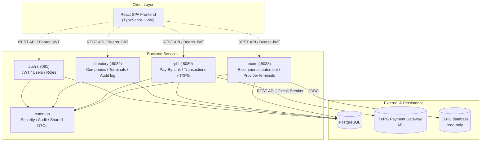

# 📑 ТЕХНИЧЕСКИЙ ПАСПОРТ СИСТЕМЫ
## Приложение к Акту приёма-передачи ПО «Merchant Portal (MP)»

> Сверено с кодом 13.09.2026.

| Параметр | Значение |
| :--- | :--- |
| **Наименование проекта** | Merchant Portal (MP) |
| **Назначение** | Личный кабинет мерчанта: платёжные ссылки (Pay-By-Link), компании и терминалы, учётные записи и роли, журнал аудита, выписка по онлайн-эквайрингу |
| **Архитектурный тип** | Четыре сервиса на Spring Boot и общая библиотека в одном Gradle-репозитории, общая база данных, React SPA |
| **Версия сборки** | 0.0.1-SNAPSHOT |
| **Язык разработки / Фреймворки** | Java 21 (LTS), Spring Boot 3.2.5, React 18, TypeScript 7, Vite 6 |

---

## 1. Назначение и краткое резюме проекта

**Merchant Portal (MP)** — веб-портал для мерчантов MilliKart:

1. **Вход и ролевой доступ.** Пять ролей; пользователь компании видит только данные своей компании.
2. **Компании и терминалы.** Справочник компаний; эквайринговые терминалы с проверкой учётных данных
   у провайдера и сверкой статусов с ним.
3. **Pay-By-Link.** Одноразовые и многоразовые платёжные ссылки со сроком жизни, QR-кодом и
   страницей возврата плательщика.
4. **Операции.** Одностадийные (SMS) и двухстадийные (DMS) платежи: списание холда, в том числе
   частичное, полные и частичные возвраты, проверка статуса у платёжного шлюза.
5. **Аналитика и аудит.** Сводка на главной странице по данным базы; журнал аудита действий
   пользователей и системы во всех сервисах.
6. **E-commerce.** Выписка по платежам мерчантов с собственным онлайн-эквайрингом — из базы
   провайдера (в работе, см. §4.6).

---

## 2. Архитектура и структура модулей

### 2.1. Схема взаимодействия

### 2.2. Назначение модулей

1. **`common`** — общая библиотека: проверка JWT и Spring Security, журнал аудита, единая обработка
   ошибок, общие DTO, поиск по спискам.
2. **`auth`** (порт 8081) — вход, обновление и отзыв токенов (access и refresh), учётные записи и роли,
   хеширование паролей (BCrypt), блокировка после неудачных попыток и лимит попыток входа по адресу.
3. **`directory`** (порт 8082) — компании и терминалы, чтение журнала аудита, сверка статусов
   терминалов с провайдером. Кэширования справочников нет.
4. **`pbl`** (порт 8080) — платёжные ссылки и операции, сводка главной страницы, интеграция со
   шлюзом TXPG. Circuit breaker (Resilience4j) стоит на вызовах шлюза; автоматические повторы — только
   на создании заказа и запросе статуса: списание и возврат автоматически не повторяются. Здесь же
   проверка учётных данных терминала.
5. **`ecom`** (порт 8083) — выписка по онлайн-эквайрингу и справочник терминалов провайдера из базы
   шлюза, только чтение.
6. **`frontend`** (порт 3000 при разработке, nginx в эксплуатации) — React 18, TypeScript, Material UI 7.

---

## 3. Технологический стек (Tech Stack)

### Бэкенд-инфраструктура
| Технология | Версия | Назначение |
| :--- | :--- | :--- |
| **Java** | 21 (LTS) | Язык программирования |
| **Spring Boot** | 3.2.5 | Каркас приложения |
| **Spring Security** | 6.x | Авторизация и фильтры безопасности |
| **Spring Data JPA** | 3.x | ORM и работа с базой данных |
| **Liquibase** | из Spring Boot | Версионирование и миграция схемы БД |
| **JJWT** | 0.11.5 | Выпуск и проверка JWT |
| **Resilience4j** | 2.2.0 | Circuit breaker и повторы вызовов шлюза (сервис `pbl`) |
| **Caffeine** | 3.1.8 | Счётчики лимита попыток входа в памяти |
| **SpringDoc OpenAPI** | 2.5.0 | Swagger UI документация API |
| **Oracle JDBC** | 23.4 | Чтение базы шлюза (сервис `ecom`) |
| **Testcontainers** | 1.20.6 | Интеграционные тесты на PostgreSQL |
| **Gradle** | 8.5 | Система сборки |

### Фронтенд-инфраструктура
| Технология | Версия | Назначение |
| :--- | :--- | :--- |
| **React** | 18.3.1 | UI-библиотека |
| **TypeScript** | 7.0.2 | Типизация кода |
| **Vite** | 6.3.5 | Сборка и dev-сервер |
| **MUI (Material UI)** | 7.3.5 | UI-компоненты |
| **React Router** | 7.13.0 | Маршрутизация на стороне клиента |
| **Axios** | 1.x | HTTP-клиент с обновлением токена |
| **Recharts** | 2.15.2 | Графики |
| **xlsx** | 0.18.5 | Выгрузка в Excel |

### СУБД и среда выполнения
- **PostgreSQL 16** — одна база данных на все сервисы.
- **Oracle** — база платёжного шлюза TXPG, сервис `ecom` читает её без права записи.
- **Nginx** — раздача фронтенда и reverse proxy к сервисам.

---

## 4. Сводка реализованной функциональности

### 4.1. Авторизация и защита данных
- Вход по логину и паролю; access-токен JWT живёт 15 минут, refresh-токен обновляется с ротацией;
  выход и отзыв сессий при блокировке или удалении учётной записи.
- Ролевая модель доступа:
  - `SYSTEM_ADMIN` — системный администратор: все компании, терминалы и пользователи; единственный,
    кто видит и меняет пароль терминала, проверяет терминал у провайдера и обновляет справочник
    терминалов провайдера.
  - `COMPANY_HEAD` — руководитель компании: пользователи, терминалы, платёжные ссылки, операции
    (включая возвраты) и журнал аудита своей компании.
  - `COMPANY_MANAGER` — менеджер: терминалы, платёжные ссылки, операции (включая возвраты) и журнал
    аудита своей компании.
  - `COMPANY_EMPLOYEE` — сотрудник: платёжные ссылки и операции своей компании, списание холда;
    без возвратов и без изменения терминалов.
  - `AUDITOR` — аудитор: чтение данных всех компаний и журнала аудита, без изменений.
- Изоляция данных компаний: пользователь компании видит только её терминалы, ссылки, операции и выписку.
- Учётная запись блокируется на 30 минут после 6 неудачных попыток входа (PCI-DSS 8.3.4); с одного
  адреса — не более 10 неудачных попыток за 15 минут.
- Пароли пользователей хранятся как хеш BCrypt, политика сложности — по PCI-DSS v4.0.

### 4.2. Управление компаниями и терминалами
- Компании: создание, изменение, смена статуса и мягкое удаление — только системный администратор.
- Эквайринговые терминалы компании. **Основной параметр терминала — его логин у провайдера**
  (с 11.09.2026): им терминал подписан на всех экранах платежей, название идёт пояснением.
- **Пароль терминала видит и меняет только системный администратор** (с 11.09.2026). Во всех
  списках и карточках пароль скрыт, настоящий показывается по отдельному запросу, и каждый показ
  фиксируется в журнале аудита; попытка сменить пароль другой ролью отклоняется.
- **Проверка терминала у провайдера** — кнопка «Тест» (с 13.09.2026), доступна системному
  администратору и для заведённого терминала, и в форме заведения до сохранения. Пробный заказ на
  1 AZN проверяет, что логин и пароль верны и что терминалу разрешены оплаты. Исходов четыре:
  данные приняты; неверный логин или пароль; данные приняты, но провайдер отказал в заказе
  (с его пояснением); провайдер не ответил. Пробный заказ не оплачивается и через 10 минут
  истекает у провайдера; в выписку он не попадает.
- **Статусы терминалов сверяются с провайдером** (с 12.09.2026). Каждые 15 минут система обновляет
  справочник терминалов провайдера и выключает у себя терминал, снятый провайдером с
  обслуживания (после трёх проверок подряд), вместе с приостановкой его ссылок; когда провайдер
  возвращает терминал, он включается обратно. Терминал, выключенный вручную, сверка не трогает, а
  выключенный сверкой нельзя включить вручную. Сбой или пустой ответ провайдера статусы не меняет.
- **Вывод терминала из работы — блокировка, а не удаление** (с 21.08.2026): у терминала есть
  статус `ACTIVE` / `BLOCKED`. Блокировка запрещает только новые платежи (создание ссылок и их
  открытие плательщиком) и приостанавливает активные ссылки терминала; возвраты, списание холдов
  DMS и проверка статуса по уже прошедшим платежам продолжают работать. Разблокировка возвращает
  ссылки в работу, кроме тех, у которых за это время истёк срок. Удаление терминала недоступно:
  на терминал ссылаются проведённые платежи. Ручная блокировка действует в портале — в MilliKart
  терминал остаётся включённым.
- **Статусная модель:** терминал — `ACTIVE` / `BLOCKED` (`TerminalStatus`), компания — `ACTIVE` /
  `INACTIVE` плюс `DELETED` как признак мягкого удаления. Статуса `Pending` в системе нет.
- **Статус компании ничего не останавливает** (уточнено 24.08.2026). В отличие от блокировки
  терминала, `INACTIVE` у компании — пометка в справочнике и запись в журнале аудита: вход
  сотрудников, создание платёжных ссылок и приём платежей продолжают работать. Проверка статуса
  компании не сделана ни в одном сервисе. Чтобы остановить платежи компании,
  блокируют её терминалы.
- **Удаление компании необратимо из портала.** Это мягкое удаление: строка остаётся в базе со
  статусом `DELETED`, но становится невидимой на всех путях чтения, и правка такой компании
  отвечает «Company not found». Восстановление возможно только правкой в базе.
- **Опасные действия требуют подтверждения** (компании — с 24.08.2026, терминалы и пользователи —
  с 25.08.2026). Удаление компании, смена её статуса, блокировка и разблокировка терминала,
  сохранение правки терминала и удаление пользователя выполняются только после отдельного окна,
  где названы конкретная запись и последствия именно этого действия. Перед блокировкой и
  разблокировкой терминала показывается, скольких платёжных ссылок это коснётся; перед
  сохранением правки терминала — построчный список изменений, включая смену компании-владельца
  и замену пароля. Удаление пользователя завершает все его сессии немедленно.
- **Настраиваемых лимитов и правил обработки платежей в портале нет** (уточнено 24.08.2026,
  P3-6): ни минимальной и максимальной суммы, ни выбора SMS/DMS/MIT/CIT, ни признака
  «3-D Secure обязателен», ни авто-капчуринга — ни в API, ни в базе. Экран настроек до
  24.08.2026 показывал эти поля как рабочие; это был макет генератора интерфейса, он удалён.
  Там же удалены макеты настроек безопасности (двухфакторная аутентификация, тайм-аут сессии,
  «активные сессии») и интеграции (API-ключ, вебхуки): **ничего из перечисленного в системе
  не реализовано**, и переключатели на них не влияли. Что осталось на экране настроек:
  название компании, email учётной записи и язык интерфейса.

### 4.3. Процессинг Pay-By-Link и интеграция с TXPG
- Платёжные ссылки: одноразовые и многоразовые (с лимитом числа оплат), срок жизни — 24 часа по
  умолчанию и не более 90 дней от создания; QR-код, страница возврата плательщика; отмена ссылки
  и снятие отмены. Сумму ссылки нельзя изменить после первой попытки оплаты.
- Одностадийная оплата (SMS) и двухстадийная (DMS): холд при оплате и его списание — полное или
  частичное.
- Возвраты — полные и частичные, в пределах списанной суммы. Возврат не освобождает использование
  многоразовой ссылки.
- **Отмена холда (Void) не поддерживается:** несписанный холд снимает банк по своим срокам.
- Статус оплаты подтверждается у шлюза: при возврате плательщика на страницу, ручной проверкой из
  карточки операции и фоновой сверкой каждые 2 минуты. Асинхронных уведомлений шлюз не присылает.
- Списание и возврат засчитываются только при подтверждении шлюза. Если шлюз не ответил или ответ
  не подтверждает операцию, она помечается «исход неизвестен» (запись `UNRESOLVED` в журнале), и
  повтор недоступен до проверки статуса — чтобы не провести деньги дважды.
- Карточка операции: номер заказа провайдера и номер платежа мерчанта (`ridByMerchant`) — первыми,
  маска карты, RRN, код одобрения, причина отказа, история статусов по записанным событиям.

### 4.4. Журнал аудита и Мониторинг
- **Журнал аудита ведётся во всех сервисах** (с 22.08.2026). Записываются:
  - `directory` — компании и терминалы (включая блокировку терминала и число приостановленных ссылок,
    показ пароля терминала, а также блокировку и разблокировку терминала сверкой с провайдером —
    исполнителем в таких записях стоит `system`);
  - `auth` — заведение и изменение учётных записей с указанием, что именно изменилось (смена роли
    видна как `role COMPANY_EMPLOYEE -> SYSTEM_ADMIN`), блокировка и разблокировка, смена пароля,
    **успешные и неудачные входы, выходы** (PCI-DSS 10.2), срабатывание блокировки после шести
    неудач, признаки кражи refresh-токена. Паролей в журнале нет ни в каком виде;
  - `pbl` — создание, изменение и отмена платёжных ссылок, **списание холдов и возвраты** с суммой
    и идентификаторами операции у эквайера, а также операции, исход которых эквайер не подтвердил
    (`outcome = UNRESOLVED` — по такой записи разбирают, ушли деньги или нет), а также каждая проверка
    терминала у провайдера с её исходом;
  - `ecom` — отказ в выписке пользователю, у которого нет компании.
- Общие правила записи, одинаковые для всех сервисов: успешные действия — с 21.08.2026
  строго после коммита операции, так что откатившееся действие в журнал не попадает; **отказы в
  доступе** (`outcome = DENIED`) — сразу и в своей транзакции, поэтому запись переживает откат
  отказанной операции. У каждой записи: исполнитель, IP-адрес клиента (разрешается через
  доверенный прокси, подделке заголовком не поддаётся), `timestamp`, детали изменений.
  До 21.08.2026 IP-адрес здесь был заявлен, но не фиксировался.

- **Каждая запись журнала открывается карточкой** (с 13.09.2026): клик по строке показывает запись
  целиком, включая полный текст деталей; из записи об операции или платёжной ссылке можно перейти в
  их карточку.

#### Словарь событий журнала (P3-2, с 24.08.2026)

Значения `entityType` и `action` заданы константами в `az.millikart.common.audit.AuditEntity` и
`AuditAction` — сервисы не придумывают собственных названий. Значение вне словаря журнал всё
равно записывает (запись важнее правописания), но в лог приложения уходит warning с маркером
`AUDIT_OUTSIDE_DICTIONARY`. Ниже — по одной строке на каждое реальное сочетание
`entityType`/`action` в коде (30 сочетаний).

| Событие | entityType | action | outcome | entityId | performedBy | companyId | Кто пишет | details |
|---|---|---|---|---|---|---|---|---|
| Вход в систему | `AUTH` | `LOGIN` | SUCCESS / DENIED | логин, как его ввели | логин | компания аккаунта; пусто, если аккаунт не найден | `auth`, `AuthService.login` | успех: `Login successful, role …`; отказ: категория (`no such account`, `wrong password`, `account locked until …`, `account status …`) — пароля нет ни в каком виде |
| Выход из системы | `AUTH` | `LOGOUT` | SUCCESS | логин | логин | компания пользователя | `auth`, `AuthService.logout` | `Logout: revoked N token(s) of family …`; пишется **только** если токен нашёлся и был отозван — 204 на незнакомый токен записи не оставляет |
| Блокировка аккаунта после 6 неудач | `AUTH` | `LOCKOUT` | DENIED | логин | логин | компания аккаунта | `auth`, `AuthService.registerFailedAttempt` | `Account locked until … after N failed attempts` (PCI-DSS 8.3.4) |
| IP исчерпал лимит попыток входа | `AUTH` | `RATE_LIMIT` | DENIED | логин последней попытки | логин последней попытки | пусто | `auth`, `AuthService.recordAddressFailure` | одна запись на окно, не на попытку; сам адрес — в `client_ip` |
| Повторное использование refresh-токена | `AUTH` | `TOKEN_REUSE` | DENIED | логин владельца токена | логин владельца | пусто | `auth`, `AuthService.refresh` | `Rotated refresh token reused … revoked N token(s) of family …`; самого токена в записи нет |
| Создание пользователя | `USER` | `CREATE` | SUCCESS | UUID пользователя | логин актора; `system` у bootstrap | компания созданного | `auth`, `UserService.createUser`; `AdminBootstrapRunner.run` | `Created user … with role …` |
| Изменение пользователя | `USER` | `UPDATE` | SUCCESS / DENIED | UUID пользователя | логин актора | успех: компания цели; отказ: компания актора | `auth`, `UserService.updateUser` | перечень полей `Changed role X -> Y, …`; отказ — попытка выдать `SYSTEM_ADMIN` не-админом |
| Смена пароля пользователя | `USER` | `PASSWORD_CHANGE` | SUCCESS | UUID пользователя | логин актора | компания цели | `auth`, `UserService.updateUser` | `Password changed for …` — без пароля |
| Блокировка аккаунта администратором | `USER` | `BLOCK` | SUCCESS | UUID пользователя | логин актора | компания цели | `auth`, `UserService.updateUser` | `Account set to … for … (was ACTIVE)` |
| Разблокировка аккаунта | `USER` | `UNBLOCK` | SUCCESS | UUID пользователя | логин актора | компания цели | `auth`, `UserService.updateUser` | `Account reactivated for … (was …)` |
| Удаление пользователя (soft) | `USER` | `DELETE` | SUCCESS | UUID пользователя | логин актора | компания цели | `auth`, `UserService.deleteUser` | `Soft deleted user … (role …)` |
| Создание компании | `COMPANY` | `CREATE` | SUCCESS / DENIED | id компании | логин актора | успех: id созданной; отказ: компания актора | `directory`, `CompanyService.createCompany` | `Created company: …` / `Denied: role … attempted to create company '…'` |
| Список компаний — отказ | `COMPANY` | `LIST` | DENIED | `ALL` | логин актора | компания актора | `directory`, `CompanyService.listCompanies` | `Denied: role … attempted to list all companies` |
| Чтение чужой компании — отказ | `COMPANY` | `READ` | DENIED | id запрошенной компании | логин актора | компания актора | `directory`, `CompanyService.validateAccess` (из `getCompany`) | `Denied: role … of company … attempted to read company …` |
| Изменение компании | `COMPANY` | `UPDATE` | SUCCESS / DENIED | id компании | логин актора | успех: id компании; отказ: компания актора | `directory`, `CompanyService.updateCompany` | перечень изменённых полей (`Name changed from … to …` и т.д.) |
| Блокировка компании | `COMPANY` | `BLOCK` | SUCCESS | id компании | логин актора | id компании | `directory`, `CompanyService.updateCompany` | `Company set to … (was ACTIVE)`; любой уход со статуса `ACTIVE` |
| Разблокировка компании | `COMPANY` | `UNBLOCK` | SUCCESS | id компании | логин актора | id компании | `directory`, `CompanyService.updateCompany` | `Company reactivated (was …)`; возврат в `ACTIVE` |
| Удаление компании (soft) | `COMPANY` | `DELETE` | SUCCESS / DENIED | id компании | логин актора | успех: id компании; отказ: компания актора | `directory`, `CompanyService.deleteCompany` | `Soft deleted company` |
| Создание терминала | `TERMINAL` | `CREATE` | SUCCESS / DENIED | id терминала | логин актора | успех: компания терминала; отказ: компания актора | `directory`, `TerminalService.createTerminal` (отказ — `validateWriteAccessToCompany`) | `Created terminal: … for company …` |
| Список терминалов — отказ | `TERMINAL` | `LIST` | DENIED | `ALL` | логин актора | компания актора; пусто, если её нет | `directory`, `TerminalService.isGlobalReader` / `requireOwnCompany`; `ecom`, `EcomScopeService.merchantRidsFor` | `directory`: `Denied: … attempted to list terminals`; `ecom`: `Denied: … without a company asked for acquiring transactions` |
| Чтение терминала: показ пароля, проверка у провайдера; отказ в чтении чужого терминала | `TERMINAL` | `READ` | SUCCESS / DENIED | id терминала; `NEW` у проверки ещё не заведённого | логин актора | успех: компания терминала (пусто у `NEW`); отказ: компания актора | `directory`, `TerminalService.revealPassword`, `validateReadAccessToCompany`; `pbl`, `TerminalCheckService`, `PaymentLinkService.validateAccess` | `Revealed the acquiring password of terminal …` (без пароля); `Checked acquiring credentials of terminal …: OK / INVALID_CREDENTIALS / REJECTED / UNREACHABLE (код провайдера)`; отказы: попытка не системного администратора открыть пароль или проверить терминал, заход в чужой терминал (`… attempted to act on terminal …`) |
| Изменение терминала | `TERMINAL` | `UPDATE` | SUCCESS / DENIED | id терминала | логин актора | успех: компания терминала; отказ: компания актора | `directory`, `TerminalService.updateTerminal` | изменённые поля; логин/пароль эквайера — `Login updated` / `Password updated`, без значений; отказ — в том числе попытка сменить пароль не системным администратором |
| Блокировка терминала | `TERMINAL` | `BLOCK` | SUCCESS | id терминала | логин актора; `system` у сверки с провайдером | компания терминала | `directory`, `TerminalService.updateTerminal`; `TerminalStatusReconciliationService` | `Blocked terminal …, suspended N links`; у сверки — `Blocked terminal … because provider terminal … is out of service; suspended N links` |
| Разблокировка терминала | `TERMINAL` | `UNBLOCK` | SUCCESS / DENIED | id терминала | логин актора; `system` у сверки с провайдером | компания терминала | `directory`, `TerminalService.updateTerminal`; `TerminalStatusReconciliationService` | `Unblocked terminal …, resumed N links, expired M links`; у сверки — `… because provider terminal … is back in service …`; отказ — попытка вручную включить терминал, выключенный сверкой |
| Чтение журнала аудита — отказ | `AUDIT_LOG` | `LIST` | DENIED | `ALL` | логин актора | компания актора; пусто, если её нет | `directory`, `AuditLogQueryService.listAuditLogs` (оба branch'а) | `Denied: … attempted to list audit logs` |
| Создание платёжной ссылки | `PAYMENT_LINK` | `CREATE` | SUCCESS | UUID ссылки | логин актора | компания терминала ссылки | `pbl`, `PaymentLinkService.create` | тип, сумма, валюта, терминал, срок |
| Изменение платёжной ссылки | `PAYMENT_LINK` | `UPDATE` | SUCCESS | UUID ссылки | логин актора | компания терминала | `pbl`, `PaymentLinkService.update` | перечень изменённых полей |
| Отмена платёжной ссылки | `PAYMENT_LINK` | `CANCEL` | SUCCESS | UUID ссылки | логин актора | компания терминала | `pbl`, `PaymentLinkService.update` (переход в `CANCELED`) | изменённые поля, в т.ч. `status ACTIVE -> CANCELED` |
| Списание холда (capture) | `TRANSACTION` | `CAPTURE` | SUCCESS / UNRESOLVED | UUID транзакции | логин актора | компания терминала | `pbl`, `PaymentLinkService.completeDms` | успех: сумма + `ridByPmo`/`tranActionId`/`approvalCode` эквайера; UNRESOLVED: `left unconfirmed by the acquirer … reconcile before retrying` |
| Возврат средств | `TRANSACTION` | `REFUND` | SUCCESS / UNRESOLVED | UUID транзакции | логин актора | компания терминала | `pbl`, `PaymentLinkService.refund` | успех: сумма, остаток, статус + идентификаторы эквайера; UNRESOLVED: как у capture — деньги могли уйти, локального следа нет |

Пояснения к таблице — соглашения, которые из самих записей не видны:

- **`entityId = "ALL"`** — соглашение: действие было над списком, а не над конкретной записью
  (отказы в `LIST`). Колонка `NOT NULL`, и заглушка честнее, чем ослабление ограничения.
- **`entityId` у `AUTH` — всегда логин** (не UUID и не IP-адрес): успешный вход, отказ, lockout,
  превышение лимита и кража токена одного аккаунта отвечают на один и тот же фильтр. IP-адрес
  при этом не теряется — он в отдельной колонке `client_ip` у каждой записи.
- **Асимметрия `companyId`**: у успеха это компания **цели** действия, у отказа — компания
  **актора**, намеренно. Журнал режется по этой колонке для `COMPANY_HEAD`/`COMPANY_MANAGER`,
  и отказ, подшитый под названную в запросе компанию, позволял бы любому пользователю писать
  произвольный текст в чужой обзор аудита. Что именно пытались сделать, видно в `entityId` и
  `details`.
- **Успешные `LIST` и `READ` не журналируются** — намеренно, из-за объёма: каждая загрузка
  каждого экрана превращала бы журнал в лог доступа. Пишутся только отказы. Отсутствие записи
  об успешном просмотре — не пробел. Два исключения — показ пароля терминала и проверка терминала
  у провайдера: первое открывает секрет, второе заводит заказ у провайдера, и след нужен у обоих.
- **Журнал только на добавление**: `AuditLogRepository` намеренно не наследует `JpaRepository` —
  в нём один метод `save`, у сущности нет сеттеров, а на уровне БД у роли приложения нет прав
  `UPDATE`/`DELETE`/`TRUNCATE` на `audit_logs` (`deployment_guide.md` §5.1a; вступает в силу
  после перевода сервисов на отдельного пользователя базы — сейчас они работают под суперпользователем).
- **Запись переживает откат операции**: успех пишется после коммита
  (`@TransactionalEventListener(AFTER_COMMIT)`), отказ и UNRESOLVED — сразу, в своей транзакции
  (`TransactionTemplate` с `REQUIRES_NEW`). Если не удалась сама запись, бизнес-операция не
  ломается, а в лог приложения уходит маркер `AUDIT_WRITE_FAILED`.

---

### 4.5. Сводка на главной странице (с 24.08.2026)

- **Считает база, а не браузер.** `GET /api/v1/dashboard/summary` (сервис `pbl`) отдаёт за
  выбранный период: итоги (получено, возвращено, выручка, средний платёж, число платежей),
  разбивку по всем шести исходам, выручку по суткам, распределение платежей по часам, пятёрку
  терминалов по выручке и разбиения платёжных ссылок по типу платежа, типу использования и
  статусу. До 24.08.2026 главная страница считала это в браузере по **двадцати** первым строкам
  и подписывала результат как «все операции системы».
- **Период** — параметры `from` и `to`, по умолчанию семь календарных суток по сегодняшний день.
  Период больше 92 дней и `from` позже `to` — отказ с пояснением, а не молчаливое сужение.
- **Сутки и часы режутся по бакинскому времени** (настройка `PBL_DASHBOARD_ZONE`, умолчание
  `Asia/Baku`), а не по UTC: иначе вечерние платежи попадали бы в следующие сутки. Использованный
  пояс возвращается в ответе и показан на экране.
- **Деньги — отдельно по каждой валюте.** Сводного числа поверх нескольких валют нет: валюта
  хранится у платёжной ссылки, и при разных валютах общая сумма была бы величиной без смысла.
  Выручка считается как полученное (для частичных списаний — фактически списанная сумма) за
  вычетом возвратов; возвращённый платёж не исчезает из статистики, а уменьшает её на сумму
  возврата.
- **Права те же, что у списка операций:** системный администратор и аудитор видят все компании,
  остальные роли — только терминалы своей компании. Учётная запись без компании получает
  нулевую сводку, а не отказ.
- **Чего в сводке нет и не заявлено:** средней скорости обработки платежа, сравнения с прошлым
  периодом и комиссии эквайера — этих величин система не хранит и не измеряет.

### 4.6. E-commerce: выписка провайдера (в работе)

- Сервис `ecom` читает базу платёжного шлюза TXPG — только чтение — для мерчантов с собственным
  онлайн-эквайрингом, чьи платежи портал не создаёт, и отдаёт их выписку по API: строка выписки —
  заказ со всеми его операциями (авторизация, списание, возврат, отмена); заказ относится к периоду
  по дате создания.
- Выписка берёт завершённые заказы, а также заказы, по которым уже списаны деньги, даже если
  провайдер ещё держит их авторизованными (списание частями); неоплаченные и пробные заказы и
  авторизации без списания в неё не попадают.
- Каждый пользователь видит выписку только по терминалам своей компании; системный администратор
  и аудитор — по всем терминалам, заведённым в портале.
- Справочник терминалов провайдера обновляется каждые 15 минут и по кнопке администратора; по нему
  сверяются статусы терминалов портала (§4.2).
- Статус заказа определяется по суммам одобренных операций: успешный, частично оплаченный (списано
  меньше суммы заказа), частично или полностью возвращённый, неуспешный, а авторизация, снятая без
  списания, и покупка, отменённая реверсалом, — «Отменён».
- **Состояние на 14.09.2026:** выписка собрана по SQL провайдера и проверена на выгрузке тестового
  стенда — 114 заказов во всех статусах провайдера, включая возвраты и реверсалы. Вкладка
  «E-commerce» показывает выписку: фильтры по периоду, терминалам, сумме и номеру, итоги периода,
  карточку заказа со всеми операциями и выгрузку загруженных строк в Excel. Системный администратор
  заводит терминал выбором из справочника провайдера и вводит только пароль.

---

## 5. Передаваемая техническая документация

Документация лежит в каталоге `project_docs/` репозитория:

1. `technical_handover.md` — данный документ (технический паспорт системы).
2. `application_description.md` — обзор архитектуры: модули и связи, схема базы данных, фоновые
   процессы, интеграция с TXPG.
3. `deployment_guide.md` — установка, настройка окружения, запуск и обновление сервисов, nginx.
4. `auth.md`, `directory.md`, `pay-by-link.md`, `ecom.md` — контракты API сервисов.
5. **OpenAPI / Swagger** — интерактивные спецификации API сервисов (`/swagger-ui.html`).
   Включается на время приёмо-сдаточных испытаний переменной `SWAGGER_ENABLED=true`; в постоянной
   эксплуатации остаётся выключенной, поскольку `/v3/api-docs` — это полная карта API.
   Процедура включения и выключения — `deployment_guide.md`, раздел 14.3.

---

## 6. Состояние на момент передачи

Программный комплекс **Merchant Portal (MP)**:
- реализует функциональность, перечисленную в разделе 4; выписка E-commerce (§4.6) находится в работе;
- покрыт автоматическими интеграционными и модульными тестами бэкенда — на 13.09.2026 691 запуск,
  все успешны; тесты, зависящие от поведения базы данных, выполняются на PostgreSQL; автоматических
  тестов фронтенда нет;
- известные ограничения (в том числе отсутствие отмены холда и хранение паролей терминалов в
  открытом виде) перечислены в корневом `AGENTS.md`, раздел 10.
