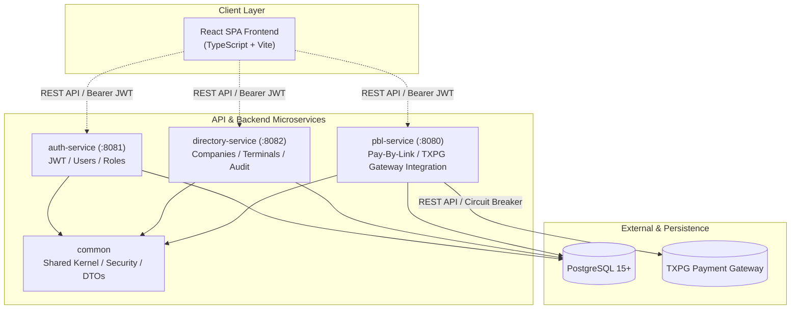

# 📑 ТЕХНИЧЕСКИЙ ПАСПОРТ СИСТЕМЫ
## Приложение к Акту приёма-передачи ПО «Merchant Portal (MP)»

| Параметр | Значение |
| :--- | :--- |
| **Наименование проекта** | Merchant Portal (MP) |
| **Назначение** | Платформа личного кабинета мерчанта, генерации платежных ссылок (Pay-By-Link), управления оргструктурой, терминалами и аналитики транзакций |
| **Архитектурный тип** | Микросервисная архитектура (Gradle Multi-Module Monorepo + React SPA) |
| **Версия платформы** | 1.0.0-RELEASE |
| **Язык разработки / Фреймворки** | Java 21 (LTS), Spring Boot 3.2.5, React 18, TypeScript 5, Vite 6 |

---

## 1. Назначение и краткое резюме проекта

**Merchant Portal (MP)** — это высокопроизводительная и масштабируемая веб-платформа для торгово-сервисных предприятий (мерчантов), обеспечивающая полный цикл взаимодействия с платежной инфраструктурой:

1. **Безопасная аутентификация и иерархический контроль доступа (RBAC)** с поддержкой ролей и изоляцией данных организаций.
2. **Управление оргструктурой** — ведение компаний, филиалов и привязанных платежных терминалов.
3. **Сервис Pay-By-Link (PBL)** — генерация одноразовых и многоразовых платежных ссылок, QR-кодов, обработка форм оплаты и синхронизация статусов.
4. **Управление транзакциями** — проведение одностадийных и двухстадийных (DMS) платежей, отмена предавторизации (Void), проведение возвратов (Refund).
5. **Аналитика и Аудит** — отслеживание финансовых метрик, построение графиков и ведение неизменяемого журнала аудита действий (Audit Log).

---

## 2. Архитектура и структура модулей

Система реализована по принципам классической N-tier микросервисной архитектуры с чётким разделением ответственности между сервисами.

### 2.1. Схема микросервисного взаимодействия

### 2.2. Назначение модулей монорепозитория

1. **`common` (Shared Library)**
   - Общий базовый модуль системы (`java-library`).
   - Содержит базовую конфигурацию безопасности (Spring Security Base), валидаторы JWT-токенов, унифицированную обработку исключений (`GlobalExceptionHandler`), базовые DTO и utility-классы.
2. **`auth` (Authentication Service — порт 8081)**
   - Отвечает за аутентификацию (Login / Refresh / Logout), выдачу и валидацию пар JWT (Access & Refresh), хеширование паролей (BCrypt), управление пользователями и распределение ролевых прав (RBAC).
3. **`directory` (Directory & Management Service — порт 8082)**
   - Управляет справочниками организаций (Companies) и платежных терминалов (Terminals).
   - Фиксирует действия пользователей и изменения данных в сквозной журнал аудита (Audit Log).
   - Обеспечивает кэширование справочников через Caffeine Cache для минимизации нагрузки на БД.
4. **`pbl` (Pay-By-Link & Payment Engine — порт 8080)**
   - Ключевой процессинговый модуль. Формирует ссылки на оплату, генерирует QR-коды, отслеживает время жизни ссылок.
   - Интегрирован с внешним платежным шлюзом **TXPG**.
   - Обеспечен механизмом Circuit Breaker & Retry (`Resilience4j`) для надежной работы при внешних сбоях.
5. **`frontend` (Single Page Application — порт 3000 / Nginx)**
   - Пользовательский клиент на React 18, типизированный TypeScript, стилизованный TailwindCSS 4 и Material UI 7.

---

## 3. Технологический стек (Tech Stack)

### Бэкенд-инфраструктура
| Технология | Версия | Назначение |
| :--- | :--- | :--- |
| **Java** | 21 (LTS) | Язык программирования |
| **Spring Boot** | 3.2.5 | Каркас приложения |
| **Spring Security** | 6.x | Авторизация и фильтры безопасности |
| **Spring Data JPA** | 3.x | ORM и работа с базой данных |
| **Liquibase** | — | Автоматическое версионирование и миграция схемы БД |
| **JJWT** | 0.11.5 | Генерация и валидация JWT-токенов |
| **Caffeine Cache** | 3.1.8 | Ин-мемори кэширование справочников |
| **Resilience4j** | 2.2.0 | Circuit Breaker и Retry механизмы (модуль PBL) |
| **SpringDoc OpenAPI** | 2.5.0 | Автогенерация Swagger UI документации API |
| **Gradle** | 8.5 | Система сборки монорепозитория |

### Фронтенд-инфраструктура
| Технология | Версия | Назначение |
| :--- | :--- | :--- |
| **React** | 18.3.1 | UI-библиотека |
| **TypeScript** | 5.x | Строгая типизация кода |
| **Vite** | 6.3.5 | Инструмент сборки и dev-сервер |
| **TailwindCSS** | 4.1.12 | Атомарный CSS-фреймворк |
| **MUI (Material UI)** | 7.3.5 | Готовые UI-компоненты |
| **React Router** | 7.13.0 | Маршрутизация на стороне клиента |
| **Axios** | 1.7.9 | HTTP-клиент с интерсепторами JWT |
| **Recharts** | 2.15.2 | Построение интерактивных графиков |
| **React Hook Form** | 7.55.0 | Управление формами и валидацией |
| **Sonner** | 2.0.3 | Система всплывающих уведомлений |

### СУБД и Среда выполнения
- **PostgreSQL**: 15+ (Реляционная база данных)
- **Nginx**: Веб-сервер / Reverse Proxy для статики фронтенда

---

## 4. Сводка реализованной функциональности

### 4.1. Авторизация и защита данных
- Stateless аутентификация через JWT (Access + Refresh tokens).
- Ролевая модель доступа (RBAC):
  - `SUPER_ADMIN` — полный доступ ко всему контенту и сервисам системы.
  - `COMPANY_ADMIN` — администрирование своей компании, терминалов и операторов.
  - `OPERATOR` / `VIEWER` — генерация платежных ссылок и просмотр аналитики.
- Строгая изоляция данных (Multi-tenancy): пользователи видят только ресурсы своей компании.

### 4.2. Управление компаниями и терминалами
- Иерархическое создание и редактирование карточек организаций.
- Привязка и конфигурирование POS-терминалов.
- **Вывод терминала из работы — блокировка, а не удаление** (с 21.08.2026): у терминала есть
  статус `ACTIVE` / `BLOCKED`. Блокировка запрещает только новые платежи (создание ссылок и их
  открытие плательщиком) и приостанавливает активные ссылки терминала; возвраты, списание холдов
  DMS и проверка статуса по уже прошедшим платежам продолжают работать. Разблокировка возвращает
  ссылки в работу, кроме тех, у которых за это время истёк срок. Удаление терминала недоступно:
  на терминал ссылаются проведённые платежи. Блокировка действует в портале — в MilliKart
  терминал остаётся включённым (`problems.md` §12).
- **Статусная модель:** терминал — `ACTIVE` / `BLOCKED` (`TerminalStatus`), компания — `ACTIVE` /
  `INACTIVE` плюс `DELETED` как признак мягкого удаления. Статуса `Pending` в системе нет.
- **Статус компании ничего не останавливает** (уточнено 24.08.2026). В отличие от блокировки
  терминала, `INACTIVE` у компании — пометка в справочнике и запись в журнале аудита: вход
  сотрудников, создание платёжных ссылок и приём платежей продолжают работать. Проверка статуса
  компании не сделана ни в одном сервисе (`problems.md` §21). Чтобы остановить платежи компании,
  блокируют её терминалы.
- **Удаление компании необратимо из портала.** Это мягкое удаление: строка остаётся в базе со
  статусом `DELETED`, но становится невидимой на всех путях чтения, и правка такой компании
  отвечает «Company not found». Восстановление возможно только правкой в базе.
- **Опасные действия требуют подтверждения** (компании — с 24.08.2026, терминалы и пользователи —
  с 25.08.2026). Удаление компании, смена её статуса, блокировка и разблокировка терминала,
  сохранение правки терминала и удаление пользователя выполняются только после отдельного окна,
  где названы конкретная запись и последствия именно этого действия. Перед блокировкой и
  разблокировкой терминала показывается, скольких платёжных ссылок это коснётся; перед
  сохранением правки терминала — построчный список изменений, включая смену компании-владельца
  и замену пароля. Удаление пользователя завершает все его сессии немедленно.
- **Настраиваемых лимитов и правил обработки платежей в портале нет** (уточнено 24.08.2026,
  P3-6): ни минимальной и максимальной суммы, ни выбора SMS/DMS/MIT/CIT, ни признака
  «3-D Secure обязателен», ни авто-капчуринга — ни в API, ни в базе. Экран настроек до
  24.08.2026 показывал эти поля как рабочие; это был макет генератора интерфейса, он удалён.
  Там же удалены макеты настроек безопасности (двухфакторная аутентификация, тайм-аут сессии,
  «активные сессии») и интеграции (API-ключ, вебхуки): **ничего из перечисленного в системе
  не реализовано**, и переключатели на них не влияли. Что осталось на экране настроек:
  название компании, email учётной записи и язык интерфейса.

### 4.3. Процессинг Pay-By-Link и интеграция с TXPG
- Формирование платежных ссылок с ограниченным сроком жизни (TTL).
- Поддержка платежных сценариев:
  - Одностадийная оплата (Purchase).
  - Двухстадийная оплата (Pre-authorization & Capture / Void).
  - Возвраты средств (Refunds).
- Глубокая интеграция с TXPG API с обработкой внешних тайм-аутов и автоматическими повторными запросами (Retry Policy).

### 4.4. Журнал аудита и Мониторинг
- **Журнал аудита ведётся во всех трёх сервисах** (с 22.08.2026). Записываются:
  - `directory` — компании и терминалы (включая блокировку терминала и число приостановленных ссылок);
  - `auth` — заведение и изменение учётных записей с указанием, что именно изменилось (смена роли
    видна как `role COMPANY_EMPLOYEE -> SYSTEM_ADMIN`), блокировка и разблокировка, смена пароля,
    **успешные и неудачные входы, выходы** (PCI-DSS 10.2), срабатывание блокировки после шести
    неудач, признаки кражи refresh-токена. Паролей в журнале нет ни в каком виде;
  - `pbl` — создание, изменение и отмена платёжных ссылок, **списание холдов и возвраты** с суммой
    и идентификаторами операции у эквайера, а также операции, исход которых эквайер не подтвердил
    (`outcome = UNRESOLVED` — по такой записи разбирают, ушли деньги или нет).
- Общие правила записи, одинаковые для всех трёх сервисов: успешные действия — с 21.08.2026
  строго после коммита операции, так что откатившееся действие в журнал не попадает; **отказы в
  доступе** (`outcome = DENIED`) — сразу и в своей транзакции, поэтому запись переживает откат
  отказанной операции. У каждой записи: исполнитель, IP-адрес клиента (разрешается через
  доверенный прокси, подделке заголовком не поддаётся), `timestamp`, детали изменений.
  До 21.08.2026 IP-адрес здесь был заявлен, но не фиксировался.

#### Словарь событий журнала (P3-2, с 24.08.2026)

Значения `entityType` и `action` заданы константами в `az.millikart.common.audit.AuditEntity` и
`AuditAction` — сервисы не придумывают собственных названий. Значение вне словаря журнал всё
равно записывает (запись важнее правописания), но в лог приложения уходит warning с маркером
`AUDIT_OUTSIDE_DICTIONARY`. Ниже — по одной строке на каждое реальное сочетание
`entityType`/`action` в коде (30 сочетаний).

| Событие | entityType | action | outcome | entityId | performedBy | companyId | Кто пишет | details |
|---|---|---|---|---|---|---|---|---|
| Вход в систему | `AUTH` | `LOGIN` | SUCCESS / DENIED | логин, как его ввели | логин | компания аккаунта; пусто, если аккаунт не найден | `auth`, `AuthService.login` | успех: `Login successful, role …`; отказ: категория (`no such account`, `wrong password`, `account locked until …`, `account status …`) — пароля нет ни в каком виде |
| Выход из системы | `AUTH` | `LOGOUT` | SUCCESS | логин | логин | компания пользователя | `auth`, `AuthService.logout` | `Logout: revoked N token(s) of family …`; пишется **только** если токен нашёлся и был отозван — 204 на незнакомый токен записи не оставляет |
| Блокировка аккаунта после 6 неудач | `AUTH` | `LOCKOUT` | DENIED | логин | логин | компания аккаунта | `auth`, `AuthService.registerFailedAttempt` | `Account locked until … after N failed attempts` (PCI-DSS 8.3.4) |
| IP исчерпал лимит попыток входа | `AUTH` | `RATE_LIMIT` | DENIED | логин последней попытки | логин последней попытки | пусто | `auth`, `AuthService.recordAddressFailure` | одна запись на окно, не на попытку; сам адрес — в `client_ip` |
| Повторное использование refresh-токена | `AUTH` | `TOKEN_REUSE` | DENIED | логин владельца токена | логин владельца | пусто | `auth`, `AuthService.refresh` | `Rotated refresh token reused … revoked N token(s) of family …`; самого токена в записи нет |
| Создание пользователя | `USER` | `CREATE` | SUCCESS | UUID пользователя | логин актора; `system` у bootstrap | компания созданного | `auth`, `UserService.createUser`; `AdminBootstrapRunner.run` | `Created user … with role …` |
| Изменение пользователя | `USER` | `UPDATE` | SUCCESS / DENIED | UUID пользователя | логин актора | успех: компания цели; отказ: компания актора | `auth`, `UserService.updateUser` | перечень полей `Changed role X -> Y, …`; отказ — попытка выдать `SYSTEM_ADMIN` не-админом |
| Смена пароля пользователя | `USER` | `PASSWORD_CHANGE` | SUCCESS | UUID пользователя | логин актора | компания цели | `auth`, `UserService.updateUser` | `Password changed for …` — без пароля |
| Блокировка аккаунта администратором | `USER` | `BLOCK` | SUCCESS | UUID пользователя | логин актора | компания цели | `auth`, `UserService.updateUser` | `Account set to … for … (was ACTIVE)` |
| Разблокировка аккаунта | `USER` | `UNBLOCK` | SUCCESS | UUID пользователя | логин актора | компания цели | `auth`, `UserService.updateUser` | `Account reactivated for … (was …)` |
| Удаление пользователя (soft) | `USER` | `DELETE` | SUCCESS | UUID пользователя | логин актора | компания цели | `auth`, `UserService.deleteUser` | `Soft deleted user … (role …)` |
| Создание компании | `COMPANY` | `CREATE` | SUCCESS / DENIED | id компании | логин актора | успех: id созданной; отказ: компания актора | `directory`, `CompanyService.createCompany` | `Created company: …` / `Denied: role … attempted to create company '…'` |
| Список компаний — отказ | `COMPANY` | `LIST` | DENIED | `ALL` | логин актора | компания актора | `directory`, `CompanyService.listCompanies` | `Denied: role … attempted to list all companies` |
| Чтение чужой компании — отказ | `COMPANY` | `READ` | DENIED | id запрошенной компании | логин актора | компания актора | `directory`, `CompanyService.validateAccess` (из `getCompany`) | `Denied: role … of company … attempted to read company …` |
| Изменение компании | `COMPANY` | `UPDATE` | SUCCESS / DENIED | id компании | логин актора | успех: id компании; отказ: компания актора | `directory`, `CompanyService.updateCompany` | перечень изменённых полей (`Name changed from … to …` и т.д.) |
| Блокировка компании | `COMPANY` | `BLOCK` | SUCCESS | id компании | логин актора | id компании | `directory`, `CompanyService.updateCompany` | `Company set to … (was ACTIVE)`; любой уход со статуса `ACTIVE` |
| Разблокировка компании | `COMPANY` | `UNBLOCK` | SUCCESS | id компании | логин актора | id компании | `directory`, `CompanyService.updateCompany` | `Company reactivated (was …)`; возврат в `ACTIVE` |
| Удаление компании (soft) | `COMPANY` | `DELETE` | SUCCESS / DENIED | id компании | логин актора | успех: id компании; отказ: компания актора | `directory`, `CompanyService.deleteCompany` | `Soft deleted company` |
| Создание терминала | `TERMINAL` | `CREATE` | SUCCESS / DENIED | id терминала | логин актора | успех: компания терминала; отказ: компания актора | `directory`, `TerminalService.createTerminal` (отказ — `validateWriteAccessToCompany`) | `Created terminal: … for company …` |
| Список терминалов — отказ | `TERMINAL` | `LIST` | DENIED | `ALL` | логин актора | компания актора; пусто, если её нет | `directory`, `TerminalService.isGlobalReader` / `requireOwnCompany` | `Denied: … attempted to list terminals` |
| Чтение / действие над чужим терминалом — отказ | `TERMINAL` | `READ` | DENIED | id терминала | логин актора | компания актора | `directory`, `TerminalService.validateReadAccessToCompany`; `pbl`, `PaymentLinkService.validateAccess` | `directory`: попытка прочитать чужой терминал; `pbl`: любой заход в чужой терминал — ссылки, транзакции, возвраты (`… attempted to act on terminal …`) |
| Изменение терминала | `TERMINAL` | `UPDATE` | SUCCESS / DENIED | id терминала | логин актора | успех: компания терминала; отказ: компания актора | `directory`, `TerminalService.updateTerminal` | изменённые поля; логин/пароль эквайера — `Login updated` / `Password updated`, без значений |
| Блокировка терминала | `TERMINAL` | `BLOCK` | SUCCESS | id терминала | логин актора | компания терминала | `directory`, `TerminalService.updateTerminal` | `Blocked terminal …, suspended N links` |
| Разблокировка терминала | `TERMINAL` | `UNBLOCK` | SUCCESS | id терминала | логин актора | компания терминала | `directory`, `TerminalService.updateTerminal` | `Unblocked terminal …, resumed N links, expired M links` |
| Чтение журнала аудита — отказ | `AUDIT_LOG` | `LIST` | DENIED | `ALL` | логин актора | компания актора; пусто, если её нет | `directory`, `AuditLogQueryService.listAuditLogs` (оба branch'а) | `Denied: … attempted to list audit logs` |
| Создание платёжной ссылки | `PAYMENT_LINK` | `CREATE` | SUCCESS | UUID ссылки | логин актора | компания терминала ссылки | `pbl`, `PaymentLinkService.create` | тип, сумма, валюта, терминал, срок |
| Изменение платёжной ссылки | `PAYMENT_LINK` | `UPDATE` | SUCCESS | UUID ссылки | логин актора | компания терминала | `pbl`, `PaymentLinkService.update` | перечень изменённых полей |
| Отмена платёжной ссылки | `PAYMENT_LINK` | `CANCEL` | SUCCESS | UUID ссылки | логин актора | компания терминала | `pbl`, `PaymentLinkService.update` (переход в `CANCELED`) | изменённые поля, в т.ч. `status ACTIVE -> CANCELED` |
| Списание холда (capture) | `TRANSACTION` | `CAPTURE` | SUCCESS / UNRESOLVED | UUID транзакции | логин актора | компания терминала | `pbl`, `PaymentLinkService.completeDms` | успех: сумма + `ridByPmo`/`tranActionId`/`approvalCode` эквайера; UNRESOLVED: `left unconfirmed by the acquirer … reconcile before retrying` |
| Возврат средств | `TRANSACTION` | `REFUND` | SUCCESS / UNRESOLVED | UUID транзакции | логин актора | компания терминала | `pbl`, `PaymentLinkService.refund` | успех: сумма, остаток, статус + идентификаторы эквайера; UNRESOLVED: как у capture — деньги могли уйти, локального следа нет |

Пояснения к таблице — соглашения, которые из самих записей не видны:

- **`entityId = "ALL"`** — соглашение: действие было над списком, а не над конкретной записью
  (отказы в `LIST`). Колонка `NOT NULL`, и заглушка честнее, чем ослабление ограничения.
- **`entityId` у `AUTH` — всегда логин** (не UUID и не IP-адрес): успешный вход, отказ, lockout,
  превышение лимита и кража токена одного аккаунта отвечают на один и тот же фильтр. IP-адрес
  при этом не теряется — он в отдельной колонке `client_ip` у каждой записи.
- **Асимметрия `companyId`**: у успеха это компания **цели** действия, у отказа — компания
  **актора**, намеренно. Журнал режется по этой колонке для `COMPANY_HEAD`/`COMPANY_MANAGER`,
  и отказ, подшитый под названную в запросе компанию, позволял бы любому пользователю писать
  произвольный текст в чужой обзор аудита. Что именно пытались сделать, видно в `entityId` и
  `details`.
- **Успешные `LIST` и `READ` не журналируются** — намеренно, из-за объёма: каждая загрузка
  каждого экрана превращала бы журнал в лог доступа. Пишутся только отказы. Отсутствие записи
  об успешном просмотре — не пробел.
- **Журнал только на добавление**: `AuditLogRepository` намеренно не наследует `JpaRepository` —
  в нём один метод `save`, у сущности нет сеттеров, а на уровне БД у роли приложения нет прав
  `UPDATE`/`DELETE`/`TRUNCATE` на `audit_logs` (`deployment_guide.md` §5.1a; вступает в силу
  после смены пользователя базы — `problems.md` §13).
- **Запись переживает откат операции**: успех пишется после коммита
  (`@TransactionalEventListener(AFTER_COMMIT)`), отказ и UNRESOLVED — сразу, в своей транзакции
  (`TransactionTemplate` с `REQUIRES_NEW`). Если не удалась сама запись, бизнес-операция не
  ломается, а в лог приложения уходит маркер `AUDIT_WRITE_FAILED`.

- Дашборд аналитики с интерактивными графиками распределения объемов платежей по дням, статусам и терминалам.

---

### 4.5. Сводка на главной странице (с 24.08.2026)

- **Считает база, а не браузер.** `GET /api/v1/dashboard/summary` (сервис `pbl`) отдаёт за
  выбранный период: итоги (получено, возвращено, выручка, средний платёж, число платежей),
  разбивку по всем шести исходам, выручку по суткам, распределение платежей по часам, пятёрку
  терминалов по выручке и разбиения платёжных ссылок по типу платежа, типу использования и
  статусу. До 24.08.2026 главная страница считала это в браузере по **двадцати** первым строкам
  и подписывала результат как «все операции системы».
- **Период** — параметры `from` и `to`, по умолчанию семь календарных суток по сегодняшний день.
  Период больше 92 дней и `from` позже `to` — отказ с пояснением, а не молчаливое сужение.
- **Сутки и часы режутся по бакинскому времени** (настройка `PBL_DASHBOARD_ZONE`, умолчание
  `Asia/Baku`), а не по UTC: иначе вечерние платежи попадали бы в следующие сутки. Использованный
  пояс возвращается в ответе и показан на экране.
- **Деньги — отдельно по каждой валюте.** Сводного числа поверх нескольких валют нет: валюта
  хранится у платёжной ссылки, и при разных валютах общая сумма была бы величиной без смысла.
  Выручка считается как полученное (для частичных списаний — фактически списанная сумма) за
  вычетом возвратов; возвращённый платёж не исчезает из статистики, а уменьшает её на сумму
  возврата.
- **Права те же, что у списка операций:** системный администратор и аудитор видят все компании,
  остальные роли — только терминалы своей компании. Учётная запись без компании получает
  нулевую сводку, а не отказ.
- **Чего в сводке нет и не заявлено:** средней скорости обработки платежа, сравнения с прошлым
  периодом и комиссии эквайера — этих величин система не хранит и не измеряет.

## 5. Передаваемая техническая документация

В составе дистрибутива репозитория передаются следующие технические документы:

1. `technical_handover.md` — данный документ (Технический паспорт системы).
2. `application_description.md` — детальная архитектура, DTO, схемы БД и API-карта.
3. `deployment_guide.md` — пошаговое руководство по сборке, развертыванию, конфигурации среды и Docker-контейнеризации.
4. **OpenAPI / Swagger Документация** — интерактивные спецификации API микросервисов (`/swagger-ui.html`).
   Включается на время приёмо-сдаточных испытаний переменной `SWAGGER_ENABLED=true`; в постоянной
   эксплуатации остаётся выключенной, поскольку `/v3/api-docs` — это полная карта API.
   Процедура включения и выключения — `deployment_guide.md`, раздел 14.3.

---

## 6. Заключение о готовности к сдаче (Acceptance Statement)

Разработанный программный комплекс **Merchant Portal (MP)**:
- Соответствует всем предъявленным техническим и функциональным требованиям.
- Успешно прошёл цикл отладки, сборки и модульного тестирования.
- Готов к передаче Заказчику для проведения приемо-сдаточных испытаний и ввода в эксплуатацию.
